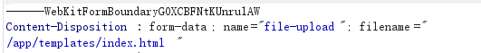
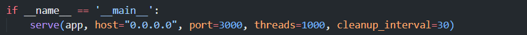
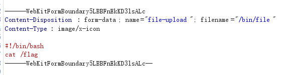

## filechecker_mini

```python
from flask import Flask, request, render_template, render_template_string
from waitress import serve
import os
import subprocess

app_dir = os.path.split(os.path.realpath(__file__))[0]
app = Flask(__name__)
app.config['UPLOAD_FOLDER'] = f'{app_dir}/upload/'

@app.route('/', methods=['GET','POST'])
def index():
    try:
        if request.method == 'GET':
            return render_template('index.html',result="ヽ(=^･ω･^=)丿 ヽ(=^･ω･^=)丿 ヽ(=^･ω･^=)丿")

        elif request.method == 'POST':
            f = request.files['file-upload']
            filepath = os.path.join(app.config['UPLOAD_FOLDER'], f.filename)

            if os.path.exists(filepath) and ".." in filepath:
                return render_template('index.html', result="Don't (^=◕ᴥ◕=^) (^=◕ᴥ◕=^) (^=◕ᴥ◕=^)")
            else:
                f.save(filepath)
                file_check_res = subprocess.check_output(
                    ["/bin/file", "-b", filepath], 
                    shell=False, 
                    encoding='utf-8',
                    timeout=1
                )
                os.remove(filepath)
                if "empty" in file_check_res or "cannot open" in file_check_res:
                    file_check_res="wafxixi ฅ•ω•ฅ ฅ•ω•ฅ ฅ•ω•ฅ"
                return render_template_string(file_check_res)

    except:
        return render_template('index.html', result='Error ฅ(๑*д*๑)ฅ ฅ(๑*д*๑)ฅ ฅ(๑*д*๑)ฅ')

if __name__ == '__main__':
    serve(app, host="0.0.0.0", port=3000, threads=1000, cleanup_interval=30)
```

`file -b`对显示文件属性
而这个地方可SSTI
`return render_template_string(file_check_res)`

直接传一个手机拍的有巨多信息的照片发现版权处可控
在版权处ssti即可

```python
{{url_for.__globals__.os.popen('cat /flag').read()}}
```


## filechecker_plus

### 大概率非预期解

`return render_template('index.html', result=file_check_res)`

加了这一步导致不能直接**ssti**，必须要这个文件不存在才能ssti

暂时不知道原因，找个时间调试一下

`if os.path.exists(filepath) and ".." in filepath:`

然后这一步用的**and**所以是可以在不用`..`的情况下删掉这个文件的

`os.path.join(app.config['UPLOAD_FOLDER'], f.filename)`

然后这里是可以直接用**绝对路径bypass掉**的



但是用的**waitress**没有开启**debug**是不会重载的



所以得想办法把服务器搞崩

公共环境下面**Intruder**发了一会包就崩了，自己的docker环境上面完全崩不了，看来是蹭车了...？公共环境请求多容易崩？

或许还有其他办法弄崩

### 预期解



预期解是覆盖file，因为这个环境给的是**root**权限

覆盖之后执行就有flag了

## filechecker_pro_max