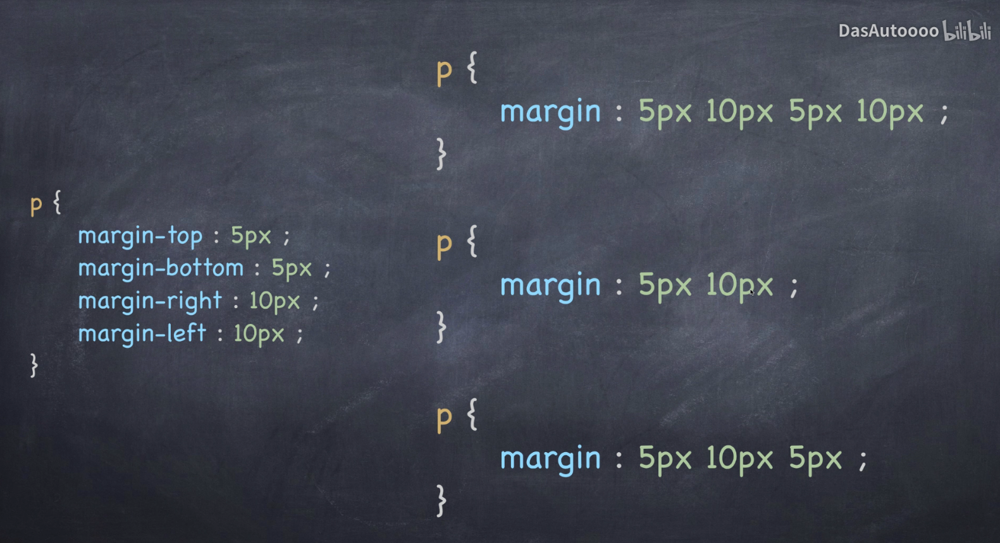
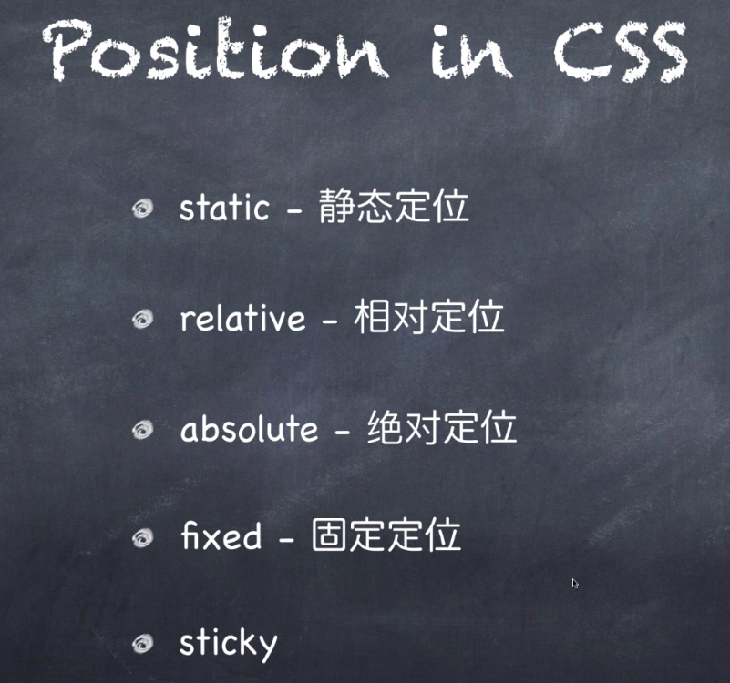
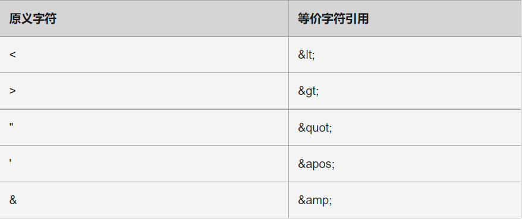
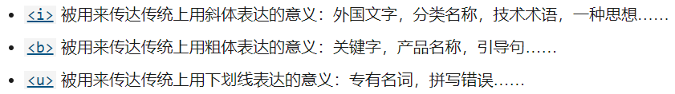
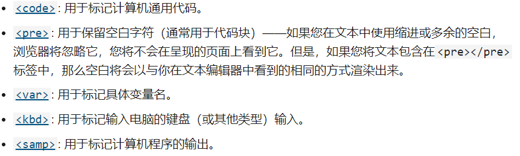

# Html5

## form

<form> 元素用于生成输入表单，该元素不会生成可视化部分，它除了通用属性 id 、 style 、 class 外，还可以指定 onclick 事件，除此之外，还有以下几个属性：
        Action ： 指定当单击表单内的确认按钮时，该表单被提交到那个地址。该属性既可以指定一个绝对地址，也可以指定一个相对地址，该属性必填，非常重要！
        method ：指定提交表单时发送何种请求，该属性有 get 和 post 两种值，通常建议发送 post 请求，该属性必填。表单默认以 get 方式提交请求。
Get 请求和 post 请求的区别如下：
        GET 请求方式：直接在浏览器地址栏中输入访问地址所发送的请求，或提交表单发送请求时，该表单对应的 form 元素没有设置 method 属性，或设置了 method 属性为 get ，这几种都是 get 方式的请求。 Get 方式的请求会将请求参数的名和值转换为字符串，并附加在原 url 之后，因此可以在地址栏中看到请求参数的名和值。且 get 请求传送的数据量较小。
        Post 方式的请求：这种方式通常使用提交表单的方式来发送，并且不要设置 form 的 method 属性为 post 。 Post 方式传送的数据量较大，通常认为 post 请求参数的大小不受限制，但往往取决于服务器的限制， post 请求传输的数据量总比 get 传输的数据量大，而且 post 方式发送的请求参数以及对应的值放在 HTML HEADER 中传输，用户不能在地址栏中看到请求的参数值，安全性相对较高。
name: 指定表单的唯一名称，建议该属性值与 id 属性值保持一致。
Target ：该属性有 4 个属性值，指定使用哪种方式打开目标 url 。 _self,_black_,_parent ， _top 分别指定使用自身，一个新的页面，顶级框架，父框架来加载 form 请求。 

① 上 右 下 左 顺时针

②上下一样 左右一样

③上 下 左右一样

边框也可以给不同样式

盒子模型

单引号和双引号都可在html5中无异，但必须配套。

### img(*表示同超链接)

alt:备选文本。(图片无法显示时显示)*

title:鼠标悬停时显示*
