# <span style='color:orange;'>Small Fox</span> #

## 一.unity基本功能方面 ##

### ***1.1 Tilemap***

当地图单位为一格一格(像素风格or用小瓦片构建地图时)可使用Tilemap。

创建方式:右键->2D Objects->Tilemap->选择瓦片的类型。

瓦片可添加碰撞器，若是需要所有小瓦片的碰撞器平滑连接，可添加Tilemap Collider 2D和Composite Collider 2D(此时会自动添加刚体，需要的话可调整刚体属性)，然后在Tilemap Collider 2D中将<span style='color:green;'>Used By Composite</span>勾选即可实现多个瓦片平滑链接的碰撞体。如下图。

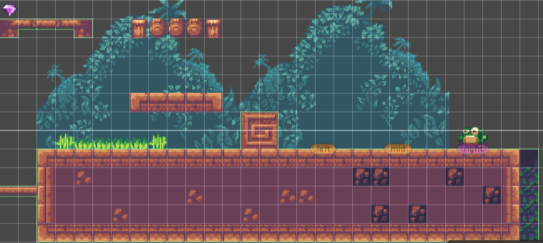

### ***1.2  Cinemachine***

需要用到摄影机移动或者更多功能时，可自己编写Camera Controller脚本，也可使用更方便，功能强大的Cinemachine。(目前掌握内容少)

创建方式:在package manager中将packages改成Unity Registry ，搜索Cinemachine->Import之后便可在上方看到Cinemachine(目前在小狐狸中所用到的是2D Camera)

2D Camera:创建完成后，将你的角色拖进Follow，在game视图中摄像机便会跟着角色。如果要设置摄像机能看到的最大范围，可在自带脚本最下面Add Extension中添加Cinemachine Confiner(极限)，于是便新建一个GameObject(也可直接在背景中)添加一个多边形碰撞器(只接受多边形碰撞器)，调整碰撞器的大小拖入Cinemachine Confiner即可。2D Camera的主脚本中有很多提升观感的设置，可在需要时查询相关文档。

### ***1.3  UI***

unity自带的UI一般只有最基础的功能及字体，有需要可去Asset Store下载资源。

#### 1.3.1 Text ####

无需多言。

#### 1.3.2 Panel

Panel，面板，在游戏中为对话框更为合适。可添加相应字体，改变位置，透明度，和背景。

有意思的是，想让对话框实现逐渐浮现的功能，可为Panel添加Animator组件创建动画，通过录制功能改变不同节点的透明的从而实现对话框的逐渐浮现(录制在Animation中讲)。

#### 1.3.3 Button

Button，顾名思义，按钮，相应的属性可搭配文档使用，当然Asset Store也有相应资源啦~(万能的Asset Store)

也可在添加函数达到在点击时执行某函数(如暂停)

#### 1.3.4 Image

Image，作为UI的一种，同样有着GameObject难以替代的功能，可固定在屏幕某一位置，相关设置也无需赘述~

### *** 1.4 Animation***

#### 1.4.1 添加Animation

Animation，可以说是游戏中十分重要的功能，在使用时也是稍微繁琐。

首先，为角色添加Animator，再在Assets下创建Animation文件夹，方便管理，在里面创建Animation Controller拖拽至角色的Animator中，接下来创建动画，选中角色，便可为角色添加动画啦。
基本操作，拖入动画。

可通过右下角长的按钮添加一个function(例如播放完该动画后摧毁该物体)，右下角短的按钮则是添加关键帧。

可通过左上角的录取功能录取关键帧，在上文的Panel处即可在录取不同帧时改变图形的透明度不循环，即可实现对话框的浮现。

Samples一般为60就行..

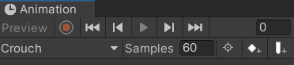

#### 1.4.2 实现动画的切换

打开Animation Controller将创建的动画拖入(如果里面还没动画的话)，然后明确各动画的转化关系。<span style='color:black;background:pink;'>(一定要考虑周全)</span>

图中Entry指向的代表在其他条件未触发时，动画就进行Idle，Any State指向的则是任何情况下都可以转化(即一旦该线的条件满足，就执行该动画)。

用右键make transition的方式来画线。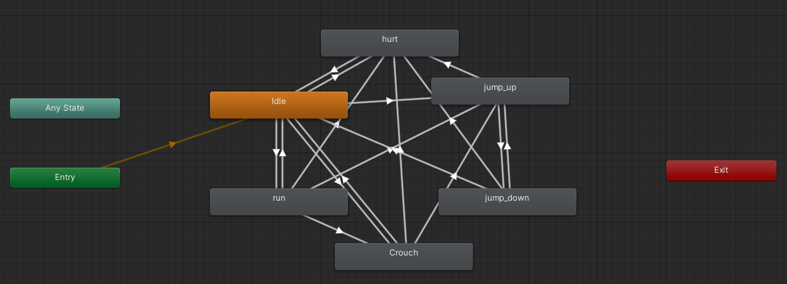

接下来便是为各种线设置触发条件。

首先在右边方框的Parameters(参数)中添加各自类型的数据(int，float，bool，trigger)来设置相应的条件，通常情况下，bool就可实现。

在设置条件名时最好命名相仿(Idleing,jumping...)以防止在后面拼写错误时不报错，难以发现问题。

条件设置好后在相应的线上添加Inspector面板中设置条件，(如Idle->jump_up 条件为 jumping  true)。同时，也需设置相关参数(查)。

然后再脚本中通过函数`anim.Setbool("Ideling",true)`来实现条件的成立，动画的转换(anim为该物体的Animator)。通过`anim.Getbool("Ideling")`来得到当时动画的在播放。

### ***1.5 Project Setting***

可将语言调成中文来调整Project Setting，重要的大致有游戏名，图标，鼠标，是否窗口化，是否可调整窗口大小，分辨率，logo...

### ***1.6 Light***

2D的地图默认是没有光源的，此时如果将物体的SpriteRenderer的材质全设为Diffuse，看到的物体就是没有光照射的样子，然后在地图上添加不同的Light，可实现光源效果。

### ***1.6 Parallax***

 Parallax，视觉差，在2D游戏中可通过此方法让游戏更有层次感，立体感。

简单的Parallax就是通过前景，中景，后景移动速度的不同来实现

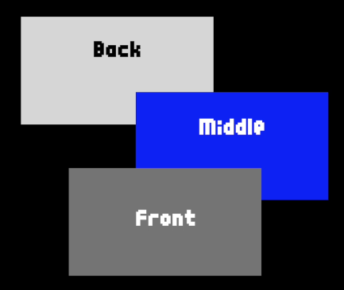

第一种方法 可通过代码实现。

+++

第二种方法 通过Z轴实现

首先将main camera的projection属性改成perspective(透视)，再将前景，中景，后景设置不同的Z轴高度运行时就可感觉到背景在晃动，有明显的层次感！

### ***1.7 Rigidbody2D***

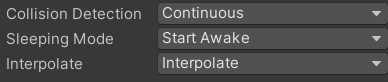

#### 1.7.1 Collision Detection:

Discrete：离散碰撞检测，该模式与场景中其他的所有碰撞体进行碰撞检测，该项为默认值。

Continuous：连续碰撞检测，该项用于检测与动态碰撞体（带有的rigidboby）的碰撞，其他的刚体会采用离散体碰撞模式，从模式使用于那些需要与采用连续动态碰撞检测的对象相碰撞的对象。这对物理性能有很大的影响，如果不需要对<span style='color:orange;'>快速运动的对象</span>进行碰撞检测，就使用离散碰撞检测模式。

#### 1.7.2 Interpolate

物体在发生微小碰撞时可能会凹陷然后在弹出，选择Interpolate可改变这种情况。

**Interpolate：一个以固定的帧率平滑物理运行的插值（选择Interpolate时物理移动更平滑）。**

Interpolate表示根据前几帧的位置来做平滑插值，Extrapolate表示根据预测的下一帧的位置来做平滑插值。


+++

+++

## 二.C#代码方面

### ***1.1 代码习惯***

多封装函数，主函数中能少写就少写。

该物体需要设置预制体时少用public，用private然后在start中得到。

与物理有关的函数都放在FixedUpdate。

### ***1.2 零散的代码知识***

```c#
GameObject.FindWithTag("Player");//通过标签寻找带有Player标签的游戏物体，并返回。
GameObject.FindGameObjectsWithTag("Player");//通过标签寻找带有Player标签的所有游戏物体，并返回。
Debug.DrawRay(transform.position + new Vector3(-0.6f,-0.3f, 0), Vector2.up, Color.blue);//打印光线，只能在Scene界面看到。
[Header("Dash参数")]//可实现在unity界面中添加该部分变量的标题。
Cherry_score.text = Cherryscore.ToString();//转换类型，将文字转换为数字形，也可在后面加上""什么都没有的字符..
Time.timeScale//时间流速，可通过改变事件流速从而达到暂停或者缓慢行动，一旦更改，全局都会受到影响。
SceneManager.LoadScene(SceneManager.GetActiveScene().name);//重新加载当前场景。
SceneManager.LoadScene(数字);//加载场景编号为该数字的场景。
[SerializeField]private//定义一个可以在unity界面看到并且更改的变量，但不能被其他脚本引用。
```

### ***1.3 2D角色控制器的手感问题***

Rigidbody2D中改变角色的Gravity Scale改变重力加速度让角色有着更好的下落感。

将移动放在FixedUpdate中从而让相同时间内移动的距离相等。

+++

**关于getkeydown失灵的问题** (button也适用)

```c#
void Update(){
	if(Input.GetKeyDown(KeyCode.Space)){
        A=true;
    }
}
void FixedUpdate(){
    if(A){
        Action();
    }
}
```

将按下放在Update中，执行放在FixedUpdate中可完美解决该问题！

+++

**通过射线检测，检测角色是否可站起时出现的bug**

如果用`if(Physics2D.Raycast(transform.position + new Vector3(0.6f, -0.3f, 0), Vector2.up, 1f, ground) && Physics2D.Raycast(transform.position + new Vector3(-0.6f, -0.3f, 0), Vector2.up, 1f, ground))`

则会出现前面一个条件满足便进入if内，所以改成两个if即可~

+++

给角色的Collider添加一个摩擦力为0的材质可防止贴墙

再在脚底添加一个有摩擦力的Collider可避免角色滑动不停

脚底下的Collider可作为地面检测，检测是否在地面上从而防止无限跳

这样，新的问题出现了，**双碰撞体**导致在几帧内两碰撞体同时碰到樱桃导致得分+2

解决办法

```C#
if (collision.gameObject.tag == "Cherry")
{
	item.Play();
	Destroy(collision.gameObject);
	Instantiate(Item_Eaten, collision.gameObject.transform.position, Quaternion.identity);
	Cherryscore++;
   	ollision.gameObject.tag = "Untagged";
}
```

在碰撞后将它的标签改为"Untagged"，即可完美解决问题啦~

### ***1.4 对象池实现冲刺残影***

#### 1.4.1 对象池介绍

先说说为什么要用对象池，如果不断Instantiate和Destory几种相同的物体，会不断消耗内存从而导致游戏崩溃，于是对象池便用来`减少对象频繁创建所占用的内存空间和初始化时间`。预先创建几个对象放入对象池中，后续需使用时直接查询对象池内的对象，不需使用时放回，便可实现对象池。

在Small Fox中，对象池用的是 `private Queue<GameObject> availableObjects = new Queue<GameObject>();`来实现的，当然其他情况下也可用List，因为冲刺残影满足先进先出，故直接用Queue更方便。

#### 1.4.2 对象池实现

`先贴出创建对象池的脚本`

```c#
using System.Collections;
using System.Collections.Generic;
using UnityEngine;

public class ShadowPool : MonoBehaviour
{
    public static ShadowPool instance;//定义一个单例，外部可以方便地访问到这个定义的instance对象

    public GameObject shadowPrefab;

    public int shadowCount;//对象的数量,需保证对象的数量能满足实例的残影

    private Queue<GameObject> availableObjects = new Queue<GameObject>();

    void Awake()
    {
        instance = this;//初始化单例

        //初始化对象池
        FillPool();
    }

    public void FillPool()
    {
        for (int i = 0; i < shadowCount; i++)
        {
            var newShadow = Instantiate(shadowPrefab);//实例化对象
            newShadow.transform.SetParent(transform);//将对象池的物体放在对象池的子物体下

            //取消启用,返回对象池
            ReturnPool(newShadow);
        }
    }

	public void ReturnPool(GameObject gameObject)
    {
        gameObject.SetActive(false);//默认对象为关闭状态

        availableObjects.Enqueue(gameObject);//将该对象添加到Queue中
    }

	public GameObject GetFormPool()
	{
        if (availableObjects.Count == 0)//对象取完了，再次填冲对象池
        {
            FillPool();
        }
        var outShadow = availableObjects.Dequeue();//取出对象

        outShadow.SetActive(true);//取出的对象设为启用状态，此处即残影的产生

        return outShadow;
    }
}
```

`产生对象池中的对象的脚本`

```c#
using UnityEngine;

public class ShadowSprite : MonoBehaviour
{
    private GameObject Player;  
    private Transform player;
    private SpriteRenderer thisSprite;
    private SpriteRenderer playerSprite;

    private Color color;

    [Header("时间控制参数")]
    public float activeTime;//显示时间
    public float activeStart;//开始显示的时间点

    [Header("不透明度控制")]
    private float alpha;//不透明度
    public float alphaSet;//初始值
    public float alphaMultiplier;//小于1的值

    private void OnEnable()
    {
        Player = GameObject.FindGameObjectWithTag("Player");
        player = GameObject.FindGameObjectWithTag("Player").transform;
        thisSprite =GetComponent<SpriteRenderer>();
        playerSprite = Player.GetComponent<SpriteRenderer>();//角色当前的Sprite

        alpha = alphaSet;

        thisSprite.sprite = playerSprite.sprite;

        transform.position = player.position;
        transform.localScale = player.localScale;
        transform.rotation = player.rotation;

        activeStart = Time.time;
    }

    void FixedUpdate()
    {
        alpha *= alphaMultiplier;//透明度逐渐降低

        color = new Color(0.5f, 0.5f, 1, alpha);//Color(1,1,1,1)代表100%显示各通道颜色，请查看Api手册

        thisSprite.color = color;

        if (Time.time >= activeStart + activeTime)
        {
            //返回对象池
            ShadowPool.instance.ReturnPool(this.gameObject);//因为instance了对象池脚本，故可直接调用
        }
    }
}

```


---

---

---

# <span style='color:orange;'>Robbier</span>


tilemap extra      blender tree   light


---

---

---

# <span style='color:orange;'>背包系统</span>

## 一.目标设计

1.实现背包的打开与关闭，界面的拖拽。(√)

2.实现拾取的物体自动进入背包并带有数字。(√)

3.实现在背包中两物体位置的交换，物体的随意拖拽。(√)

4.实现点击时能显示物体的属性。(√)

5.实现拿起背包的武器。(×)

## 二.设计思路

### 1.unity系统方面

首先创建一个Panel，给背包图片当作背包。

然后添加两个按钮实现背包(Panel)的打开和关闭。

然后再创建一个Panel，来实现单元格(取名为Grid)，即物体添加进去后是一格一格的/*，为该Panel添加组件便可实现一格一格的样子。*/‘

再在该单元格下创建18个子物体(Image，取名为Slot，Image为单元格的图片)，Slot带有一个Button(取名为Item，可带有Image，也可remove掉用后面的方式)，Item下带有一个Text表示物体的数量，带有一个Image(Item Image)表示，默认图片为白方块，所以该Item为空，没有实际物体时，是关闭状态。

然后再创建一个Text，作为物体属性显示的文本。

### 2.<font color="green">代码方面</font>

六个代码分别是 `Inventory` `InventoryManager` `Item` `ItemOnWorld` `Slot` `ItmeOnDrag`

核心思想：ScriptableObject(类)  单例模式  复杂的逻辑

目前我对ScriptableObject的理解便是数据库，继承于此类的脚本无需挂载在任何物体上，但它可以将游戏数据真正的储存在本地，也就是不管游戏的开启与启动，他的数据不会被销毁

Inventory和Item便继承于ScriptableObject，定义简单的属性即可，属性的赋值在其他脚本中完成(无需挂载)

InventoryManager挂载在Cnavas上，用于控制Inventory，主要目的是实例化背包中的物体，让其在背包中显示，并且不会重复。

ItemOnWorld挂载在游戏内的拾取物上，用于将Item的数据传到Inventory的List中，并且调用InventoryManager的代码来刷新背包。

<font color="red">讲的很混乱，具体看代码实现部分吧</font>

## 三.背包实现

### 1.非代码

先说说里面会用到没学过的组件

#### ①<font color="violet">Grid Layout Group</font>

为Panel(应该图片类型的也可？)添加该组件后，在该物体的子物体下直接添加物体会按设计的大小及间距排列，以此来实现一格一格的样子。

#### ②<font color="violet">Canvas Group</font>

Canvas Group里面有一个Blocks Raycasts，因为在背包拖拽的过程中需要返回到鼠标的光线(垂直于电脑屏幕)所碰到的物体，而拖拽过程中，如果该Blocks Raycasts开启，会把鼠标的射线挡住，所以需要在代码中鼠标拖拽到该物体时关闭，拖拽完成后开启，不然鼠标就无法检测到该物体了！

#### ③<font color="violet">Layout Element</font>

由于在拖拽物体时会把物体(Item)由Slot的子物体变成Grid的子物体，这样在`Grid Layout Group`的影响下就会使该物体偶尔在左下角闪烁(下一个排的地方)，所以在Layout Element中把Ignore Layout开启(忽略当前布局)即可结局该问题。

### 2.<font color="Green">ScriptableObject</font>

继承与ScriptableObject的变量无需挂在脚本，里面的值会持续保存，基于此特性，用

`[CreateAssetMenu(fileName = "New Inventory", menuName = "Inventory/New Inventory")]`

方法可创建一个可在unity界面中右键创建的物体，类型为ScriptableObject,<font color="green">fileName</font>是右键时看到的选项，<font color="green">menuName</font>的第一个值鼠标悬停到该选项后小框产生的选项，点击，创建的物体的名字为第二个值。

里面包含的信息就是在该代码中创建的。

<font color='lred'>Inventory</font>(总背包，可有不同类型，如自己的背包、箱子的背包，创建一个即是一种类型背包)

```c#
using System.Collections;
using System.Collections.Generic;
using UnityEngine;

[CreateAssetMenu(fileName = "New Inventory", menuName = "Inventory/New Inventory")]
public class Inventory : ScriptableObject
{
    public List<Item> itemList = new List<Item>();//Item型的list！！！
}

```

<font color='lred'>Item</font>(背包里的物体)

```c#
using System.Collections;
using System.Collections.Generic;
using UnityEngine;

[CreateAssetMenu(fileName = "New Item", menuName = "Inventory/New Item")]
public class Item : ScriptableObject
{
    public string itemName;
    public Sprite itemImage;
    public int itemHeld;
    [TextArea]
    public string itemInfo;

    public bool equip;
}

```

该物体为提前创建好的，先创建各自类型如鞋、剑、衣服，然后分别给游戏中的物体也就是ItemOnWorld。

固定的变量，名字，图片，信息。个数会变化。

### 3.代码

<font color="Sky blue">贴代码加unity变量图  代码里的注释和最后逻辑总结解决问题！</font>

#### ①<font color='lred'>InventoryManager</font>

```c#
using System.Collections;
using System.Collections.Generic;
using UnityEngine;
using UnityEngine.UI;

public class InventoryManager : MonoBehaviour
{
    static InventoryManager instance;//实例化对象

    public Inventory myBag;
    public GameObject slotGrid;
    // public Slot slotPrefab;
    public GameObject emptySlot;
    public Text itemInfromation;

    public List<GameObject> slots = new List<GameObject>();//管理生成的18个slots

    void Awake()
    {
        if (instance != null)
            Destroy(this);
        instance = this;
    }

    private void OnEnable()
    {
        RefreshItem();
        instance.itemInfromation.text = "";
    }

    public static void UpdateItemInfo(string itemDescription)
    {
        instance.itemInfromation.text = itemDescription;
    }

    /*public static void CreateNewItem(Item item)
    {
        Slot newItem = Instantiate(instance.slotPrefab, instance.slotGrid.transform.position, Quaternion.identity);
        newItem.gameObject.transform.SetParent(instance.slotGrid.transform);
        newItem.slotItem = item;
        newItem.slotImage.sprite = item.itemImage;
        newItem.slotNum.text = item.itemHeld.ToString();
    }*/
	//游戏重新开始时刷新此时的背包
    public static void RefreshItem()
    {
        //循环删除slotGrid下的子集物体
        for (int i = 0; i < instance.slotGrid.transform.childCount; i++)
        {
            if (instance.slotGrid.transform.childCount == 0)
                break;
            Destroy(instance.slotGrid.transform.GetChild(i).gameObject);
            instance.slots.Clear();
        }

        //重新生成对应myBag里面的物品的slot
        for (int i = 0; i < instance.myBag.itemList.Count; i++)
        {
            // CreateNewItem(instance.myBag.itemList[i]);
            instance.slots.Add(Instantiate(instance.emptySlot));//先将空的添加到slots的list里面
            instance.slots[i].transform.SetParent(instance.slotGrid.transform);
            instance.slots[i].GetComponent<Slot>().slotID = i;//给ID
            instance.slots[i].GetComponent<Slot>().SetupSlot(instance.myBag.itemList[i]);//将mybag里面的list对应序号的item的相关值赋给他(详见SetupSlot)
        }
    }
}

```

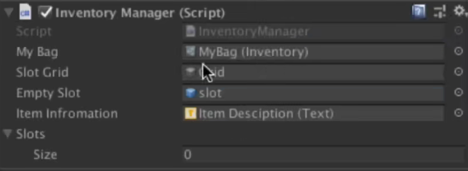

#### ②<font color='lred'>itemOnWorld</font>

```c#
using System.Collections;
using System.Collections.Generic;
using UnityEngine;

public class itemOnWorld : MonoBehaviour
{
    public Item thisItem;//在上面提前创建好的item,ScriptableObject型
    public Inventory playerInventory;//存入该背包的背包,ScriptableObject型

    private void OnTriggerEnter2D(Collider2D other)//当角色碰撞时
    {
        if (other.gameObject.CompareTag("Player"))
        {
            AddNewItem();
            Destroy(gameObject);
        }
    }

    public void AddNewItem()//将该物体的item添加到背包的空item中
    {
        if (!playerInventory.itemList.Contains(thisItem))
        {
            // playerInventory.itemList.Add(thisItem);
            // InventoryManager.CreateNewItem(thisItem);
            for (int i = 0; i < playerInventory.itemList.Count; i++)
            {
                if (playerInventory.itemList[i] == null)
                {
                    playerInventory.itemList[i] = thisItem;
                    break;
                }
            }
        }
        else//如果有了，则只需要加该itemHeld的数量
        {
            thisItem.itemHeld += 1;
        }

        InventoryManager.RefreshItem();
    }
}

```

#### ③<font color='lred'>Slot</font>

```c#
using System.Collections;
using System.Collections.Generic;
using UnityEngine;
using UnityEngine.UI;

public class Slot : MonoBehaviour
{
    public int slotID;//空格ID 等于 物品ID
    public Item slotItem;//该slot下的Item
    public Image slotImage;//该slot下的Item下的ItemImage(装备的图片)
    public Text slotNum;//该slot下的Item下的number(装备的数量)
    public string slotInfo;

    public GameObject itemInSlot;

    public void ItemOnClicked()
    {
        InventoryManager.UpdateItemInfo(slotInfo);
    }
//将mybag中的值传给grid便于其显示
    public void SetupSlot(Item item)
    {
        if (item == null)//如果也是空，关闭该itemInSlot(图片为白方块，不是相对应的图片，自然要关闭)
        {
            itemInSlot.SetActive(false);
            return;
        }
	//如果有值，将值的相关信息传过去
        slotImage.sprite = item.itemImage;
        slotNum.text = item.itemHeld.ToString();
        slotInfo = item.itemInfo;

    }
}

```


#### ④<font color='lred'>ItemOnDrag</font>(挂载在Item上)

```c#
using System.Collections;
using System.Collections.Generic;
using UnityEngine;
using UnityEngine.EventSystems;
//IBeginDragHandler, IDragHandler, IEndDragHandler为拖拽中的相关方法，开始，接触，结束
public class ItemOnDrag : MonoBehaviour, IBeginDragHandler, IDragHandler, IEndDragHandler
{
    public Transform originalParent;
    public Inventory myBag;//当前背包
    private int currentItemID;//当前物品ID

    public void OnBeginDrag(PointerEventData eventData)
    {
        originalParent = transform.parent;
        currentItemID = originalParent.GetComponent<Slot>().slotID;//记录下来是为了交换序号保存在数据库中
        transform.SetParent(transform.parent.parent);//该item脱离出slot放在grid下
        transform.position = eventData.position;//跟随鼠标
        GetComponent<CanvasGroup>().blocksRaycasts = false;//射线阻挡关闭
    }

    public void OnDrag(PointerEventData eventData)
    {
        transform.position = eventData.position;
        Debug.Log(eventData.pointerCurrentRaycast.gameObject.name);//输出鼠标当前位置下到第一个碰到到物体名字
    }

    public void OnEndDrag(PointerEventData eventData)//互换位置，代码多但其实很简单，不麻烦而且逻辑也没问题
    {
        if (eventData.pointerCurrentRaycast.gameObject.name == null)
        {
            if (eventData.pointerCurrentRaycast.gameObject.name == "Item Image")//判断下面物体名字是：Item Image 那么互换位置
            {
                transform.SetParent(eventData.pointerCurrentRaycast.gameObject.transform.parent.parent);
                transform.position = eventData.pointerCurrentRaycast.gameObject.transform.parent.parent.position;
                //itemList的物品存储位置改变
                var temp = myBag.itemList[currentItemID];
                myBag.itemList[currentItemID] =myBag.itemList[eventData.pointerCurrentRaycast.gameObject.GetComponentInParent<Slot>().slotID];
                myBag.itemList[eventData.pointerCurrentRaycast.gameObject.GetComponentInParent<Slot>().slotID] = 	temp;
	
                eventData.pointerCurrentRaycast.gameObject.transform.parent.position = originalParent.position;
                eventData.pointerCurrentRaycast.gameObject.transform.parent.SetParent(originalParent);
                GetComponent<CanvasGroup>().blocksRaycasts = true;//射线阻挡开启，不然无法再次选中移动的物品
                return;
            }
            if (eventData.pointerCurrentRaycast.gameObject.name == "slot(Clone)")
            {
                //否则直接挂在检测到到Slot下面
                transform.SetParent(eventData.pointerCurrentRaycast.gameObject.transform);
                transform.position = eventData.pointerCurrentRaycast.gameObject.transform.position;
                //itemList的物品存储位置改变
                myBag.itemList[eventData.pointerCurrentRaycast.gameObject.GetComponentInParent<Slot>().slotID] = myBag.itemList[currentItemID];
                //解决自己拽到自己的问题
                if (eventData.pointerCurrentRaycast.gameobject.GetCommponent<Slot>().slotID != currentItemID)
                    myBag.itemList[currentItemID] = null;
                GetComponent<CanvasGroup>().blocksRaycasts = true;
            }
        }
        //如果在其他位置
        transform.SetParent(originalParent);
        transform.position = originalParent.position;
        GetComponent<CanvasGroup>().blocksRaycasts = true;


    }


}

```


#### ⑤逻辑

简单说下逻辑：游戏中的一个拾取物，挂载这包含该物体使用需要信息的ScriptableObject的item，被碰撞后将该item的信息传给mybag-自己的背包，然后再传给挂载在Grid的InventoryManager中，此时通过改变Grid的子物体的图片和数字即可将该拾取物显示在背包中。

勉勉强强水完。

​																																																	12.26  1:47

------

------

------

# 对话系统

将外部的文本读入字符型的list中，然后利用携程的方式以逐秒输出以达到效果。涉及的知识并不难，就贴个代码吧。

```c#
using System.Collections;
using System.Collections.Generic;
using UnityEngine;
using UnityEngine.UI;
public class NewBehaviourScript : MonoBehaviour
{
    [Header("UI组件")]
    public Text TextLabel;
    public Image FaceImage;
    bool textFinish;
    bool CancelTyping = false;

    [Header("文本文件")]
    public TextAsset textFile;
    public int index;
    public float TextTime;

    [Header("头像")]
    public Sprite face_01;
    public Sprite face_02;
    List<string> TextList = new List<string>();
    void Awake()
    {
        GetTextFromFile(textFile);
    }
    private void OnEnable()
    {
        // TextLabel.text = TextList[index];
        // index++;
        textFinish = true;
        StartCoroutine(SetTextUi());
    }
    void Update()
    {
        if (Input.GetKeyDown(KeyCode.R) && index == TextList.Count)
        {
            gameObject.SetActive(false);
            index = 0;
        }
        if (Input.GetKeyDown(KeyCode.R))
        {
            if(!CancelTyping&&textFinish){
                StartCoroutine(SetTextUi());
            }
            if(textFinish==false){
                CancelTyping = !CancelTyping;
            }
        }
    }

    void GetTextFromFile(TextAsset TF)
    {
        TextList.Clear();
        index = 0;
        var listData = TF.text.Split('\n');//按行切割
        foreach (var line in listData)
        {
            TextList.Add(line);
        }
    }
    IEnumerator SetTextUi()
    {
        textFinish = false;
        TextLabel.text = "";
        switch(TextList[index].Trim().ToString()/*转换字符，避免出问题*/){
            case "A":
                FaceImage.sprite = face_01;
                index++;
                break;
            case "B":
                FaceImage.sprite = face_02;
                index++;
                break;
        }
        // for (int i = 0; i < TextList[index].Length; i++)
        // {
        //     TextLabel.text += TextList[index][i];
        // }
        int i = 0;
        while(!CancelTyping&&i<TextList[index].Length-1){
            TextLabel.text += TextList[index][i];
            i++;
            yield return new WaitForSeconds(TextTime);//也可通关将time改成0达到关于协程的效果
        }
        TextLabel.text = TextList[index];
        CancelTyping = false;
        textFinish = true;
        index++;
    }
}

```

+++

+++

+++


# Down to live


## 一.unity基本功能方面

### *1.Tricks*

①**按住 V 选择锚点进行拖拽将自动贴合**

②Filter Mode 当该纹理由于3D变换进行拉伸时，它将如何被过滤插值。共有三种选择：
	Point 单点插值，纹理将变得块状化（blocky up close）；
	Bilinear 双线性插值，纹理将变得模糊（blurry up close）；
	Trilinear 三线性插值，类似Bilinear，但是纹理还会在不同的mip水平之间（between the different mip levels）进行模	糊；

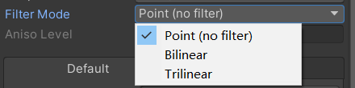

### *2.Joint*

Joint(节点)unity强大的内置功能，添加该组件后，可让游戏物体有一个节点并受力时绕其旋转。

例如:铁球添加了Distance Joint 2D后，给其一个节点的rigidbody就可使铁球绕其旋转。

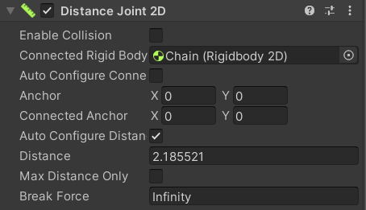

旋转方块设置好Circle Joint 2D之后，自然就能绕中心旋转啦。(记得设置好角度哦！)

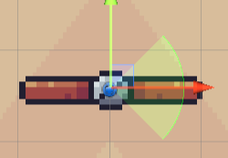

还有更多强大的joint等着你去探索~

*3.Material*

学到了Material重复，移动方面的知识。

首先把原图中的Wrap Mode改成Repeat，然后就可以在材质中Tilling设置重复的数量了。

如果是移动功能，可通过代码调节材质的Offset，才实现移动的样子。

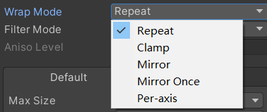

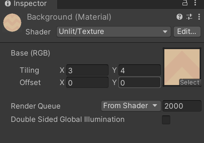

贴个代码:

```c#
using System.Collections;
using System.Collections.Generic;
using UnityEngine;

public class MateAnim : MonoBehaviour
{
    Material material;
    Vector2 movement;
    public Vector2 speed;

    void Start()
    {
        material = GetComponent<Renderer>().material;
    }

    void Update()
    {
        movement += speed * Time.deltaTime;
        material.mainTextureOffset = movement;
    }
}
```


### *3.Line Render*

Line Render，线渲染器，可通过代码给出一个起始位置和一个终止位置来画线，可调整线的长度、宽细、颜色。

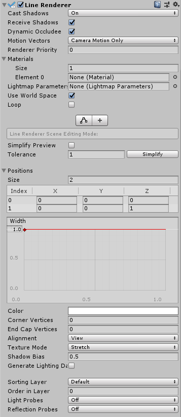

也可以以此做一个画笔。(以后闲的实在没事了做做吧)

贴个代码~

```c#
using System.Collections;
using System.Collections.Generic;
using UnityEngine;

public class LineCreate : MonoBehaviour
{
    LineRenderer line;
    public GameObject startpos;
    public GameObject endpos;
    // Start is called before the first frame update
    void Start()
    {
        line = GetComponent<LineRenderer>();
    }

    // Update is called once per frame
    void Update()
    {
        line.SetPosition(0, startpos.transform.position);
        line.SetPosition(1, endpos.transform.position);
    }
}

```


## 二.C#代码方面

### *1.isOnGround*

在角色的脚底生成一个可自己选择形状的检测图，有与玩家设定layer相同的方块则返回true。

然后可用unity自带的方法OnDrawGizmosSelected来画出自己设定的检测图来看是否检测的部分有问题。

(目前box的检测和绘画似乎有问题，以后再试试)


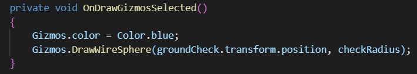

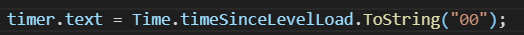

### *2.Random*

代码挺简单的，就这样啦~

```c#
using System.Collections;
using System.Collections.Generic;
using UnityEngine;

public class Spawner : MonoBehaviour
{
    public List<GameObject> platforms = new List<GameObject>();//0 基础 1 旋转 2 飞 3 基础 4 铁球  设置两个基础是为了增加游戏可玩性

    public float spawnTime;
    float countTime;
    public Vector3 spawnPosition;
    int spikeNums=0;
    void Start()
    {

    }

    void Update()
    {
        SpawnPlatform();
    }

    private void SpawnPlatform()
    {
        countTime += Time.deltaTime;
        spawnPosition.x = Random.Range(-3.1f, 3.1f);
        spawnPosition.y = transform.position.y;

        if (countTime >= spawnTime)
        {
            CreatePlatform();
            countTime = 0;
        }
    }

    private void CreatePlatform()
    {
        int index = Random.Range(0, platforms.Count);
        if(index==3){
            spikeNums++;
        }
        else{
            spikeNums = 0;
        }
        if(spikeNums>1){
            return;
        }
        
        
       GameObject newPlatform = Instantiate(platforms[index], spawnPosition, Quaternion.identity);
        newPlatform.transform.SetParent(gameObject.transform);
    }
}

```

+++

+++

+++


# Roguelike

## 一.介绍

`随机产生地图`

`找到合理的boss关`

实现不同关卡间的穿梭

摄像机的移动

`小地图`

## 二.功能的实现

### *1.随机产生地图&&找到合理的boss关*

#### ①思路：

随机产生房间：确定每个房间的单元格大小，先有一个初始的房间，向上下左右随机移动检测点，用Physics2D.OverlapCircle来检测当前是否有房间，如果有，上下左右随机移向下一个检测点，如果没有，生成房间。

缺点：可能重复检测某个点，运行效率低。

优点：对于小的地图，从代码量来看，十分方便，效率也不会太低。

找到合理的boss关：计算出该点到初始点需要经过多少步。

`stepToStart = (int)Mathf.Abs(transform.position.x / 18) + (int)Mathf.Abs(transform.position.y / 9);`

18和9为单元格大小，然后用两个列表记录出最大格数的次大格数的房间(排序算法)，再用一个列表记录出这两个列表中只有一个门能进入该房间的房间，三个列表按顺序，列表中按次序(相当于随机啦~)，选出boss关。

1.只有一个门的列表，若为空

2.最大格数的房间。

缺点：boss关的限制不够，选出的可能不是最好的。

优点：代码量小，容易理解与实现。

#### ②代码：

基础房间的代码:

```c#
using System.Collections;
using System.Collections.Generic;
using UnityEngine;
using UnityEngine.UI;

public class Room : MonoBehaviour
{
    public GameObject door_up, door_down, door_left, door_right;
    public bool roomUp, roomDown, roomLeft, roomRight;
    public Text text;
    public int stepToStart=0;
    public int roomCount=0;

    void Start()
    {
        door_up.SetActive(roomUp);
        door_down.SetActive(roomDown);
        door_left.SetActive(roomLeft);
        door_right.SetActive(roomRight);
        
    }

    // Update is called once per frame
    void Update()
    {
        
    }

    public void UpdateRoom(){

        stepToStart = (int)Mathf.Abs(transform.position.x / 18) + (int)Mathf.Abs(transform.position.y / 9);
        text.text = stepToStart.ToString();

        if(roomUp) roomCount++;
        if(roomDown) roomCount++;
        if(roomLeft) roomCount++;
        if(roomRight) roomCount++;
    }
}

```

房间管理(两个功能的实现):

```c#
using System.Collections;
using System.Collections.Generic;
using UnityEngine;
using UnityEngine.SceneManagement;

public class RoomGenerator : MonoBehaviour
{
    public enum Direction { up, down, left, right };
    public Direction direction;
    [Header("房间信息")]
    public GameObject roomPrefab;
    public int roomNumber;
    public Color startColor, endColor;
    private GameObject endRoom;

    [Header("位置控制")]
    public Transform generatorPoint;
    public float xOffset;
    public float yOffset;
    public LayerMask roomLayer;

    public int maxStep=0;

    public List<Room> rooms = new List<Room>();

    public List<GameObject> farRoom = new List<GameObject>();
    public List<GameObject> lessFarRoom = new List<GameObject>();
    public List<GameObject> oneWayRoom = new List<GameObject>();
    // Start is called before the first frame update
    void Start()
    {
        for (int i = 0; i < roomNumber; i++)
        {
            rooms.Add(Instantiate(roomPrefab, generatorPoint.position, Quaternion.identity).GetComponent<Room>());
            ChangePosition();
        }
        rooms[0].GetComponent<SpriteRenderer>().color = startColor;
        endRoom = rooms[0].gameObject;
        foreach (var room in rooms)
        {

            SetUpRoom(room, room.transform.position);
        }
        FindEndRoom();
        endRoom.GetComponent<SpriteRenderer>().color = endColor;
        
    }

    // Update is called once per frame
    void Update()
    {
        if (Input.anyKey)
        {
            SceneManager.LoadScene(SceneManager.GetActiveScene().name);
        }
    }

    void ChangePosition()
    {
        //先移动，再判断，这样再判断的地方在移动后的位置，而不是移动前的位置，不会造成九宫格死循环
        do
        {
            direction = (Direction)Random.Range(0, 4);
            switch (direction)
            {
                case Direction.up:
                    generatorPoint.position += new Vector3(0, yOffset, 0);
                    break;
                case Direction.down:
                    generatorPoint.position += new Vector3(0, -yOffset, 0);
                    break;
                case Direction.left:
                    generatorPoint.position += new Vector3(-xOffset, 0, 0);
                    break;
                case Direction.right:
                    generatorPoint.position += new Vector3(xOffset, 0, 0);
                    break;
            }
        } while (Physics2D.OverlapCircle(generatorPoint.position, 0.2f, roomLayer));

    }

    public void SetUpRoom(Room newRoom,Vector3 roomPosition){

        newRoom.roomUp = Physics2D.OverlapCircle(roomPosition + new Vector3(0, yOffset, 0), 0.2f, roomLayer);
        newRoom.roomDown = Physics2D.OverlapCircle(roomPosition + new Vector3(0, -yOffset, 0), 0.2f, roomLayer);
        newRoom.roomLeft = Physics2D.OverlapCircle(roomPosition + new Vector3(-xOffset, 0, 0), 0.2f, roomLayer);
        newRoom.roomRight = Physics2D.OverlapCircle(roomPosition + new Vector3(xOffset, 0, 0), 0.2f, roomLayer);
        newRoom.UpdateRoom();

        
    }

    public void FindEndRoom(){
        for (int i = 0; i < rooms.Count;i++){
            if(rooms[i].stepToStart>maxStep){
                maxStep = rooms[i].stepToStart;
            }
        }
        foreach(var room in rooms){
            if(room.stepToStart==maxStep){
                farRoom.Add(room.gameObject);
            }
            if(room.stepToStart==maxStep-1){
                lessFarRoom.Add(room.gameObject);
            }
        }

        for (int i = 0; i < farRoom.Count;i++){
            if(farRoom[i].GetComponent<Room>().roomCount==1)
                oneWayRoom.Add(farRoom[i]);
        }
        for (int i = 0; i < lessFarRoom.Count;i++){
            if(lessFarRoom[i].GetComponent<Room>().roomCount==1)
                oneWayRoom.Add(lessFarRoom[i]);
        }

        if(oneWayRoom.Count!=0){
            endRoom= oneWayRoom[Random.Range(0, oneWayRoom.Count)];
        }
        else {
            endRoom = farRoom[Random.Range(0, farRoom.Count)];
        }
    }
}

```


### *2.实现不同关卡间的穿梭&&摄像机的移动*

#### ①生成墙壁及门第一种思路：

墙壁全用一样的，在上诉roomUp, roomDown, roomLeft, roomRight中，如果为true，则生成门覆盖原来的贴图，这样的话碰撞体可能会有点复杂，需要单独考虑，或者为门单独设置碰撞体，碰到门，传送到下一个房间。

#### ②第二种思路：

分别为每种可能性设置一个预制体，1个口，2个口...一个口时向上，向下...这样设置完后，再利用枚举写出代码。

代码非常复杂，但在碰撞体的设置上简单一点。

可新建一个类来代替重复写预制体，在unity界面上好看一点点。

---

摄像机的移动用MovePosition就好。

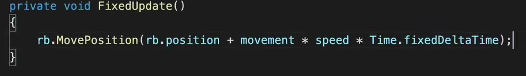

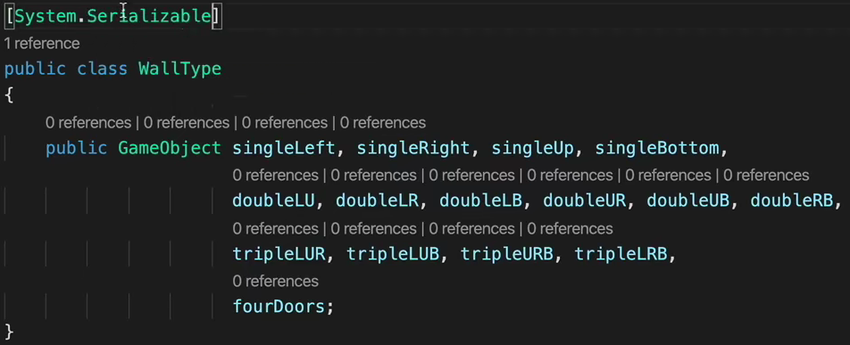

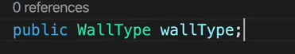

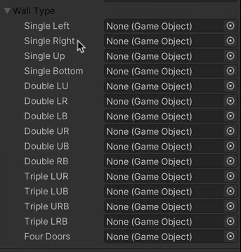

### 3.小地图

为每个房间设置一个子物体，并且有一个单独的Layer，主摄像机不观察次Layer，副摄像机观察

给该子物体设置一个bool值初始是关闭状态，碰撞到该物体时改为true。

然后也给玩家设置一个子物体及单独的Layer，主摄像机不观察次Layer，副摄像机观察。

然后新建一个Texture Blender拖给副摄像机(摄像机看到的图像显示在该Texture Blender上)，设置好位置大小等等即可实现！


