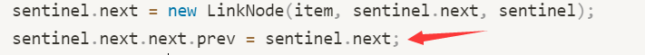
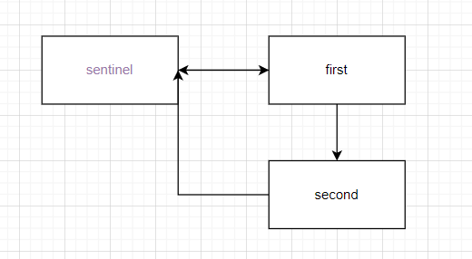
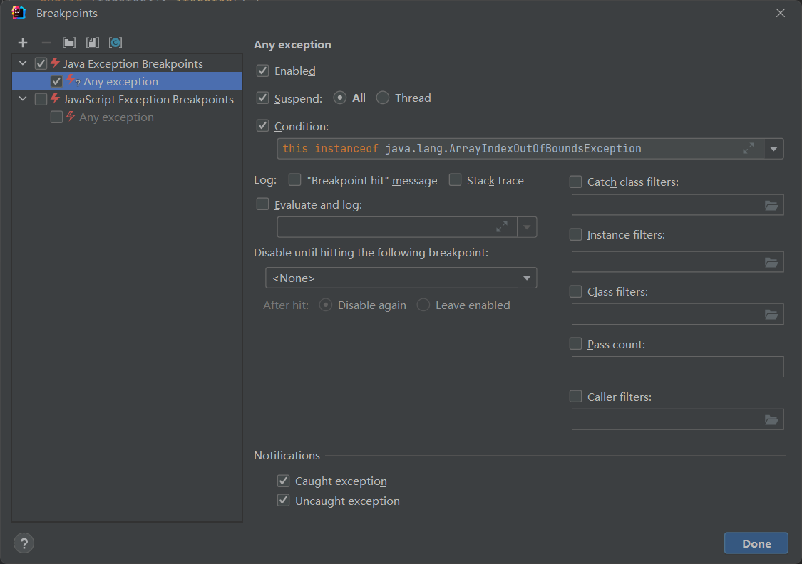

## 链型指针队列

```java
package deque;


public class LinkedListDeque<T> {
    private class LinkNode {
        private T value;
        private LinkNode next;
        private LinkNode prev;
        public LinkNode(T i, LinkNode n, LinkNode p) {
            value = i;
            next = n;
            prev = p;
        }

    }
    /** sentinel node, it's next(sentinel.next is the front of list)*/
    private LinkNode sentinel;
    /** end node, always point on the end of list*/
    private LinkNode end;

    private int size;

    /** initialize list */
    public LinkedListDeque() {
        sentinel = new LinkNode(null, null, null);
        sentinel.prev = sentinel;
        sentinel.next = sentinel;
        end = sentinel;
        size = 0;
    }


    /** Add a new LinkNode at the beginning*/
    public void addFirst(T item) {
        sentinel.next = new LinkNode(item, sentinel.next, sentinel);
        sentinel.next.next.prev = sentinel.next;
        size = size + 1;
        if (end == sentinel) {
            end = end.next;
        }
    }

    /** Add a new LinkNode on the last side*/
    public void addLast(T item) {
        LinkNode q = new LinkNode(item, null, end);
        end.next = q;
        /** point on the end of list*/
        end = end.next;
        size = size + 1;
    }

    /** size ==0, true*/
    public boolean isEmpty() {
        return size == 0;
    }

    public int size() {
        return size;
    }

    public T removeFirst() {
        T p = null;
        if (!isEmpty()) {
            p = sentinel.next.value;
            /**no longer point on NowFirst*/
            sentinel.next = sentinel.next.next;
            size = size - 1;
        }
        return p;
    }

    public T removeLast() {
        T p = null;
        if (!isEmpty()) {
            p = end.value;
            /**no longer point on NowEnd*/
            end = end.prev;
            size = size - 1;
        }
        return p;
    }

    public void printDeque() {
        if (!isEmpty()) {
            LinkNode p = sentinel.next;
            /**if p == end, print NowValue and break*/
            while (!p.equals(end)) {
                System.out.print(p.value + " ");
                p = p.next;
            }
            System.out.println(p.value);
        }
    }

    /** get any value you want by iteration(for-loop)*/
    public T get(int index) {
        if (isEmpty() || index > size) {
            return null;
        }
        LinkNode p = sentinel.next;
        for (int i = 0; i < index; i++) {
            p = p.next;
        }
        return p.value;
    }

    /** Recursive search*/
    private T getRecursive(int index, LinkNode curr) {
        if (index == 0) {
            return curr.value;
        }
        return getRecursive(index - 1, curr.next);
    }
    /** get any value you want by recursion*/
    public T getRecursive(int index) {
        if (isEmpty() || index > size) {
            return null;
        }
        LinkNode p = sentinel.next;
        return getRecursive(index, p);
    }
}
```



```
sentinel.next.next为null
以及这一步会在初始化第一个值的时候 导致sentinel的prev指向第一个值，从而导致remove时无法当作garbage回收


removeFirst时 若只有一个值 end的值也要变
```

## 数组队列

```java
package deque;


public class ArrayDeque<T> {
    private T[] items;
    private int size;
    private int nextFirst;
    private int nextLast;
    private final int initSize = 8;

    public ArrayDeque() {
        items = (T[]) new Object[initSize];
        size = 0;
        /** In order to form a circle, start first and end at Center.
         *  So you can just add numbers without worrying about overflow(next < 0 or Last > length)*/
        nextFirst = initSize / 2;
        nextLast = initSize / 2 + 1;
    }
    /** Determine if it is full,if true upSize*/
    private boolean isFull() {
        return size == items.length;
    }
    /** Determine if it is half,if true downSize*/
    private boolean isHalf() {
        return size == items.length / 2;
    }
    /** A little math*/
    private int adjustLast(int pos) {
        return (pos + 1) % items.length;
    }
    /** A little math*/
    private int adjustFirst(int pos) {
        return (pos - 1 + items.length) % items.length;
    }

    public void addFirst(T item) {
        if (isFull()) {
            /** Increase length. Adjust the nextFirst and nextLast*/
            upSize();
        }
        items[nextFirst] = item;
        size = size + 1;
        nextFirst = adjustFirst(nextFirst);
    }

    public void addLast(T item) {
        if (isFull()) {
            /** Increase length. Adjust the nextFirst and nextLast*/
            upSize();
        }
        items[nextLast] = item;
        size = size + 1;
        nextLast = adjustLast(nextLast);
    }
    /** Resize the length of array*/
    private void resize(int length) {
        T[] tempArray = (T[]) new Object[length];
        /** if upSize, the newFirst is items.length / 2(items.length % length = items.length, so it's that expression)
         *  if downSize, the newFirst is 0(items.length % length = 0, so it's that expression )*/
        int newFirst = items.length % length / 2;
        /** for-loop index from true next(nextFist's Last) until done*/
        int index = adjustLast(nextFirst);
        for (int i = 0; i < size; i = i + 1) {
            tempArray[newFirst] = items[index];
            newFirst = newFirst + 1;
            index = adjustLast(index);
        }
        items = tempArray;
        /** Because we have fill the array
         *  so the first should adjust*/
        nextFirst = adjustFirst(items.length % length / 2);
        nextLast = newFirst;
    }
    /** expand*/
    private void upSize() {
        resize(items.length * 2);
    }
    /** narrow*/
    private void downSize() {
        resize(items.length / 2);
    }
    public boolean isEmpty() {
        return size == 0;
    }

    public int size() {
        return size;
    }
    /** for-loop to print the values*/
    public void printDeque() {
        /** For array, print directly or print by get are both efficient
         *  but for LinkedList, print by get indirect printing means double loops,for-loop to get this value,
         *  start from scratch to find the next value, doing a lot of unnecessary loops*/
        for (int i = 0; i < size; i = i + 1) {
            System.out.print(get(i) + " ");
        }
        System.out.println();
    }
    /** RemoveFirst and resize the length if necessary*/
    public T removeFirst() {
        if (isEmpty()) {
            return null;
        }
        if (isHalf()) {
            downSize();
        }
        nextFirst = adjustLast(nextFirst);
        T p = items[nextFirst];
        items[nextFirst] = null;
        size = size - 1;
        return p;
    }
    /** removeLast and resize the length if necessary*/
    public T removeLast() {
        if (isEmpty()) {
            return null;
        }
        if (isHalf()) {
            downSize();
        }
        nextLast = adjustFirst(nextLast);
        T p = items[nextLast];
        items[nextLast] = null;
        size =  size - 1;
        return p;
    }
    /** transform index to true INDEX
     * Get any value you want*/
    public T get(int index) {
        if (isEmpty() || index > size - 1) {
            return null;
        }
        return items[adjustLast(nextFirst + index)];
    }

}
```

downsize后`nextLast = newFirst;` 而newFirst在进行最后一次 +1 后是超出了数组长度的
有一种优雅的办法是在**adjustLast**和**adjustFirst**加一个参数，也就是当前赋值数组的长度，而不是仅仅**items.length**，因为temp数组长度是当前数组的2倍或者1/2倍

另一种办法就是在downsize之后直接将**nextLast **赋为0（太不优雅了

## Begin

历经坎坷，边看视频边做，耗时一周多才完成了这个**project**

后来想想，看完这部分所有视频再写可能好一点

过程有点太复杂了，也学到了很多东西(写代码有点不经过🧠了)

**英语是硬伤**，很多东西翻译出来了语义变了，还是自己看好理解一点

写篇只有自己能看懂的博客记录下这个**project**吧

## Deque

### LinkedListDeque

刚开始写的时候没有完全理解题目的意思

题目要求`addFirst`和`addLast`的时间是一样固定的，`removeFirst`和`removeLast`同理

这样就要求在头和尾都有一个指针能随时调用，而不是遍历到末尾

所以此时就有两种办法

**双端链形队列和环形队列**(自己乱取的)

然后我就二选一选了**双端链形队列**(痛苦的开始)

首先就是各种特殊情况

#### Special Cases①

当队列为空时，**end**指向的是**sentinel**，也就是开头的哨兵指针，其意义就是避免特殊情况

此时我进行**addFirst**，一般情况**end**是不会变的，而此时队列为空就导致**end**需要指向**addFirst**加入的第一个指针

这个我目前也没想到什么好的办法

#### Special Cases②

这个情况是我铸币了

同样当队列非空时，进行**addFirst**

```java
sentinel.next = new LinkNode(item, sentinel.next, sentinel);
```



经过这一步后是这样的

所以此时就要把**second**的**prev**指针指向**first**

也就是

```java
sentinel.next.next.prev = sentinel.next;
```

而我在初始化的时候将**sentinel**的**next**和**prev**赋的为**null**

所以在**sentinel**为空时，`sentinel.next.next`为**null**

这样设置一个特殊情况就太说不过去了

卡了好久才想到`sentinel.next.next`只要不是**null**都可以啊

所以在赋值的时候

```java
sentinel.prev = sentinel;
sentinel.next = sentinel;
```

全部赋为他自己就好啦(**真的好了吗？？**)

#### end

于是这个**有着许多bug的LinkedListDeque**就在我完全不缜密的思考下完成了...

### ArrayDequeTest

在这一部分中，课程给了一个**ppt**来演示思路，从而实现了一个类环形的队列

大致思路就是将数组中间段的两边分为初始的开头和结尾
`addFirst`就往前直到到达0，到0之后就再到数组的末尾直到数组满
`addLast`就往后直到数组的末尾，到最后之后就转到0

其中对**nextFirst**和**nextLast**的判断有点意思

```java
/** A little math*/
private int adjustLast(int pos) {
    return (pos + 1) % items.length;
}
private int adjustFirst(int pos) {
    return (pos - 1 + items.length) % items.length;
}
```

其他的相对就比较常规

### Debug？？？

编写完**randomTest**，并且信心满满的点击运行

毫无疑问的**Tests failed**

**ArrayDequeTest**里有几个纯因为我铸币的问题就不细写了

主要写写**LinkedListDeque**的问题和如何通过**randomTest**来找到真正的问题

#### Debug LinkedListDeque

在**LinkedListDeque**的第二种特殊情况里面用到了这个

```java
sentinel.next.next.prev = sentinel.next;
```

若队列为空，执行第一个`addFirst`

此时**sentinel.next**指向第一个数据

**sentinel.next.next**指向**sentinel**

所以这一步就把**sentinel**的**prev**指向了第一个，在环形中这是没问题的，因为你的**sentinel.prev**就是最后一个数据

而在**双端链形队列**里面你的**sentinel.prev**实际是没什么用的，一直指向自己就好

此时你指向了你在**队列为空时`addFirst`**的数据，就导致你此时**removeFirst**，由于该内存还有指针指向它，它并不会被删除，从而导致一些问题

还有一个问题就是，如果队列只有一个元素，此时`removeFirst`
一般情况下这步不会影响**end**指针,而此时由于**end就是first**，**end**指针也要改变，如果要修这个bug，又要来一个特殊情况...

所以最后放弃了**双端链形队列**

🐖🧠过载不知道怎么避免特殊情况了

#### randomTest

如果**randomTest**运行时**RE**了,类似下面这样

```java
java.lang.ArrayIndexOutOfBoundsException: Index 7 out of bounds for length 7

at randomizedtest.BuggyAList.resize(BuggyAList.java:31)
```

以该报错类型加一个条件断点可以看到是哪里的问题



找到问题后，不一定能判断是哪种特殊情况引起的

反正我当时傻乎乎的看了好久也没找到是哪种情况

后来想了个笨办法，就是在每一个引起该报错类型(可能是**index**的长度超过了数组长度，就在每个**index**会改变的地方加一个条件断点，`index > items.length`)的地方加一个断点

然后再调试时基本就能判断是哪种方法，哪种情况导致的
